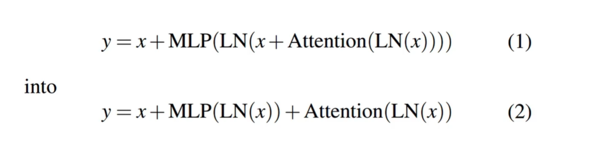
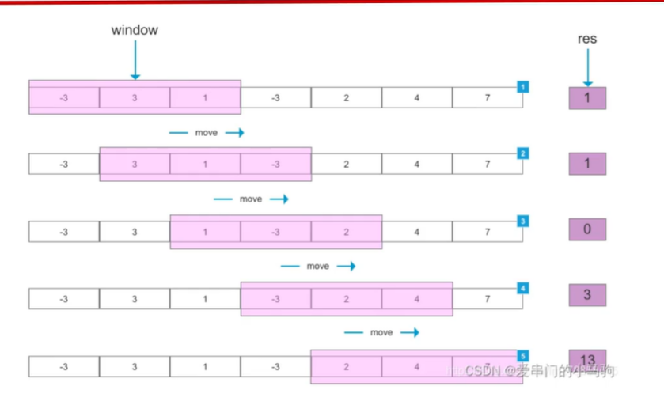
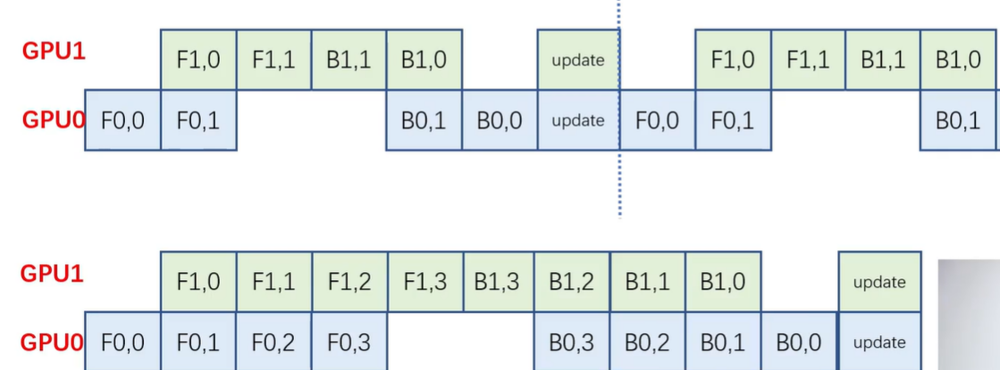
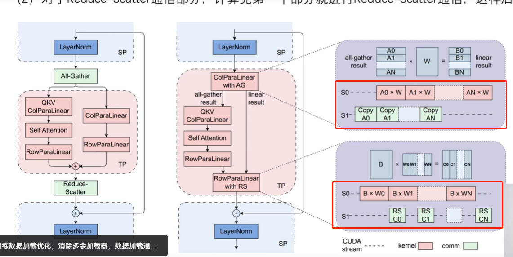

# MegaScale

* 万卡考虑的因素
1. 算法
2. 分布式并行方案
3. 数据加载
4. 网络与通信
5. 底层算子
6. 集群容错与性能监控

## 算法
* 并行计算

* 划动窗口（SWA）

* Lamb优化器

## 分布式训练
* 改进zero

* 改进张量并行
> 通信和计算并行

> 同构节点上采用数据并行
> 节点内张量并行
> 异构节点的流水线并行

## 数据加载优化

* 异步数据预加载/处理
> 训练完成通信同步梯度时，就开始数据预处理/加载。

* 消除冗余数据加载器
> 每个GPU都有自己的数据加载器将数据先读到CPU内存。同一张量并行组，他们输入相同因此将数据加载到CPU内存只需个数据加载器，然后各个GPU加载数据到自己显存。

## 网络与通信

1. 同步步骤中使用当阻塞是基于Pytorch内部实现的TCPStore，它单线程、阻塞读写方式运行，将TCPStore替换为Redis，它是非阻塞异步的。

2. 减少非必要当全局barrier阻塞同步。

* 拥堵控制
1. 减少ECMP哈希冲突
2. 流量控制优化
3. 重新传输超时设置

## 底层算子融合

## 集群容错与性能监测

1. 心跳检测
2. 自行恢复
3. 故障恢复

