## vllm

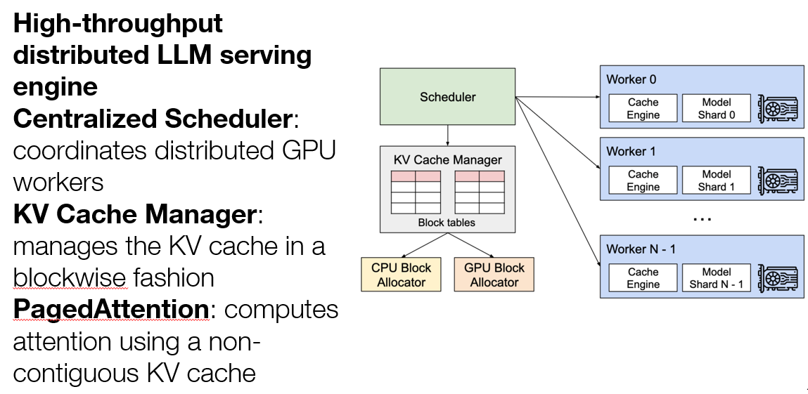

### PagedAttention
> KV cache is split into multiple blocks
> Each block contains key and value vector for a fixed number of tokens

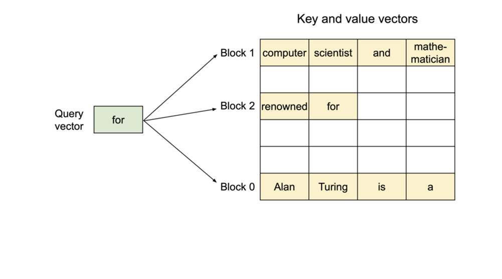

* KV Cache Manager
> KV Blocks = OS Pages
> Logical KV Blocks = Virtual Pages
> Physical KV Blocks = Physical Pages
> Tokens = Bytes
> Requests = Processes

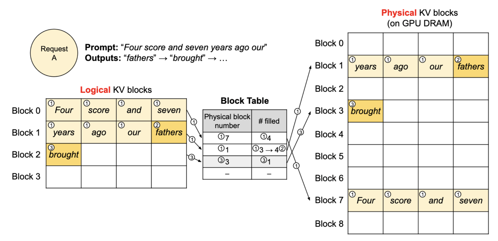

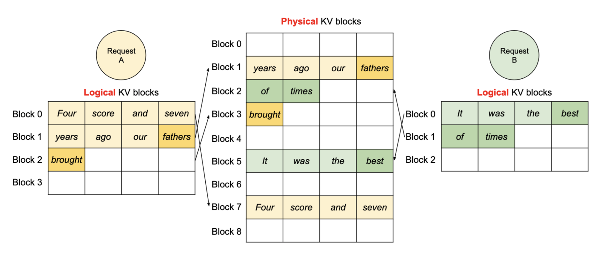

#### Decoding with PagedAttention and vLLM
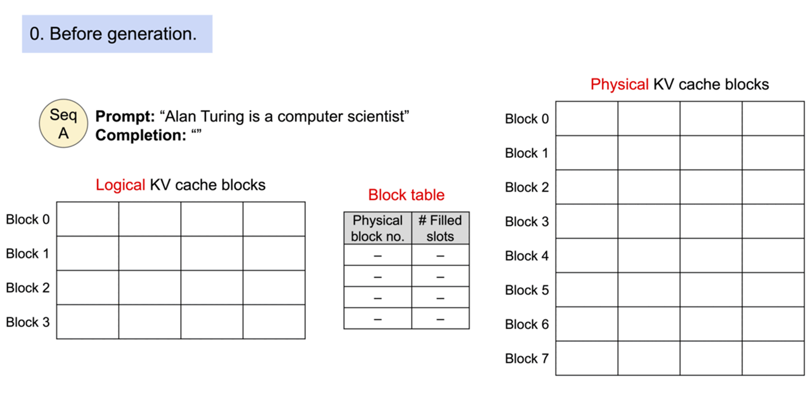
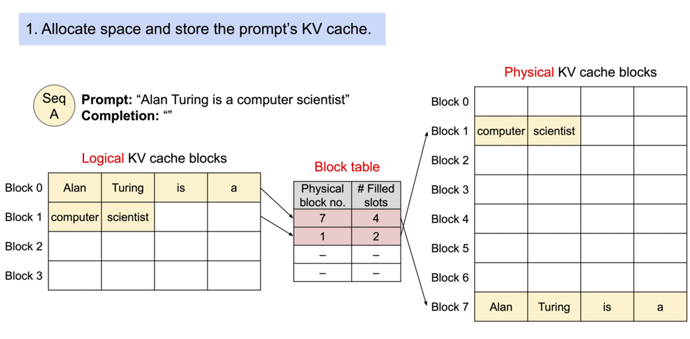
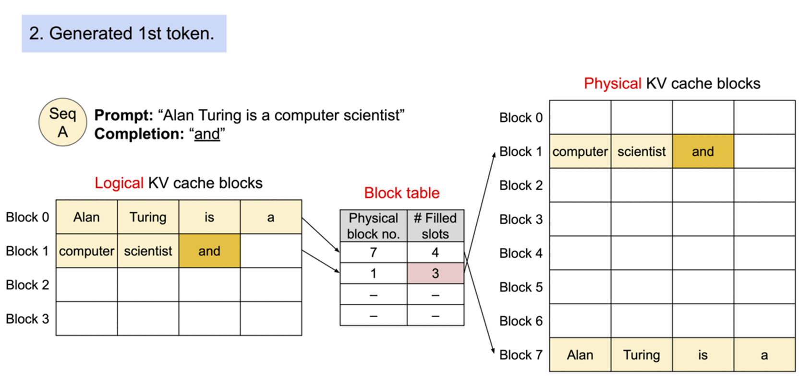
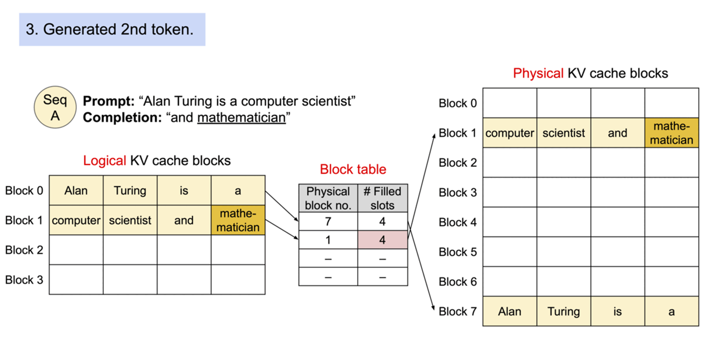
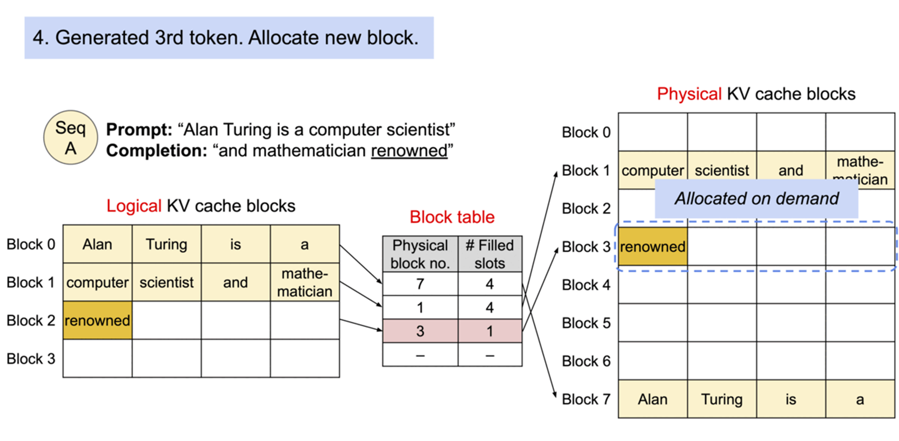

#### Application to Other Decoding Scenarios
* Parallel Sampling
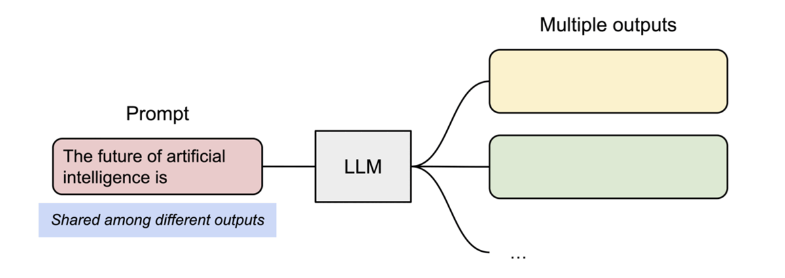
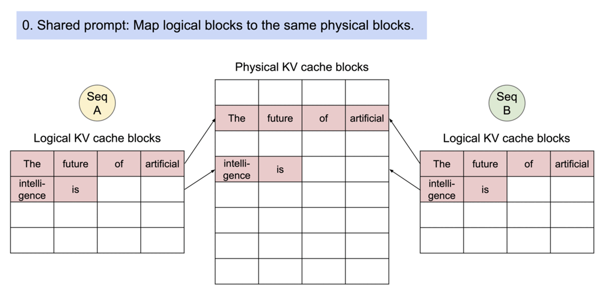
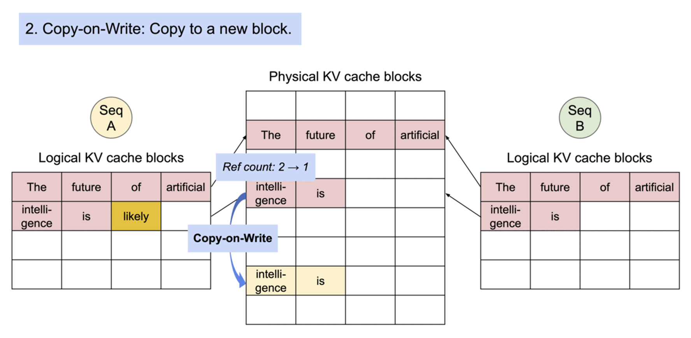
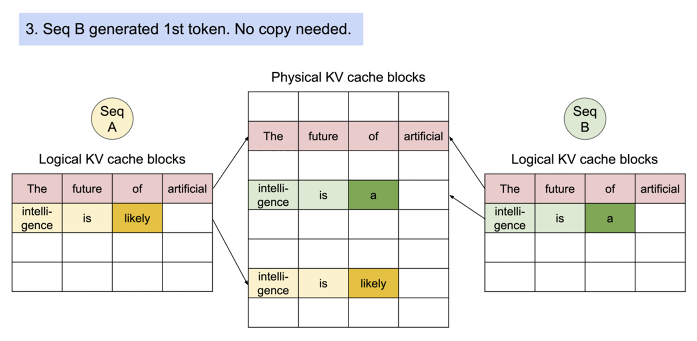
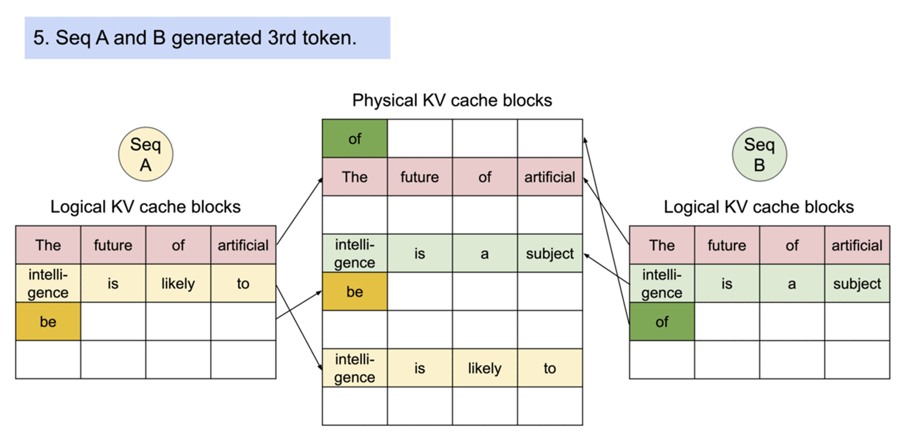

* Beam Search
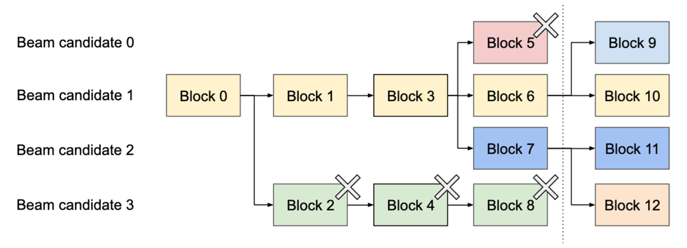

* Shared Prefix
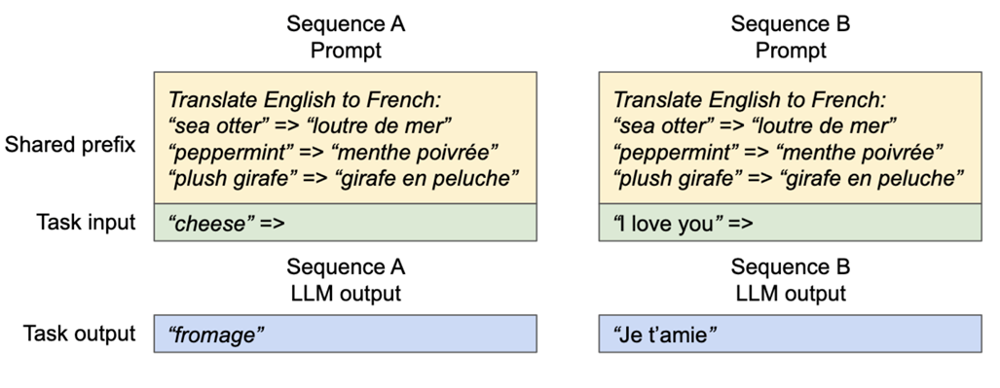

## JAX
> Compiling machine learning programs via high-level tracing

