## vllm

### PagedAttention
> KV cache is split into multiple blocks
> Each block contains key and value vector for a fixed number of tokens

* KV Cache Manager
> KV Blocks = OS Pages
> Logical KV Blocks = Virtual Pages
> Physical KV Blocks = Physical Pages
> Tokens = Bytes
> Requests = Processes

#### Decoding with PagedAttention and vLLM

#### Application to Other Decoding Scenarios
* Parallel Sampling

* Beam Search

* Shared Prefix

## JAX
> Compiling machine learning programs via high-level tracing

* Automatic Differentiation
* Functional Programming
* Interoperability with NumPy
* XLA Compilation
* 4 main transformations
  * grad(): automatically differentiate a function
  * vmap(): automatically vectorize operations
  * pmap(): parallel computation of SPMD programs
  * jit(): transform a function into a JIT-compiled version

### Functional Programming
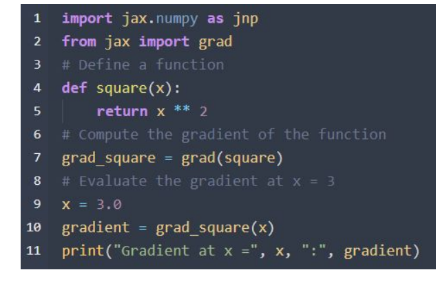

* Transformations: grad()
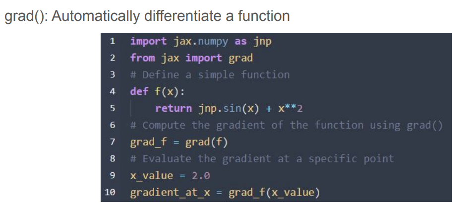

* Transformations: vmap()
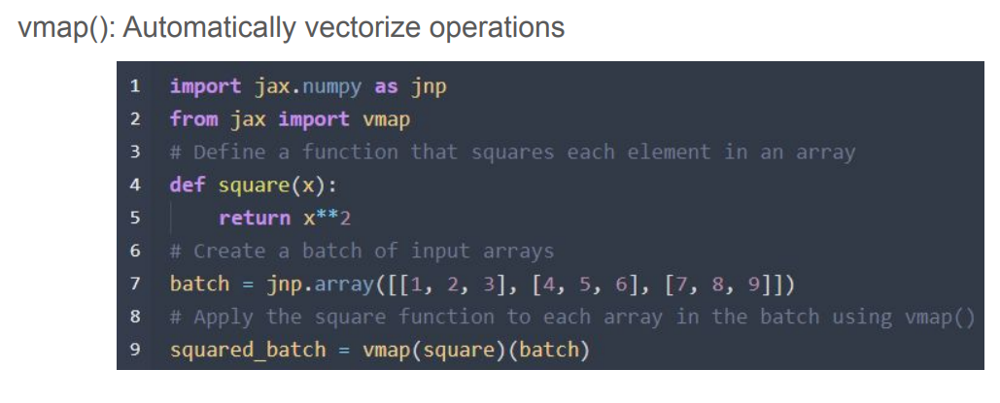

* Transformations: pmap()
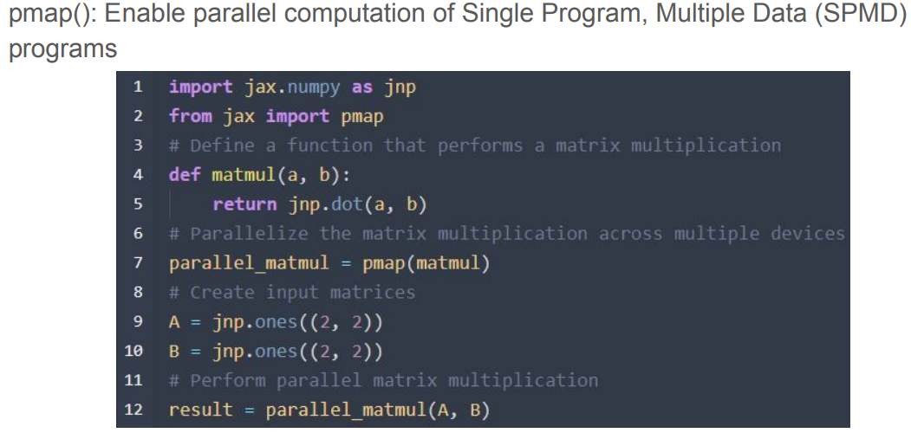
* Transformations: jit()
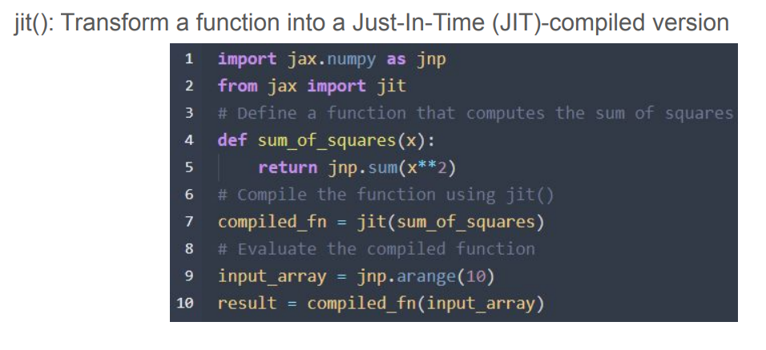

### Jaxpr
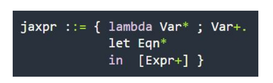

* example
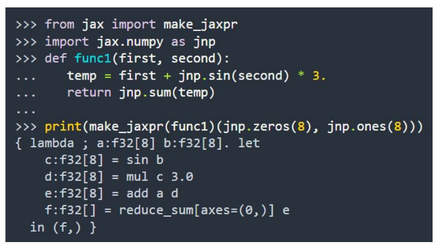

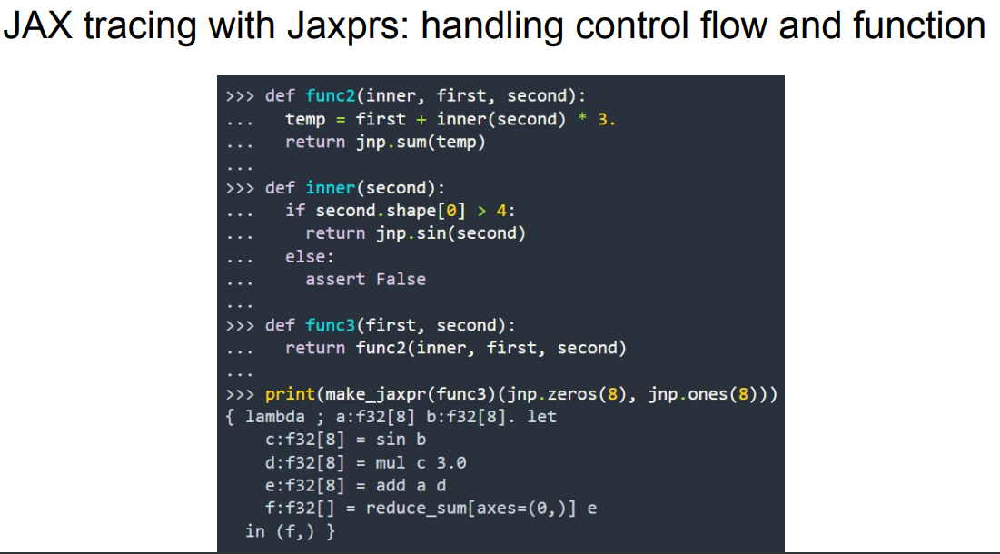

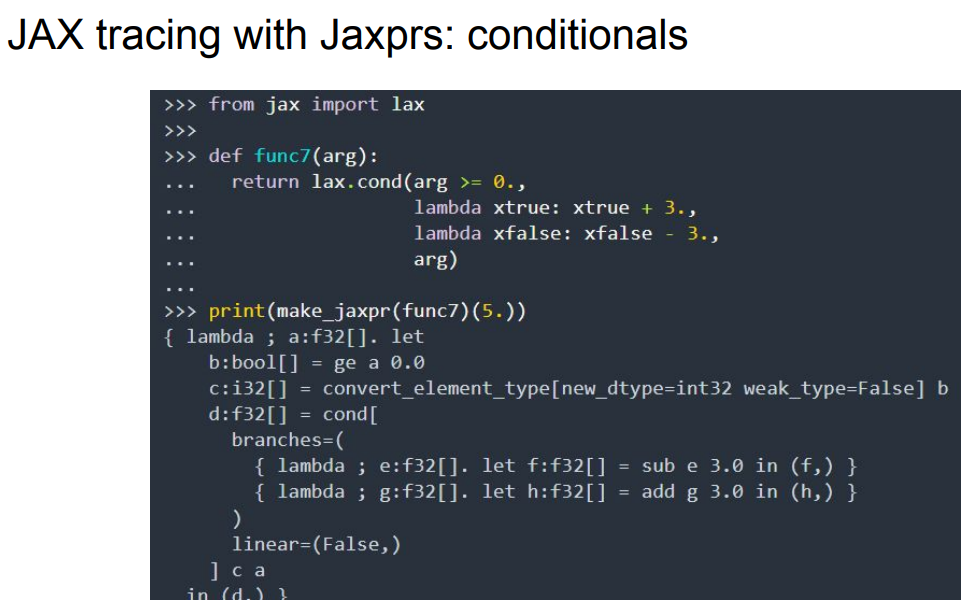

* JAX tracing with Jaxprs: XLA_call
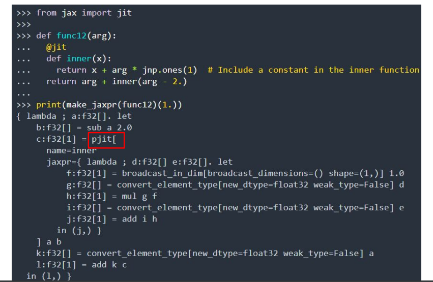

### JAX

* Introduction
1. Just-in-time (JIT) compiler
2. Convert pure Python and Numpy into high-performance code
3. Run efficiently on various accelerators (CPUs, GPUs, TPUs)
4. Write easily with Python while achieving significant speedups

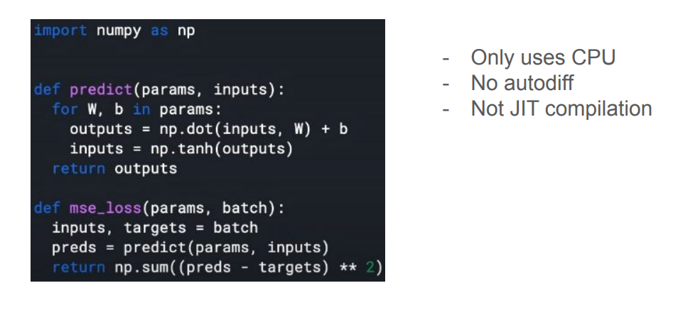
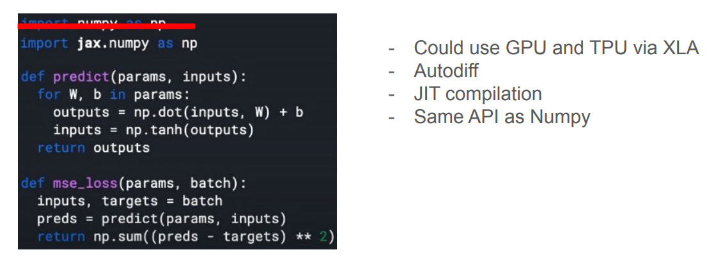

* Method
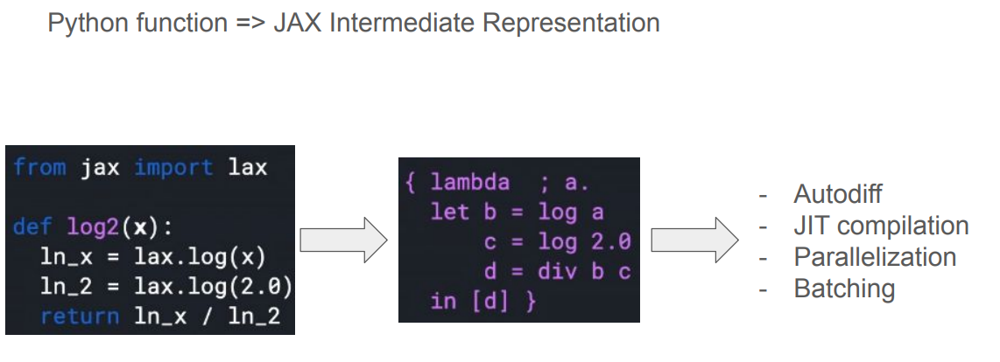

* Design
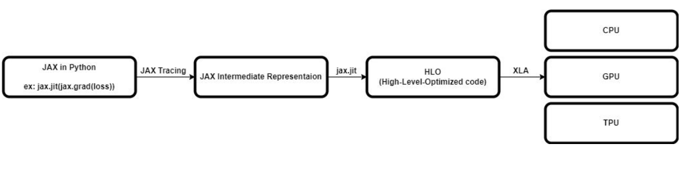

* Operator Fusion Mechanisms in JAX (XLA)

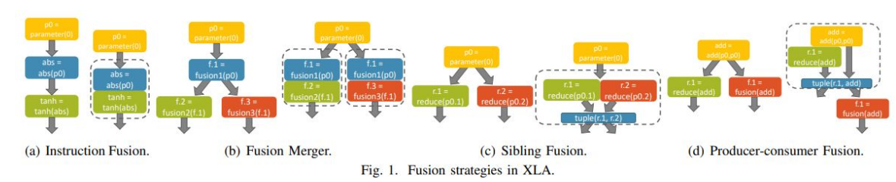

* Instruction Fusion
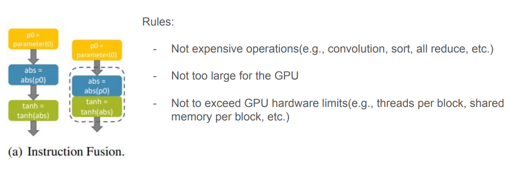

* Fusion Merger
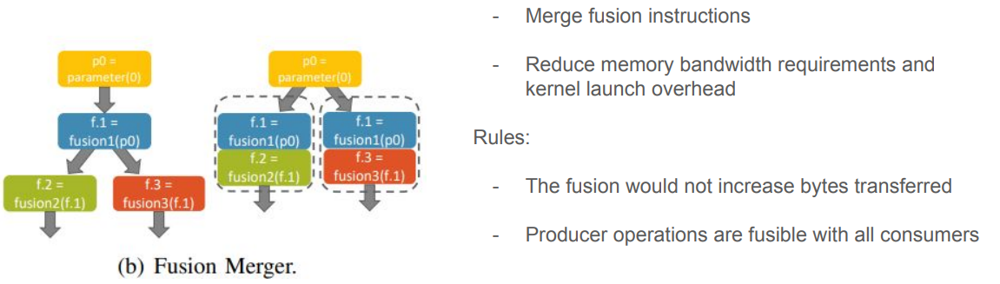

* Sibling Fusion
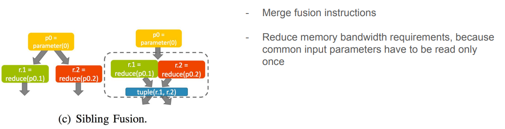

* Producer-consumer Fusion
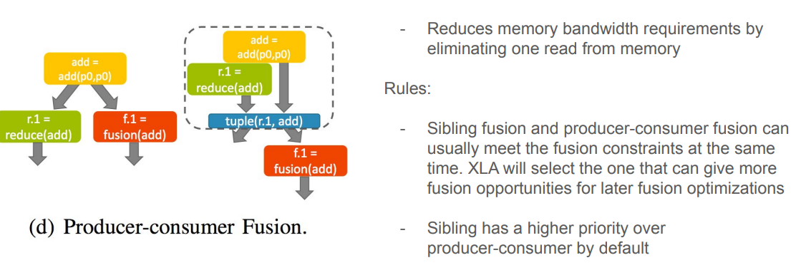

