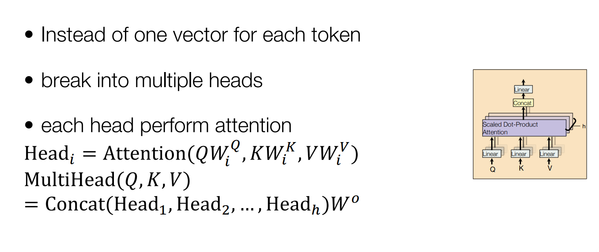

# cmu 11868
> https://llmsystem.github.io/llmsystem2024spring/docs/Syllabus/

## Auto Differentiation

### 计算图
*  Pytorch/Autograd

* 正向传播


* 反向传播


* 向量(矩阵)求导


```
import numpy as np


class auto:
    '''自动微分'''

    def __init__(self, value, depend=None, opt=''):
        self.value = value  # 该节点的值
        self.depend = depend  # 生成该节点的两个子节点
        self.opt = opt  # 两个子节点的运算方式
        self.grad = None  # 函数对该节点的梯度

    def add(self, other):
        '''数或矩阵加法'''
        return auto(value=self.value + other.value, depend=[self, other], opt='+')

    def mul(self, other):
        '''数的乘法或数与矩阵乘法'''
        return auto(value=self.value * other.value, depend=[self, other], opt='*')

    def dot(self, other):
        '''矩阵乘法'''
        return auto(value=np.dot(self.value, other.value), depend=[self, other], opt='dot')

    def sigmoid(self):
        '''sigmoid激活函数'''
        return auto(value=1 / (1 + np.exp(-self.value)), depend=[self], opt='sigmoid')

    def backward(self, backward_grad=None):
        print('--------> ', backward_grad)
        '''反向求导'''
        if backward_grad is None:
            if type(self.value) == int or float:
                self.grad = 1
            else:
                a, b = self.value.shape
                self.grad = np.ones((a, b))
        else:
            if self.grad is None:
                self.grad = backward_grad
            else:
                self.grad += backward_grad
        if self.opt == '+':
            self.depend[0].backward(self.grad)
            self.depend[1].backward(self.grad)  # 对于加法，把函数对自己的梯度传给自己对子节点的梯度
        if self.opt == '*':
            new = self.depend[1].value * self.grad
            self.depend[0].backward(new)
            new = self.depend[0].value * self.grad
            self.depend[1].backward(new)
        if self.opt == 'dot':
            new = np.dot(self.grad, self.depend[1].value.T)
            self.depend[0].backward(new)
            new = np.dot(self.depend[0].value.T, self.grad)
            self.depend[1].backward(new)
        if self.opt == 'sigmoid':
            new = self.grad * (1 / (1 + np.exp(-self.depend[0].value))) * (1 - 1 / (1 + np.exp(-self.depend[0].value)))
            self.depend[0].backward(new)


if __name__ == '__main__':
    a = auto(3)
    b = auto(4)
    c = auto(5)
    f1 = a.mul(b).add(c).sigmoid()
    f1.backward()
    print(a.grad, b.grad, c.grad)  # f1对a,b,c,导数
    A = auto(np.random.randint(1, 20, size=(3, 4)))
    B = auto(np.random.randint(1, 20, size=(4, 3)))
    F = A.dot(B)
    F.backward()
    print(A.grad, B.grad)
```

* TF 实现


## Transformer


* self-attention


* MHA



* Decoder
> 就多了一个mask


* all


*  Embedding


## Pre-trained LLM

### T5

### LLaMA
> Transformer Decoder

1. pre Layer Normalization

2. FFN with SwiGLU


3. Rotary Embedding (RoPE)


### GPT3
> 基于标准的Transformer架构  

*  稀疏注意力（Sparse Attention）
> 不是让序列中的每个位置都与其他所有位置进行注意力计算，而是仅选择部分位置进行计算

1. 基于位置的稀疏注意力（position-based sparse attention）
  
> 全局节点充当了一个信息集散地  
> “带状注意力”（也被称为滑动窗口注意力或局部注意力）是一种在处理数据时考虑数据的局部性质的注意力机制  
> “扩张注意力”（Dilated Attention）:在带状注意力（即局部注意力）的基础上，通过在关注的邻域内设置间隔（称为“扩张”），模型能够覆盖更远的输入元素，而不是仅仅关注紧密排列的邻近元素  
> 随机注意力旨在增强模型处理非局部（或长距离）交互的能力  
> “块局部注意力” 将输入序列划分为若干个不重叠的查询块（query blocks），并为每个查询块分配一个局部记忆块  


> Star-Transformer：带状注意力与全局注意力  
> 星形图结构: 带状注意力和全局注意力  
> Longformer：带状注意力、内部全局节点注意力、膨胀窗口注意力  
> ETC：带状注意力、外部全局节点注意力、掩码机制和CPC预训练方法
> BigBird：带状注意力、全局注意力、随机注意力

BP-Transformer、 Image Transformer、Axial Transformer   

2. 基于内容的稀疏注意力（content-based sparse attention）
> 在标准的 Transformer 模型中，自注意力机制需要计算查询（query）与所有键（key）之间的相似度，这在处理长序列时会导致巨大的计算负担。为了解决这个问题，可以构建一个基于内容的稀疏图，从而只关注与给定查询最相关的一小部分键，而不是所有键。

* 最大内积搜索（MIPS）
> MIPS的目标是找到与查询具有最大点积（dot product）的键，而不需要计算查询与所有键之间的点积。


Routing Transformer\Reformer\SAC(Sparse Adaptive Connection)\Sparse Sinkhorn Attention

## Tokenization & Decoding

### Tokenization
> Break sentences into tokens, basic elements of processing


1. Character-level Tokenization
2. Subword-level Tokenization
3. Byte-Pair-Encoding Tokenization
4. More Subword Tokenization

* 找到最佳词汇
1. VOLT: Using entropy to learn vocabulary
2. MUV: Utility of Information for Adding Tokens

### Sequence Decoding

* Sampling
1. Discrete Sampling
2. Beam Search


