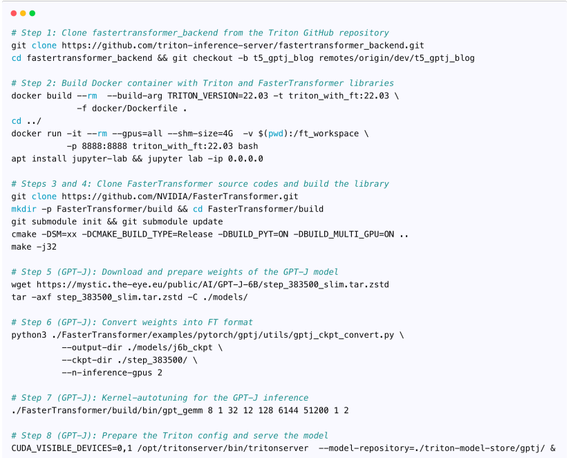
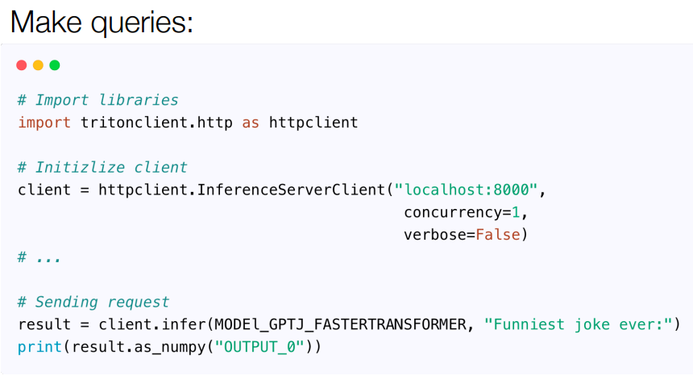

# LLM Serving

## Architectures for LLM Applications

### Data Preprocessing / Embedding

* Data Pipelines
> Include loaders, parsers, and preprocessing.

Databricks/Airflow/Unstructured

* Embedding Model

1. OpenAI:  Effective but cheap
2. Cohere: Focus more on embeddings
3. Hugging Face:  Open-source
4. Customer Embedding: e.g. BERT

* Vector Database
1. Pinecone： Fully clound-hosted
2. chroma：Local vector management
3. Faiss：by meta
4. Weaviate： Open-source

### Prompt Construction / Retrieval

1. LlamaIndex
2. LangChain4

### Prompt Execution / Inference

1. LLM APIs：Proprietary APIs、Open APIs、ChatGPT
2. LLM Hosting：General Could（E.g. AWS, GCP, and Azure）、Opinionated Cloud（E.g. Databricks, Anyscale, and Mosaic）
3. LLM Cache：o E.g. Redis, SQLite, and GPTCache
4. Validation：E.g. Guardrails, Rebuff, and Guidance
5. Logging：E.g. Weights&Biases, MLflow, and PromptLayer
6. App Hosting：Vercel、Steamship、Anyscale and Modal

### AI Agent
AutoGPTL 

## Frameworks for LLM Serving

### Triton“s”

* NVIDIA
1. Dynamic Batching

2. Triton + LightSeq / TensorRT-LLM

3. Triton + FasterTransformer 

* OpenAI

### Text Generation Inference

### OpenLLM

### MLC LLM

### LightLLM

