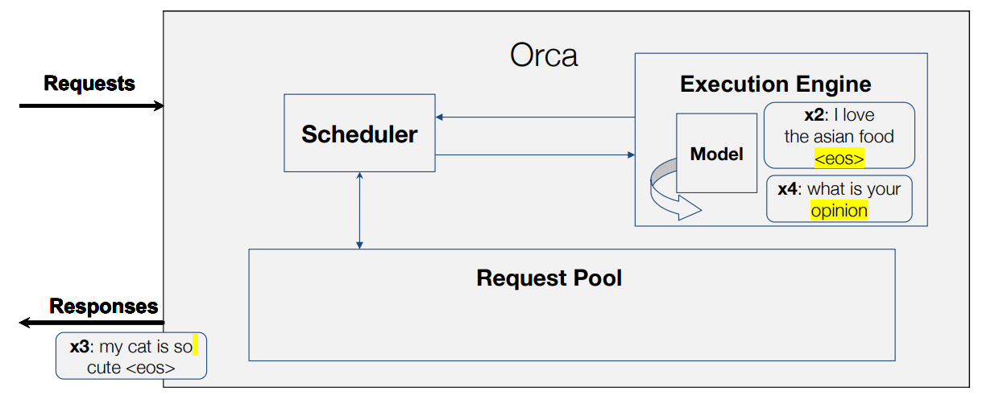

## Advanced Large Model Serving (推理服务系统 Orca)
> Orca: A Distributed Serving System for Transformer Based Generative Models

### Inference of Autoregressive LMs
* Multi-iteration characteristic
* Initiation phase (1st iteration)
> Process all input tokens (prefix/prompt) at once.
* Increment phase (2nt to last iteration)
> Process a single token generated from the prev. iteration.

### Orca

* Orca Allows Iteration-Level Scheduling
* Iteration-Level Scheduling is Harder to Batch
> Batching is only applicable: requests are in the same phase\requests have the same length

* Orca is Inspired by BatchMaker

### Challenges & Solutions 

* Request Scheduling

* step 1

* step 2

* step 3

* step 4

* step 5

* step 6

### S1: Iteration-Level Scheduling

* step 0

* step 1

* step 2

* step 3

* step 4

* step 5

* step 6

### C2: Batching

* Three cases cannot batch normally
1. both requests are in the initiation phase and each has
different number of input tokens
2. both are in the increment phase and each is
processing a token at different index from each other
3. each request is in the different phase: initiation or
increment

* S2: Selective Batching

### Orca Design
* Distributed Architecture

### Control Flow

### Scheduling Algorithm

* First Come First Serve (FCFS)
* step

* Scheduling Algorithm

* Pipeline Parallelism

> 出现气泡的关键原因:请求级别调度必须等到批次完成所有迭代后才能开始新批次

