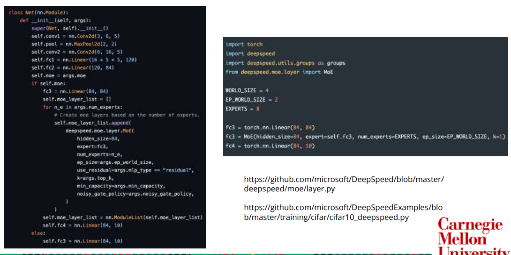
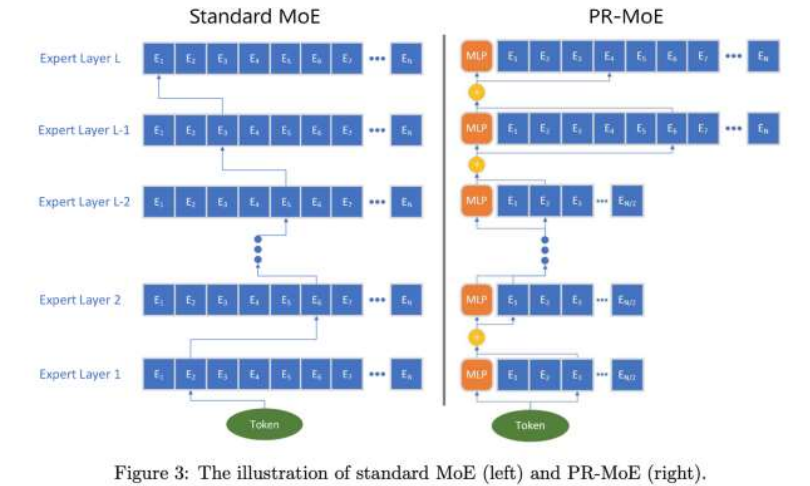
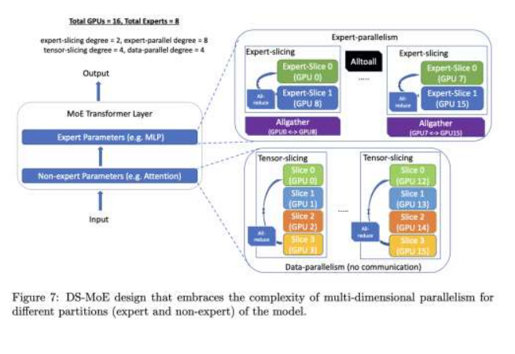
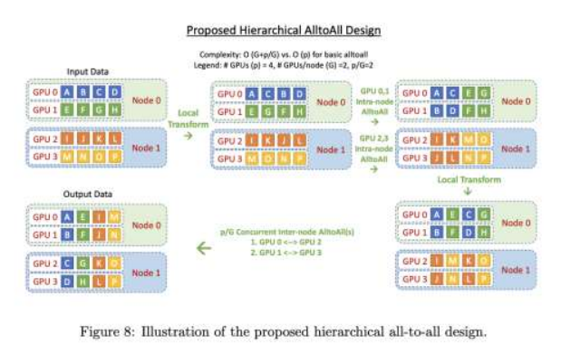

# DeepSpeed-MoE

> DeepSpeed-MoE: Advancing Mixture-of-Experts Inference and Training to Power NextGeneration AI Scale 

[https://arxiv.org/abs/2201.05596](https://arxiv.org/abs/2201.05596)

[https://github.com/microsoft/DeepSpeed/blob/master/deepspeed/moe/layer.py](https://github.com/microsoft/DeepSpeed/blob/master/deepspeed/moe/layer.py)

[https://github.com/microsoft/DeepSpeedExamples](https://github.com/microsoft/DeepSpeedExamples/)

* PR-MOE

* Mixture-of-Students(MoS)

* MOE Transformer
1. Expert Parallelism and Expert-slicing (Expert Params)
2. Data Parallelism and Tensor-slicing (Non-Expert Params)

* Hierarchical All-to-all for communication

# FlashAttention

# Recurrent Memory Transforme(RMT)
[https://zhuanlan.zhihu.com/p/689394585](https://zhuanlan.zhihu.com/p/689394585)

# Attention sink (StreamingLLM)
> Efficient Streaming Language Models with Attention Sinks

# Speculative Decoding
[https://zhuanlan.zhihu.com/p/671432448](https://zhuanlan.zhihu.com/p/671432448)

# Retrieval-augmented language models (RAG)
[https://zhuanlan.zhihu.com/p/681496536](https://zhuanlan.zhihu.com/p/681496536)

# Nearest Vector Search for Embeddings (HNSW)

# Multimodal LLMs (Flamingo)

