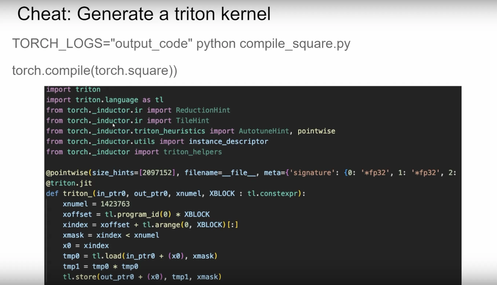

# Pytorch 中使用 profile Cuda kernels


# PyTorch的 .cu实现

* torch.utils.cpp_extension
```
# Look at this test for inspiration
# https://github.com/pytorch/pytorch/blob/main/test/test_cpp_extensions_jit.py

import torch
from torch.utils.cpp_extension import load_inline

# Define the CUDA kernel and C++ wrapper
cuda_source = '''
__global__ void square_matrix_kernel(const float* matrix, float* result, int width, int height) {
    int row = blockIdx.y * blockDim.y + threadIdx.y;
    int col = blockIdx.x * blockDim.x + threadIdx.x;

    if (row < height && col < width) {
        int idx = row * width + col;
        result[idx] = matrix[idx] * matrix[idx];
    }
}

torch::Tensor square_matrix(torch::Tensor matrix) {
    const auto height = matrix.size(0);
    const auto width = matrix.size(1);

    auto result = torch::empty_like(matrix);

    dim3 threads_per_block(16, 16);
    dim3 number_of_blocks((width + threads_per_block.x - 1) / threads_per_block.x,
                          (height + threads_per_block.y - 1) / threads_per_block.y);

    square_matrix_kernel<<<number_of_blocks, threads_per_block>>>(
        matrix.data_ptr<float>(), result.data_ptr<float>(), width, height);

    return result;
    }
'''

cpp_source = "torch::Tensor square_matrix(torch::Tensor matrix);"

# Load the CUDA kernel as a PyTorch extension
square_matrix_extension = load_inline(
    name='square_matrix_extension',
    cpp_sources=cpp_source,
    cuda_sources=cuda_source,
    functions=['square_matrix'],
    with_cuda=True,
    extra_cuda_cflags=["-O2"],
    build_directory='./load_inline_cuda',
    # extra_cuda_cflags=['--expt-relaxed-constexpr']
)

a = torch.tensor([[1., 2., 3.], [4., 5., 6.]], device='cuda')
print(square_matrix_extension.square_matrix(a))

# (cudamode) ubuntu@ip-172-31-9-217:~/cudamode/cudamodelecture1$ python load_inline.py 
# tensor([[ 1.,  4.,  9.],
#         [16., 25., 36.]], device='cuda:0')


```


* Triton
```
# Adapted straight from https://triton-lang.org/main/getting-started/tutorials/02-fused-softmax.html
import triton
import triton.language as tl
import torch

# if @triton.jit(interpret=True) does not work, please use the following two lines to enable interpret mode
# import os
# os.environ["TRITON_INTERPRET"] = "1"

@triton.jit
def square_kernel(output_ptr, input_ptr, input_row_stride, output_row_stride, n_cols, BLOCK_SIZE: tl.constexpr):
    # The rows of the softmax are independent, so we parallelize across those
    row_idx = tl.program_id(0)
    # The stride represents how much we need to increase the pointer to advance 1 row
    row_start_ptr = input_ptr + row_idx * input_row_stride
    # The block size is the next power of two greater than n_cols, so we can fit each
    # row in a single block
    col_offsets = tl.arange(0, BLOCK_SIZE)
    input_ptrs = row_start_ptr + col_offsets
    # Load the row into SRAM, using a mask since BLOCK_SIZE may be > than n_cols
    row = tl.load(input_ptrs, mask=col_offsets < n_cols, other=-float('inf'))

    square_output = row * row
    
    # Write back output to DRAM
    output_row_start_ptr = output_ptr + row_idx * output_row_stride
    output_ptrs = output_row_start_ptr + col_offsets
    tl.store(output_ptrs, square_output, mask=col_offsets < n_cols)


def square(x):
    n_rows, n_cols = x.shape
    # The block size is the smallest power of two greater than the number of columns in `x`
    BLOCK_SIZE = triton.next_power_of_2(n_cols)
    # Another trick we can use is to ask the compiler to use more threads per row by
    # increasing the number of warps (`num_warps`) over which each row is distributed.
    # You will see in the next tutorial how to auto-tune this value in a more natural
    # way so you don't have to come up with manual heuristics yourself.
    num_warps = 4
    if BLOCK_SIZE >= 2048:
        num_warps = 8
    if BLOCK_SIZE >= 4096:
        num_warps = 16
    # Allocate output
    y = torch.empty_like(x)
    # Enqueue kernel. The 1D launch grid is simple: we have one kernel instance per row o
    # f the input matrix
    square_kernel[(n_rows, )](
        y,
        x,
        x.stride(0),
        y.stride(0),
        n_cols,
        num_warps=num_warps,
        BLOCK_SIZE=BLOCK_SIZE,
    )
    return y


torch.manual_seed(0)
x = torch.randn(1823, 781, device='cuda')
y_triton = square(x)
y_torch = torch.square(x)
assert torch.allclose(y_triton, y_torch), (y_triton, y_torch)

@triton.testing.perf_report(
    triton.testing.Benchmark(
        x_names=['N'],  # argument names to use as an x-axis for the plot
        x_vals=[128 * i for i in range(2, 100)],  # different possible values for `x_name`
        line_arg='provider',  # argument name whose value corresponds to a different line in the plot
        line_vals=[
            'triton',
            'torch-native',
            'torch-compile'
        ],  # possible values for `line_arg``
        line_names=[
            "Triton",
            "Torch (native)",
            "Torch (compiled)"
        ],  # label name for the lines
        styles=[('blue', '-'), ('green', '-'), ('green', '--')],  # line styles
        ylabel="GB/s",  # label name for the y-axis
        plot_name="square() performance",  # name for the plot. Used also as a file name for saving the plot.
        args={'M': 4096},  # values for function arguments not in `x_names` and `y_name`
    ))
def benchmark(M, N, provider):
    x = torch.randn(M, N, device='cuda', dtype=torch.float32)
    quantiles = [0.5, 0.2, 0.8]
    if provider == 'torch-native':
        ms, min_ms, max_ms = triton.testing.do_bench(lambda: torch.square(x), quantiles=quantiles)
    if provider == 'triton':
        ms, min_ms, max_ms = triton.testing.do_bench(lambda: square(x), quantiles=quantiles)
    if provider == 'torch-compile':
        ms, min_ms, max_ms = triton.testing.do_bench(lambda: torch.compile(torch.square)(x), quantiles=quantiles)
    gbps = lambda ms: 2 * x.nelement() * x.element_size() * 1e-9 / (ms * 1e-3)
    return gbps(ms), gbps(max_ms), gbps(min_ms)


benchmark.run(show_plots=True, print_data=True, save_path='.')
```


* torch.compile


## Triton debugger


## Look at PTX
> https://github.com/msaroufim/cudamodelecture1/blob/main/square_kernel.ptx 
> 用chatgpt

## 查看PyTorch的编译器生成的Triton Kernel



# ncu
> nsight compute profile
> https://github.com/cuda-mode/lectures/blob/main/lecture_001/ncu_logs


