# Sparsity

## Sparsity /剪枝的流程

> Optimal Brain Damage (Hinton 89)

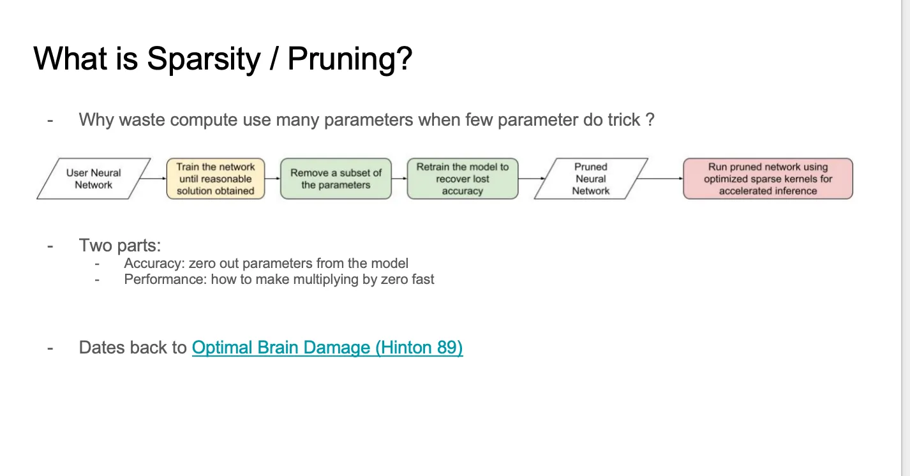

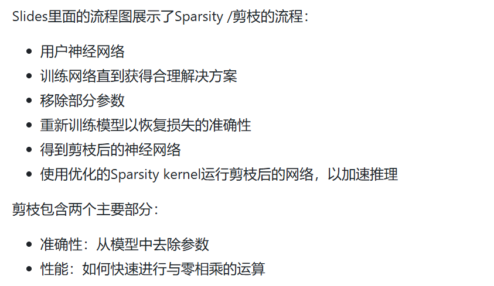

## 如何在神经网络中添加零，即如何实现稀疏性

首先，有不同的Sparsity pattern，其次，我们需要灵活性以保证准确性，最后我们也需要结构化的pattern以提高性能。右侧图表展示了不同的稀疏性模式，所有模式都显示了50%的Sparsity 度

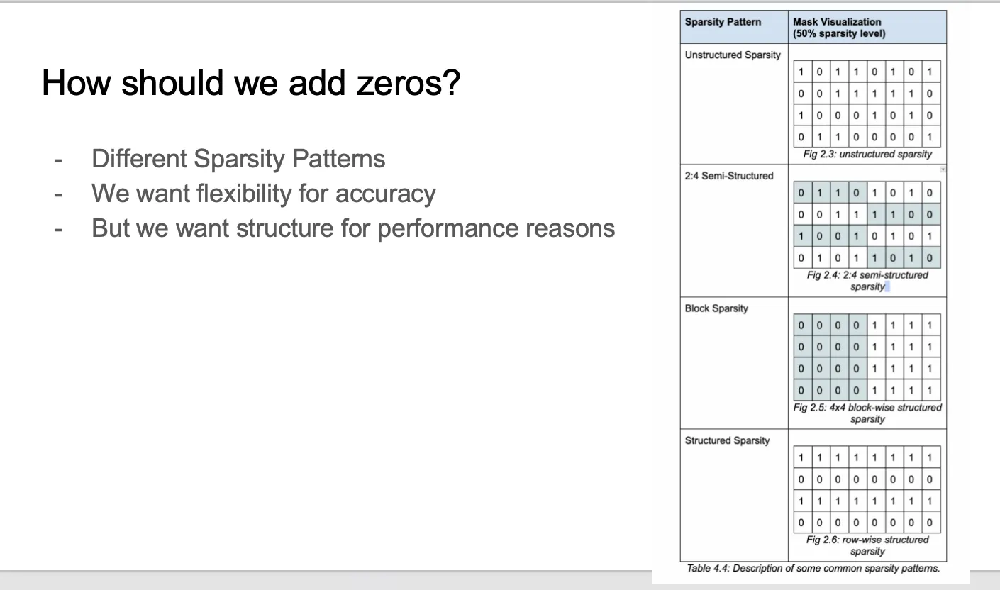

## Sparsity在性能方面的考虑
讨论了Sparsity在性能方面的考虑，特别是在张量乘法中的实现。我们使用Sparsity 表示（Sparse representations）和Sparsity kernel（Sparse kernels）以及独立的存储数据结构来完成。下面举了一个COO（Coordinate）表示法的例子，只存储非0元素的坐标和数据，更多的表示方法可以参考 https://pytorch.org/docs/stable/sparse.html 。只有在Sparsity 度超过99%的情况下相比于Dense Matmul才能展现出速度优势。这张slides像是在讨论CPU上的Sparsity

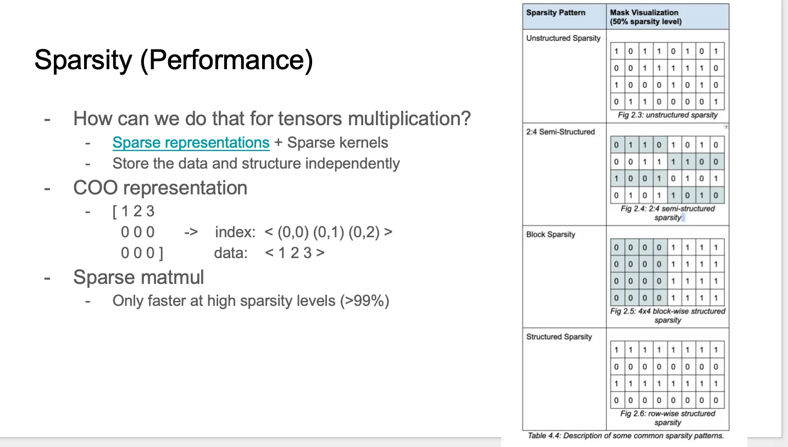

在GPU上情况更糟糕，Dense Matmul由于并行计算的影响速度很快。非结构化稀疏性虽然很酷且能保持准确性，但在GPU上无法快速运行。GPU基于块操作，而非结构化稀疏性无法形成有结构的块。

* 通过移除整行这种结构化剪枝并重用dense kernels
但这种方法对准确性的影响很大，难以处理

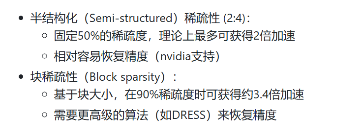

## Semi-Structured (2:4) Sparsity 

1. Semi-Structured (2:4) Sparsity，也被称为M:N / 细粒度结构化稀疏性，每4个元素中有2个为0。

右边的图显示我们存储的压缩后的矩阵元素只有原始元素的一半，此外我们有一个2Bit dtype的mask矩阵，这个mask矩阵会应用在Sparse Matmul中，这个已经整合到了PyTorch中，我们可以尝试和使用。对于backend，我们有两种处理方法可以选择。在CutLass中，我们可以按照原始指令进行这个操作，此外还有一个NVIDIA的Sparse处理的专用库cuSPARSELt提供了一些附加功能，使得试用起来速度更快并且更方便。我们已经把这两种处理方法整合到了PyTorch中，如果你在PyTorch中见到cuSPARSELt，那就是和Semi-Structured (2:4) Sparsity相关的。理论上可以有2倍加速，但实际中加速大概是1.6倍左右，这和kernel的实现是有关的，对于不同的矩阵规模加速效果会不同。

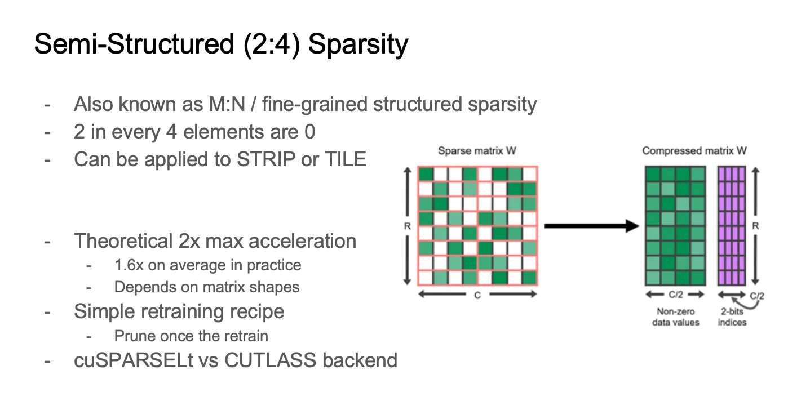

### 使用cuSPARSELt库进行GPU稀疏矩阵乘法

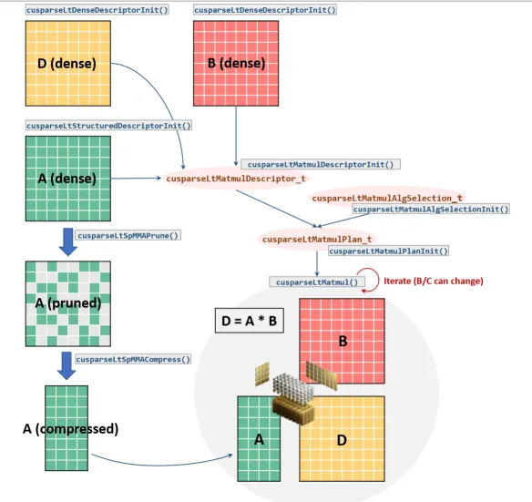

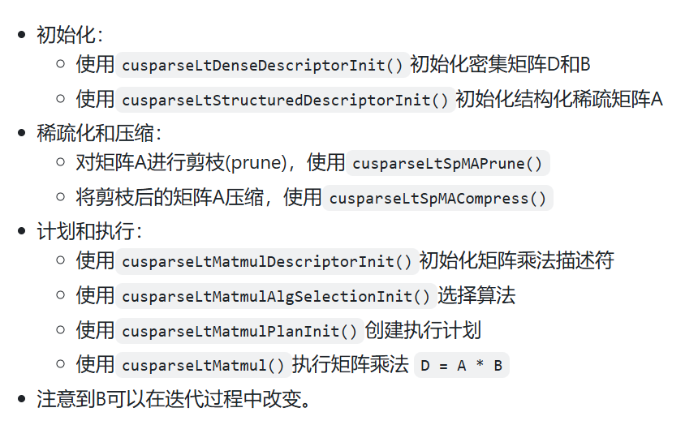

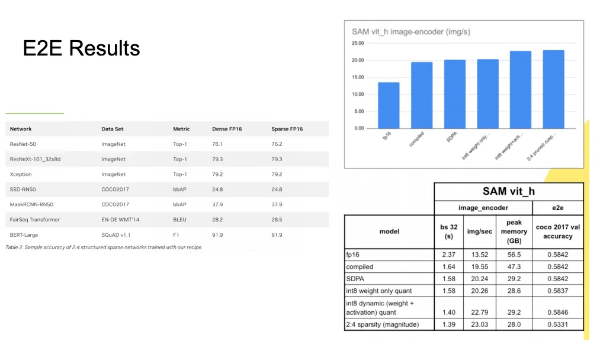

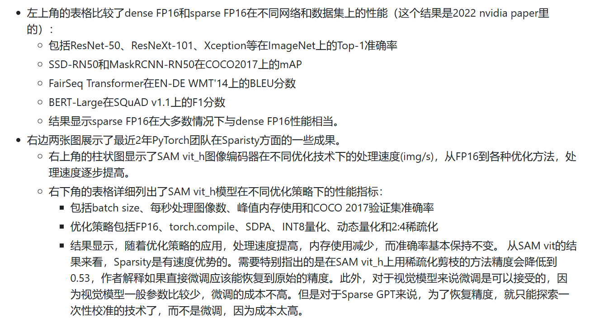

### PyTorch中如何对nn.Linear层应用Sparse

https://gist.github.com/jcaip/44376cd69d3a05cbe16610b4379d9b70

整体流程为先对模型进行稀疏化（这里使用的是apply_fake_sparsity函数，名字暗示这个是伪稀疏化，应该不能保证模型精度），然后再调用 to_sparse_semi_structured 函数执行真正的权重转换为semi structured sparse tensor。迷惑的点在于，apply_fake_sparsity函数里面执行了2行sparsifier.step()，这个可能要深入了解下PyTorch Sparisity才知道了。

此外，目前Torch实现的这种semi structured sparse只支持第一个矩阵为稀疏的，而第二个矩阵必须是的Dense。在PyTorch中Linear的基本形式是xW'，所以不支持对W的稀疏化，但我们可以考虑试用转置来重写它，使它支持对W的稀疏化。如Slides左侧的最后一个公式所示。但这样又明显会对性能产生影响，因为要在GPU上进行内存复制操作，我们可以通过编译器把这个转置融合到后续的操作比如ReLU中，这样整个流程会快得多。但torch.comiple目前好像不支持sparse Matmul之后这种融合。

## Block Sparsity

### https://github.com/pytorch-labs/superblock 

我们可以发现，随着块大小的增加，性能普遍提高，并且稀疏度水平0.9通常比0.8获得更高的性能数值。此外，端到端（E2E）结果显示在ImageNet上使用ViT-L模型测试时实现了1.44倍的加速，精度下降损失不大。

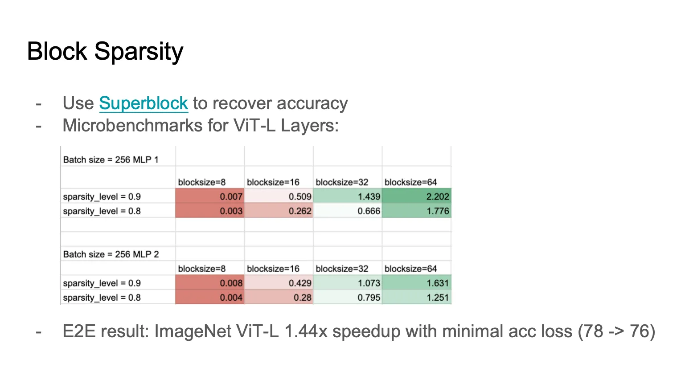

## Sparse和Quantization结合

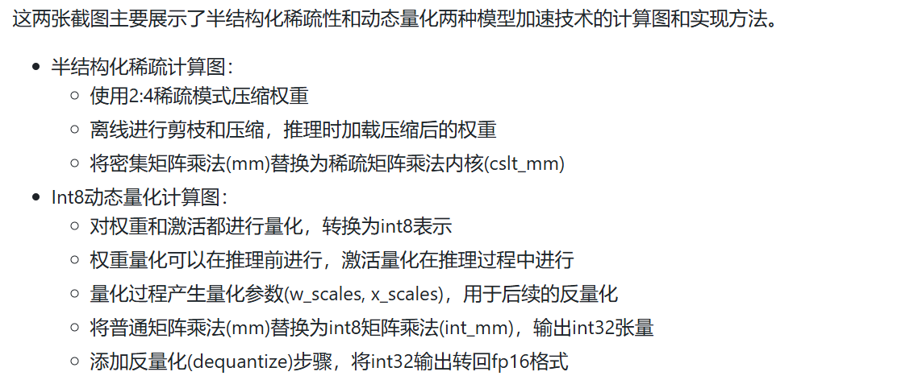

### 如何将半结构化稀疏性和int8动态量化技术结合使用

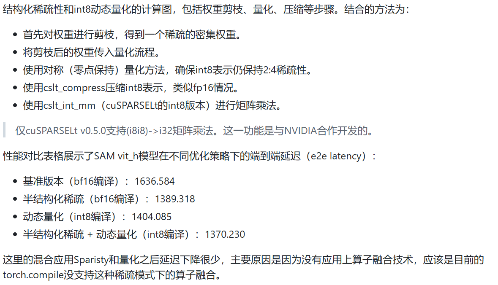

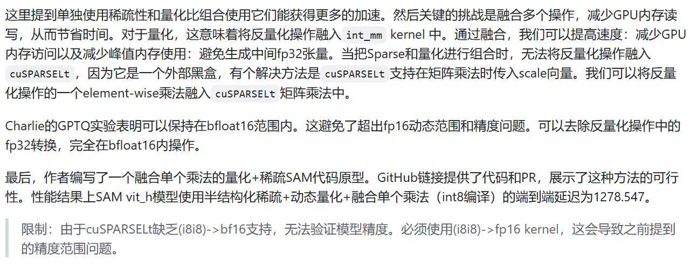

最终结论就是Sparisty和Quantization结合可以展现出速度优势，然后在精度方面还处于非常初级的实验阶段。

## Sparse Training

只是简单提了一下xformers支持了Semi-Structured (2:4) Sparsity Training，并在ImageNet上做过实验。然后说明了一下Sparse Training和Inference的主要区别以及Sparse Training的一些关键组件，包括需要算得很快的稀疏算子，让我们完成对输入的压缩，需要自定义的torch.autograd.Function实现，需要cuSPARSELt支持转置操作与后续分布式集合通信算子的融合。

