# Flash Attention

## 分块（Tiling）技术
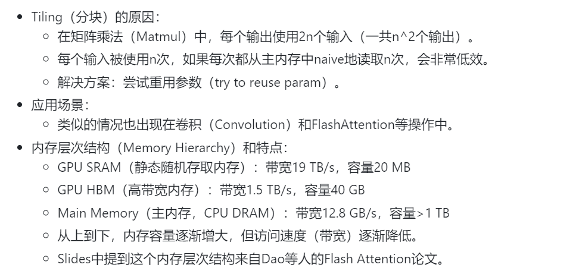

通过重用数据和利用更快的内存层（如GPU SRAM），可以显著提高计算效率。同时，Slides中展示的内存层次结构清楚地说明了不同级别内存之间在速度和容量上的权衡，这进一步强调了优化内存访问模式的重要性。

## 把注意力机制视为分类问题
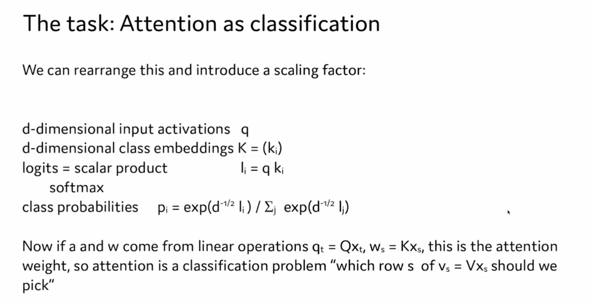

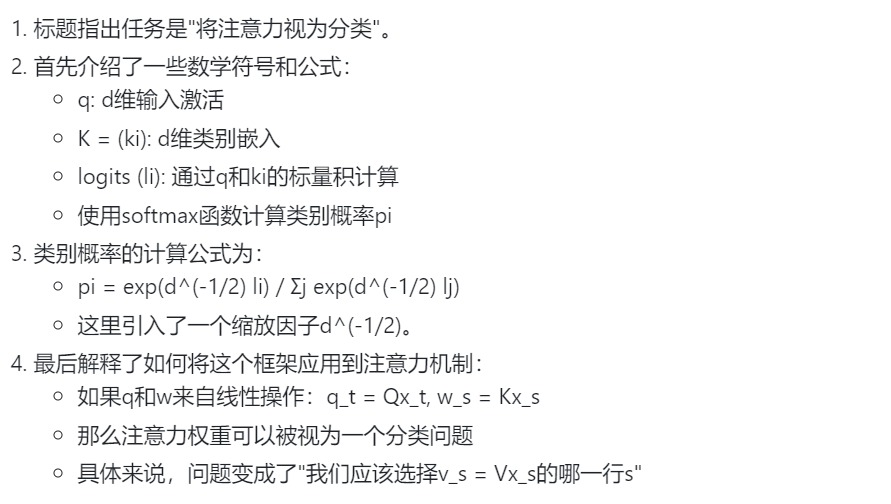

## Multi-head Attention（多头注意力机制）

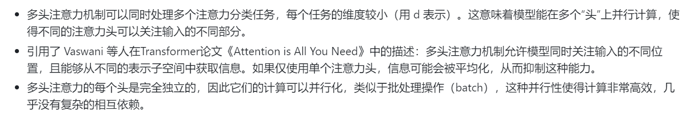

### 注意力机制的数学表示，以及如何在计算中进行并行化优化

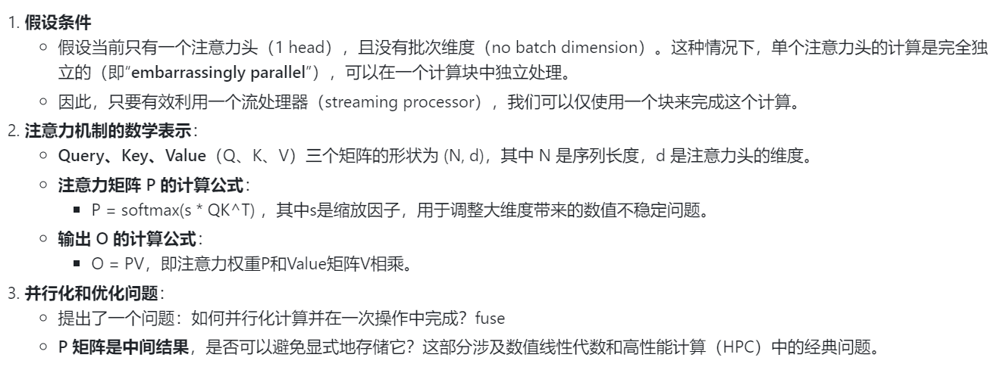

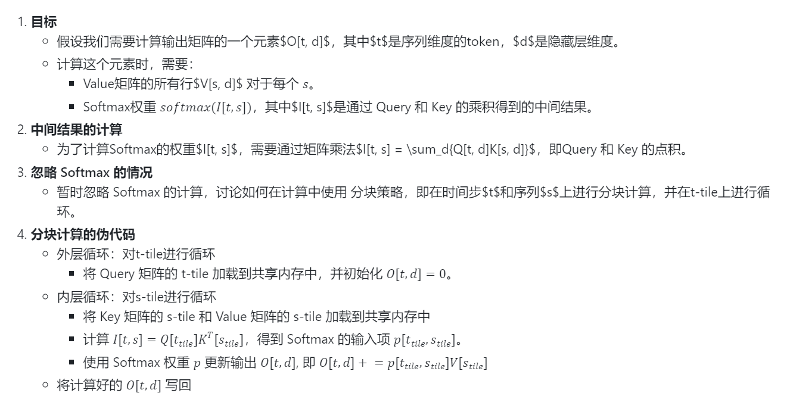

https://zhuanlan.zhihu.com/p/669926191
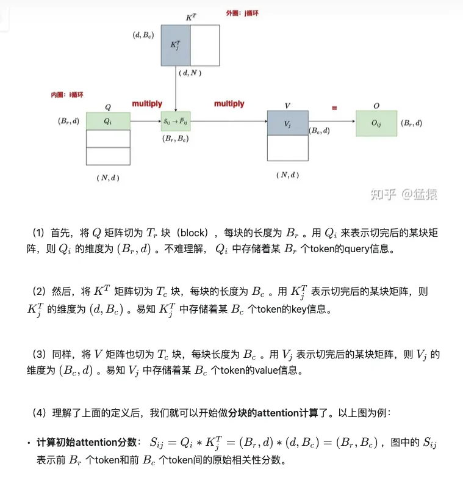
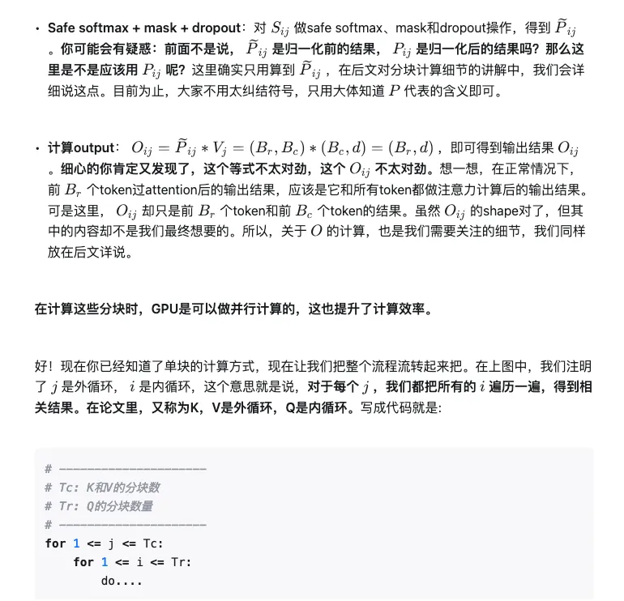

### safe softmax

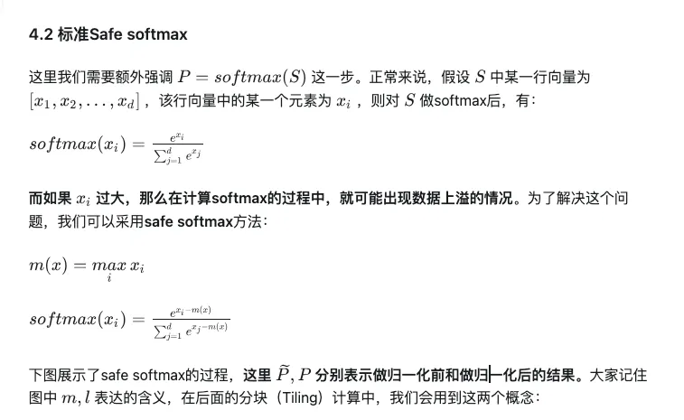

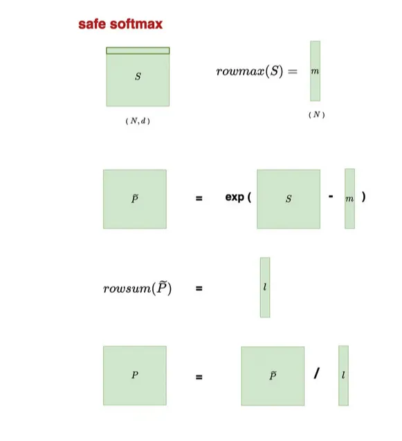

## Online stabilized softmax

https://zhuanlan.zhihu.com/p/669926191 

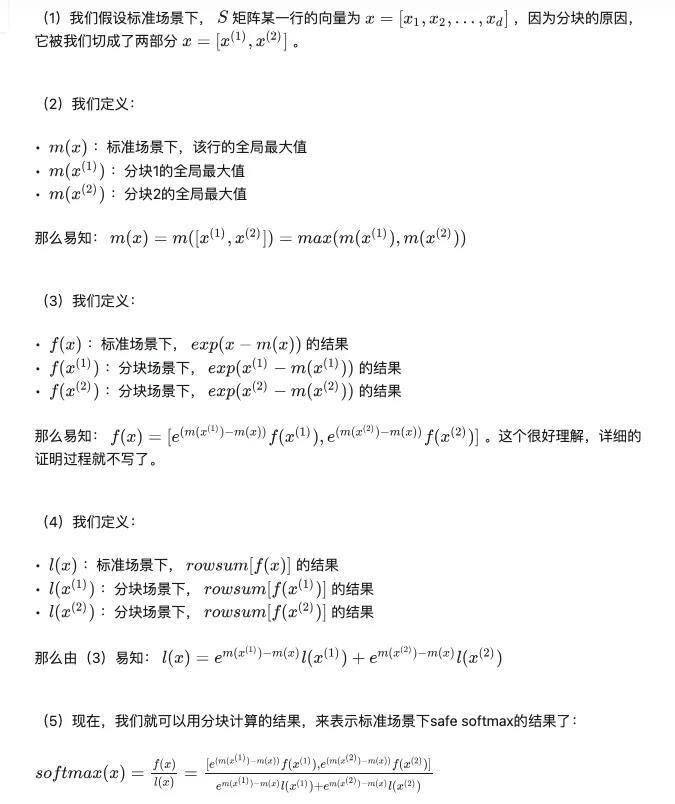

## 一些与实现和优化相关的技术细节

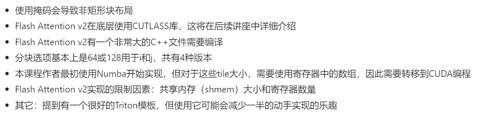

> https://zhuanlan.zhihu.com/p/669926191 
> https://zhuanlan.zhihu.com/p/684557290  《Flash Attention PyTorch naive实现讲解补充》

