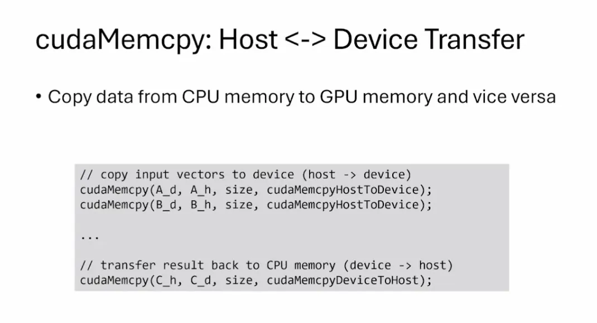
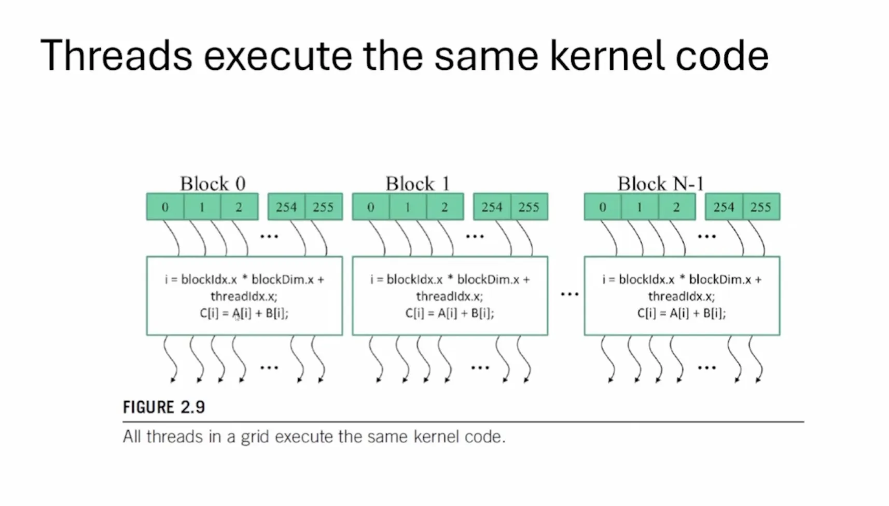
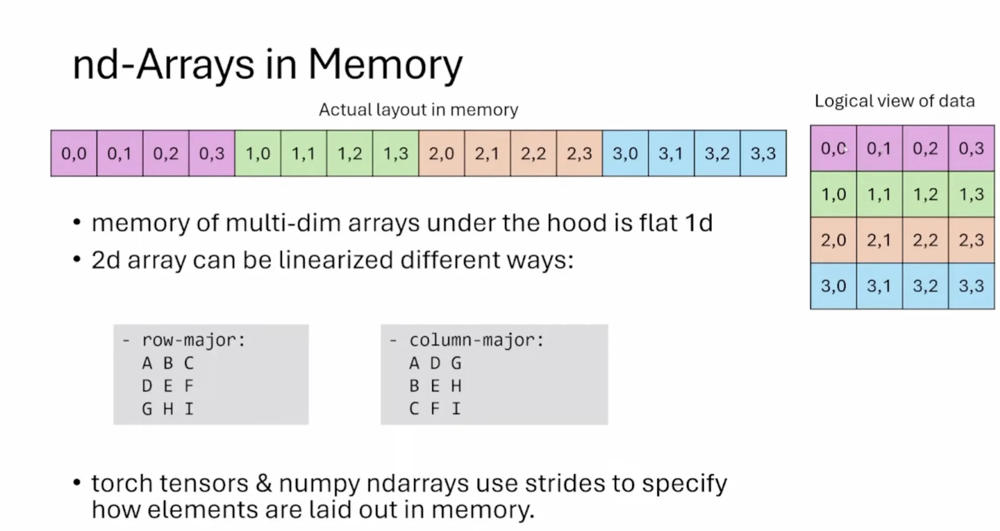
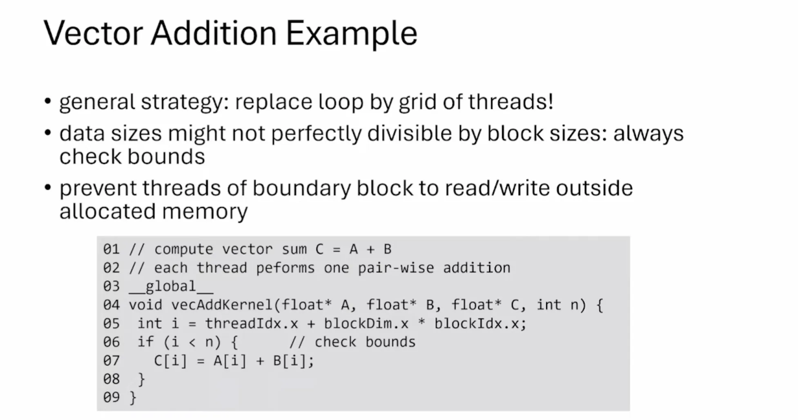
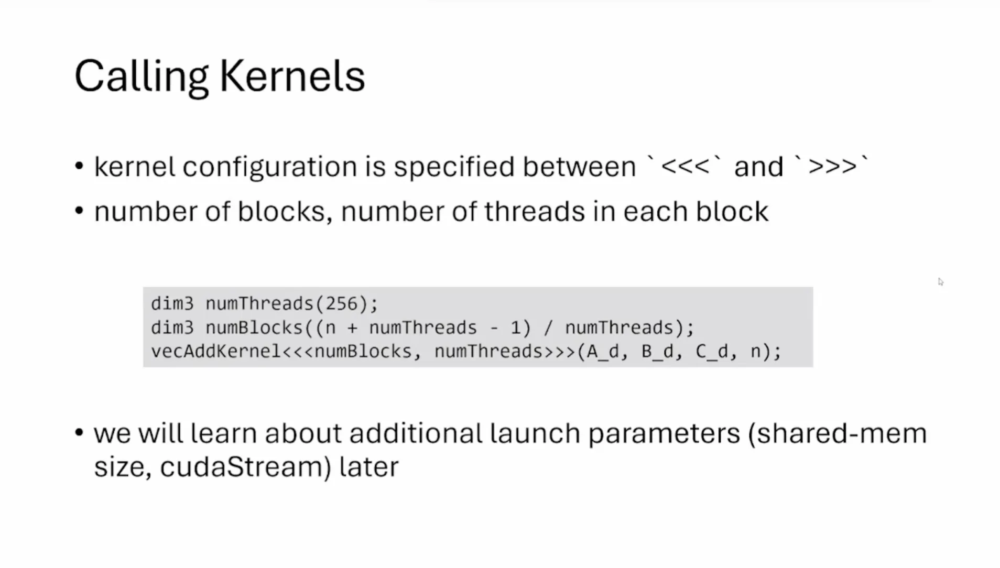

# Programming Massively Parallel Processors（PMPP） 1-3章


## cuda 语法

* cudaMalloc()
* cudaFree()
```
size_t size = n * sizeof(float);
cudaMalloc((void**)&A_d, size);
cudaFree(A_d);
```



* D2H和H2D


* error handle
```
// https://stackoverflow.com/questions/14038589/what-is-the-canonical-way-to-check-for-errors-using-the-cuda-runtime-api
#define gpuErrchk(ans) { gpuAssert((ans), __FILE__, __LINE__); }
inline void gpuAssert(cudaError_t code, const char *file, int line, bool abort = true) {
  if (code != cudaSuccess) {
    fprintf(stderr, "GPUassert: %s %s %d\n", cudaGetErrorString(code), file, line);
    if (abort) {
      exit(code);
    }
  }
}

inline unsigned int cdiv(unsigned int a, unsigned int b) {
  return (a + b - 1) / b;
}

void vecAdd(float *A, float *B, float *C, int n) {
  float *A_d, *B_d, *C_d;
  size_t size = n * sizeof(float);

  cudaMalloc((void **)&A_d, size);
  cudaMalloc((void **)&B_d, size);
  cudaMalloc((void **)&C_d, size);

  cudaMemcpy(A_d, A, size, cudaMemcpyHostToDevice);
  cudaMemcpy(B_d, B, size, cudaMemcpyHostToDevice);

  const unsigned int numThreads = 256;
  unsigned int numBlocks = cdiv(n, numThreads);

  vecAddKernel<<<numBlocks, numThreads>>>(A_d, B_d, C_d, n);
  gpuErrchk(cudaPeekAtLastError());
  gpuErrchk(cudaDeviceSynchronize());

  cudaMemcpy(C, C_d, size, cudaMemcpyDeviceToHost);

  cudaFree(A_d);
  cudaFree(B_d);
  cudaFree(C_d);
}
```

* fn <<>>


* 坐标
> int i = blockIdx.x * blockDim.x + threadIdx.x;
> 多维数组在内存中实际上是以扁平的一维方式存储的。图中展示了一个4x4的二维数组如何在内存中线性存储。
> 左侧显示了实际的内存布局（一维）；右侧显示了数据的逻辑视图（二维）
> 二维数组可以通过不同方式线性化：
>    a) 行主序（Row-major）：按行存储，如 ABC DEF GHI
>    b) 列主序（Column-major）：按列存储，如 ADG BEH CFI
> 







* \_\_global\_\_，\_\_device\_\_和 \_\_host\_\_


> 如果在函数声明中同时使用\_\_host\_\_和\_\_device\_\_修饰符，编译器会为该函数生成CPU和GPU两个版本


* Example



* call kernel



* compiler

> nvcc: 代码转换成PTX


