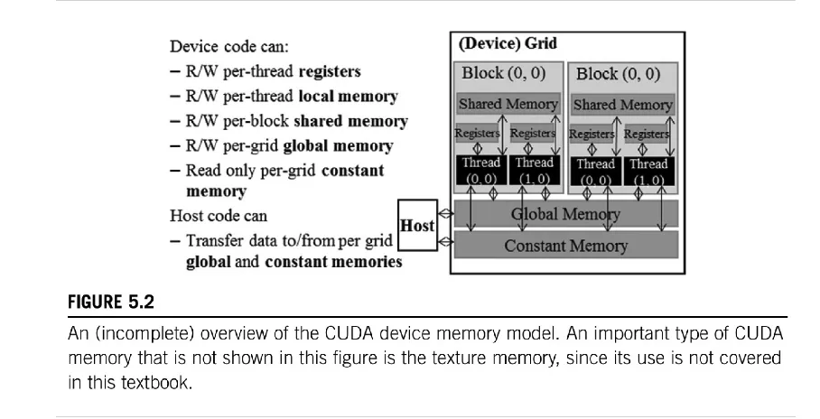

# PMPP 第4-5章 计算和内存基础


## GPU 架构


* RTX 3090有82个流式多处理器（SM, Streaming Multiprocessor），每个SM包含多个RT Core（光线追踪核心）和Tensor Core（张量核心）。所有SM共用L2缓存。
* GA102 GPU实际上有168个FP64单元（每个SM两个），但Slides中未显示。FP64的TFLOP（每秒浮点运算次数）速率是FP32的1/64。包含少量FP64硬件单元是为了确保任何包含FP64代码的程序都能正确运行，包括FP64 Tensor Core代码。
> GA：代表 "Graphics Ampere"，指的是 NVIDIA 的 Ampere 架构。102：是这个特定 GPU 型号的数字标识符。通常，较高的数字表示更高端或更大规模的 GPU 设计。GA102 被用于多款显卡，包括 GeForce RTX 3090, RTX 3080 和一些 Quadro 系列专业卡。


### NVIDIA GA10x GPU架构中的流式多处理器(Streaming Multiprocessor, SM)的结构和特性

* SM结构
  * 4个处理单元，每个包含FP32（单精度浮点）和INT32（整数）运算单元
  * 每个处理单元有一个第三代Tensor Core
  * 寄存器文件（16,384 x 32位）
  * L0 I-Cache和Warp调度器
  * 128KB的L1数据缓存/共享内存
  * 第二代RT Core（光线追踪核心）
* 线程块分配
  * 一个线程块被分配给一个SM
  * 每个SM最多可分配1536个线程
  * 无法控制网格中的哪个块分配到哪里（Hopper+架构可以有线程块组）
* Warp执行
  * 4个warp或"部分warp"可以在一个周期内计算
  * 这些warp共享一条指令（Volta+架构每个线程都有程序计数器）
* 计算单元
  * 32个FP32单元（这32个FP32单元对应一个warp的32个线程，在任何给定的时钟周期，32个FP32单元可以同时处理一个warp中的32个线程）
  * 其中16个同时支持INT32运算
* 寄存器
  * 16k个32位寄存器在同一块上调度的任务之间共享
* 缓存和共享内存
  * L1缓存和共享内存共享128KB硬件
  * 共享内存可以配置为0/8/16/32/64/100KB
  * L1缓存使用剩余空间（至少28KB）

### CUDA编程中的线程(Threads)、线程束(Warps)和线程块(Blocks)的概念和关系


* CUDA内核启动：指定块布局（每个块中的线程数）；指定网格布局（要启动的块数）
* 一个线程块内的线程：同一块内的线程在同一个流式多处理器(SM)上并行执行（可以访问SM的共享内存）
* 除了及其新的GPU，块之间完全独立；CUDA可以自由地将块分配给SM；块的执行顺序是随机的
* 一个线程块在SM上运行时被划分为32线程的线程束；每个线程束在SM的固定处理单元上运行；同时分配给处理单元的所有线程束轮流执行，但寄存器状态保持不变（这里应该指的是线程束切换的时候可以保留寄存器状态，例如当一个线程束暂停执行让位于另一个线程束时，它的寄存器状态会被保存。当这个线程束再次获得执行时间时，它可以从之前的状态继续执行，而不需要重新初始化。）；
* 在AMD硬件和术语中，线程束称为Wavefronts，默认大小为64？
* 右侧图表展示了线程块如何分配到不同的SM上。

### CUDA中线程的线性化和分组为线程束（warps）的过程


使用T(x,y,z)表示线程索引，其中x、y、z表示三个维度的索引。将多维的线程索引转换为一维的线性索引的公式为：threadId = threadIdx.x + blockDim.x * (threadIdx.y + blockDim.y * threadIdx.z)。线性化后的线程被分组为32个线程一组的线程束，图底部显示了线程如何被分组成连续的线程束。


这个kernel的目的是为3D空间中的每个点计算其在warp内的32个"邻居"的索引。它利用了CUDA的warp级别shuffle操作来高效地在线程间交换数据。输出是一个5D张量，维度为(8, 8, 8, 32, 3)，其中：

* 前三个维度(8, 8, 8)对应3D空间中的点
* 32表示每个点计算32个邻居
* 3表示每个邻居的x、y、z坐标


### 线程束分歧（Warp Divergence）现


Pascal架构，根据线程ID执行不同的操作。执行执行流程为:
* 所有线程首先到达分歧点。
* 执行 A 和 B 的线程（threadIdx.x < 4）继续执行，其他线程等待。
* 然后执行 X 和 Y 的线程继续，之前的线程等待。
* 最后所有线程重新汇合执行 Z。
关键点为：
* 旧方法：线程共享程序计数器，但有一个"活动掩码"。
* 需要小心在 if 语句内部不进行线程间通信或同步（除非使用掩码）。
* 自动重新汇合：执行完分歧部分后，所有线程自动在 Z 处重新汇合。

> 关键点为<=Pascal架构时，warp内的所有线程共享程序计数器。


Volta及之后架构中处理线程束分歧（Warp Divergence）的新方法：
* 所有线程首先到达分歧点。
* 执行 A 的线程（threadIdx.x < 4）继续执行。
* 同时，执行 X 的线程（threadIdx.x >= 4）也开始执行。
* B 和 Y 分别在各自的线程组中执行。
* 最后，所有线程执行 Z，但不需要显式的重新汇合。
主要改进：
* 独立程序计数器：每个线程都有自己的PC，允许更灵活的执行。
* 并行执行分歧路径：不同的执行路径可以同时进行，提高效率。
* 没有自动重新汇合：线程可以独立执行，直到自然地到达相同的指令。
* 更好的延迟隐藏：如果两个分支都涉及从DRAM加载数据，可以并行进行，提高效率。
* 更高的硬件利用率：减少了线程等待的情况。

> 注意线程分化时不再有自动重新汇合：开发者需要更加注意同步点。


最后添加了__syncwarp()函数。关键变化和概念：
* 没有自动重新汇合：Volta架构不再自动在分支结束处重新同步线程。
* 显式同步：使用__syncwarp()函数来手动重新同步线程束。
* 线程间通信：像shuffle这样的操作也会同步参与的线程。
* 块级同步：__syncthreads()函数同步整个线程块，而不仅仅是线程束。


展示了CUDA编程中由于循环上限不同导致的线程束分歧（Warp Divergence）情况

### 如何获得良好的GPU占用率（occupancy）和平衡资源使用


* 有82个SM（流多处理器）是很好的，因为这意味着可以运行多个块。作为对比，Jetson Xavier有8个Volta SM。
* 每个SM可以调度多达1536个线程。建议块大小是512的2的幂次方（如256或512），这有利于性能优化。一些其他GPU支持2048个线程。
* 尽量避免线程束（warp）内的分歧，以便每个周期都能执行整个warp（32个线程）。
* 在Gx102（GeForce / Workstation GPUs）上，如果可能的话，避免使用FP64/INT64数据类型。
* 共享内存和寄存器资源限制了SM上可调度的线程数量。使用__launch_bounds__ / C10_LAUNCH_BOUNDS来建议编译器为寄存器分配线程数。注意：寄存器溢出会降低性能。
* 以前有一个Excel表格用于计算占用率，现在这个功能集成在Nsight Compute中。
* 使用torch.cuda.get_device_properties(<gpu_num>)来获取设备属性（如max_threads_per_multi_processor）。


## 内存架构和数据局部性（也是获得fast kernel的基础）

### 讨论了PyTorch程序如何分配其运行时间


PyTorch程序的时间分配（高层次概述）：
* Python处理
* 数据"管理开销"（如分配Tensor结构等）
* 数据获取（I/O）- 建议在深入GPU优化前检查这部分
* GPU计算，包括：
  * 固定成本（如内核启动等）  
  * 内存访问（读取输入/写入结果）- 当前章节（第5章）的重点
  * "实际"计算（FLOPs）- 占用率是关键，在第4章已经讨论

* Thomas的经验法则：
  * 如果GPU利用率（在nvidia-smi中）未接近100%，应优先改进数据获取等方面
  * 当处理的Tensor只有几百个元素时，"Python很慢"，数据管理开销占比为个位数百分比
  * 算法选择也很重要（后续章节会讨论并行算法）


内存访问作为性能瓶颈的问题：
* Eager PyTorch对每个操作都执行"加载输入、计算、存储输出"的过程。
* 如果能够合并内核，执行"加载输入、多次计算、存储输出"，效率会更高。
* PyTorch的优化焦点：
  * 长期以来，PyTorch一直关注这个问题。
  * PyTorch JIT的原始目的是将elementwise操作融合到一个内核中，例如提高LSTM接近CuDNN的性能。
  * 第二代PyTorch JIT fusers增加了收缩操作等（NVFuser在https://github.com/NVIDIA/Fuser 上持续改进）。
  * 当前的inductor/Triton基础优化也部分针对这点，但支持更复杂的操作。
* 内存访问优化也是flash attention的核心组成部分。图片右侧展示了内存层次结构，包括带宽和内存大小。图来自FLash Attention的Paper。

接着举了这个GeLU fuse前后执行时间对比的例子，说明我们把所有的elementwise操作fuse之后的有效性


### 内存访问和计算在图像处理中的性能影响


这里说的27us就是 https://github.com/cuda-mode/lectures/blob/main/lecture_004/cuda-mode-session-4.ipynb 这里的第一个cuda kernel的输出


### 屋顶线模型（Roofline Model with latency hiding）

这是一个性能分析模型，用于评估计算密集型应用在特定硬件上的性能上限。横轴表示计算密度（Computational intensity），单位是FLOP/B（每字节内存传输的浮点运算数）。纵轴表示计算吞吐量（Computational throughput），单位是GFLOP/s（每秒十亿次浮点运算）。

* 计算密度：FLOP/Byte of memory transfer。
* 延迟隐藏：在SM（Streaming Multiprocessor）上使用多个warps，允许一些warps在计算时其他warps等待
* 峰值吞吐量（Peak throughput）：硬件能达到的最大计算速度
* 内存带宽（Peak bandwidth）：内存传输的最大速度

A1、A2、A3：代表不同算法或优化的性能点。越接近屋顶线的点，表示性能越接近硬件极限。对于内存受限区域：优化内存访问模式，减少数据传输。对于计算受限区域：提高计算效率，如使用更高效的算法。此外，通过并行执行多个warps，可以有效隐藏内存访问延迟，使得实际性能曲线更接近理论上限。


### CUDA设备内存模型的概览



* 设备代码（Device code）可以访问的内存类型
  * 每线程寄存器（R/W per-thread registers）
  * 每线程本地内存（R/W per-thread local memory）
  * 每块共享内存（R/W per-block shared memory）
  * 每网格全局内存（R/W per-grid global memory）
  * 只读每网格常量内存（Read only per-grid constant memory）
* 主机代码（Host code）可以
  * 向/从每网格全局内存和常量内存传输数据
* 设备（Device）网格结构
  * 由多个块（Block）组成
  * 每个块内有共享内存（Shared Memory）
  * 每个块内有多个线程（Thread）
  * 每个线程有自己的寄存器（Registers）
* 内存层次
  * 全局内存（Global Memory）：所有块和线程都可访问
  * 常量内存（Constant Memory）：所有块和线程都可读取
  * 共享内存（Shared Memory）：块内的线程可共享
  * 寄存器（Registers）：每个线程私有


### 参数存储位置


* 数组以外的自动变量：Register（寄存器），Thread（线程作用域），Grid（网格生命周期）
* 自动数组变量：Local（本地内存），Thread（线程作用域），Grid（网格生命周期）
* SharedVar：Shared（共享内存），Block（块作用域），Grid（网格生命周期）
* GlobalVar：Global（全局内存），Grid（网格作用域），Application（应用程序生命周期）
* ConstVar：Constant（常量内存），Grid（网格作用域），Application（应用程序生命周期）


### 分块（Tiling）技术


* Tiling（分块）的原因
  * 在矩阵乘法（Matmul）中，每个输出使用2n个输入（一共n^2个输出）。
  * 每个输入被使用n次，如果每次都从主内存中naive地读取n次，会非常低效。
  * 解决方案：尝试重用参数（try to reuse param）。
* 应用场景
  * 类似的情况也出现在卷积（Convolution）和FlashAttention等操作中
* 内存层次结构（Memory Hierarchy）和特点
  * GPU SRAM（静态随机存取内存）：带宽19 TB/s，容量20 MB
  * GPU HBM（高带宽内存）：带宽1.5 TB/s，容量40 GB
  * Main Memory（主内存，CPU DRAM）：带宽12.8 GB/s，容量>1 TB
  * 从上到下，内存容量逐渐增大，但访问速度（带宽）逐渐降低。
  * Slides中提到这个内存层次结构来自Dao等人的Flash Attention论文。

总的来说，这里解释了为什么在某些计算密集型操作中使用分块技术很重要。通过重用数据和利用更快的内存层（如GPU SRAM），可以显著提高计算效率。 同时，Slides中展示的内存层次结构清楚地说明了不同级别内存之间在速度和容量上的权衡，这进一步强调了优化内存访问模式的重要性。


#### Tiling 细节


要点是:
* 将输出和输入矩阵分割成"tiles"，例如16x16的小块。
* 每个输出tile依赖于2n/TILE_SIZE个大小为TILE_SIZE*TILE_SIZE的输入tile。
* 总共有(n/TILE_SIZE)²个tile。
* 每个输入只需从主内存读取n/TILE_SIZE次。
* 需要将输入tile存储在共享内存(shmem)中。这样block中的各个线程可以在TILE_SIZE次计算中使用这些数据。
* 最简单的设置是使用TILE_SIZE²个线程。

```
cuda_src = cuda_begin + r"""
constexpr int TILE_SIZE = 16;

__global__ void tiled_matmul_kernel(float* out, float* M, float* N, int h, int w, int k) {
  __shared__ float M_tile[TILE_SIZE][TILE_SIZE];
  __shared__ float N_tile[TILE_SIZE][TILE_SIZE];
  
  // idxes into tile
  int ir = threadIdx.y;
  int ic = threadIdx.x;
  
  int r = blockIdx.y * blockDim.y + threadIdx.y;
  int c = blockIdx.x * blockDim.x + threadIdx.x;

  // note: cannot just exit if we want to do padding!
  
  float res = 0.0f;
  for (int K_tileidx = 0; K_tileidx < (k + TILE_SIZE -1) / TILE_SIZE; K_tileidx++) {
    // note how threadIdx.x is the fastes moving bit --> coalesced memory access
    M_tile[ir][ic] = (((r < h) && (K_tileidx * TILE_SIZE + ic < k)) ? M[r * k + K_tileidx * TILE_SIZE + ic] : 0.f);
    N_tile[ir][ic] = ((((K_tileidx * TILE_SIZE + ir) < k) && (c < w)) ? N[(K_tileidx * TILE_SIZE + ir) * w + c] : 0.f);
    //M_tile[ir][ic] = M[r * k + K_tileidx * TILE_SIZE + ic];
    //N_tile[ir][ic] = N[(K_tileidx * TILE_SIZE + ir) * w + c];
    __syncthreads();
    for (int idx = 0; idx < TILE_SIZE; idx++) {
       res += M_tile[ir][idx] * N_tile[idx][ic];
    }
    __syncthreads(); // important! (why?)
  }
  if ((r < h) && (c < w)) {
    out[r * w + c] = res;
  }
}

torch::Tensor tiled_matmul(const torch::Tensor& m, const torch::Tensor& n) {
    CHECK_INPUT(m); CHECK_INPUT(n);
    int h = m.size(0);
    int w = n.size(1);
    int k = m.size(1);
    TORCH_CHECK(k==n.size(0), "Size mismatch");
    //TORCH_CHECK((k % TILE_SIZE == 0) && (h % TILE_SIZE == 0) && (w % TILE_SIZE == 0), "Padding not done");
    auto output = torch::empty({h, w}, m.options());

    dim3 tpb(TILE_SIZE, TILE_SIZE);
    dim3 blocks(cdiv(w, tpb.x), cdiv(h, tpb.y));
    tiled_matmul_kernel<<<blocks, tpb>>>(
        output.data_ptr<float>(), m.data_ptr<float>(), n.data_ptr<float>(), h, w, k);
    C10_CUDA_KERNEL_LAUNCH_CHECK();
    return output;
}

"""
cpp_src = """
torch::Tensor tiled_matmul(const torch::Tensor& m, const torch::Tensor& n);
"""

tiled_matmul_module = torch.utils.cpp_extension.load_inline(
    "test_ext_tiled_matmul", cpp_src, cuda_src, 
    functions=['tiled_matmul'], extra_cuda_cflags=['--ptxas-options=-v'], verbose=True)
```


