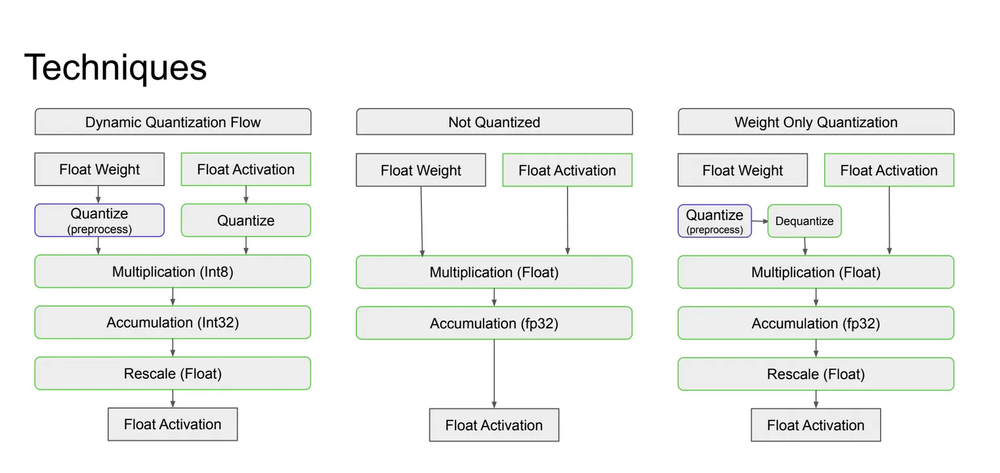
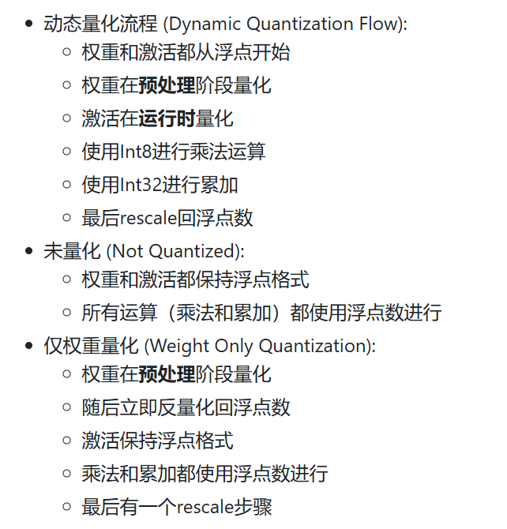
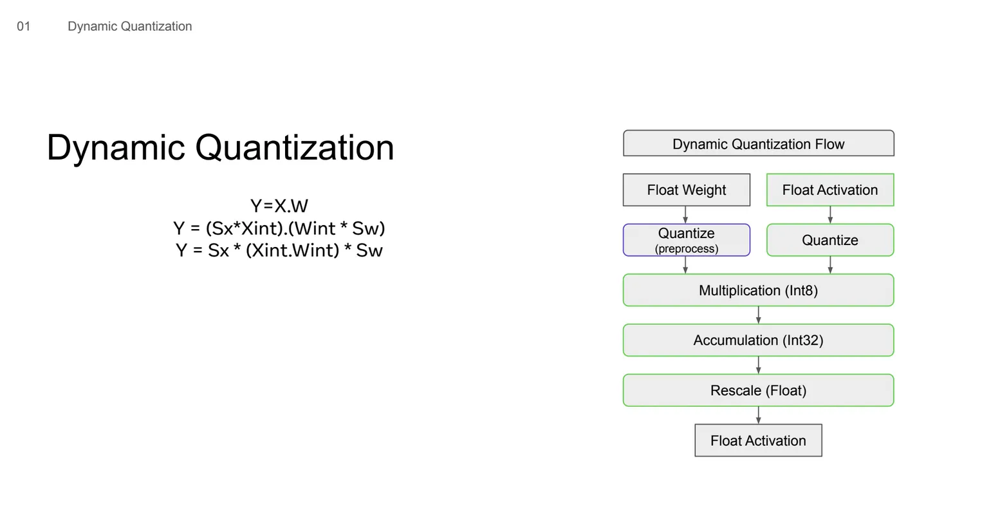
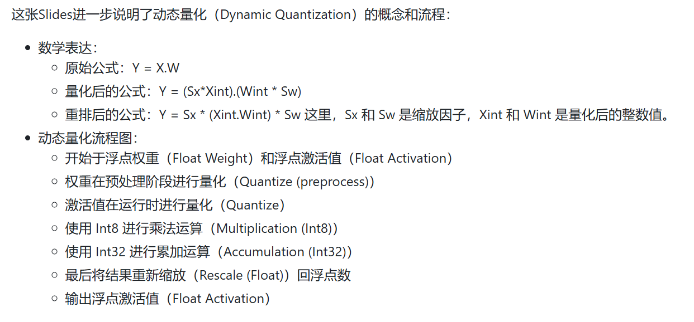
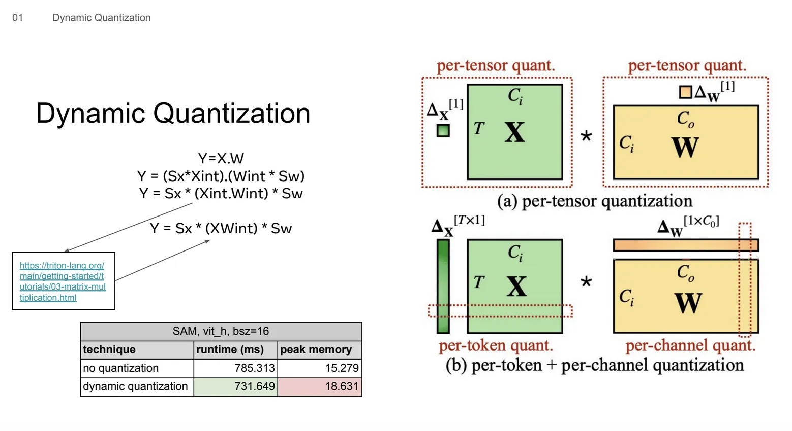
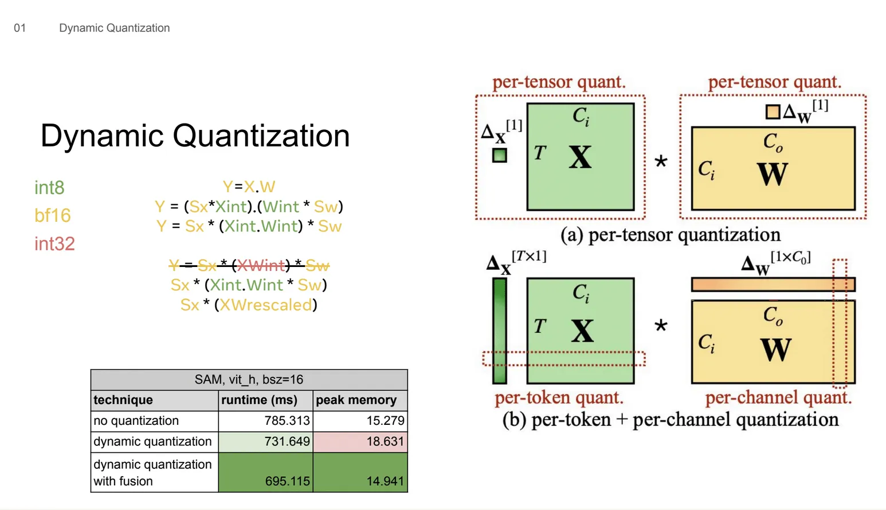
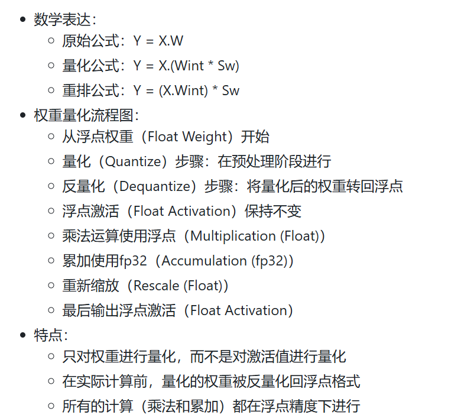
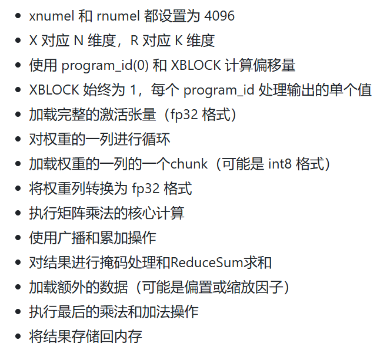
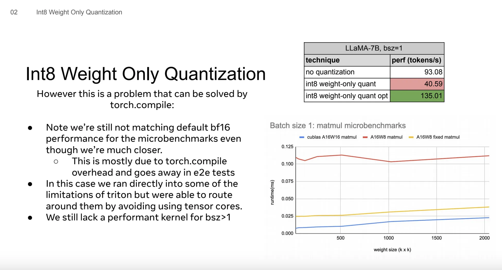
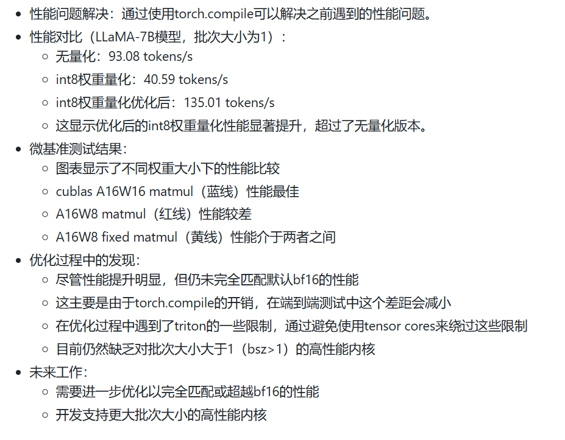

# Quantization Cuda vs Triton

> PyTorch发布了一些生成式AI模型的案例, 这些模型比如GPT-FAST，SAM-FAST都应用了量化技术

## 量化技术




总的来说，这张Slides展示了这三种技术在处理神经网络计算时的不同流程。动态量化通过在计算过程中使用整数运算来提高效率，而仅权重量化则只对权重进行压缩，在实际计算时仍使用浮点数。未量化的方法则完全使用浮点数，可能提供最高的精度但计算效率较低。


### 动态量化（Dynamic Quantization）



动态量化可以提高计算效率，在这个例子中，运行时间减少了约7%。不同的量化策略（逐张量、逐token、逐通道）可以应用于不同的张量，以优化性能和精度。虽然动态量化提高了计算速度，但它的显存占用却更多了大概是15%-20%。

显存增加的原因是要把int8的结果累加到int32类型中，因此相比于BFloat1增加了额外的显存

* 进一步量化

> 其中使用了不同的数据类型： - int8：用于Xint和Wint - bf16：用于Sx和Sw - int32：用于中间计算结果XWint

> 在Torch Compile中实现动态量化with fusion需要做出的努力，因为Torch Compile并不愿意融合乘法操作，所以作者不得不在Torch Compile的矩阵乘法kernel后强制添加一个乘法的epilogue（实际上这是一个编译器的PASS，需要匹配到矩阵乘法+乘法才能生效）。

``` 
# This op is a special case of the int_mm op which we use based on the pattern
# _int_mm -> mul (defined in ../fx_passes/post_grad.py) in order to prevent
# realization of the int32 _int_mm output by forcing fusion with the mul op.
# This is only used when config.force_fuse_int_mm_with_mul = True
def tuned_fused_int_mm_mul(mat1, mat2, mat3, out_dtype, *, layout=None):
    out_dtype = (
        torch.promote_types(mat3.get_dtype(), torch.int32)
        if out_dtype is None
        else out_dtype
    )
    m, n, k, layout, mat1, mat2, mat3 = mm_args(
        mat1, mat2, mat3, layout=layout, out_dtype=out_dtype
    )
    choices: List[Dict[Any, Any]] = []
    for config in int8_mm_configs(m, n, k):
        mm_template.maybe_append_choice(
            choices,
            input_nodes=(mat1, mat2, mat3),
            layout=layout,
            **dict(mm_options(config, m, n, k, layout), ACC_TYPE="tl.int32"),
            suffix_args=1,
            epilogue_fn=V.ops.mul,
        )
    return autotune_select_algorithm("int_mm", choices, [mat1, mat2, mat3], layout)
```
> Triton在实现这个需求时相比于Torch Compile会很简单，一行代码即可。


## Int8 Weight


展示了Int8权重量化（Int8 Weight Only Quantization）的性能表现，无量化: 93.08 tokens/s，int8权重量化: 40.59 tokens/s，可以看到int8权重量化反而降低了处理速度，约为无量化版本的43.6%。

* Int8权重量化的性能低于预期的原因是
执行了比基础matmul更多的工作，展示了一段代码，显示了额外的加载和类型转换操作，这些额外操作可能导致性能下降
块大小被限制为大于等于16，当前配置只执行64个块，少于A 100GPU的108个多处理器，这可能导致一些多处理器未被充分利用

* Torch Compile通过链接里的代码解决了这个问题
```
@register_decomposition([aten.mm])
@pw_cast_for_opmath
def mm(self, input2):
    # Our matrix vector multiplies only achieve peak bandwidth with coordinate descent tuning.
    # todo: Look into why and fix it (hopefully)
    if config.coordinate_descent_tuning:
        if guard_size_oblivious(self.shape[0] == 1) or guard_size_oblivious(
            input2.shape[1] == 1
        ):
            return (self.unsqueeze(2) * input2.unsqueeze(0)).sum(dim=1)
    ...
    return NotImplemented
```
实际上这个操作就是让GEMV用Cuda Core而不是Tensor Core来完成计算，具体做法就是把GEMV操作等价为一个element-wise乘法加一个reduce操作。
展示了一个名为 triton_() 的函数（由Torch编译器生成），该函数实现了 Int8 权重量化的GEMV操作。完整流程为：


``` 
def triton_(in_ptr0, in_ptr1, in_ptr2, in_ptr3, out_ptr1, xnumel, rnumel, XBLOCK: tl.constexpr, RBLOCK: tl.constexpr):
    xnumel = 4096
    rnumel = 4096
    xoffset = tl.program_id(0) * XBLOCK
    xindex = xoffset + tl.arange(0, XBLOCK)[:, None]
    xmask = xindex < xnumel
    rbase = tl.arange(0, RBLOCK)[None, :]
    x0 = xindex
    _tmp6 = tl.full([XBLOCK, RBLOCK], 0, tl.float32)
    for roffset in range(0, rnumel, RBLOCK):
        rindex = roffset + rbase
        rmask = rindex < rnumel
        r1 = rindex
        tmp0 = tl.load(in_ptr0 + (r1), None, eviction_policy='evict_last').to(tl.float32)
        tmp2 = tl.load(in_ptr1 + (r1 + (4096*x0)), xmask, eviction_policy='evict_first', other=0.0)
        tmp1 = tmp0.to(tl.float32)
        tmp3 = tmp2.to(tl.float32)
        tmp4 = tmp1 * tmp3
        tmp5 = tl.broadcast_to(tmp4, [XBLOCK, RBLOCK])
        tmp7 = _tmp6 + tmp5
        _tmp6 = tl.where(xmask, tmp7, _tmp6)
    tmp6 = tl.sum(_tmp6, 1)[:, None]
    tmp9 = tl.load(in_ptr2 + (x0), xmask, eviction_policy='evict_last').to(tl.float32)
    tmp11 = tl.load(in_ptr3 + (x0), xmask, eviction_policy='evict_last').to(tl.float32)
    tmp8 = tmp6.to(tl.float32)
    tmp10 = tmp8 * tmp9
    tmp12 = tmp10 + tmp11
    tl.store(out_ptr1 + (x0), tmp12, xmask)
```

* Int8权重量化（Int8 Weight Only Quantization）的优化过程和结果




## Int4


