# CUDA性能检查清单

> 这篇文章对Volta架构的GPU的架构细节进行分析，对性能优化是很重要的
> https://arxiv.org/pdf/1804.06826.pdf 

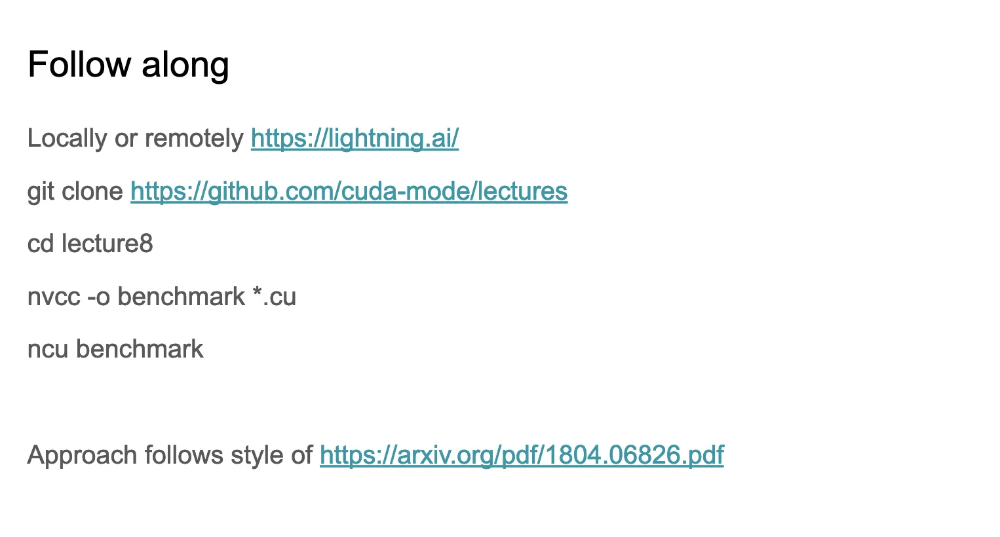


## 从物理学的角度分析了下SRAM和DRAM的区别

DRAM由1个晶体管和1个电容器构成；SRAM: 由6个晶体管构成
SRAM 比 DRAM 更快，但也更贵；SRAM 占用更多空间且发热更多； 实际上SRAM就对应了GPU的Shared Memory，而DRAM对应的则是Shared Memory。


## 性能检查清单（Performance checklist）
> 优化GPU程序性能的策略和技巧

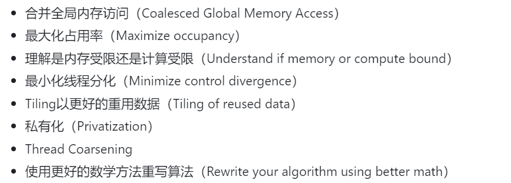


## GPU内存访问延迟的相关内容

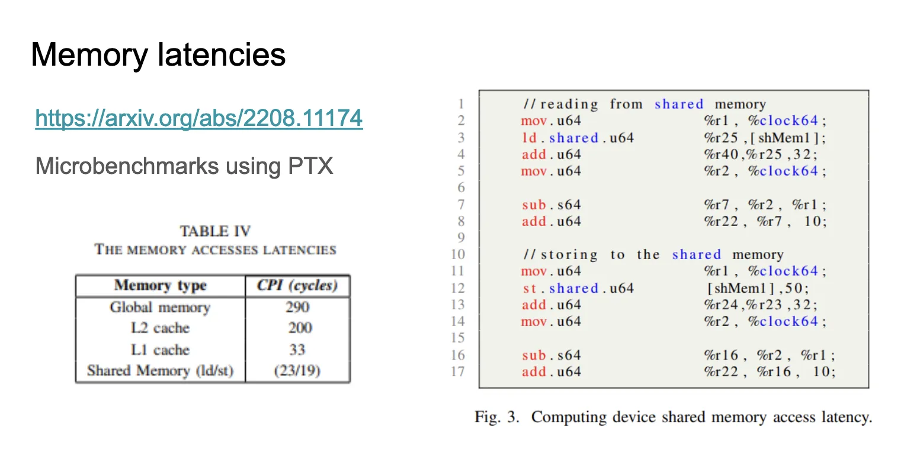

> https://arxiv.org/pdf/2208.11174 
> https://www.stuffedcow.net/research/cudabmk?q=research/cudabmk


* 全局内存（Global memory）: 290 cycles
* L2 缓存: 200 cycles
* L1 缓存: 33 cycles
* 共享内存（Shared Memory）: 读取23 cycles，写入19 cycles


## 延迟（latency）

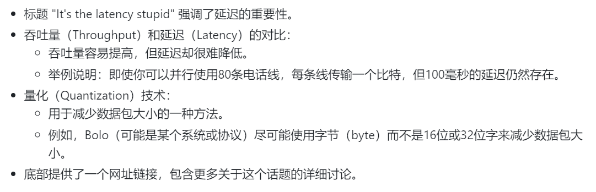


## 内存合并（Memory Coalescing）
> 我们无法减少延迟，但可以通过读取连续的内存元素来隐藏延迟。

* DRAM Throughput（DRAM吞吐量）
* Duration（持续时间）
* L1 cache throughput（L1缓存吞吐量）

```
#include <iostream>
#include <cuda_runtime.h>

__global__ void copyDataNonCoalesced(float *in, float *out, int n) {
    int index = blockIdx.x * blockDim.x + threadIdx.x;
    if (index < n) {
        out[index] = in[(index * 2) % n];
    }
}

__global__ void copyDataCoalesced(float *in, float *out, int n) {
    int index = blockIdx.x * blockDim.x + threadIdx.x;
    if (index < n) {
        out[index] = in[index];
    }
}

void initializeArray(float *arr, int n) {
    for(int i = 0; i < n; ++i) {
        arr[i] = static_cast<float>(i);
    }
}

int main() {
    const int n = 1 << 24; // Increase n to have a larger workload
    float *in, *out;

    cudaMallocManaged(&in, n * sizeof(float));
    cudaMallocManaged(&out, n * sizeof(float));

    initializeArray(in, n);

    int blockSize = 128; // Define block size
    // int blockSize = 1024; // change this when talking about occupancy
    int numBlocks = (n + blockSize - 1) / blockSize; // Ensure there are enough blocks to cover all elements

    // Launch non-coalesced kernel
    copyDataNonCoalesced<<<numBlocks, blockSize>>>(in, out, n);
    cudaDeviceSynchronize();

    initializeArray(out, n); // Reset output array

    // Launch coalesced kernel
    copyDataCoalesced<<<numBlocks, blockSize>>>(in, out, n);
    cudaDeviceSynchronize();

    cudaFree(in);
    cudaFree(out);

    return 0;
}
```

定义了两个CUDA kernel：
* copyDataNonCoalesced kernel：非合并内存访问模式，以非连续的方式读取输入数组（使用 (index * 2) % n 作为索引），这种访问模式会导致非合并的内存访问，可能降低性能。
* copyDataCoalesced kernel：合并内存访问模式，以连续的方式读取输入数组（直接使用 index 作为索引），这种访问模式允许合并内存访问，可以提高性能。

接着使用nvcc -o benchmark coalesce.cu来编译程序，然后执行ncu benchmark来Profile程序。


## padding（填充）

> 解决Tensor Core矩阵乘法维度要求的问题

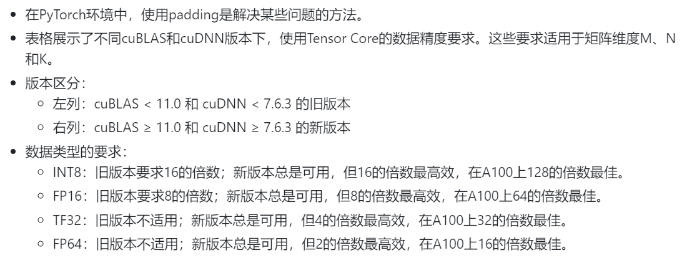


在CUDA中提升Occupancy的一个方法是修改kernel


> CUDA Occupancy calculator工具可以帮我们自动计算达到更好Occupancy的kernel启动参数，在上一节合并访存的.cu中调用这个Api结果显示，对于T4 GPU，最优的配置是网格大小为40，块大小为1024。
> https://github.com/cuda-mode/lectures/blob/main/lecture_008/occupancy.cu

> Roofline模型，它决定了一个cuda kernel是compute bound还是memory bound。


## 算术强度（Arithmetic intensity）

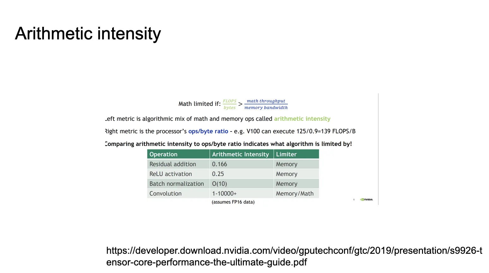

左侧指标是数学运算和内存操作的算法混合，称为算术强度
右侧指标是处理器的ops/byte比率
比较算术强度和ops/byte比率可以指出算法受什么因素限制
> https://developer.download.nvidia.com/video/gputechconf/gtc/2019/presentation/s9926-tensor-core-performance-the-ultimate-guide.pdf


* ReLU（Rectified Linear Unit）函数的算术强度

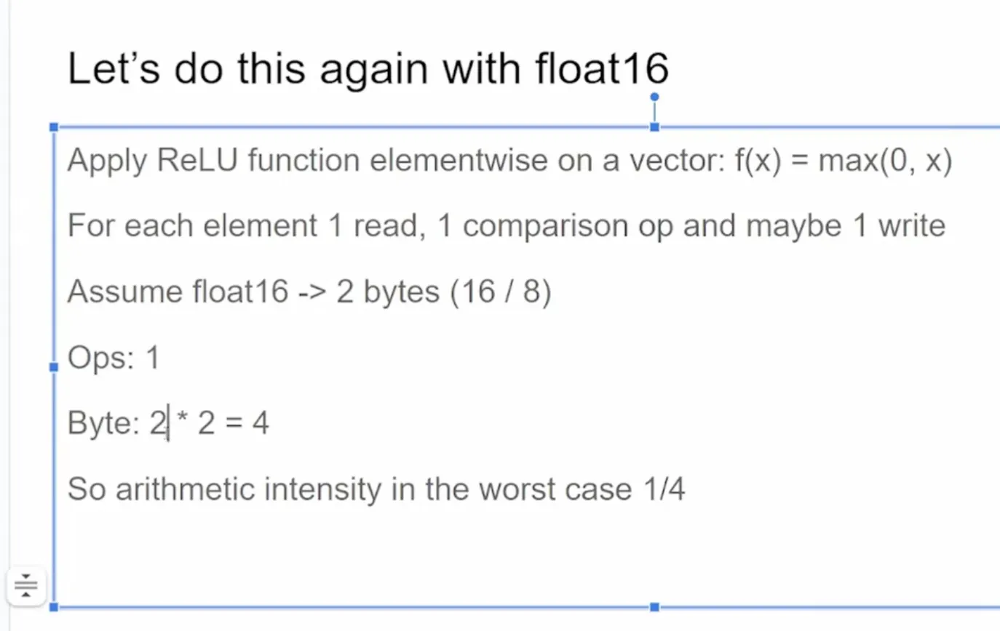

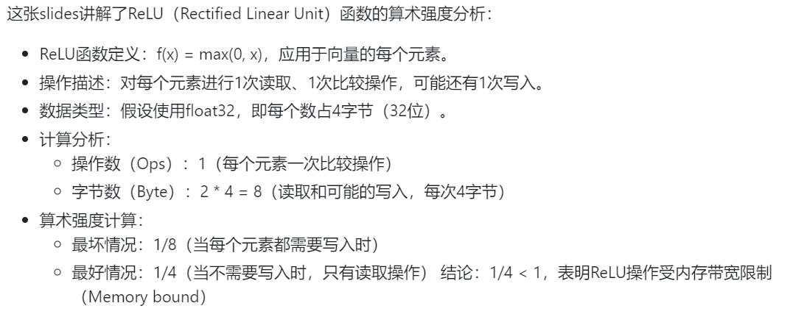

* 对Float16的ReLU进行了算术强度分析


可以看打这种情况下最坏的算术强度是1/4，而不是Float32时的1/8，因此量化是可以提高计算强度的。


* 矩阵乘法（Matmul）的算术强度分析

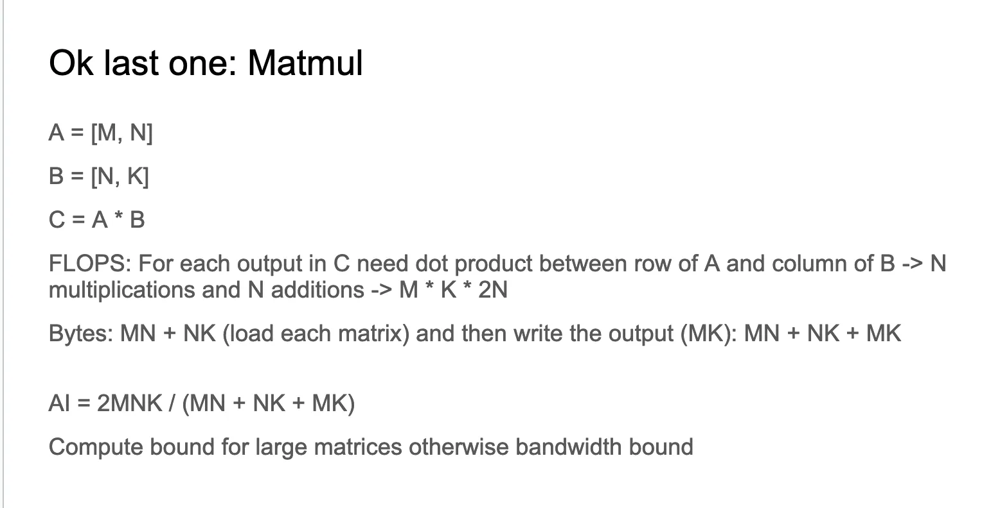

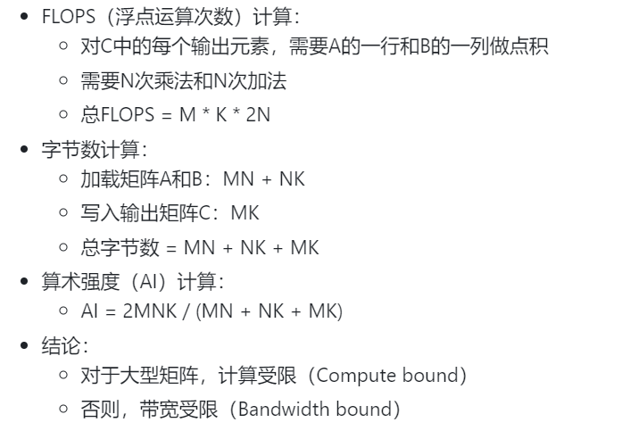

## 如何优化不同类型的kernels
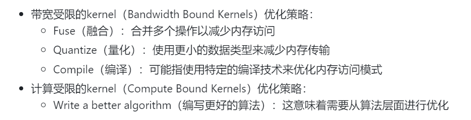


* Tiling减少全局内存访问
* 分歧（control divergence）
> https://github.com/cuda-mode/lectures/blob/main/lecture_008/divergence.cu
控制分歧（control divergence）与占用率（occupancy）有关，但如果条件语句导致大量线程闲置，这是不好的。
processArrayWithDivergence 耗时 0.074272 毫秒; processArrayWithoutDivergence 耗时 0.024704 毫秒;这表明去除control divergence可以显著提高性能（约3倍）。
"ncu --set full divergence" 用这行命令来设置线程control divergence分析。

* 对于compute bound的kernel
> 让线程可以做更多工作，可能会更快
>  https://github.com/cuda-mode/lectures/blob/main/lecture_008/coarsening.cu
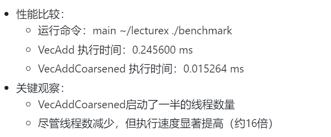


## GPU编程中的"私有化"（Privatization）技术


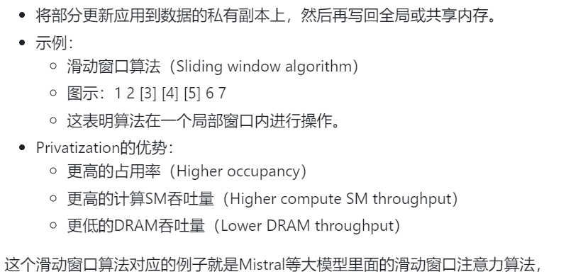


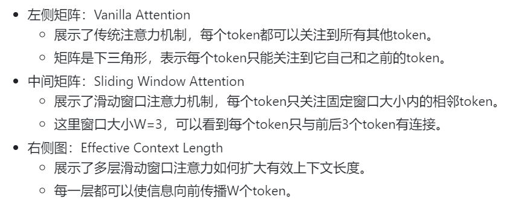

传统注意力的操作数量与序列长度成二次方关系，内存使用随token数线性增长。在推理时，这会导致更高的延迟和更低的吞吐量，因为缓存可用性降低。滑动窗口注意力通过限制每个token最多只关注前一层的W个token来缓解这个问题。虽然窗口外的token不直接参与注意力计算，但它们仍然可以影响下一个词的预测。在每个注意力层，信息可以向前传播W个token。经过k个注意力层后，信息可以向前传播最多k × W个token

https://github.com/cuda-mode/lectures/blob/main/lecture_008/privatization.cu
```

// CUDA kernel for vector addition without privatization
__global__ void vectorAdd(const float *a, const float *b, float *result, int n) {
    int index = threadIdx.x + blockIdx.x * blockDim.x;
    if (index < n) {
        result[index] = a[index] + b[index];
    }
}

// CUDA kernel for vector addition with privatization
__global__ void vectorAddPrivatized(const float *a, const float *b, float *result, int n) {
    int index = threadIdx.x + blockIdx.x * blockDim.x;
    if (index < n) {
        float a_private = a[index]; // Load into private memory
        float b_private = b[index]; // Load into private memory
        result[index] = a_private + b_private;
    }
}
```
我们把a[index]，b[index]加载到private memory里面避免对全局内存的直接操作，但在这个VectorAdd的例子中没有加速。
在下面的滑动窗口求和的例子中通过把global memory加载到shared memory中，然后进行累加时求和操作就是在shared memory中进行操作。
https://github.com/cuda-mode/lectures/blob/main/lecture_008/privatization2.cu

比如Flash Attention利用Safe Softmax的数学形式分块计算Attention
