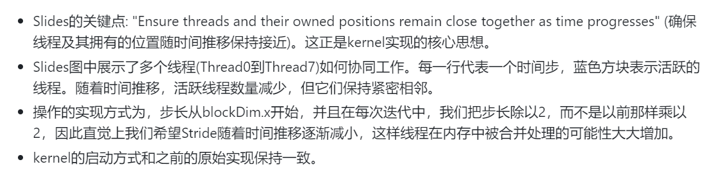
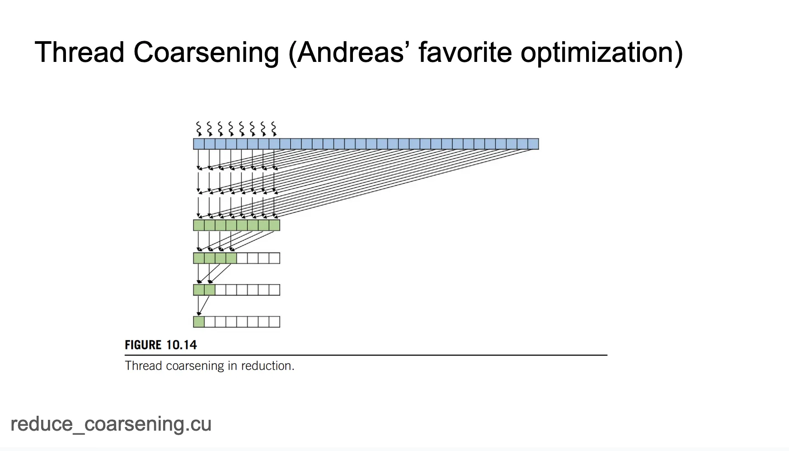

# 归约


reduction（归约）操作的定义，reduction（归约）是减少输出大小的操作
最典型的reduction操作是将向量（vector）转换为标量（scalar）
常见的reduction操作，包括min（最小值），max（最大值），argmax（最大值的索引），argmin（最小值的索引），norm（范数），sum（求和），prod（乘积），mean（平均值），unique（唯一值）
https://github.com/cuda-mode/lectures/blob/main/lecture_009/torch_reductions.py 


* 归约操作在深度学习和机器学习中的普遍


torch.max这个算子的实现是在 https://github.com/pytorch/pytorch/blob/main/aten/src/ATen/native/cuda/ReduceOps.cpp 这里，并不是一个单独的kernel实现，而是注册为通用的Reduce Op里面的其中一个。


## 并行规约

* 乘法


* 加法

浮点数加法不满足交换律，即A=B不等于B+A，使用PyTorch时这一点经常引起混淆。在这个例子中，我们无法控制GPU线程执行的先后顺序，所以无法控制合并两个元素的顺序，这也是不确定性的源头之一

PyTorch中使用torch.use_deterministic_algorithms(True)来控制使用确定性的算法，但是这种算法一般会降低运行速度
https://github.com/cuda-mode/lectures/blob/main/lecture_009/nondeterminism.py 
```
# We'll use several small numbers that, when added together first, could show a difference
numbers = [1e-20] * 10 + [1e20, -1e20]  # 10 small numbers followed by a large positive and negative number

# Sum the list from left to right
sum_left_to_right_adjusted = sum(numbers)

# Sum the list from right to left
sum_right_to_left_adjusted = sum(reversed(numbers))

# 0.0 9.999999999999997e-20
print(sum_left_to_right_adjusted, sum_right_to_left_adjusted)
```
INT4/INT8量化时，累加运算往往在更高的精度下运行，其原因在于如果你在float16中累加许多小的数值，最后可能会出现大数吃小数的情况
解决方法有两种：
1. 要么使用bf16这种具有更高动态范围的数据类型
2. 要么在float32高精度上进行累加

Triton矩阵乘法的教程时，我们会发现他的累加器一般都是float32
https://github.com/cuda-mode/lectures/blob/main/lecture_009/accuracy.py


* simple_reduce
https://github.com/cuda-mode/lectures/blob/main/lecture_009/simple_reduce.cu 

```
__global__ void SimpleSumReductionKernel(float* input, float* output) {
    unsigned int i = 2 * threadIdx.x;
    for (unsigned int stride = 1; stride <= blockDim.x; stride *= 2) {
        if (threadIdx.x % stride == 0) {
            input[i] += input[i + stride];
        }
        __syncthreads();

    }
    if (threadIdx.x == 0) {
    *output = input[0];
    }
}
```


## Control divergence，Memory divergence，最小化全局内存访问，线程粗化

###  Control divergence
> https://github.com/cuda-mode/lectures/blob/main/lecture_009/control_divergence_reduce.cu

```
__global__ void FixDivergenceKernel(float* input, float* output) {
    unsigned int i = threadIdx.x; //threads start next to each other
    for (unsigned int stride = blockDim.x; stride >= 1; stride /= 2) { // furthest element is blockDim away
        if (threadIdx.x < stride) { // 
            input[i] += input[i + stride]; // each thread adds a distant element to its assigned position
        }
        __syncthreads();

    }
    if (threadIdx.x == 0) {
    *output = input[0];
    }
}
```



### 下一个shared memory优化相关

> https://github.com/cuda-mode/lectures/blob/main/lecture_009/shared_reduce.cu

```
#define BLOCK_DIM 1024

// This is the code from the book but I couldn't get this to run faster even with occupancy calculator
// L1 throughput is dramatically increased though
__global__ void SharedMemoryReduction(float* input, float* output) {
    __shared__ float input_s[BLOCK_DIM];
    unsigned int t = threadIdx.x;
    input_s[t] = input[t] + input[t  + BLOCK_DIM];
    for (unsigned int stride = blockDim.x/2; stride >= 1; stride /=2) {
        __syncthreads();
        if (threadIdx.x < stride) {
            input_s[t] += input_s[t + stride];
        }
    }

    if (threadIdx.x == 0) {
        *output = input_s[0];
    }
}
```


尝试增加这个kernel的输入数据量的时候我们发现kernel结果会出错，这是因为kernel里面的shared memory的大小限制为了1024。在GPU上一般不会做规模着么小的任务。

###  多 block


启动多个Block，然后只要每个单独的Block可以容纳1024分元素，我们就可以在不同的Block中单独进行归约操作，最后再对所有的Block进行一次最后的归约。
https://github.com/cuda-mode/lectures/blob/main/lecture_009/segment_reduce.cu


### 线程粗化
每个线程累加4个或者8个元素


https://github.com/cuda-mode/lectures/blob/main/lecture_009/reduce_coarsening.cu 


# 结语

PyTorch的reduction kernel并不是像我们有一个max.cuh/mean.cuh那样，而是只有一个单独的Reduce.cuh，因为所有的归约操作都具有相同的结构，它们在数学上是高度等价的。我们期望构建一个更为通用的基础设施，其中可以赋予它一个累加器以及一个操作符，然后通过代码生成来获得最优的算法
https://github.com/pytorch/pytorch/blob/main/aten/src/ATen/native/cuda/Reduce.cuh


