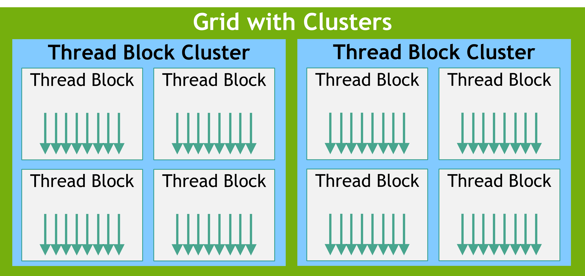
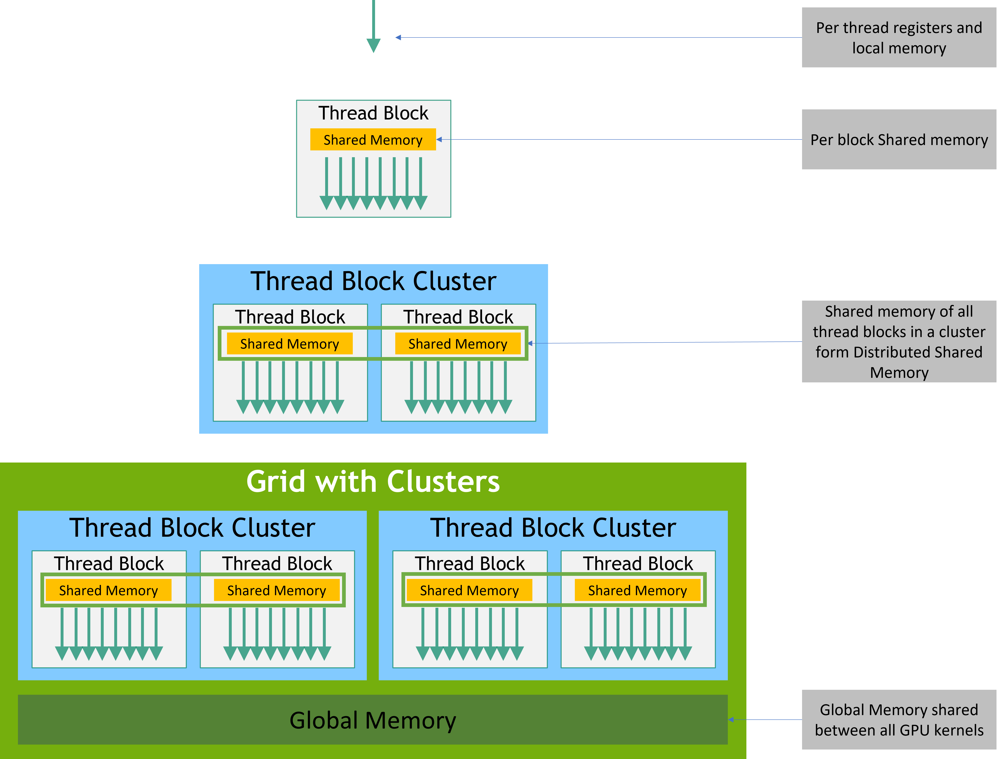
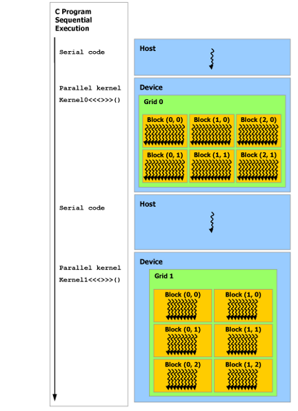

## 2.1 Kernels

\_\_device__

\_\_global__

<<<...>>>

```
// Kernel definition
__global__ void VecAdd(float* A, float* B, float* C)
{
    int i = threadIdx.x;
    C[i] = A[i] + B[i];
}

int main()
{
    ...
    // Kernel invocation with N threads
    VecAdd<<<1, N>>>(A, B, C);
    ...
}
```


## 2.2 Thread Hierarchy

thread index: (Dx, Dy), (x, y) is (x + y * Dx)

thread block: (Dx, Dy, Dz), (x, y, z) is (x + y * Dx + z * Dx * Dy)


numBlocks：线程块数量            int or dim3

threadsPerBlock: 线程块中的线程数 （最多1024个线程）    int or dim3

一个内核（kernel）可以由多个形状相同的线程块（block）来执行

```
// Kernel definition
__global__ void MatAdd(float A[N][N], float B[N][N],
float C[N][N])
{
    int i = blockIdx.x * blockDim.x + threadIdx.x;
    int j = blockIdx.y * blockDim.y + threadIdx.y;
    if (i < N && j < N)
        C[i][j] = A[i][j] + B[i][j];
}

int main()
{
    ...
    // Kernel invocation
    dim3 threadsPerBlock(16, 16);
    dim3 numBlocks(N / threadsPerBlock.x, N / threadsPerBlock.y);
    MatAdd<<<numBlocks, threadsPerBlock>>>(A, B, C);
    ...
}
```

\_\_syncthreads（）内在函数来指定内核中的同步点，块中的所有线程都必须等待，然后才能继续


### 2.2.1 Thread Block Clusters




* version 1
\_\_cluster_dims__(X,Y,Z)
```
// Kernel definition
// Compile time cluster size 2 in X-dimension and 1 in Y and Z dimension
__global__ void __cluster_dims__(2, 1, 1) cluster_kernel(float *input, float* output)
{

}

int main()
{
    float *input, *output;
    // Kernel invocation with compile time cluster size
    dim3 threadsPerBlock(16, 16);
    dim3 numBlocks(N / threadsPerBlock.x, N / threadsPerBlock.y);

    // The grid dimension is not affected by cluster launch, and is still enumerated
    // using number of blocks.
    // The grid dimension must be a multiple of cluster size.
    cluster_kernel<<<numBlocks, threadsPerBlock>>>(input, output);
}
```

* version 2
cudaLaunchKernelEx

cluster.sync() 执行硬件支持的同步

num_threads() 和 num_blocks() API 根据线程数或块数来查询集群组的大小

dim_threads() 和 dim_blocks() 集群组中线程或块的 rank
```
// Kernel definition
// No compile time attribute attached to the kernel
__global__ void cluster_kernel(float *input, float* output)
{

}

int main()
{
    float *input, *output;
    dim3 threadsPerBlock(16, 16);
    dim3 numBlocks(N / threadsPerBlock.x, N / threadsPerBlock.y);

    // Kernel invocation with runtime cluster size
    {
        cudaLaunchConfig_t config = {0};
        // The grid dimension is not affected by cluster launch, and is still enumerated
        // using number of blocks.
        // The grid dimension should be a multiple of cluster size.
        config.gridDim = numBlocks;
        config.blockDim = threadsPerBlock;

        cudaLaunchAttribute attribute[1];
        attribute[0].id = cudaLaunchAttributeClusterDimension;
        attribute[0].val.clusterDim.x = 2; // Cluster size in X-dimension
        attribute[0].val.clusterDim.y = 1;
        attribute[0].val.clusterDim.z = 1;
        config.attrs = attribute;
        config.numAttrs = 1;

        cudaLaunchKernelEx(&config, cluster_kernel, input, output);
    }
}
```


## 2.3 Memory Hierarchy




## 2.4 Heterogeneous Programming




## 2.5 Asynchronous SIMT Programming Model

Asynchronous Barrier 、 cuda::memcpy_async


1. Asynchronous Operations

异步操作使用同步对象来同步操作的完成： 

cuda::memcpy_async

cooperative_groups::memcpy_async

cuda::thread_scope::thread_scope_thread：Only the CUDA thread which initiated asynchronous operations synchronizes.

cuda::thread_scope::thread_scope_block：All or any CUDA threads within the same thread block as the initiating thread synchronizes.

cuda::thread_scope::thread_scope_device：All or any CUDA threads in the same GPU device as the initiating thread synchronizes.

cuda::thread_scope::thread_scope_system：All or any CUDA or CPU threads in the same system as the initiating thread synchronizes.


## 2.6 Compute Capability

9 for devices based on the NVIDIA Hopper GPU architecture

8 for devices based on the NVIDIA Ampere GPU architecture

7 for devices based on the Volta architecture

6 for devices based on the Pascal architecture

5 for devices based on the Maxwell architecture

3 for devices based on the Kepler architecture


