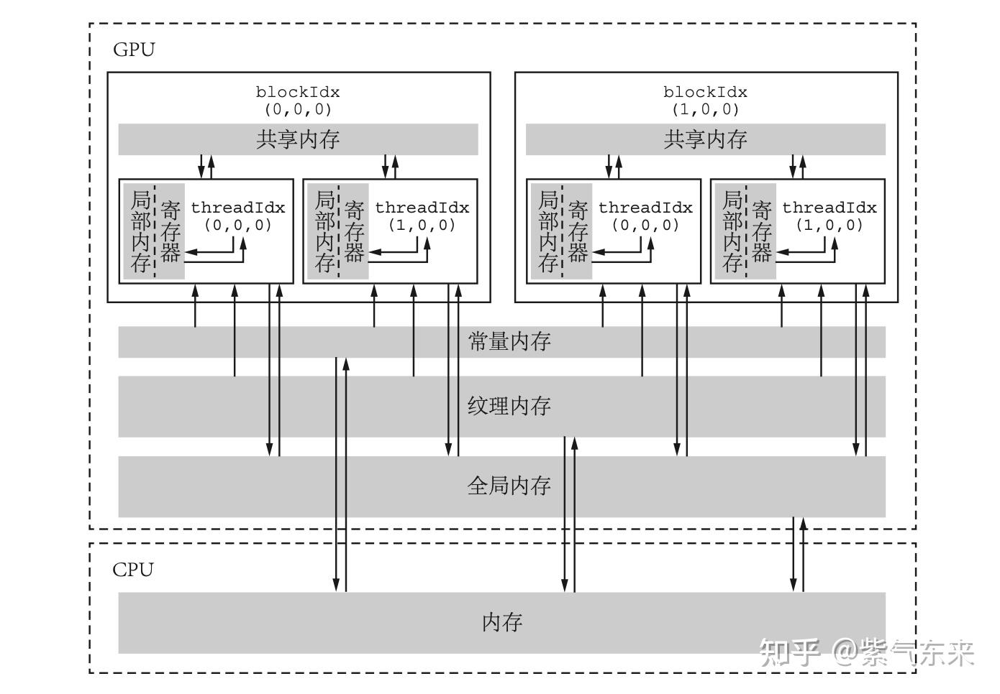
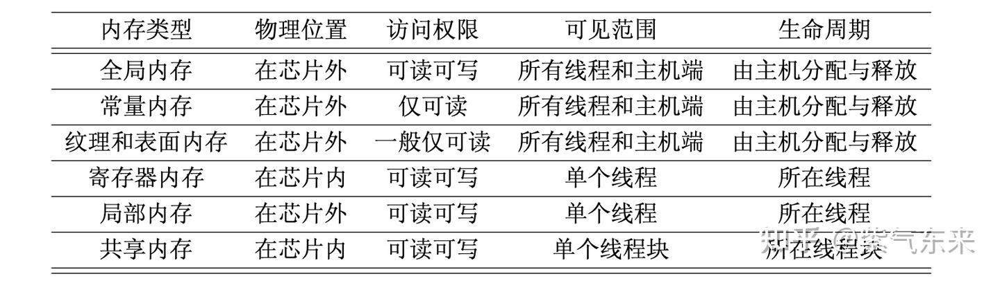
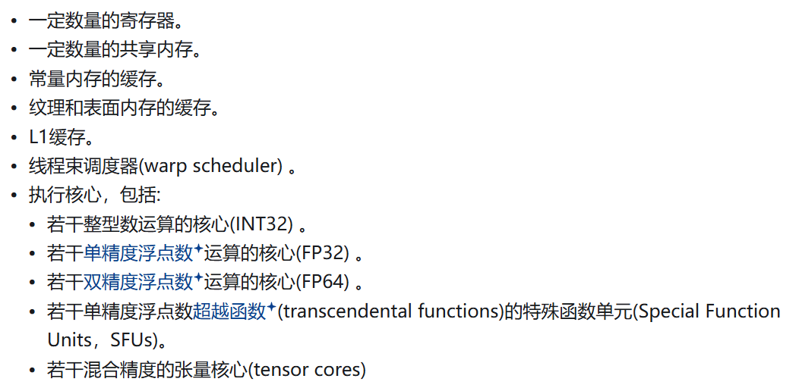
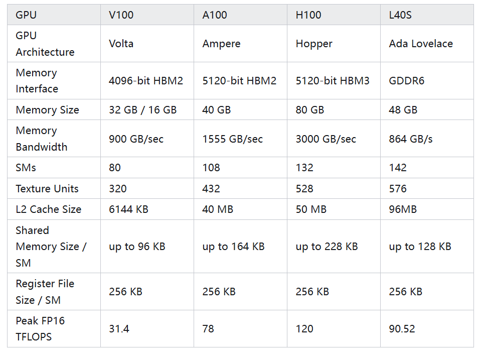
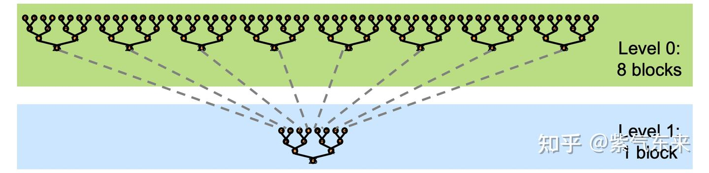
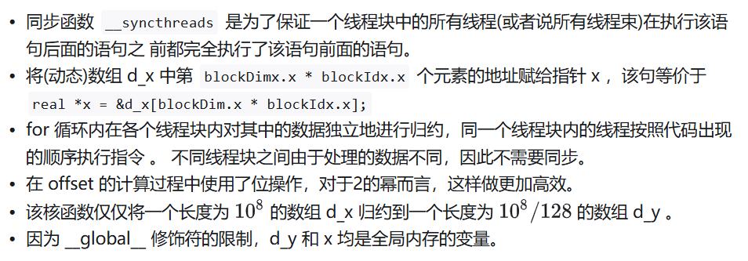
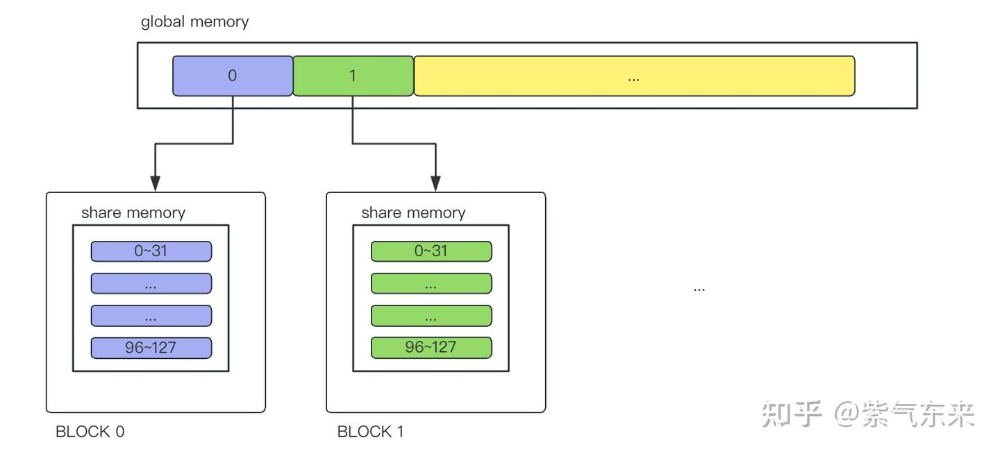

# GPU的内存体系及其优化指南

## GPU的内存体系




* 全局内存(global memory)
cudaMemcpy(d_x, h_x, M, cudaMemcpyHostToDevice);


全局内存变量可以被静态声明和动态声明， 如 静态全局内存变量由以下方式在任何函数外部定义
```
__device__ T x; // 单个变量 
__device__ T y[N]; // 固定长度的数组
```


* 常量内存(constant memory)
常量内存数量有限，一共仅有 64 KB

一个使用常量内存的方法是在核函数外面用 __constant__ 定义变量，并用 API 函数 cudaMemcpyToSymbol 将数据从主机端复制到设备的常量内存后 供核函数使用。


* 纹理内存(texture memory)和表面内存(surface memory)

* 寄存器（register）

在核函数中定义的不加任何限定符的变量一般来说就存放于寄存器(register)中。 各种内建变量，如 gridDim、blockDim、blockIdx、 threadIdx 及 warpSize 都保存在特殊的寄存器中，以便高效访问。
```
const int n = blockDim.x * blockIdx.x + threadIdx.x;
c[n] = a[n] + b[n];
```

中的 n 就是一个寄存器变量。 寄存器变量仅仅被一个线程可见

* 局部内存(local memory)
虽然局部内存在用法上类似于寄存器，但从硬件来看，局部内存只是全局内存的一部 分。所以，局部内存的延迟也很高。每个线程最多能使用高达 512 KB 的局部内存，但使用 过多会降低程序的性能。

* 共享内存(shared memory)

```
__shared__
```
不同于寄存器的是，共享内存对整个线程块可见，其生命周期也与整个线程块一致。




* L1和L2 缓存
每个 SM 都有一个 L1 缓存，所有 SM 共享一个 L2 缓存。L1 和 L2 缓存都被用来存储局部内存和全局内存中的数据，也包括寄存器中溢出的部分，以减少延时。

## SM 构成及典型GPU的对比


* 一个 GPU 是由多个 SM 构成的。一个 SM 包含如下资源




* H100




## GPU 之外

* 近存计算: 以 Graphcore IPU 为例

* 存算一体: 以 后摩智能 H30 为例

# 通过规约(Reduction)操作理解GPU内存体系

reduce 算法可以描述为   sum，min，max，avg 等操作，最后获得的输出相比于输入一般维度上会递减。

由于GPU没有针对global数据的同步操作，只能针对block的数据进行同步。所以，一般而言将reduce分为两个阶段，其示意图如下


假设给定一个长度为N的数组，需要计算该数组的所有元素之和。首先需要将数组分为m个小份。而后，在第一阶段中，开启m个block计算出m个小份的reduce值。最后，在第二阶段中，使用一个block将m个小份再次进行reduce，得到最终的结果。

https://github.com/ifromeast/cuda_learning/tree/main/02_reduce


## 仅使用全局内存实现规约

```
void __global__ reduce_global(real *d_x, real *d_y)
{
    const int tid = threadIdx.x;
    real *x = d_x + blockDim.x * blockIdx.x;

    for (int offset = blockDim.x >> 1; offset > 0; offset >>= 1)
    {
        if (tid < offset)
        {
            x[tid] += x[tid + offset];
        }
        __syncthreads();
    }

    if (tid == 0)
    {
        d_y[blockIdx.x] = x[0];
    }
}
```


## 使用共享内存实现规约

__shared__ 修饰共享内存变量 s_y，同时其长度等于线程块大小

具体实现如下所示， 当 blockIdx.x 等于 0 时，将全局内存中第 0 到第 blockDim.x - 1 个数组元素复制给 第 0 个线程块的共享内存变量副本，以此类推

```
const int tid = threadIdx.x;
const int idx = blockIdx.x * blockDim.x + threadIdx.x;
__shared__ real s_y[128];
s_y[tid] = (idx < N) ? d_x[idx] : 0.0;
__syncthreads();
```

GPU需要分配两种资源，一个是存储资源，一个是计算资源。计算资源其实是根据thread数量来确定的，一个block中分配128个thread线程，32个线程为一组（即一个 warp），绑定在一个SIMD单元。所以128个线程可以简单地理解为分配了4组SIMD单元



在我们的数组归约问题中，使用共享内存相对于仅使用全局内存还有两个好处: 一个是不再要求全局内存数组的长度 N 是线程块大小的整数倍，另一个是在规约的过程中不会改变全局内存数组中的数据(在仅使用全局内存时，数组 d_x 中的部分元素被改变)


## 使用动态共享内存实现规约

将静态共享内存改成动态共享内存，只需要做以下两处修改

1. 在调用核函数的执行配置中写下第三个参数
```
<<<grid_size, block_size, sizeof(real) * block_size>>>
```
2. 要使用动态共享内存，还需要改变核函数中共享内存变量的声明方式
```
extern __shared__ real s_y[];
```

第一，必须加上限定词 extern; 第二，不能指定数组大小。
3 种方式都完成后，我们可以编译运行代码
```
nvcc reduce_gpu.cu -o reduce

// 双精度
nvcc reduce_gpu.cu -DUSE_DP -o reduce_dp
```

然后通过 nvprof 命令查看GPU各部分的耗时
```
nvprof ./reduce
```

## 规约的其他优化方法

### 使用原子函数

```
    if (tid == 0)
    {
        d_y[bid] = s_y[0];
    }

    if (tid == 0) {
        d_y[0] += s_y[0];
    }

    if (tid == 0)
    {
        atomicAdd(d_y, s_y[0]);
    }
```

### 使用线程束函数与协作组


