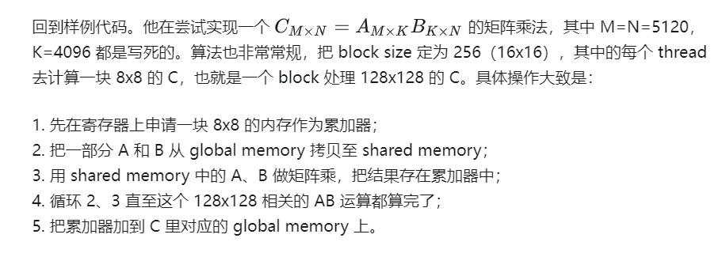

# Cute

https://github.com/NVIDIA/cutlass/blob/v3.2.0/media/docs/cute/00_quickstart.md#tutorial

## 概念
tensor、layout、shape 和 stride
> tensor = ptr + layout
> layout = shape + stride

tensor: 就是一个内存指针（ptr，其实是显存，不过为求方便，后面均称内存）和这个指针对应的内存排布的描述信息（layout）
layout（排布）:就是说一个 tensor 的形状（shape），即这个 tensor 是几维的，每一维多大，以及每一维的各个元素之间间隔多大（stride）




* 定义 mA、 mB、 mC
```
// Represent the full tensors
auto mA = make_tensor(make_gmem_ptr(A), make_shape(M,K), make_stride(Int<1>{}, M));  // (M,K)
auto mB = make_tensor(make_gmem_ptr(B), make_shape(N,K), make_stride(Int<1>{}, N));  // (N,K)
auto mC = make_tensor(make_gmem_ptr(C), make_shape(M,N), make_stride(Int<1>{}, M));  // (M,N)
```

* 定义block size
128x128 的 C，也就是处理 128 个 M 和 128 个 N，假设我们在 K 那一维每个 block 每次处理 8 个
```
// Define block sizes (static)
auto bM = Int<128>{};
auto bN = Int<128>{};
auto bK = Int<  8>{};

// dimBlock 是一维的
dim3 dimBlock(size(tC));
dim3 dimGrid(ceil_div(size(M), size(bM)),
             ceil_div(size(N), size(bN)));
gemm_device<<< dimGrid, dimBlock, 0, stream >>>(...)
```
上面的这个 bM、bN、bK 相当于每个 block 里每个循环会处理一块 bM x bK 的 A 和一块 bN x bK 的 B。

* 定义 share memory
A 和 B 的 shared memory 就应该按这个形状分配，所以它们对应的 cute tensor 为 
```
// Shared memory buffers
// 注意，shared memory 要先手动分配而且分配一维就行
__shared__ TA smemA[bM * bK];
__shared__ TB smemB[bN * bK];
auto sA = make_tensor(make_smem_ptr(smemA), make_layout(make_shape(bM,bK)));  // (BLK_M,BLK_K)
auto sB = make_tensor(make_smem_ptr(smemB), make_layout(make_shape(bN,bK)));  // (BLK_N,BLK_K)
```

* 定义A、B、C 的 thread layout
考虑 block 中的 256 个 thread 的 layout。因为 bK=8，所以我们在拷贝的时候这一维最多也就用 8 个 thread
```
// Define the thread layouts (static)
auto tA = make_layout(make_shape(Int<32>{}, Int< 8>{}));
auto tB = make_layout(make_shape(Int<32>{}, Int< 8>{}));
auto tC = make_layout(make_shape(Int<16>{}, Int<16>{}));
```

* 每个 block 对应的 global memory
```
// Get the appropriate blocks for this thread block --
// potential for thread block locality
auto blk_shape = make_shape(bM, bN, bK);
auto blk_coord = make_coord(blockIdx.x, blockIdx.y, _);            // (m,n,k)

auto gA = local_tile(mA, blk_shape, blk_coord, Step<_1, _,_1>{});  // (BLK_M,BLK_K,k)
auto gB = local_tile(mB, blk_shape, blk_coord, Step< _,_1,_1>{});  // (BLK_N,BLK_K,k)
auto gC = local_tile(mC, blk_shape, blk_coord, Step<_1,_1, _>{});  // (BLK_M,BLK_N)
```
上面这段等价于
```
auto gA = local_tile(mA, make_shape(bM, bK), make_coord(blockIdx.x, _));  // (BLK_M,BLK_K,k)
auto gB = local_tile(mB, make_shape(bN, bK), make_coord(blockIdx.y, _));  // (BLK_N,BLK_K,k)
auto gC = local_tile(mC, make_shape(bM, bN), make_coord(blockIdx.x, blockIdx.y));  // (BLK_M,BLK_N)
```
第一行相当于先把 mA 从 (M, K) reshape 成 (bM, bK, M/bM, K/bK)，然后取 mA[:, :, blockIdx.x, :]（coord 中的 _ 就类似 python 中的 :），得到的 gA 形状为 (bM, bK, K/bK)。类似地，gB 的形状为 (bN, bK, K/bK)，gC 的形状为 (bM, bM)，他们都是当前 block 会访问的 global memory。


* 每个 thread 对应的 global memory 和 shared memory 的位置
```
auto tAgA = local_partition(gA, tA, threadIdx.x);  // (THR_M,THR_K,k)
auto tAsA = local_partition(sA, tA, threadIdx.x);  // (THR_M,THR_K)

auto tBgB = local_partition(gB, tB, threadIdx.x);  // (THR_N,THR_K,k)
auto tBsB = local_partition(sB, tB, threadIdx.x);  // (THR_N,THR_K) 
```
第一行会把 gA 从 (bM, bK, K/bK) 转成 (tA[0], tA[1], bM/tA[0], bK/tA[1], K/bK) ，然后取 gA[x, y, :, :, :] ，得到 tAgA 的形状为 (bM/tA[0], bK/tA[1], K/bK)，对应当前 thread 要访问的 global memory。类似地，tAsA 的形状为 (bM/tA[0], bK/tA[1])，tBgB 为 (bN/tB[0], bK/tB[1], K/bK)，tBsB 为 (bB/tB[0], bK/tB[1])。其中的 tXgx 为一个线程要访问的 global memory，tXsX 为要访问的 shared memory。

* 每个线程的要访问的 C
```
// Partition sA (M,K) by the rows of tC
auto tCsA = local_partition(sA, tC, threadIdx.x, Step<_1, X>{});  // (THR_M,BLK_K)
// Partition sB (N,K) by the cols of tC
auto tCsB = local_partition(sB, tC, threadIdx.x, Step< X,_1>{});  // (THR_N,BLK_K)
// Partition gC (M,N) by the tile of tC
auto tCgC = local_partition(gC, tC, threadIdx.x, Step<_1,_1>{});  // (THR_M,THR_N)
```

* 申请累加器
```
// Allocate the accumulators -- same size as the projected data
auto tCrC = make_fragment_like(tCgC);  // (THR_M,THR_N) 
```
分配了一个 TC a[8x8] 这样的本地数组，从而能直接使用寄存器
