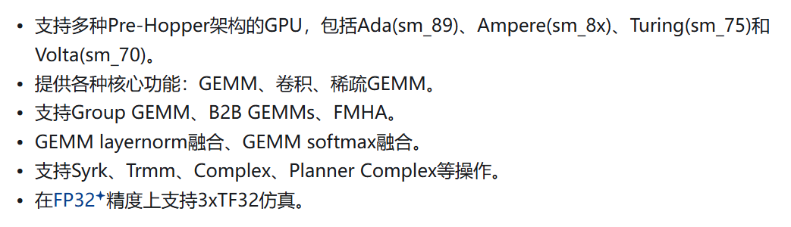
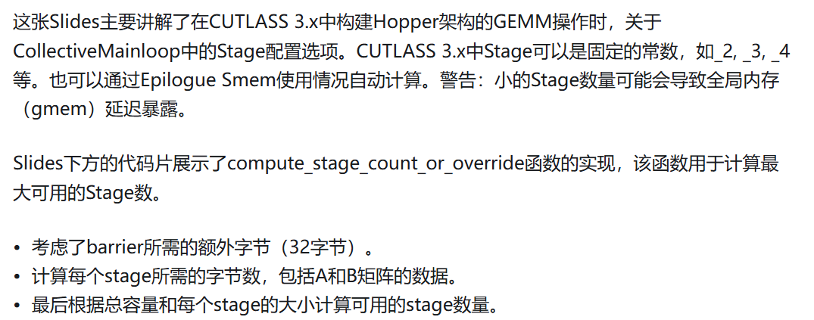
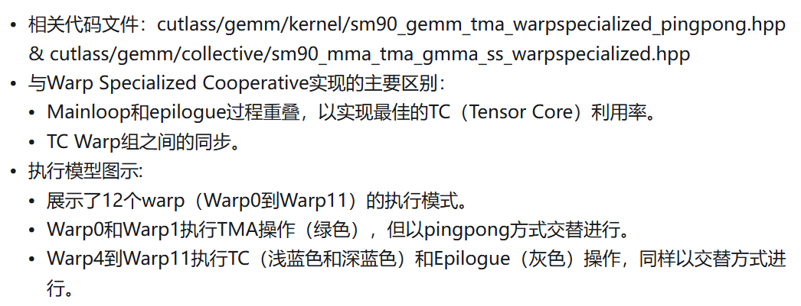
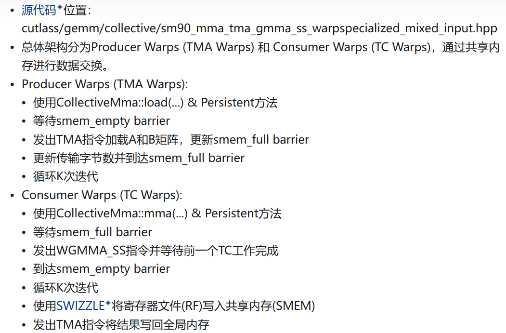

# CUTLASS GEMM
> TensorRT-LLM中的 Quantization GEMM（Ampere Mixed GEMM）的 CUTLASS 2.x 实现讲解

## CUTLASS介绍

### CUTLASS 2.x 特性

### CUTLASS 3.x 特性

### 应该使用CUTLASS 2.x还是CUTLASS 3.x？
* 在Hopper架构的GPU上工作，并且想要充分利用芯片的性能，选择CUTLASS 3.x
* 否则选择CUTLASS 2.x （大多数Pre-Hopper（即Hopper之前的架构）的特性在Hopper芯片上仍然受支持，这意味着CUTLASS 2.x可以在Hopper芯片上运行。）
* 如果你想使用CUTLASS 2.x的所有扩展和kernel变体

### CUTLASS GEMM的核心概念图

以C矩阵为视角，我们把矩阵C切成小块让每个BLOCK去认领一块做计算。接着要指定WARP去做计算，WARP会认领这个小块中的某一块，比如图中Thread Block Tile的绿色块。每个WARP有32个线程，每个线程又应该做哪一部分计算呢？Warp Tile这个图进一步放大细节，其中4个绿色块代表其中一个线程需要负责计算矩阵C的的部分。最后到线程级别，每个线程都有自己的寄存器去负责做自己的工作。再往右就是Epilogue，这个是很多人使用CUTLASS的第一步比如在GEMM后面做一个Activation后处理。最后把数据写回Global Memory完成整个运算过程。分块的关键参数以及Epilogue的操作类型由图上的using语句所指定。
\\
数据流动，数据需要从Global Memory逐级传递的。除了Tiling之外另外一个重要的概念是我们需要把数据尽可能的复用在高级缓存上，享受到更高的带宽，避免频繁的读取global memory的数据。因此，我们要把数据放在Shared Memory, 寄存器上，然后Tensor Core在寄存器上算完后写Shared Memory，最后从Shared Memory写回Global Memory。
\\
上图的左下角和右下角分别表示读写Global Memory的粒度，以FP16为例设置为8（128 bits / size_bits_of(datatp)）。除了Tiling之外还要考虑Overlap，现在我们有Tling来决定线程块/线程需要做哪些事情，有内存Streaming的过程让数据尽可能的复用在各级存储上，NumStage这个模板参数用来决定开多少个额外的Buffer来做计算和传输的Overlap（参考Double Buffering）,如最下方的中间的图所示

### CUTLASS 2x

* CUTLASS 2.x中GEMM操作的各种配置项

* 如何通过选择合适的GEMM变体和配置参数来满足不同的需求

如何通过选择合适的GEMM变体和配置参数来满足不同的需求。同时，它也指出了CUTLASS提供了丰富的GEMM实现，可以处理各种特殊情况和优化场景。通过这种方式，开发者可以根据具体需求选择最合适的GEMM实现，并进行细粒度的性能优化

* CUTLASS 2.x中构建GEMM（通用矩阵乘法）时的关键优化选项

* CUTLASS 2.x中构建GEMM时的更多优化选项

* CUTLASS2.x到CUTLASS3.x的架构变化

在CUTLASS 2.0（类Ampere架构风格）中提到，除了Tiling和复用内存层级，我们还希望使用软流水的方法把global memory读写latency和计算隐藏起来。也就是做当前计算的时候去读后续计算轮次需要的数据，这个过程可以流水起来。在进入稳定流水之前，也就是图中的Main loop body会有一个建立流水的过程。做了计算预取，当前计算的数据肯定在上几轮计算就取出来了，数据预取叫Prologue，GEMM的整个计算过程分为Prologue, Main Loop和Epilogue部分，Tensor Core的计算发生在Main Loop部分。

* CUTLASS 2.x和CUTLASS 3.x在配置GEMM操作时的主要区别

* CUTLASS 3.x中，重点关注配置主循环（Mainloop）和后处理（Epilogue）部分
具体来说，使用CollectiveEpilogue类型定义后处理操作。包含架构、tile形状、累加器类型等参数。使用CollectiveMainloop类型定义主循环。包含架构标签、操作类、矩阵配置、tile形状等参数。定义GemmKernel，组合Mainloop和Epilogue。最后定义Gemm，使用GemmUniversalAdapter。

CUTLASS 3.x相比2.x版本提供了更高层次的抽象，简化了用户需要手动指定的参数。

* 从CUTLASS 2.x到CUTLASS 3.x的演进原因
主要通过比较不同GPU架构（Ampere和Hopper）上GEMM操作的执行效率来说明

* CUTLASS库中使用的一些关键术语和缩写的解释

## CUTLASS 2x中的MixedGEMM

## CUTLASS 3x中的MixedGEMM

* CUTLASS 3.x中构建Hopper架构的GEMM操作时，关于CollectiveMainloop中的Stage配置选项

* CollectiveMainloop的配置代码

特别强调了KernelScheduleAuto参数。指出Mainloop kernel Scheduler选项定义在cutlass/gemm/dispatch_policy.hpp文件中。Kernel Scheduler类型包含LDGSTS和UTMALDG两种类型的异步指令，分别针对的是Ampere和Hopper架构。在UTMALDG类型指令可用的情况下，选用它会更快。

* CollectiveMainloop中Kernel Scheduler
CUTLASS 3.x中构建Hopper架构GEMM操作时，CollectiveMainloop中Kernel Scheduler的配置选项和自动选择机制

* CollectiveEpilogue

EpilogueScheduleAuto的选择会推断出NoSmemWarpSpecialized的Epilogue Scheduler类型，效率会偏低

* CollectiveEpilogue - EpilogueTile
特别指出我们可以始终使用EpilogueTileAuto，这代表整个CTile。它会根据Mainloop Scheduler类型计算合理的epilogue tile

* Kernel Scheduler - KernelMultistage调度器

* Hopper架构GEMM操作的Kernel TMA (Tensor Memory Access) 调度器。

* Hopper架构GEMM操作的Warp Specialized调度器

* 补充

这张Slides补充了寄存器分析，TMA warps (Warp0和Warp1)：每个线程使用32个寄存器，总共128 x 32 = 4K个寄存器。TC warps (Warp4到Warp7)：每个线程最多可以使用255个寄存器，总共128 x 255 = 32K个寄存器。

Slides还指出"This is not optimal for the SOL impl."（这对于SOL实现来说不是最优的）。Epilogue延迟仍然暴露，即使使用持久化编程且寄存器文件（RF）利用率较低。

* Hopper架构GEMM操作的Warp Specialized + Cooperative (Persistent) 调度器。

* Hopper架构GEMM操作的Warp Specialized + Pingpong (Persistent) 调度器。

* Hopper架构上的Warp Specialized GEMM实现，采用了生产者-消费者模型

* Hopper架构上不同GEMM kernel调度器的性能基准测试结果

* Hopper架构上CPAsync和TMA两种不同内存访问方式在GEMM操作中的性能表现

TMA方法在几乎所有情况下都优于CPAsync方法，在TMA方法中，Pingpong_TMA通常表现最好，尤其是对于大型矩阵。"CPAsync is the reluctant choice. Always use TMA if the alignment requirement is satisfied."（CPAsync是不得已的选择。如果满足对齐要求，总是使用TMA。）

* Hopper架构上构建GEMM（通用矩阵乘法）时的几个关键决策点和建议

* Hopper GEMM (通用矩阵乘法) 的2个关键点

