# layout

Layout 是一个数据排列的描述体系，其可以实现将逻辑坐标映射到索引坐标（offset表示）。Layout包含Shape和Stride两部分。其中Shape描述排列的分块层次和结构。Stride描述块内或块间的数据排列连续性。Shape和Stride都是层级的嵌套表示。也就是说Shape可以包含Int数据和Shape。Shape和Stride需要有相同的层次关系。

* 一维向量的表示


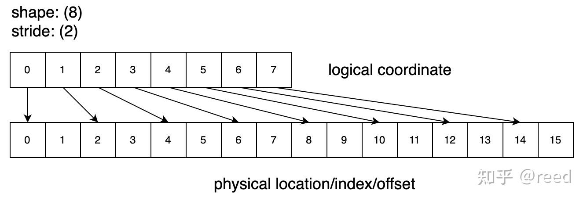

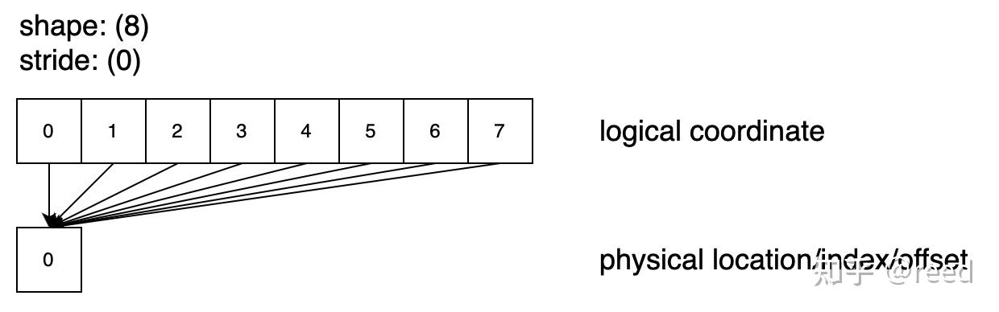

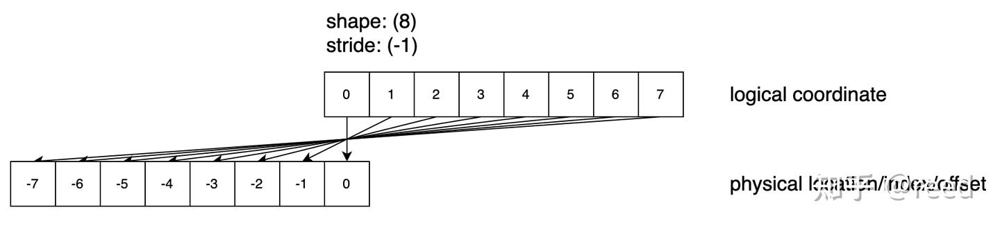


* 二维矩阵的表示

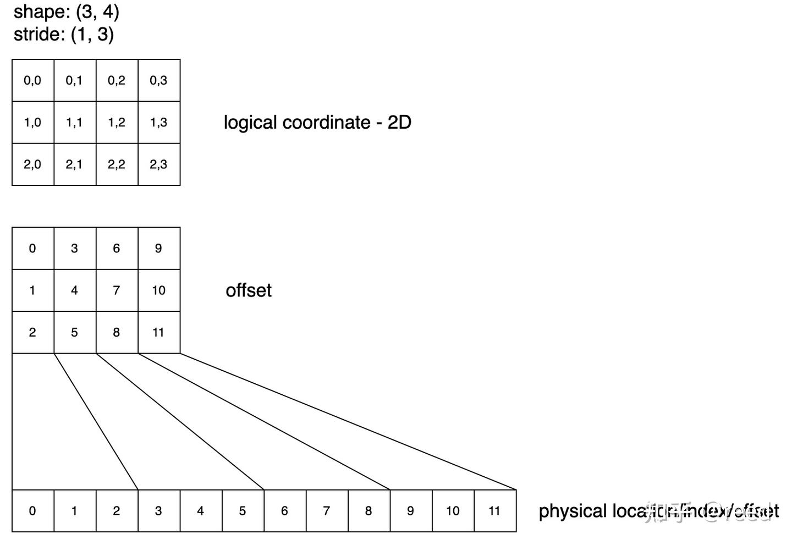

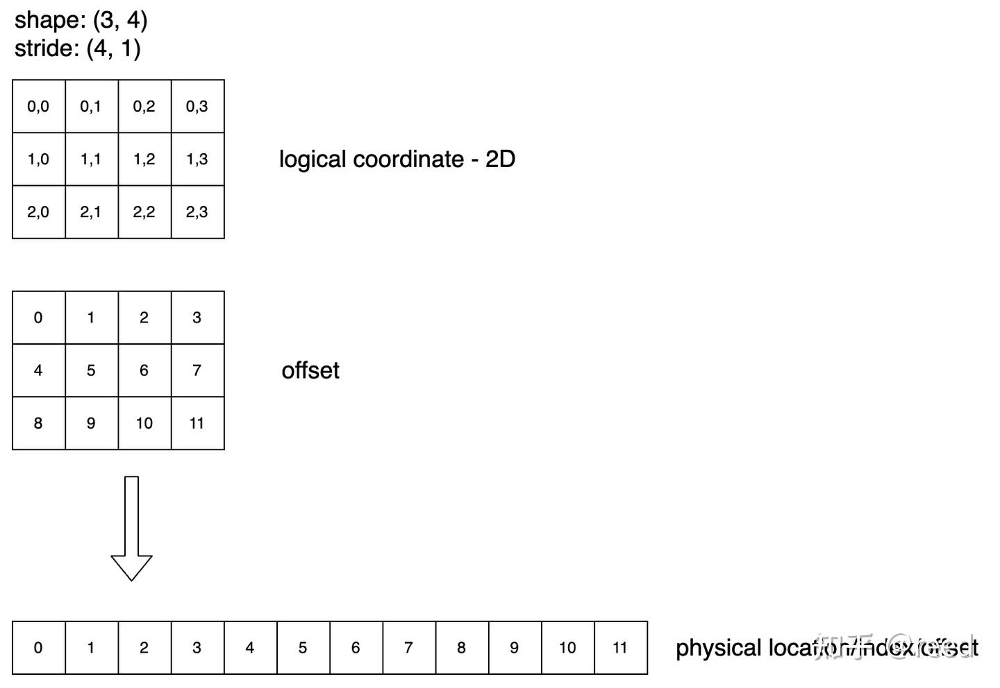


* 有层次的Layout（Heriarchy Layout）
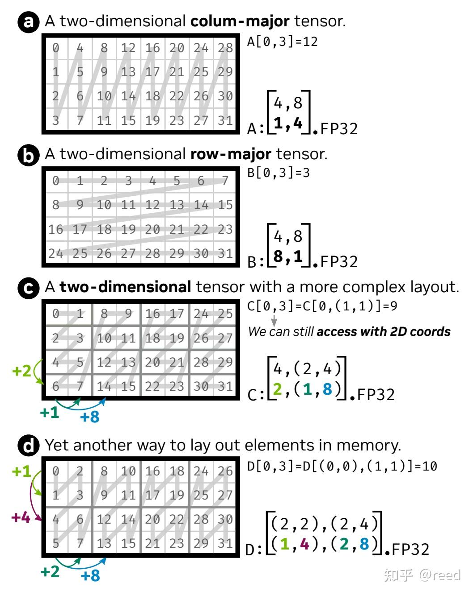


* 常量Shape（编译时Shape）
> Int<K>{}

```
auto shape = make_shape(Int<2>{}, Int<3>{});
auto shape1 = make_shape(shape, Int<3>{});
```

* 变量Shape（运行时Shape）
```
auto shape = make_shape(2, 3);
auto shape = make_shape(m, n);
```


## Layout 的代数和几何解释

### 基本属性
* shape为((2, 4), (3, 5)), stride为((3, 6), (1, 24))的Layout示意图
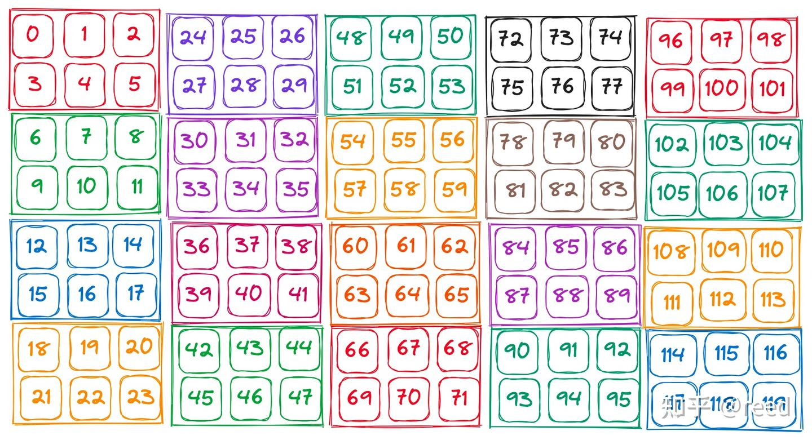

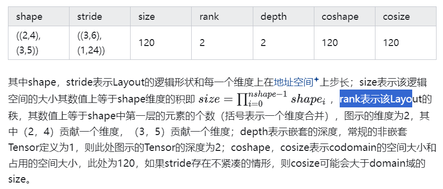


### 坐标（coordinate）

```
auto row_coord = make_coord(1, 3); 
auto col_coord = make_coord(2, 4); 
auto coord = make_coord(row_coord, col_coord);
```

coord: ((1, 3), (2, 4))所表示的位置和访问层次
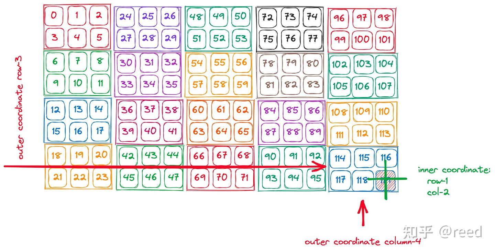


### 切片（slice）
auto layout_out = slice(coord, layout_in);
* Layout的切片运算示意图
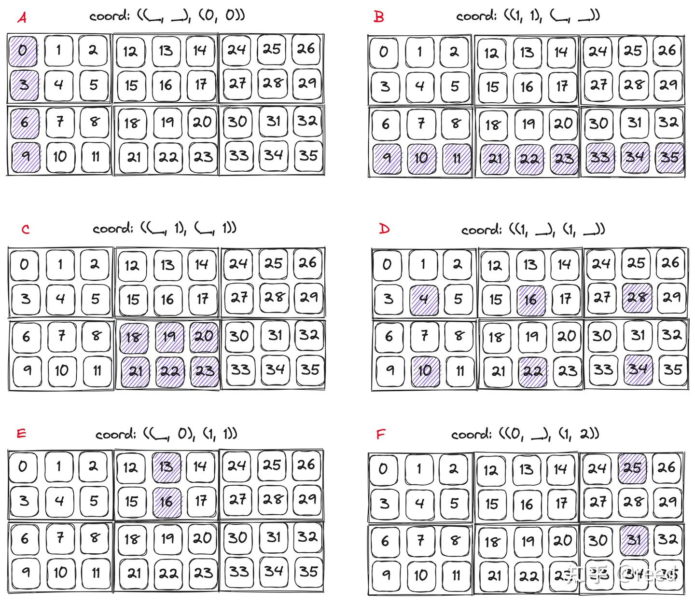


### 补集（complement）

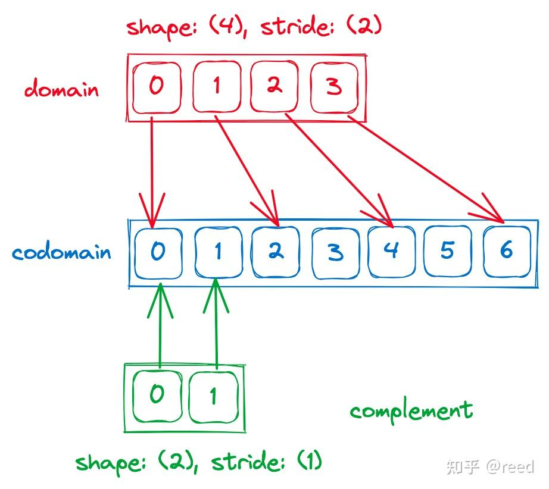


### 乘法（product）

* 约定了各个乘法的顺序和层级如下
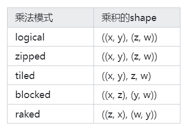


Layout乘法的几何解释

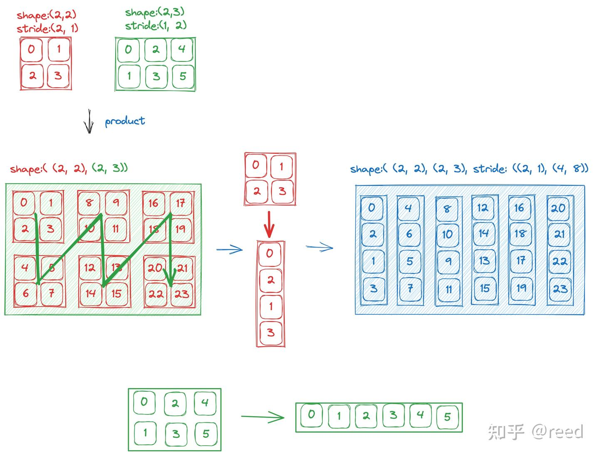

### 除法（divide）

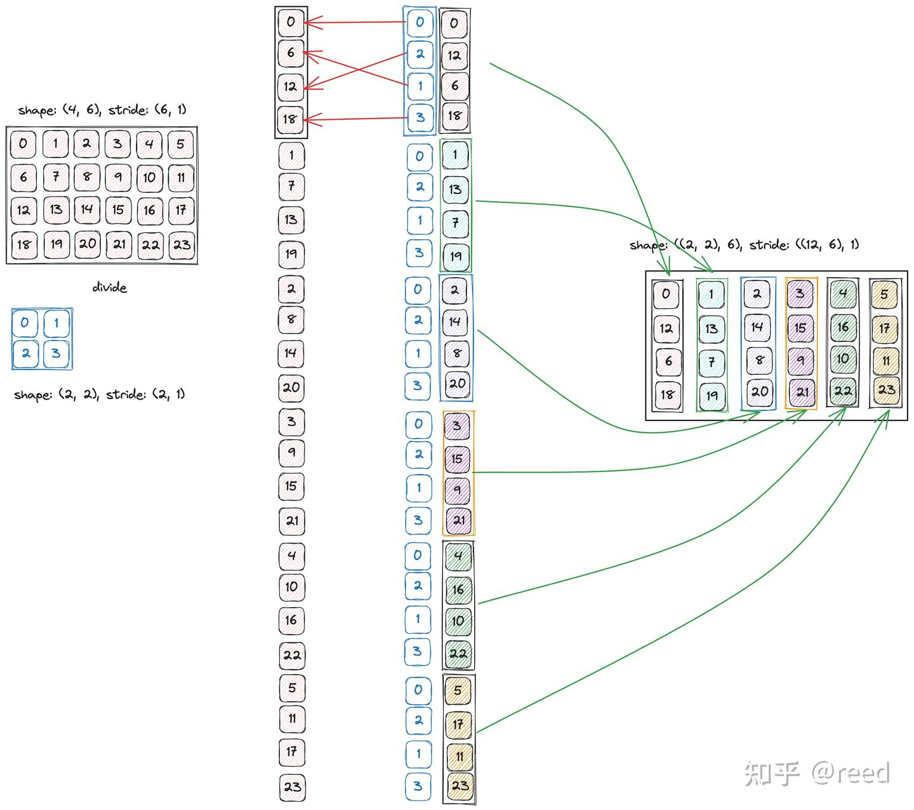


### 复合函数和逆（composition & inverse）


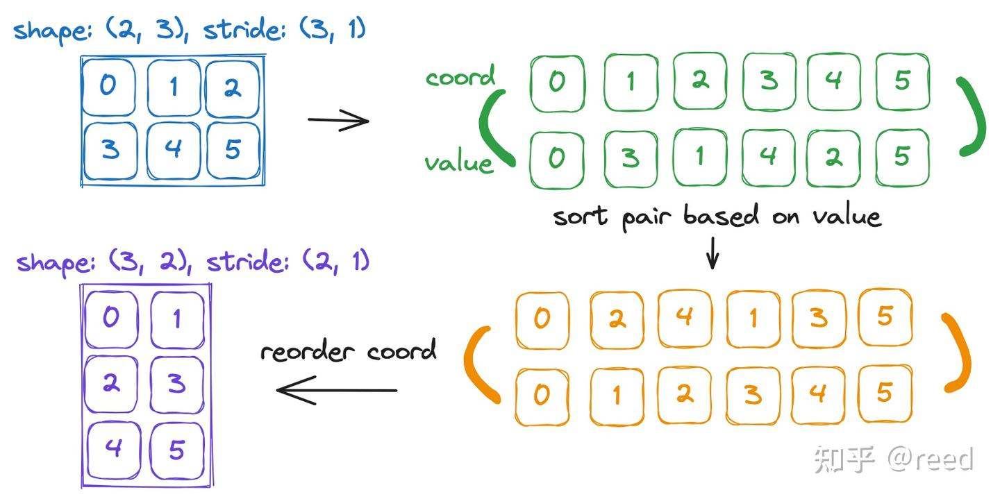


