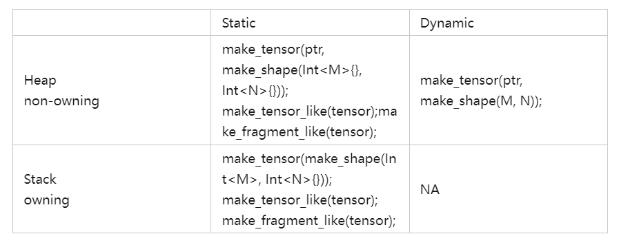
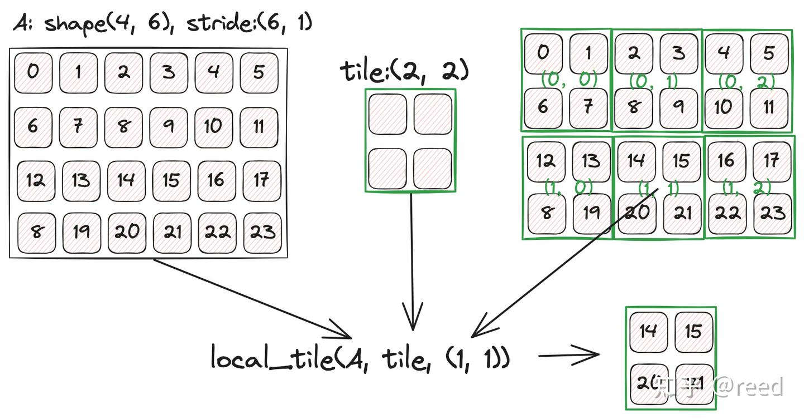
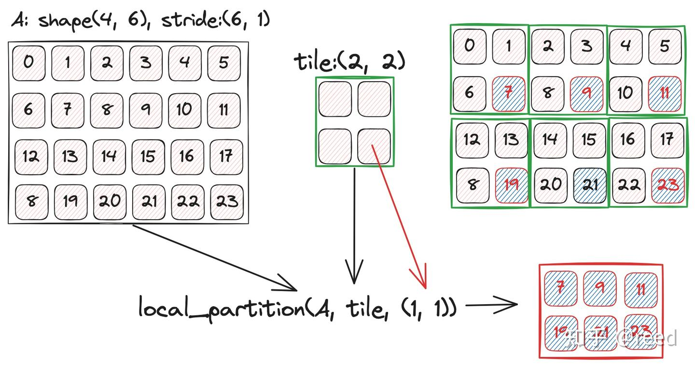

# Tensor
Tensor就是在Layout的基础上包含了存储，即Tensor = Layout + storage，数据存储的具体表现上可以是指针表达的数据或则是栈上数据（GPU上表现为寄存器）。

cute中的Tensor并不同于深度学习框架中的Tensor,
深度学习框架中的Tensor更强调数据的表达实体，通过Tensor实体与实体之间的计算产生新的Tensor实体，即多份数据实体，cute中的Tensor更多的是对Tensor进行分解和组合等操作，而这些操作多是对Layout的变换（只是逻辑层面的数据组织形式），底层的数据实体一般不变更。


深度学习框架中的Tensor是通过Tensor产生新Tensor，cute中是对数据表达形式的变换，底层数据一般不变更

## Tensor生成

```
// 栈上对象：需同时指定类型和Layout，layout必须是静态shape
Tensor make_tensor<T>(Layout layout);

// 堆上对象：需指定pointer和Layout，layout可动可静
Tensor make_tensor(Pointer pointer, Layout layout);
 
// 栈上对象，tensor的layout必须是静态的
Tensor make_tensor_like(Tensor tensor); 

// 栈上对象，tensor的layout必须是静态的
Tensor make_fragment_like(Tensor tensor);
```
其中栈上的对象必须是静态的，堆上对象可以是动态也可以是静态，不存在动态的栈上结构，整体如下表格：




## Tensor维度信息查询

```
// 成员函数
Tensor::layout();
Tensor::shape();
Tensor::stride();
Tensor::size();

// 全局函数, 可以获取完整信息，或者通过<>获取某一个维度
auto cute::layout<>(Tensor tensor);
auto cute::shape<>(Tensor tensor);
auto cute::stride<>(Tensor tensor);
auto cute::size<>(Tensor tensor);
auto cute::rank<>(Tensor tensor); // (1, (2, 3)) => rank 2 
auto cute::depth<>(Tensor tensor);
```


## Tensor的访问operator()/operator[]

```
Tensor tensor = make_tensor(ptr, layout);
auto coord = make_coord(irow, icol);

tensor(0) = 1;
tensor(1, 2) = 100;
tensor(coord) = 200;
```
也可以通过data函数直接获取数据存储空间的地址
```
Tensor::data();
```


## Tensor的Slice
```
Tensor tensor = make_tensor(ptr, make_shape(M, N， K)); // MxNxK
Tensor tensor1 = tensor(_, _, 3); // MxN,k =3
```

## Tensor的Take
通过take函数提取take出[B, E)的轴上的数据
```
Tensor tensor = make_tensor(ptr, make_shape(M, N, K));
Tensor tensor1 = take<0, 1>(tensor);
```

## Tensor的flatten
```
Tensor tensor = ...;  // M，N，K
Tensor tensor1 = flatten(tensor);  // M，N，K
```

## Tensor的层级合并coalesce
层级中如果存在空间可连续的坐标，即stride意义下不存在空隙，则进行合并

```
Tensor tensor = make_tensor(ptr, make_shape(M, N));
Tensor tensor1 = coalesce(tensor);
```


## Tensor的主轴层级化group_modes
将[B,E)的主轴层级化为一个新的层级
```
Tensor tensor = ...; // 1, 2, 3, 4
Tensor tensor1 = group_modes<B, E>(tensor); // B=1,E=3 => 1, <2, 3>, 4
```

## Tensor的划分logical_divide/tiled_divide/zipped_divide
divide是将tensor进行按照tile参数的大小进行划分，具体的可以参考前序文章“cute Layout代数和几何解释”中的除法的解释：
```
Tensor tensor = ...;
Tensor tensor1 = logical_divide(tensor, tile);
Tensor tensor2 = zipped_divide(tensor, tile);
Tensor tensor3 = tiled_divide(tensor, tile);
```

## Layout的乘积logical/zipped/tiled/blocked/raked
Tensor上没有定义乘法，只有Layout上有乘法，其表达了重复的语义
```
Layout  = ..;
Tile tile = ...;
Layout tensor1 = logical_product(layout, tile);
Layout tensor2 = zipped_product(layout, tile);
Layout tensor3 = tiled_product(layout, tile);
Layout tensor4 = blocked_product(layout, tile);
Layout tensor5 = raked_product(layout, tile);
```

## Tensor的局部化切块local_tile
该函数是Tensor中用户可以使用到的重要的函数，可以通过tile方法对tensor进行分块，通过local_tile可以实现从大的tensor中切取tile块，并且通过coord进行块的选取，以下代码展示了将维度为MNK的张量按照2x3x4的小块进行划分，取出其中的第(1, 2, 3)块。

```
Tensor tensor = make_tensor(ptr, make_shape(M, N, K));
Tensor tensor1 = local_tile(tensor, make_shape(2, 3，4), make_coord(1, 2，3));
```



## Tensor的局部数据提取local_partition

local partition和local tile类似，现将大的Tensor按照tile大小进行分块，分块后每一块取出coordinate指定的元素形成新的块，代码形式和具体实例参考图2:

```
Tensor tensor = make_tensor(ptr, ...);
Tensor tensor1 = local_partition(tensor, tile);
```



## Tensor数据类型转换recast

Tensor表达了特定的数据类型的数据，可以对其进行数据类型的重新解释，然后形成新的tensor，类似于C++中的reinterpret_cast语义，代码形式如下：

```
Tensor tensor = make_tensor<float>(make_shape(...));
Tensor tensor1 = recast<NewType>(tensor);
```

## Tensor内容的填充fill和清除clear
clear(), fill() 可以对tensor进行元素级别的清除和填充操作
```
Tensor tensor = make_tensor(...);

clear(Tensor);  // 使用T{}类型的默认构造函数对tensor进行赋值
fill(Tensor tensor, T value);  // 将Tensor中的值填充为value值。
```

## Tensor的线性组合axpby
对两个tensor进行线性组合运算y = a*x + b*y：
```
Tensor x = make_tensor(...);
Tensor y = make_tensor_like(x);

axpby(a, x, b, y);
```

## Tensor的打印print
可以通过全局print方法来完成对tensor的打印来debug和展示Tensor的信息，print会打印tensor存储空间所在的位置和shape、stride信息，而print_tensor除了以上信息还会打印Tensor中具体的每一个数值：

```
Tensor tensor = make_tensor(...);
print(tensor);
print_tensor(tensor);
```

## 特殊矩阵
构造只有形状没有类型的tensor，用于一些特定变换：
```
Tensor tensor = make_identity_tensor(shape);
```

## 使用Tensor实现Vector Add示例


```
// z = ax + by + c
template <int kNumElemPerThread = 8>
__global__ void vector_add_local_tile_multi_elem_per_thread_half(
    half *z, int num, const half *x, const half *y, const half a, const half b, const half c) {
  using namespace cute;

  int idx = threadIdx.x + blockIdx.x * blockDim.x;
  if (idx >= num / kNumElemPerThread) { // 未处理非对齐问题
    return;
  }

  Tensor tz = make_tensor(make_gmem_ptr(z), make_shape(num));
  Tensor tx = make_tensor(make_gmem_ptr(x), make_shape(num));
  Tensor ty = make_tensor(make_gmem_ptr(y), make_shape(num));

  Tensor tzr = local_tile(tz, make_shape(Int<kNumElemPerThread>{}), make_coord(idx));
  Tensor txr = local_tile(tx, make_shape(Int<kNumElemPerThread>{}), make_coord(idx));
  Tensor tyr = local_tile(ty, make_shape(Int<kNumElemPerThread>{}), make_coord(idx));

  Tensor txR = make_tensor_like(txr);
  Tensor tyR = make_tensor_like(tyr);
  Tensor tzR = make_tensor_like(tzr);

  // LDG.128
  copy(txr, txR);
  copy(tyr, tyR);

  half2 a2 = {a, a};
  half2 b2 = {b, b};
  half2 c2 = {c, c};

  auto tzR2 = recast<half2>(tzR);
  auto txR2 = recast<half2>(txR);
  auto tyR2 = recast<half2>(tyR);

#pragma unroll
  for (int i = 0; i < size(tzR2); ++i) {
    // two hfma2 instruction
    tzR2(i) = txR2(i) * a2 + (tyR2(i) * b2 + c2);
  }

  auto tzRx = recast<half>(tzR2);

  // STG.128
  copy(tzRx, tzr);
}
```
