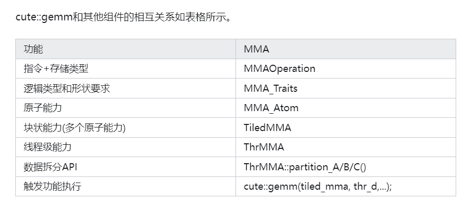

# MMA抽象

cute中利用Tensor Core完成矩阵乘法（MMA = matrix multiply accumulate）所需要的数据结构抽象。

## NVidia Tensor Core简介

Tensor Core是专门针对矩阵计算而设计的硬件单元，其可以高效的实现小块的矩阵乘法，公式为D = A x B + C
\\
国内使用算力主力Ampere架构的显卡A100所装配的Tensor Core，可以实现单周期完成8x4x8（MNK描述方法，即A矩阵的维度为8x8, B矩阵为8x4, C矩阵为8x8）的半精度的矩阵乘法。


### 我们有两种形式可以使用Tensor Core
* 第一种是利用NVidia提供的矩阵计算库cublas和深度学习库cudnn


* 第二种是通过CUDA编程提供的特定的接口和PTX汇编实现
CUDA编译器NVCC 提供了wmma（warp matrix multiply accumulate）和mma（matrix multiply accumulate）两种形式

wmma: 第一种形式是通过提供fragment数据表示和特定的load_matrix_sync()、store_matrix_sync()、mma_sync() 数据加载存储和计算API来触发对Tensor Core的编程

mma:  另一种是通过PTX汇编实现，其数据直接面向寄存器表示，计算则是通过mma.sync类的函数实现。


## cute的MMA核心数据结构及其相互关系

主要包含的核心结构：MMAOperation、MMA_Traits、MMA_Atom、TiledMMA、ThrMMA


在ThrMMA得到各个线程的计算任务后，各个线程同时调用cute::gemm函数完成各个线程级别的任务下发，最终所有线程等结果体现为大块的D = A x B + C的任务完成计算。

\\
表现为三个大的抽象层：硬件和指令抽象、逻辑抽象、和CUDA编程型指令。


## MMAOperation

operation通过指令实现D = AB + C计算，该operation需要设定A/B/C/D的操作数的类型。其中fma的参数形式依赖于D/A/B/CRegisters的类型和数据量。即，如果DRegister的类型为float[2], 则fma的接口中最前面的两个参数为float输出。如SM75_16x8x8_F32F16F16F32_TN 表示SM75算力的Turing架构的MMA，16x8x8表示矩阵的MNK大小，F32F16F16F32表示D、A、B、C的数据类型分别为float32、float16、float16、float32。T表示A矩阵为行优先，B矩阵为列优先（blas中约定normal矩阵为列优先，T表示transpose，即对列优先的矩阵进行转置则为行优先）

```
struct SM75_16x8x8_F32F16F16F32_TN {
  using DRegisters = float[4];
  using ARegisters = uint32_t[2];
  using BRegisters = uint32_t[1];
  using CRegisters = float[4];

  // Register asm fma
  CUTE_HOST_DEVICE static void
  fma(float         & d0, float         & d1, float      & d2, float      & d3,
      uint32_t const& a0, uint32_t const& a1,
      uint32_t const& b0,
      float    const& c0, float    const& c1, float const& c2, float const& c3)
  {
    asm volatile("mma.sync.aligned.m16n8k8.row.col.f32.f16.f16.f32" ...);
  }
};
```


## MMA_Traits
针对特定的MMAOperation类型，定义其相关的辅助类型或值给MMA_Atom使用，用以完成块状的矩阵乘法，其需要提供出的类型信息如下

```
using ElementDVal =  // Logical A-value type
using ElementAVal =  // Logical B-value type
using ElementBVal =  // Logical C-value type
using ElementCVal =  // Logical D-value type

using ElementAFrg =  // A-type consumed by MMA  (if ommitted, same as ElementAVal)
using ElementBFrg =  // B_type consumed by MMA  (if ommitted, same as ElementBVal)
using ElementCFrg =  // C_type consumed by MMA  (if ommitted, same as ElementCVal)

using Shape_MNK =    // Logical MxNxK shape of the MMA

using ThrID     =    // Logical thread id (tid) -> tidx

using ALayout =      // (Logical thread id (tid), Logical value id (vid)) -> Flat MK-coord
using BLayout =      // (Logical thread id (tid), Logical value id (vid)) -> Flat NK-coord
using CLayout =      // (Logical thread id (tid), Logical value id (vid)) -> Flat MN-coord
```


## TiledMMA

TiledMMA整体表达了矩阵在MNK空间维度如何通过Atom组织而来，其结构内部定义了很多函数，这些函数提供了对给定计算块的划分能力，但是这部分逻辑终端用户早期可以不用太多关注(这些)，只需要关注如下两个API即可，第一个是TiledMMA的模版参数，第二时TiledMMA提供的get_thread_slice函数。模版参数表达了TiledMMA在MMA_Atom上的扩展逻辑：AtomLayoutMNK表示M N K方向上分别重复几次Atom，这种重复会要求更多的执行线程，ValueLayoutMNK表述了对该Atom在M N K方向上重复几次，这里的重复是通过重复计算来完成的。get_slice、get_thread_slice函数功过给定线程id则获取线程对应到ThrMMA结构，形式如下

```
template <class MMA_Atom,
          class AtomLayoutMNK   = Layout<Shape<_1,_1,_1>>,
          class ValLayoutMNK    = Layout<Shape<_1,_1,_1>>,
          class PermutationsMNK = Tile<Underscore,Underscore,Underscore>>
struct TiledMMA : MMA_Atom {
  ...;
  ThrMMA get_slice(ThrIdx thr_idx)；
  ThrMMA get_thread_slice(ThrIdx thr_idx);
  ...;
}
```

cutlass3.4版本中更新了该接口去掉了ValLayoutMNK，具体的参数解读可以参考cute核心作者Cecka的解释。

## ThrMMA
该结构由TiledMMA根据具体的线程id分解而来（ThrMMA即Thread MMA），其描述了线程级实现D = A x B + C任务时的功能抽象，主要是如下partition类函数和partition_fragment类函数。其中partition函数完成对逻辑Tensor针对该线程的划分，即Tensor参数提供大块的逻辑矩阵单元，其返回值返回该线程需要进行的任务的Tensor描述。如Tensor C为BLK_M x BLK_N，则partition_C可以得到线程级别的任务，维度为（MMA, MMA_M, MMA_N）, MMA表达了TileMMA一次能计算的单元，MMA_M, MMA_N表达了M方向和N方向需要分块数量。partition_fragment类函数是按照partition类函数返回的Tensor形状生成的对应的寄存器表示。

```
ThrMMA {
  Tensor partition_C(Tensor C);
  Tensor partition_A(Tensor A);
  Tensor partition_B(Tensor B);
  Tensor partition_fragment_C(Tensor C);
  Tensor partition_fragment_A(Tensor A);
  Tensor partition_fragment_B(Tensor B);
}
```

## cute::gemm

cute::gemm是线程完成MMA计算的函数，其核心接口如下，这里D、A、B、C接收的Tensor即为ThrMMA所划分出来的Tensor，
```
void gemm(TiledMMA &mma, Tensor& D, Tensor const& A, Tensor const& B, Tensor const& C)；
```



