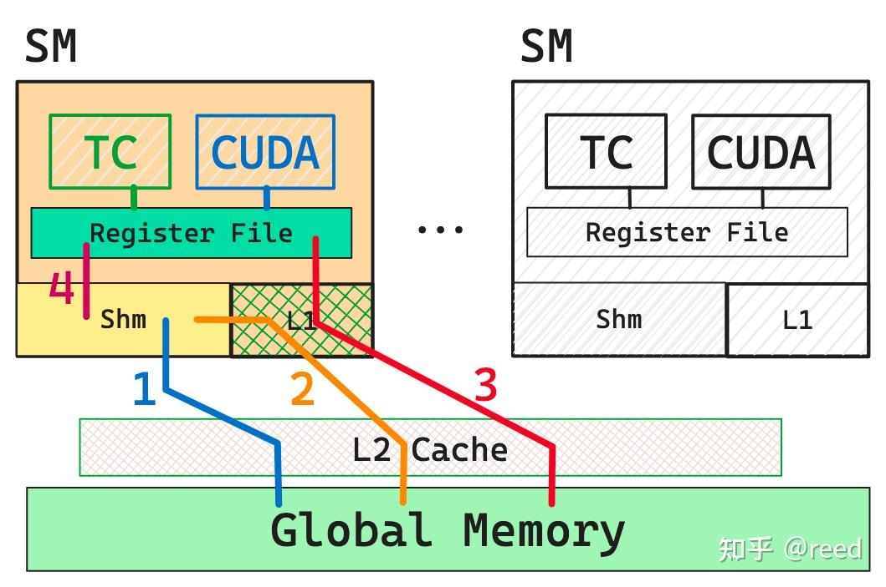

# Copy

* GPU的存储层次和数据搬运路径

1. 片外存储结构-全局内存（global memory）
2. 片上SM（stream multi-processor）内的shared memory 和 L1 data cache，以及寄存器堆（register file）
3. 以及在全局内存和SM之间的L2 Cache

1. 全局内存（图中标记为绿色global memory）容量最大，在数据中心级A100显卡中存储空间可以达到80GB，采用HBM2e技术实现，最高带宽可达2TB/s
2. 再往内层为L2 Cache，在A100-80GB上为80MB，带宽可达20TB/s
3. 再向内层为片上(on-chip)存储shared memory 和L1 data cache，shared memory 和 L1 data cache 共享192KB的空间，可以配置shared memory 和L1的大小，最大可将shared memory配置为164KB
4. Tensor Core、CUDA Core、Register File（一个线程最多使用255个32bit的寄存器）

## 高效的ldmatrix指令

