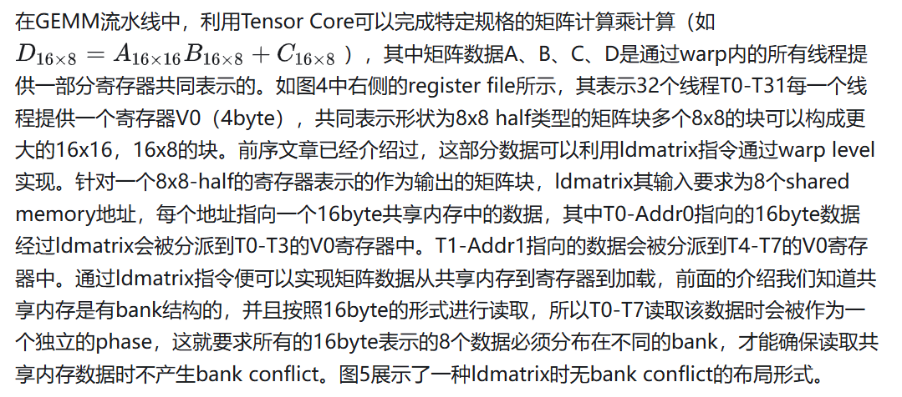
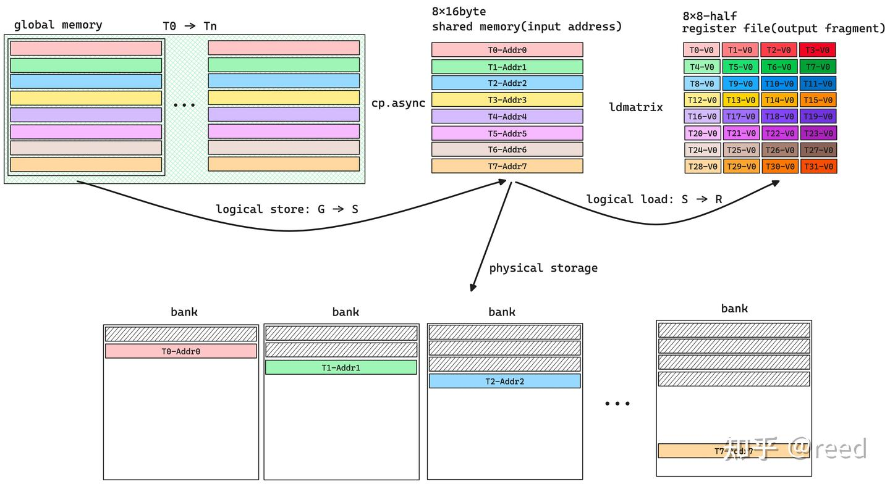

# Swizzle

cute通过提供swizzle抽象简化了逻辑空间和多bank存储空间的映射的复杂度。

## 局部性原理和Shared Memory
* 空间局部性和时间局部性
* Shared Memory
为了保障Shared Memory存储结构在多线程并发读写下的效率（更低的Latency和更高的Throughput），其硬件被实现为多bank的模式，每个bank都是可以独立寻址的存储空间，bank之间可以并行的读写数据，相互之间不会影响

在NVidia的架构中，shared memory包含32个bank，bank中可寻址的基本单元为4byte

* 每个bank为黑框所包含的单元，用户看到的地址空间为箭头所示的方向，即相邻的4byte占用不同的bank

* 当32个线程同时访问32个不同的bank时，各个bank是并行执行的，其效率是最高的，即32个线程并发的访问32个bank中不同颜色的单元，是可以并行的，值得注意的是其中的线程编号（如图2中的T0所示）和bank中的行位置并没有连续性要求

* 如果某两个线程T0、T2要同时访问相同bank-2的不同地址，则这两次访问会被排队执行，即先访问该bank的一个地址，然后再访问第二个地址，这样两次访问在发射任务维度上（产生访问请求指令）时间维度上是并行的，但是在真正bank读写数据在时间维度上是串行的。这就是所谓的bank conflict。由于一个bank上有两次冲突，这种情况称为二路冲突（two-way conflict）。

为了减少指令数，我们在进行kernel优化时会采用向量化的读写指令（也叫大字长读写），如以128bit的形式读写共享内存，此时线程需要访问的单位数据量为16byte，32个线程需要访问的数据量为16byte x 32 = 512byte。完整的512byte需要4个phase才能完成访问，第一phase，T0-T7无bank conflict的访问所有bank，第二phase，T8-T15无bank conflict的访问所有bank，第三phase，T16-T23无bank conflict的访问所有bank，第四phase，T24-T31无bank conflict的访问所有的bank。这种情况也可以看作是：shared memory基本单元为16byte，总bank数为8，冲突与否的分析不在是32线程，而变成4个phase中的不同线程。如果采用64bit的访问形式，则相应的基本单元可以看作是8byte，总bank数目为16，冲突与否的条件变成两个phase内的线程是否冲突。整体上shared memory空间可以看作二维存储空间，其中列方向表示bank情况，行方向表示自由定义的大小。

## 共享内存读取（ldmatrix指令）

## Shared Memory写入

## Swizzle抽象

描述逻辑空间我们可以使用Layout（本质是函数），而为了避免bank 冲突，cute中定义了swizzle抽象，swizzle的本质也是函数，swizzle作用在layout上，即函数作用在函数上，复合函数复合的定义

Layout的作用是给定坐标返回offset，而swizzle的作用则是给定offset返回bank conflict free的offset

Swizzle定义了三个参数: B、M、S。它们共同表达描述一维坐标向二维空间映射的三个层次。其中一维坐标中连续的2^M个元素构成二维空间中最基本的元素，2^S表示新的二维空间中有多少列，2^B表示新的二维空间中有多少行。

## Thread Block Swizzle

cute（cutlass）中还有另一种swizzle，为thread block swizzle。在以C为中心的任务划分模式中，如果没有Thread Block Swizzle，则任务块会按照线性的行优先或者列优先的顺序分配给所有的执行单元（如图9中SM0-3，假设硬件只有4个SM），进行Thread Block Swizzle后，可以形成如图9右侧所示的任务划分关系，在某些场景下，其可以提升L2 Cache的命中率，数学上表现为在相同的元素能覆盖更大的面积，同时这部分面积(A、B)能够很好的被L2缓存住，具体的可以参考cutlass中的thread block swizzle实现

