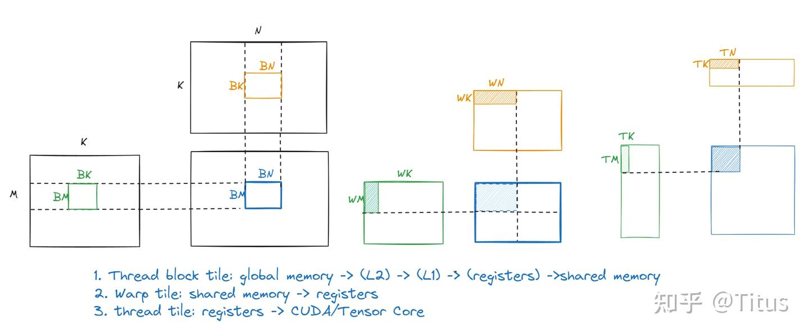
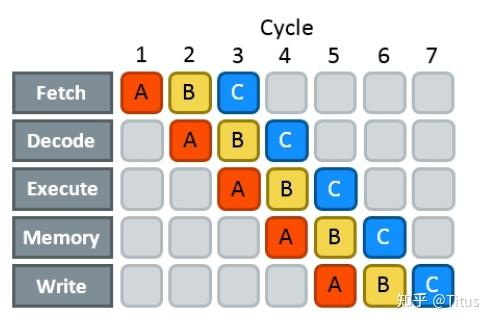
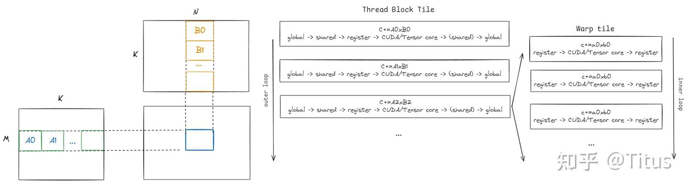
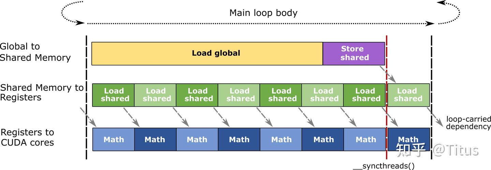
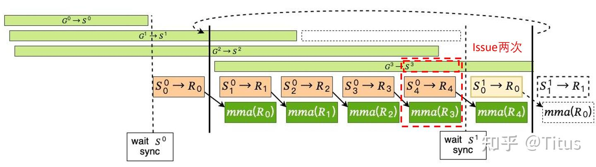

# cutlass GEMM中使用到的流水线技术

1. MmaSingleStage(mma_singlestage.h)；
2. MmaPipelined(mma_pipelined.h)；
3. MmaMultiStage(mma_multistage.h)；

为了解决访存瓶颈（局部性原理）、掩盖访存延迟、充分利用硬件并行特性等，cutlass构建了层级化的GEMM流水线——三级tiling
1. thread block tiling
将一定大小的block从global memory搬运到shared memory，减少对global memory的访问，每个block被分配到各个SM上（即使分配到同一个SM）以独立、并发的方式运行；
2. warp tiling
warp-level并行，block内由若干个warp进一步tiling，这些warp将被SM内的多个warp调度器（Ampere架构每个SM有4个warp scheduler）调度到不同的SMSP上独立运行，足够多的warp数量（高占用率）可以让warp scheduler通过快速切换warp减少bubble；
3. thread tiling
每个线程具备一定的ILP（指令级并行）的能力，足够数量的指令（LDS、STS、FFMA）且高计算访存比可以进一步地隐藏延迟；




## 硬件流水——Instruction Pipeline
现代硬件支持多级流水线，假如是5级流水线
1. 取指（fetching）；
2. 译码（decoding）；
3. 执行（executing）；
4. 访存（reading）；
5. 写回（writing）；



## GEMM 流水线

* 大循环Loop over K（thread block tile level），以BK为步长进行迭代，共计nK=K/BK个。对于A矩阵，每个子块编号为A0/1/2...，依此类推；对于B矩阵，每个对应的子块编号为B0/1/2...，依此类推；
reed不应该称为sliced-K，而是CTA-wide MacLoop() subroutine for performing a sequence of MAC-loop iterations

* 小循环Loop over BK（warp tile level），以TK为步长进行迭代，则nk=BK/TK。对于每个子块Ai，其中的每个子块编号为a0/1/2...，依此类推；对于子块Bi，每个对应的子块的编号为b0/1/2...，依此类推；

###  single-stage

single-stage就是单级流水线，即串行，定义如下
```
/// Structure to compute the matrix product targeting CUDA cores and SIMT math instructions.
template <
  /// Size of the Gemm problem - concept: gemm::GemmShape<>
  typename Shape_,
  /// Iterates over tiles of A operand in global memory 
  //  (concept: ReadableTileIterator | ForwardTileIterator | MaskedTileIterator)
  typename IteratorA_,
  /// Iterates over tiles of A operand in shared memory
  /// (concept: WriteableTileIterator | RandomAccessTileIterator)
  typename SmemIteratorA_,
  /// Iterates over tiles of B operand in global memory
  //  (concept: ReadableTileIterator | ForwardTileIterator | MaskedTileIterator)
  typename IteratorB_,
  /// Iterates over tiles of B operand in shared memory
  /// (concept: WriteableTileIterator | RandomAccessTileIterator)
  typename SmemIteratorB_,
  /// Data type of accumulator matrix
  typename ElementC_,
  /// Data type of accumulator matrix
  typename LayoutC_,
  /// Policy describing tuning details (concept: MmaPolicy)
  typename Policy_,
  /// Used for partial specialization
  typename Enable = bool
>
class MmaSingleStage : public MmaBase<Shape_, Policy_, 1> {

  /// Perform a threadblock-scoped matrix multiply-accumulate
  CUTLASS_DEVICE
  void operator()(
    int gemm_k_iterations,            ///< number of iterations of the mainloop
    FragmentC &accum,                 ///< destination accumulator tile
    IteratorA iterator_A,             ///< iterator over A operand in global memory
    IteratorB iterator_B,             ///< iterator over B operand in global memory
    FragmentC const &src_accum) {     ///< source accumualtor tile

    //
    // Prologue
    //

    // Perform accumulation in the 'd' output operand
    accum = src_accum;

    FragmentA tb_frag_A;
    FragmentB tb_frag_B;

    tb_frag_A.clear();
    tb_frag_B.clear();

    // The last kblock is loaded in the prolog
    iterator_A.load(tb_frag_A);
    iterator_B.load(tb_frag_B);

    ++iterator_A;
    ++iterator_B;

    // Pair of fragments used to overlap shared memory loads and math instructions
    WarpFragmentA warp_frag_A;
    WarpFragmentB warp_frag_B;

    Operator warp_mma;

    // Avoid reading out of bounds
    iterator_A.clear_mask(gemm_k_iterations <= 1);
    iterator_B.clear_mask(gemm_k_iterations <= 1);

    //
    // Mainloop
    //

    CUTLASS_GEMM_LOOP
    for (; gemm_k_iterations > 0; --gemm_k_iterations) {
      this->smem_iterator_A_.store(tb_frag_A);
      this->smem_iterator_B_.store(tb_frag_B);

      __syncthreads();

      //
      // Loop over GEMM K dimension
      //

      CUTLASS_PRAGMA_UNROLL
      for (int warp_mma_k = 0; warp_mma_k < Base::kWarpGemmIterations; ++warp_mma_k) {

        // Load warp-level tiles from shared memory, wrapping to k offset if this is the last group
        // as the case may be.
        
        this->warp_tile_iterator_A_.set_kgroup_index(warp_mma_k % Base::kWarpGemmIterations);
        this->warp_tile_iterator_B_.set_kgroup_index(warp_mma_k % Base::kWarpGemmIterations);

        this->warp_tile_iterator_A_.load(warp_frag_A);
        this->warp_tile_iterator_B_.load(warp_frag_B);

        ++this->warp_tile_iterator_A_;
        ++this->warp_tile_iterator_B_;

        warp_mma(accum, warp_frag_A, warp_frag_B, accum);
      }

      // Add negative offsets to return smem load iterators to the 'start' of the shared memory
      this->warp_tile_iterator_A_.add_tile_offset({0, -Policy::kPartitionsK * Base::kWarpGemmIterations});
      this->warp_tile_iterator_B_.add_tile_offset({-Policy::kPartitionsK * Base::kWarpGemmIterations, 0});

      __syncthreads();

      iterator_A.load(tb_frag_A);
      iterator_B.load(tb_frag_B);

      ++iterator_A;
      ++iterator_B;

      // Avoid reading out of bounds if this was the last loop iteration
      iterator_A.clear_mask(gemm_k_iterations <= 2);
      iterator_B.clear_mask(gemm_k_iterations <= 2);
    }

  }
};
```
首先，在大循环开始之前block内的所有线程将A0和B0的数据从全局内存加载到寄存器再加载到共享内存中，当这些数据加载完成以后（__syncthreads()），进入小循环，每次小循环迭代，每个warp分别从A0、B0加载一定大小的数据ai、bi，然后计算，存储（累加）到累加器中，这样，完成依次小循环后，继续下一次的大循环。



###  pipelined

pipelined即double-buffer，相当于multi-stage=2的情形，不同的是multi-stage版本引入了异步copy指令，而它相当于同步版本。

```
template<...>
class MmaPipelined : public MmaBase<Shape_, Policy_, 2> {
  /// Perform a threadblock-scoped matrix multiply-accumulate
  CUTLASS_DEVICE
  void operator()(
    int gemm_k_iterations,                            ///< number of iterations of the mainloop
    FragmentC &accum,                                 ///< destination accumulator tile
    IteratorA iterator_A,                             ///< iterator over A operand in global memory
    IteratorB iterator_B,                             ///< iterator over B operand in global memory
    FragmentC const &src_accum)                       ///< source accumulator tile
  {
    // Prologue
	/// GEMM prologue.  Bootstrap the global->shared memory pipeline by fetching
  	/// the global fragments needed by the first kStages-1 threadblock mainloop iterations
    prologue(iterator_A, iterator_B, gemm_k_iterations);

    // Wait until we have at least one completed global fetch stage
    gmem_wait();

    // Perform accumulation in the 'd' output operand
    accum = src_accum;

    // Perform the MAC-iterations
    gemm_iters(gemm_k_iterations, accum, iterator_A, iterator_B);
  }
};
```

1. prologue：block中的每个线程开始读写A0、B0块的global memory，并加载到shared memory中，写入完成后切换到下一个（A1、B1）；
2. gemm_wait：即__syncthreads()，等待A0、B0的写入共享内存完成；
3. 初始化累加器；
4. 开始大、小循环的迭代——gemm_iters()；

* gemm_iters

1. 进入大循环迭代前，首先每个warp从A0、B0中加载一定大小的数据到寄存器（shared memory -> registers），然后进入大循环。
2. 对于每个大循环，迭代每个小循环，小循环的每次迭代如下所示：
   1. 如果是小循环的最后一次计算，将这一阶段（A0、B0）大循环的fragment存储到共享内存中（register -> shared memory），等待完成以后（__syncthreads()），迭代器切换到下下一个大循环；
   2. 开始加载下一次小循环的fragment（shared memory -> register）；
   3. 如果是第1次小循环迭代，将下一个大循环的fragment从shared memory内存加载到register中（预取）；
   4. 计算当前小循环迭代；


每次小循环迭代进行warp-tile计算时，要做的关键事情：（1）对于第1次迭代，加载下一阶段大循环的全局内存到寄存器fragment；对于最后1次迭代，需要将第1次迭代的数据从寄存器store到shared memory中（2）加载下一次小循环的shared memory到寄存器的fragment，最后一次迭代计算需要切换，加载下一阶段大循环的fragment（shared memory -> register）；

```
/// Perform the specified number of threadblock mainloop iterations of matrix
  /// multiply-accumulate.  Assumes prologue has been initiated.
  CUTLASS_DEVICE
  void gemm_iters(
    int gemm_k_iterations,        ///< number of threadblock mainloop iterations
    FragmentC &accum,             ///< [in|out] accumulator tile
    IteratorA &iterator_A,        ///< [in|out] iterator over A operand in global memory
    IteratorB &iterator_B)        ///< [in|out] iterator over B operand in global memory
  {
    using WarpFragmentA = typename Operator::FragmentA;
    using WarpFragmentB = typename Operator::FragmentB;

    // Pair of fragments used to overlap shared memory loads and math instructions
    WarpFragmentA warp_frag_A[2];
    WarpFragmentB warp_frag_B[2];

    // Load A fragment from shared A
    this->warp_tile_iterator_A_.set_kgroup_index(0);
    this->warp_tile_iterator_A_.load(warp_frag_A[0]);
    ++this->warp_tile_iterator_A_;

    // Load B fragment from shared B
    this->warp_tile_iterator_B_.set_kgroup_index(0);
    this->warp_tile_iterator_B_.load(warp_frag_B[0]);
    ++this->warp_tile_iterator_B_;

    // Pair of fragments used to overlap global memory loads and math instructions;
    FragmentA tb_frag_A;
    FragmentB tb_frag_B;

    // Avoid reading out of bounds
    iterator_A.clear_mask(gemm_k_iterations <= 1);
    iterator_B.clear_mask(gemm_k_iterations <= 1);

    //
    // Mainloop
    //

    // Note: The main loop does not support Base::kWarpGemmIterations == 2.
    CUTLASS_GEMM_LOOP
    for (; gemm_k_iterations > 0; --gemm_k_iterations) {
      //
      // Loop over GEMM K dimension
      //

      CUTLASS_PRAGMA_UNROLL
      for (int warp_mma_k = 0; warp_mma_k < Base::kWarpGemmIterations; ++warp_mma_k) {

        // Load warp-level tiles from shared memory, wrapping to k offset if this is the last group
        // as the case may be.

        if (warp_mma_k == Base::kWarpGemmIterations - 1) {

          // Write fragments to shared memory
          this->smem_iterator_A_.store(transform_A_(tb_frag_A));

          this->smem_iterator_B_.store(transform_B_(tb_frag_B));

          // Wait until we have at least one completed global fetch stage
          gmem_wait();

          // Advance smem read and write stages
          advance_smem_stages();
        }

        this->warp_tile_iterator_A_.set_kgroup_index((warp_mma_k + 1) % Base::kWarpGemmIterations);
        this->warp_tile_iterator_B_.set_kgroup_index((warp_mma_k + 1) % Base::kWarpGemmIterations);

        this->warp_tile_iterator_A_.load(warp_frag_A[(warp_mma_k + 1) % 2]);
        this->warp_tile_iterator_B_.load(warp_frag_B[(warp_mma_k + 1) % 2]);

        ++this->warp_tile_iterator_A_;
        ++this->warp_tile_iterator_B_;

        if (warp_mma_k == 0) {

          // Load fragment from global A
          tb_frag_A.clear();
          iterator_A.load(tb_frag_A);
          ++iterator_A;

          // Load fragment from global B
          tb_frag_B.clear();
          iterator_B.load(tb_frag_B);
          ++iterator_B;

          // Avoid reading out of bounds if this was the last loop iteration
          iterator_A.clear_mask(gemm_k_iterations <= 2);
          iterator_B.clear_mask(gemm_k_iterations <= 2);
        }

        warp_mma(
          accum,
          warp_frag_A[warp_mma_k % 2],
          warp_frag_B[warp_mma_k % 2],
          accum);
      }
    }

  }
```

相对于single-stage，需要额外一组共享内存和寄存器fragment，这会导致占用率降低，流水线容易stall，还有一个缺点是计算指令较少、访存指令较高，不容易覆盖延迟，因此，需要合理tune设置分块参数。


### multi-stage

从Ampere架构开始，引入了异步访存指令，例如：cp.async。由于是异步的操作，可以从ILP的约束中解放出来，不需要消耗额外的寄存器，直接load global memory，然后写入到shared memory中。


当stages=2时，可以理解为异步版的double-buffer。

```
/// Structure to compute the matrix product targeting CUDA cores and SIMT math
/// instructions.
template <
    /// Size of the Gemm problem - concept: gemm::GemmShape<>
    typename Shape_,
    /// Iterates over tiles of A operand in global memory
    //  (concept: ReadableTileIterator | ForwardTileIterator |
    //  MaskedTileIterator)
    typename IteratorA_,
    /// Iterates over tiles of A operand in shared memory
    /// (concept: WriteableTileIterator | RandomAccessTileIterator)
    typename SmemIteratorA_,
    /// Cache operation for operand A
    cutlass::arch::CacheOperation::Kind CacheOpA,
    /// Iterates over tiles of B operand in global memory
    //  (concept: ReadableTileIterator | ForwardTileIterator |
    //  MaskedTileIterator)
    typename IteratorB_,
    /// Iterates over tiles of B operand in shared memory
    /// (concept: WriteableTileIterator | RandomAccessTileIterator)
    typename SmemIteratorB_,
    /// Cache operation for operand B
    cutlass::arch::CacheOperation::Kind CacheOpB,
    /// Data type of accumulator matrix
    typename ElementC_,
    /// Data type of accumulator matrix
    typename LayoutC_,
    /// Policy describing tuning details (concept: MmaPolicy)
    typename Policy_,
    /// Number of stages,
    int Stages,
    /// Use zfill or predicate for out-of-bound cp.async
    SharedMemoryClearOption SharedMemoryClear = SharedMemoryClearOption::kNone,
    /// Used for partial specialization
    typename Enable = bool>
class MmaMultistage : 
  public MmaBase<Shape_, Policy_, Stages> {

  /// Perform a threadblock-scoped matrix multiply-accumulate
  CUTLASS_DEVICE
  void operator()(
      ///< problem size of GEMM
      int gemm_k_iterations,
      ///< destination accumulator tile
      FragmentC &accum,
      ///< iterator over A operand in global memory
      IteratorA iterator_A,
      ///< iterator over B operand in global memory
      IteratorB iterator_B,
      ///< initial value of accumulator
      FragmentC const &src_accum) {

    // Prologue (start fetching iterations of global fragments into shared memory)
    prologue(iterator_A, iterator_B, gemm_k_iterations);

    // Wait until we have at least one completed global fetch stage
    gmem_wait();

    // Initialize destination accumulators with source accumulators
    accum = src_accum;

    // Perform the MAC-iterations
    gemm_iters(gemm_k_iterations, accum, iterator_A, iterator_B);
  }
};
```
1. prologue：在thread block tile开始计算之前，需要发起（commit） kStages - 1 个异步的全局内存到共享内存的流水线；
2. 等待第1个大循环global memory到 shared memory的stage读取任务完成（gmem_wait）；
3. 初始化累加器（ACC）；
4. 开始大、小循环迭代（gemm_iters）；

* 对于gemm_iters分析
1. 开始加载第1个大循环内部的第1个小循环从shared memory -> register fragment，并进行类型转换transform：
```
    PipeState pipe_state;

    // Disable global fetching if done with global fetch iterations
    iterator_A.clear_mask(gemm_k_iterations == 0);
    iterator_B.clear_mask(gemm_k_iterations == 0);

    // Load first warp-tile's A fragment from shared memory
    this->warp_tile_iterator_A_.set_kgroup_index(0);
    this->warp_tile_iterator_A_.load(pipe_state.warp_loaded_frag_A_[0]);
    ++this->warp_tile_iterator_A_;

    // Load first warp-tile's B fragment from shared memory
    this->warp_tile_iterator_B_.set_kgroup_index(0);
    this->warp_tile_iterator_B_.load(pipe_state.warp_loaded_frag_B_[0]);
    ++this->warp_tile_iterator_B_;

    // Transform, if necessary, the first warp-tile's shared memory fragments
    warp_mma_.transform(
      pipe_state.warp_transformed_frag_A_[0],
      pipe_state.warp_transformed_frag_B_[0],
      pipe_state.warp_loaded_frag_A_[0],
      pipe_state.warp_loaded_frag_B_[0]);

    if (Detail::kStagedAccumulation) {
      pipe_state.tmp_accum_.clear();
    }
```
2. 进入大循环迭代，当 gemm_k_iterations 为 0 时，前面还有 nStages-1 条流水线未完成（未处理），因此，还需要继续处理：
```
// Mainloop
CUTLASS_GEMM_LOOP
for (; gemm_k_iterations > (-Base::kStages + 1);) {
mac_loop_iter(
    pipe_state,
    accum,
    iterator_A,
    iterator_B,
    gemm_k_iterations);
}
```
3. 大循环结束时，commit 并 清空（drain） 所有 pending 和 predicated 的 cp.async。
```
// Commit and drain all pending and predicated cp.async pnz from the GEMM mainloop
cutlass::arch::cp_async_fence();
cutlass::arch::cp_async_wait<0>();		// 保证没有任何uncommitted的stages
__syncthreads();
```
* 下面继续分析小循环：
1. 计算当前warp-tile的时候，同时开始下一个迭代的shared -> register fragment 加载流程
2. 除了当前warp-tile的最后一次迭代计算，之前的所有迭代都会issue其对应global -> shared（大循环stage）的拷贝
3. 对于计算倒数第二个迭代的同时，开始当前warp-tile小循环的最后一个搬运，也会
   1. issue 最后一个 warp-tile迭代 的 global -> shared fragment 的拷贝（要issue两个global -> shared 的拷贝，分别是warp_mma_k和warp_mma_k+1）
   2. 等待一个大循环stage完成，然后切换到这个stage上去；
   3. 切换到下一个大循环的fetch stage；
   4. 本次大循环的迭代结束（--gemm_k_iterations）；


