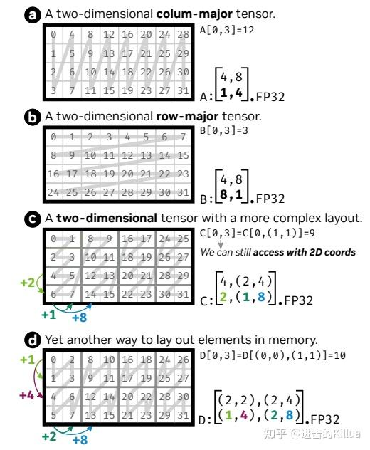
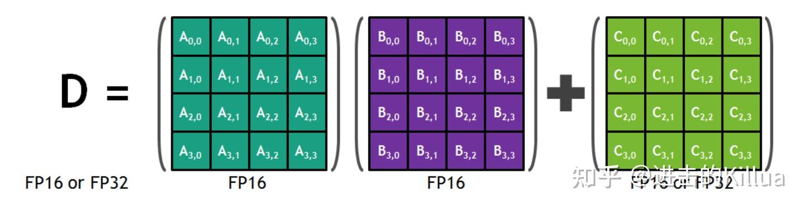

# CuTe实战(一)
https://zhuanlan.zhihu.com/p/690703999
https://github.com/zeroine/cutlass-cute-sample


## CuTe结构

### Layout

Layout包含Shape和Stride两部分

图a是一维列优先的layout，shape是(4,8)，stride是(1,4)。

图b是一维行优先的layout，shape是(4,8), stride是(8,1)。

图c是二维layout，shape是((4,1),(2,4)), 代表((最里层行数，最外层行数),(最里层列数，最外层列数))；stride是((2,1),(1,8)含义也是类似的。

图d也是二维layout((2,2),(2,4))，shape是((1,4),(2,8))，stride，可以对着图推导下。



```
#include <cuda.h>
#include <stdlib.h>
#include "util.h"

using namespace cute;
int main(){
    auto shape1 = make_shape(Int<8>{});
    auto stride1 = make_stride(Int<8>{});
    auto layout1 = make_stride(shape1, stride1);
    PRINT("layout1", layout1);

    auto shape2 = make_shape(Int<4>{}, Int<2>{});
    auto stride2 = make_stride(Int<1>{}, Int<4>{});
    auto shape2 = make_shape(shape2, stride2);
    PRINT("layout2", layout2);

    auto shape3 = make_shape(Int<2>{}, Int<3>{}, Int<4>{});
    auto stride3 = make_stride(Int<12>{}, Int<4>{}, Int<1>{});
    auto layout3 = make_layout(shape3, stride3);
    PRINT("layout3", layout3);

    auto shape41 = make_shape(Int<2>{}, Int<2>{});
    auto shape42 = make_shape(Int<2>{}, Int<4>{});
    auto shape4 = make_shape(shape41, shape42);
    auto stride41 = make_stride(Int<1>{}, Int<4>{});
    auto stride42 = make_stride(Int<2>{}, Int<8>{});
    auto stride4 = make_stride(stride41, stride42);
    auto layout4 = make_layout(shape4, stride4);
    PRINT("layout22", layout4)

    auto shape51 = make_shape(Int<2>{}, Int<2>{}, Int<2>{});
    auto shape52 = make_shape(Int<2>{}, Int<4>{}, Int<4>{});
    auto shape5 = make_shape(shape51, shape52);
    auto stride51 = make_stride(Int<2>{}, Int<16>{}, Int<128>{});
    auto stride52 = make_stride(Int<1>{}, Int<4>{}, Int<32>{});
    auto stride5 = make_stride(stride51, stride52);
    auto layout5 = make_layout(shape5, stride5);
    PRINT("layout33", layout5)
}

```

### Tensor

Tensor = Layout + storage，storage在GPU上可以有三种类型即全局内存、共享内存和寄存器。

```
Tensor make_tensor<T>(Layout layout);

Tensor make_tensor_like(Tensor tensor);

Tensor make_fragment_like(Tensor tensor);

Tensor make_tensor(Pointer pointer, Layout layout);

// 访问tensor
tensor(1, 2) = 100;

// slice
Tensor tensor1 = tensor(_, _, 3);

// 局部切块
Tensor tensor1 = local_tile(tensor, make_shape(2, 3, 4), make_coord(1, 2, 3));

// 局部提取
Tensor tensor1 = local_partition(tensor, layout, idx);

Tensor tensor1 = recast<NewType>(tensor);

print(tensor);
print_tensor(tensor);

// 构造只有形状没有数据实体的tensor，主要用于一些中间layout计算
Tensor tensor = make_identity_tensor(shape);
```

* demo
https://github.com/zeroine/cutlass-cute-sample/blob/main/tensor.cu

```
#include <cuda.h>
#include <stdlib.h>
#include "util.h"

using namespace cute;
using namespace std;

__global__ void handle_register_tensor(){

    auto reshape = make_shape(Int<4>{}, Int<2>{});
    auto rstride = make_stride(Int<2>{}, Int<1>{});
    auto rtensor = make_tensor(make_layout(rshape, rstride));

    PRINT("rtensor.layout", rtensor.layout());
    PRINT("rtensor.shape", rtensor.shape());
    PRINT("rtensor.stride", rtensor.stride());
    PRINT("rtensor.size", rtensor.size());
    PRINT("rtensor.data", rtensor.data());
    print("\n");
}

__global__ void handle_global_tensor(int *pointer){
    auto gshape = make_shape(Int<4>{}, Int<6>{});
    auto gstride = make_stride(Int<6>{}, Int<1>{});
    auto gtensor = make_tensor(make_gemm_ptr(pointer), make_layout(gshape, gstride));
    PRINTTENSOR("global tensor", gtensor);

    auto coord = make_coord(2, 1);
    PRINT("gtensor(2,1)", gtensor(coord));

    auto tensor_slice = gtensor(_, 1);
    PRINTTENSOR("tensor slice", tensor_slice);

    auto tensor_tile = local_tile(gtensor, make_shape(Int<2>(), Int<2>()), make_coord(Int<1>(), Int<1>()));
    PRINTTENSOR("tensor tile (2,2) index (1,1)", tensor_tile);

    int thr_idx = 1;
    auto tensor_partition = local_partition(gtensor, Layout<Shape<_2, _2>, Stride<_2, _1>>{}, thr_idx);
    PRINTTENSOR("tensor partition tile (2,2) index (1)", tensor_partition);
}


```

### Copy


基于cute Copy开发有一套范式，即
> CopyOperation，Copy_Traits  --->   Copy_Atom    --->  TildCopy   --->   ThrCopy   --->   copy

1. 其中CopyOperation代表copy指令，像对ldmatrix、cp.async指令的封装，Copy_Traits 记录一些type、shape之类的元信息，两者共同构成的Copy_Atom可认为是提供了指令级别不可分割的数据搬运的拷贝能力；
2. TiledCopy是对Copy_Atom的能力的封装通过重复拷贝执行单元的个数（增加执行线程）或者做多次的拷贝实现对原子能力的重复；
3. 而ThrCopy则是TiledCopy拆分到每个线程的任务，毕竟我们能code的都是线程级别的指令；最后通过copy触发数据搬运指令，

* demo
首先是从CopyOperation到TiledCopy的定义，这里给出了global memory->shared memory 和 shared memory -> register 2类拷贝的定义。
```
// CopyOperation
using g2s_copy_op = SM80_CP_ASYNC_CACHEGLOBAL<cute::uint128_t>
// Copy_Traits
using g2s_copy_traits = Copy_Traits<g2s_copy_op>;
// Copy_Atom
using g2s_copy_attom = Copy_Atom<g2s_copy_traits, T>;
// TildCopy
using G2SCopy = decltype(
    make_tiled_copy(
        g2s_copy_attom{}, 
        make_laout(make_shape(Int<32>{}, Int<4>{}),
                    make_stride(Int<4>{}, Int<1>{})), 
        make_laout(make_shape(Int<1>{}, Int<8>{}))));


using s2r_copy_op = SM75_U32x4_LDSM_N;
using s2r_copy_traits = Copy_Traits<s2r_copy_op>;
using s2r_copy_atom = Copy_Atom<s2r_copy_traits, T>;
using S2RCopy =
    decltype(make_tiled_copy(s2r_copy_atom{},
                                make_layout(make_shape(Int<32>{}, Int<4>{}),
                                            make_stride(Int<4>{}, Int<1>{})),
                                make_layout(make_shape(Int<1>{}, Int<8>{}))));

```

* 接着是对TildCopy和ThrCopy的使用，通过get_slice获得本线程的thr_copy，利用partition_S/retile_S获取拷贝源的tensor表示，利用partition_D/retile_D获取拷贝目的tensor表示，最后用copy完成数据搬运。

```
int idx = threadIdx.x;
extern __shared__ T shm_data[];
T *Ashm = shm_data;

auto gA = make_tensor(make_gmem_ptr(Aptr), make_shape(Int<M>{}, Int<N>{}), make_stride(Int<N>{}, Int<1>{}));

auto sA = make_tensor(make_smem_ptr(Ashm), SmemLayout{});

auto rA = make_tensor_like(gA);
// global -> shm
G2SCopy g2s_tiled_copy;
auto g2s_thr_copy = g2s_tiled_copy.get_slice(idx);
auto tAgA = g2s_thr_copy.partition_S(gA);
auto tAsA = g2s_thr_copy.partition_D(sA);
cute::copy(g2s_tiled_copy, tAgA, tAsA);

// shm-> register
S2RCopy s2r_tiled_copy;
auto s2r_thr_copy = s2r_tiled_copy.get_slice(idx);
auto stAsA = s2r_thr_copy.retile_S(tAsA);
auto tArA = s2r_thr_copy.partition_D(rA);
cute::copy(s2r_tiled_copy, stAsA, tArA);

```

### MMA

MMA是构建在TensorCore之上的

MMA的开发也有其范式
> MMAOperation，MMA_Traits  --->   MMA_Atom    --->  TiledMMA   --->   ThrMMA   --->  gemm

1. MMAOperation代表mma指令，MMA_Traits 记录一些type、shape之类的元信息，两者共同构成的MMA_Atom可认为是硬件提供的能执行的矩阵乘法的最小的单位
2. TiledMMA 是对MMA_Atom的组合，可以近似认为MMA_Atom是warp级别的而TiledMMA 是block级别的
3. 而ThrMMA则是TiledMMA 拆分到每个线程的任务，毕竟我们能code的都是线程级别的指令，最后通过gemm触发矩阵乘指令


* 首先是从MMAOperation到TiledMMA的定义

```
// MMAOperation, M=16, N=8, K=16, type=half
using mma_op = SM80_16x8x16_F16F16F16F16_TN;
// MMA_Traits
using mma_traits = MMA_Traits<mma_op>;
// MMA_ATOM
using mma_atom = MMA_Atom<mma_traits>;
// TiledMMA
using MMA = decltype(make_tiled_mma(mma_atom{},
                                    make_layout(Shape<_2, _4, _4>{}),   // thr_layout
                                    make_layout(Shape<_4, _4, _4>{}))); // val_layout

```

* 接着是对TiledMMA和ThrMMA的使用
get_slice获取当前线程对应的thr_mma对象，partition_A/B/C和partition_fragment_A/B/C分别得到global memory和register的tensor表示
利用copy操作将数据从global memory拷贝到寄存器中，再使用gemm进行矩阵乘，将最后的结果拷贝回global memory中。

```
template<typename T, typename MMA, int M, int N, int K>
__global__ void mma_simple(T *Cptr, const T *Aptr, const T *Bptr){
    MMA tiled_mma;
    
    // ThrMMA
    auto thr_mma = tiled_mma.get_slice(threadIdx.x);

    Tensor A = make_tensor(make_tensor_ptr(Aptr), make_shape(Int<M>{}, Int<K>{}), make_stride(Int<K>, Int<1>{}));
    Tensor B = make_tensor(make_tensor_ptr(Bptr), make_shape(Int<N>{}, Int<K>{}), make_stride(Int<K>, Int<1>{}));
    Tensor C = make_tensor(make_tensor_ptr(Cptr), make_shape(Int<M>{}, Int<N>{}), make_stride(Int<N>, Int<1>{}));

    auto tAgA = thr_mma.partition_A(A);
    auto tBgB = thr_mma.partition_B(B);
    auto tcgC = thr_mma.partition_C(C);

    auto tArA = thr_mma.partition_fragment_A(A);
    auto tBrB = thr_mma.partition_fragment_B(B);
    auto tCrC = thr_mma.partition_fragment_C(C);

    if(threadIdx.x == 0){
        // MMA 由MMA指令决定，不受MMAThrLayout和MMAValLayout影响
        // A,B,C 对应为： 16*16/32=8=(2,2,2), 16*8/32=4=(2,2), 16*8/32=4=(2,2)

        // MMA_M, MMA_K, MMA_N 由MMA指令、MMAThrLayout和源Tensor shape决定，不受MMAValLayout影响
        // MMA_M = M / (mma_op_m * thr_layout_m)
        // MMA_N = N / (mma_op_n * thr_layout_n)
        // MMA_K = K / (mma_op_k * thr_layout_k)

        // (MMA, MMA_M, MMA_K)
        PRINT("tArA.shape", tArA.shape());
        // (MMA, MMA_N, MMA_K)
        PRINT("tBrB.shape", tBrB.shape());
        // (MMA, MMA_M, MMA_N)
        PRINT("tCrC.shape", tCrC.shape());
    }
    cute::copy(tAgA, tArA);
    cute::copy(tBgB, tBrB);
    clear(tCrC);

    // cute::gemm, warp level
    // 语义：处理tCrC, tArA, tBrB 对应的partition前tensor A,B,C的 C= A*B+C, 内部会拆解成大量的mma_atom指令
    cute::gemm(tiled_mma, tCrC, tArA, tBrB, tCrC);

    // thread level
    cute::copy(tCrC, tCgC);
}

```

## VectorAdd

* 普通的vectorAdd kernel实现。

```
template <int kNumElemPerThread = 8>
__global__ void vector_add_v0(half *z, half *x, half *y, int num, const half a, const half b, const half c)
{
    using namespace cute;
    int tid = blockDim.x * blockIdx.x + threadIdx.x;
    int offset = tid * kNumElemPerThread;
    if (tid > num / kNumElemPerThread)
    {
        return;
    }
    half2 a2 = {a, a};
    half2 b2 = {b, b};
    half2 c2 = {c, c};
    half2 *x_ptr = reinterpret_cast<half2 *>(x + offset);
    half2 *y_ptr = reinterpret_cast<half2 *>(y + offset);
    half2 *z_ptr = reinterpret_cast<half2 *>(z + offset);
#pragma unroll
    for (int i = 0; i < kNumElemPerThread/2; i++)
    {
        half2 x_val, y_val, result;
        x_val = __ldg(x_ptr++);
        y_val = __ldg(y_ptr++);
        result = a2 * x_val + b2 * y_val + c2;
        *(z_ptr++) = result;
    }
}
 
```


* 接着是基于cute实现的vectorAdd kernel
```
template <int kNumElemPerThread = 8>
__global__ void vector_add_v1(half *z, half *x, half *y, int num, const half a, const half b, const half c)
{
    using namespace cute;
    int tid = blockDim.x * blockIdx.x + threadIdx.x;
    if (tid > num / kNumElemPerThread)
    {
        return;
    }

    auto tZ = make_tensor(make_gmem_ptr(z), make_shape(num));
    auto tX = make_tensor(make_gmem_ptr(x), make_shape(num));
    auto tY = make_tensor(make_gmem_ptr(y), make_shape(num));

    auto tZg = local_tile(tZ, make_shape(Int<kNumElemPerThread>()), tid);
    auto tXg = local_tile(tX, make_shape(Int<kNumElemPerThread>()), tid);
    auto tYg = local_tile(tY, make_shape(Int<kNumElemPerThread>()), tid);

    auto tZr = make_tensor_like(tZg);
    auto tXr = make_tensor_like(tXg);
    auto tYr = make_tensor_like(tYg);

    cute::copy(tXg, tXr);
    cute::copy(tYg, tYr);

#pragma unroll
    for (int i = 0; i < size(tXr); i++)
    {
        tZr(i) = a * tXr(i) + (b * tYr(i) + c);
    }
    cute::copy(tZr, tZg);
}
```

* 最后是优化版本的cute

利用了half2数据结构进行了向量化的读取写入，本质上是加速存储介质间的拷贝过程。同时还利用了HFMA2指令加速计算
```
template <int kNumElemPerThread = 8>
__global__ void vector_add_v2(
    half *z, const half *x, const half *y, int num, const half a, const half b, const half c)
{
    using namespace cute;

    int idx = threadIdx.x + blockIdx.x * blockDim.x;
    if (idx >= num / kNumElemPerThread)
    {
        return;
    }

    Tensor tz = make_tensor(make_gmem_ptr(z), make_shape(num));
    Tensor tx = make_tensor(make_gmem_ptr(x), make_shape(num));
    Tensor ty = make_tensor(make_gmem_ptr(y), make_shape(num));

    Tensor tzr = local_tile(tz, make_shape(Int<kNumElemPerThread>{}), make_coord(idx));
    Tensor txr = local_tile(tx, make_shape(Int<kNumElemPerThread>{}), make_coord(idx));
    Tensor tyr = local_tile(ty, make_shape(Int<kNumElemPerThread>{}), make_coord(idx));

    Tensor txR = make_tensor_like(txr);
    Tensor tyR = make_tensor_like(tyr);
    Tensor tzR = make_tensor_like(tzr);

    // LDG.128
    copy(txr, txR);
    copy(tyr, tyR);

    half2 a2 = {a, a};
    half2 b2 = {b, b};
    half2 c2 = {c, c};

    auto tzR2 = recast<half2>(tzR);
    auto txR2 = recast<half2>(txR);
    auto tyR2 = recast<half2>(tyR);

#pragma unroll
    for (int i = 0; i < size(tzR2); ++i)
    {
        // two hfma2 instruction
        tzR2(i) = txR2(i) * a2 + (tyR2(i) * b2 + c2);
    }

    auto tzRx = recast<half>(tzR2);
    // STG.128
    copy(tzRx, tzr);
}
```


