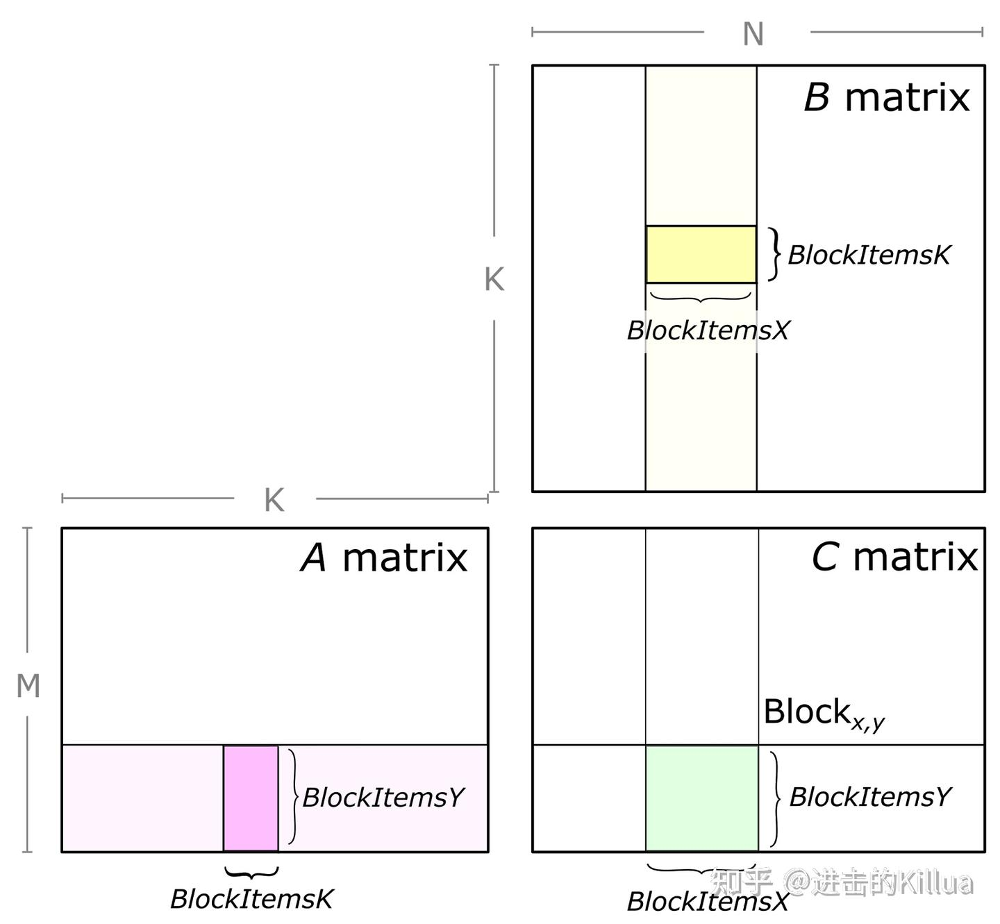
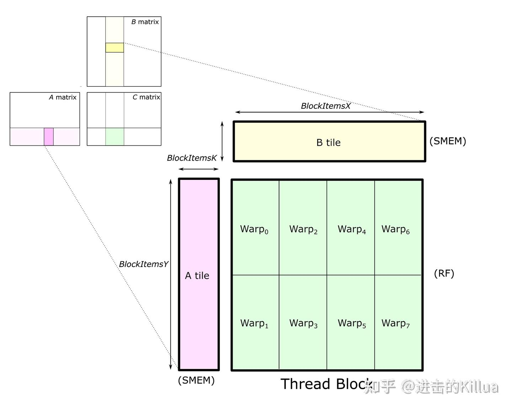
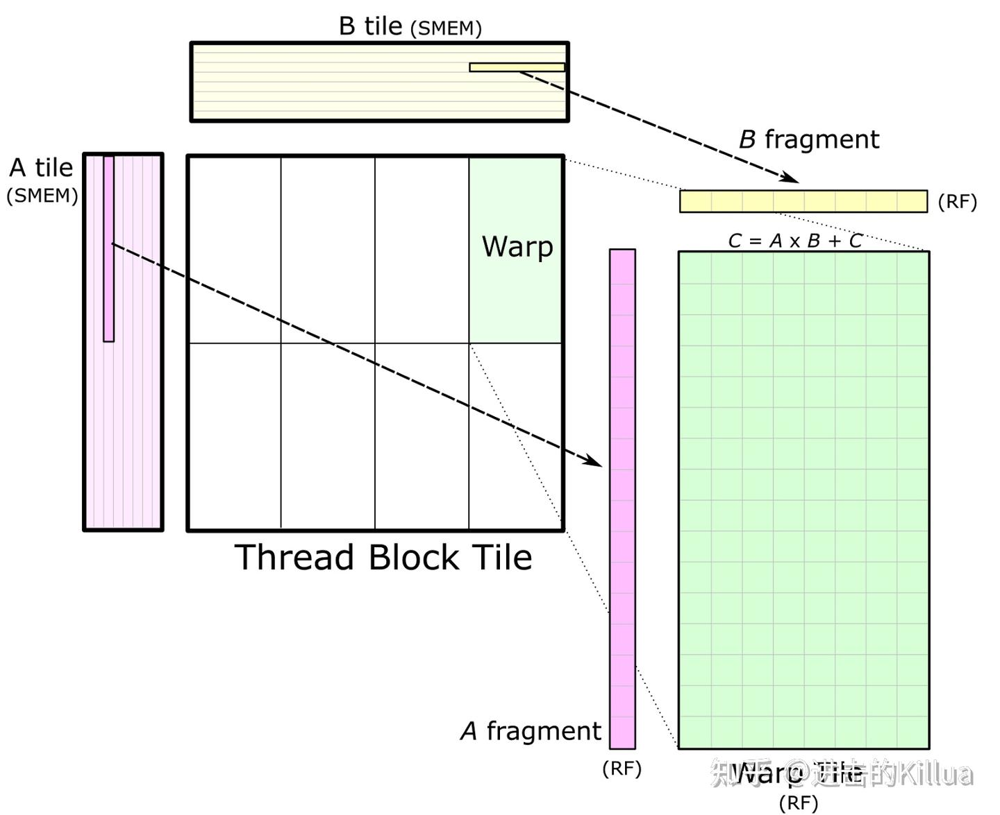
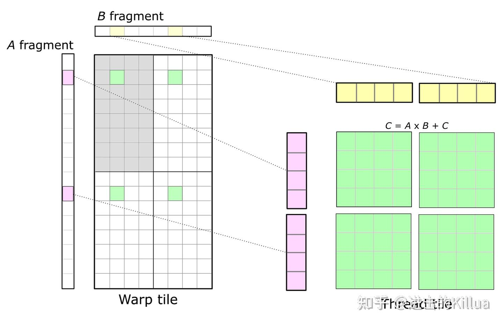

# CUTLASS 基础介绍
1. 定义一个operator。
2. 定义参数args。
3. 使用参数调用operator。
```
 CutlassGemm gemm_operator;
 CutlassGemm::Arguments args;
 cutlass::Status status = gemm_operator(args);
```

* 矩阵乘
Gemm类型并使用该类型定义一个gemm_operator，这里使用了cutlass::gemm::device::Gemm模板，并用float和ColumnMajor进行了模板实例化，即指定了矩阵乘输入输出参数的类型和layout，然后用这个类型定义了gemm_operator变量，这个可以理解为执行矩阵乘的算子

```
  using ColumnMajor = cutlass::layout::ColumnMajor;

  using CutlassGemm = cutlass::gemm::device::Gemm<float,        // Data-type of A matrix
                                                  ColumnMajor,  // Layout of A matrix
                                                  float,        // Data-type of B matrix
                                                  ColumnMajor,  // Layout of B matrix
                                                  float,        // Data-type of C matrix
                                                  ColumnMajor>; // Layout of C matrix

  // Define a CUTLASS GEMM type
  CutlassGemm gemm_operator;
```

```
  int M, N, K;
  float alpha, float beta;
  int lda = M;
  int ldb = K;
  int ldc = M;
  // Construct the CUTLASS GEMM arguments object.
  CutlassGemm::Arguments args({M , N, K},  // Gemm Problem dimensions
                              {A, lda},    // Tensor-ref for source matrix A
                              {B, ldb},    // Tensor-ref for source matrix B
                              {C, ldc},    // Tensor-ref for source matrix C
                              {C, ldc},    // Tensor-ref for destination matrix D (may be different memory than source C matrix)
                              {alpha, beta}); // Scalars used in the Epilogue
```

```
  //
  // Launch the CUTLASS GEMM kernel.
  //
  cutlass::Status status = gemm_operator(args);
  //
  // Return a cudaError_t if the CUTLASS GEMM operator returned an error code.
  //
  if (status != cutlass::Status::kSuccess) {
    return cudaErrorUnknown;
  }
```

* 经典的OP Fusion例子


## cutlass原理


* thread block




* warp




* thread


