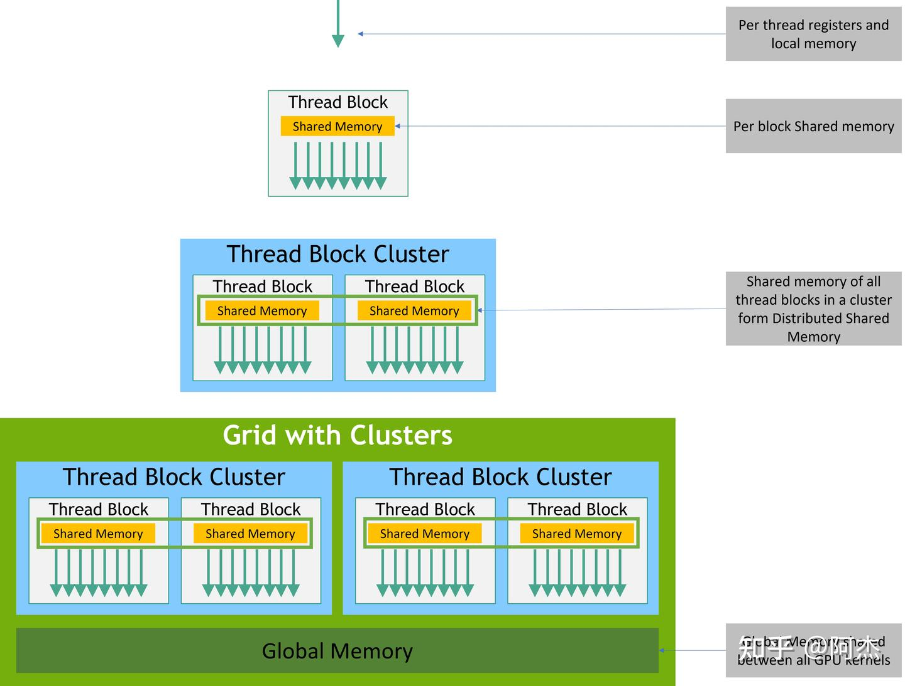
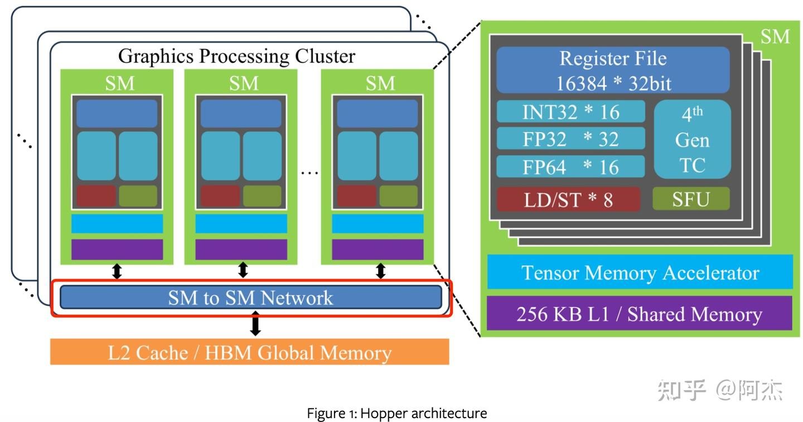
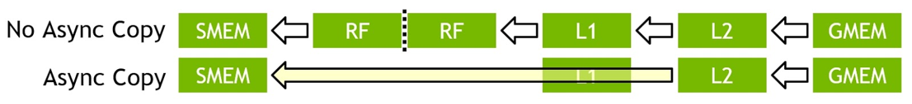
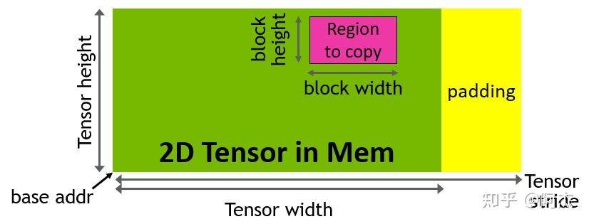
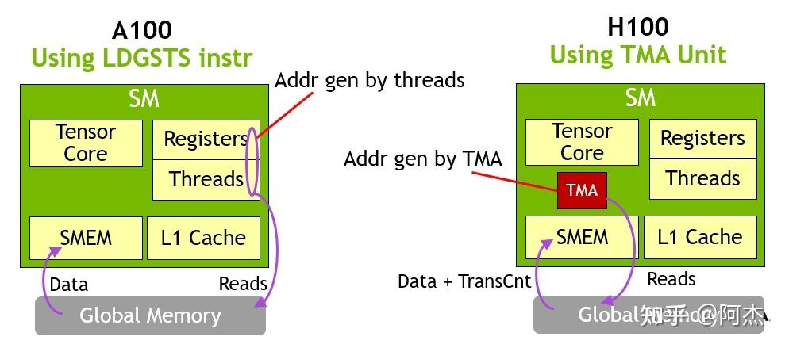
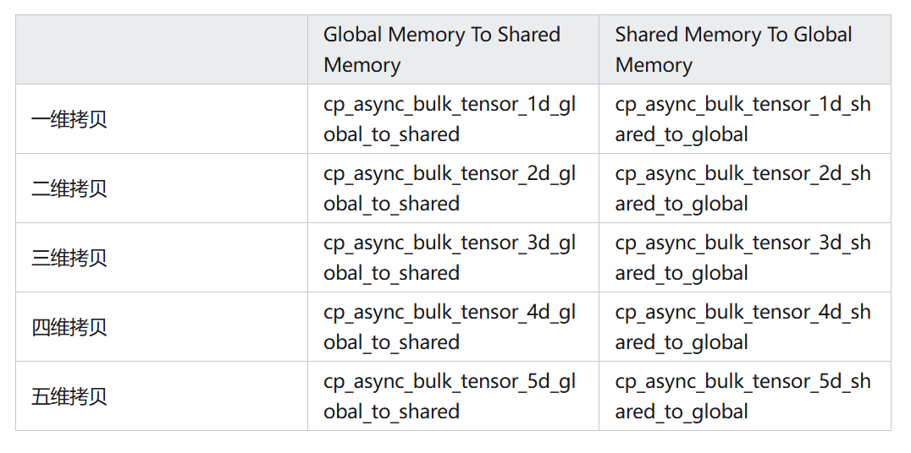

# hopper

1. 数据局部性
2. 异步执行

* Hopper 架构针对这两个关键因素，在软件层提供了两方面的编程能力
1. 新线程、显存层次：通过新增 Thread Block Cluster 这一线程层次，提供跨 Thread Block 的 Shared Memory 访问。开发者可以基于 Thread Block Cluster ，利用 Distributed Shared Memory 实现高效的多 Thread Block 的协同运行；
2. 访存计算异步执行：Hopper 在硬件层提供了 TMA 单元，在软件层可以通过 cuda::memcpy_async 使用 TMA 单元实现异步的 Global Memory 和 Shared Memory 之间的拷贝。


## Thread Block Clusters 的前世今生

H800为例，其 Global Memory 的访问延迟约为 478 个时钟周期，Shared Memory 的访问延迟约为 30 个时钟周期，Register 约为 1 个时钟周期

* GPU 编程中，Kernel 的设计是以 Thread Block 这个粒度展开的。但这样会导致两个问题：

1. 单个 Thread Block 处理的数据规模有限
Shared Memory 的容量有限
H800为例，其Global Memory 大小为 80GB，而每个 Thread Block 最大可用 Shared Memory 仅 227 KB
这使得单个 Thread Block 为了使用 Shared Memory加速性能时，只能处理一个数据规模较小的子任务。
任务规模一旦变大，Shared Memory 不够用，Thread Block 就只能用高访问延迟的 Global Memory 完成任务，导致 Kernel 性能降低。

2. SM 利用率较低
单个 Thread Block 可配置的最大线程数为 1024，每个 Thread Block 会分配到一个 SM 上运行
假如每个 Thread Block 处理较大规模的数据、计算，Kernel 一次仅发射很少的 Thread Block，可能导致某些 SM 处于空闲状态，计算资源没有被充分挖掘，这样同样会限制 Kernel 的整体性能。例如在 LLM 长文本推理 进行 Decoding Attention 时， K、V 长度较长，此时由于显存上限问题， batch size 会小，这导致单个 Thread Block 访问的数据量、计算量较大，同时发射的 Thread Block 的数量较少，导致某些 SM 处于空闲状态，限制 Kernel 性能。


解决这个问题的最直接的方式是：提供更大粒度的线程组。


###  Thread Block Clusters

为了解决 Thread Block 粒度过小导致的 Kernel 运行效率不足的问题，Hooper 在 Thread Block 之上再引入一层结构——Thread Block Clusters。



Hopper 架构通用的最大 Cluster Size 为 8
H100 有点特殊（毕竟很贵），其最大的 Cluster Size 为 16
Distributed Shared Memory
Hopper 架构在 Cluster 内部，位于 L1 和 L2 Cache 之间新增了一层SM-to-SM Network。Thread Block Cluster 内部的 SM 可以通过该层网络访问其他 SM 的 Shared Memory。




* Distributed Shared Memory 用法
直方图统计示例
```
#include <cooperative_groups.h>

// Distributed Shared memory histogram kernel
__global__ void clusterHist_kernel(int *bins, const int nbins,
                                   const int bins_per_block,
                                   const int *__restrict__ input,
                                   size_t array_size)
{
  extern __shared__ int smem[];
  namespace cg = cooperative_groups;
  int tid = cg::this_grid().thread_rank();

  // 获取当前 cluster 信息
  cg::cluster_group cluster = cg::this_cluster();
  unsigned int clusterBlockRank = cluster.block_rank();
  int cluster_size = cluster.dim_blocks().x;

  for (int i = threadIdx.x; i < bins_per_block; i += blockDim.x) {
    // 初始化直方图每个bin的值
    smem[i] = 0; //Initialize shared memory histogram to zeros
  }

  // Cluster 同步，类似 Thread Block 的 __syncthreads()。该调用保证整个 Cluster 的
  // 线程都会在这个点同步。这个同步点目标是保证 cluster 中所有 Thread Block 的 smem 都
  // 完成初始化，可以开始运行后面的处理逻辑。
  cluster.sync();

  for (int i = tid; i < array_size; i += blockDim.x * gridDim.x)
  {
    int ldata = input[i];

    //Find the right histogram bin.
    int binid = ldata;
    if (ldata < 0)
      binid = 0;
    else if (ldata >= nbins)
      binid = nbins - 1;

    int dst_block_rank = (int)(binid / bins_per_block);
    int dst_offset = binid % bins_per_block;

    // 重点：map_shared_rank 主要用于获取其他 Thread Block 的 Shared Memory 地址
    int *dst_smem = cluster.map_shared_rank(smem, dst_block_rank);

    // 更新直方图 bin 的统计数字
    atomicAdd(dst_smem + dst_offset, 1);
  }

  // 这个同步点目标是保证 cluster 中所有 Thread Block 的 smem 都处于可用的状态。
  // 如果不同步，可能部分 Thread Block 提前结束运行，对应的 smem 也被销毁，这时未退出的
  // Thread Block 有可能访问已退出的 Thread Block 对应的 smem，出现非法内存访问，
  // 会造成程序崩溃
  cluster.sync(); 

  int *lbins = bins + cluster.block_rank() * bins_per_block;
  for (int i = threadIdx.x; i < bins_per_block; i += blockDim.x)
  {
    atomicAdd(&lbins[i], smem[i]);
  }
}
```

1. cg::this_cluster()：获取当前 cluster
2. cluster.map_shared_rank(void *smem, int rank)：主要用于获取其他 Thread Block 的 Shared Memory 地址，通过该调用实现 Distributed Shared Memmory 的访问
3. cluster.sync()：负责整个 Thread Block Cluster 所有线程的同步操作

第二个 cluster.sync 算是 Thread Block Cluster Kernel 独有并且必须的，以前 Thread Block Kernel 并不需要同步操作保证 Shared Memory 的可用性。所以，一个 Thread Block Cluster Kernel 的实现范式如下：
```
#include <cooperative_groups.h>
namespace cg = cooperative_groups;
__global__ void cluster_kernel() {
    auto cluster = cg::this_cluster();
    extern __shared__ int shm[];
    // 初始化 ... 
    init_local_shared_data(shm);
    // 保证初始化完成
    cluster.sync();
    // ...
    // 获取 Distributed Shared Memory 地址
    int *dsmem = cluster.map_shared_rank(&shm[0], some_rank);
    // 处理 Distributed Shared Memory
    process_shared_data(dsmem);
    // 保证 Shared Memory 可用，避免其他 Thread Block 访问
    // 当前 Thread Block 的 Shared Memory 失败
    cluster.sync();
}
```

*  Kernel Launch 方式

由于传统的 Kernel Lauch 无法传递 Cluster Size 这个参数，所以 Thread Block Cluster Kernel 的 Launch 方式不能使用传统的 Kernel Lauch 方式( kernel<<<...>>>() ) 
Thread Block Cluster Kernel 需要使用 cudaLaunchKernelEx 这个函数，通过设置 cudaLaunchConfig_t 以及 cudaLaunchAttribute 设置 grid、block 以及 cluster 配置

Thread Block Cluster Kernel 需要使用 cudaLaunchKernelEx 这个函数，通过设置 cudaLaunchConfig_t 以及 cudaLaunchAttribute 设置 grid、block 以及 cluster 配置。以下是 Thread Block Cluster Kernel 的 Lauch 示例
```
// Launch via extensible launch
{
  cudaLaunchConfig_t config = {0};
  config.gridDim = array_size / threads_per_block;
  config.blockDim = threads_per_block;

  // cluster_size depends on the histogram size.
  // ( cluster_size == 1 ) implies no distributed shared memory, just thread block local shared memory
  int cluster_size = 2; // size 2 is an example here
  int nbins_per_block = nbins / cluster_size;

  //dynamic shared memory size is per block.
  //Distributed shared memory size =  cluster_size * nbins_per_block * sizeof(int)
  config.dynamicSmemBytes = nbins_per_block * sizeof(int);

  CUDA_CHECK(::cudaFuncSetAttribute((void *)clusterHist_kernel, cudaFuncAttributeMaxDynamicSharedMemorySize, config.dynamicSmemBytes));

  cudaLaunchAttribute attribute[1];
  attribute[0].id = cudaLaunchAttributeClusterDimension;
  attribute[0].val.clusterDim.x = cluster_size;
  attribute[0].val.clusterDim.y = 1;
  attribute[0].val.clusterDim.z = 1;

  config.numAttrs = 1;
  config.attrs = attribute;

  cudaLaunchKernelEx(&config, clusterHist_kernel, bins, nbins, nbins_per_block, input, array_size);
}
```

* 同步优化
cluster.sync() 负责整个 Thread Block Cluster 所有线程的同步操作，同步开销比一般的 __syncthreads()要更高。
如果允许我们在等待期间完成一些与 Shared Memory 无关的操作，这样就可以掩盖了 cluster.sync() 的部分延迟，从而提升性能。这样就需要 CUDA 提供拆分 cluster.sync() 的能力，将 cluster.sync() 拆分成两个阶段：同步点与等待点。在同步点与等待点之间，可以插入与 Shared Memory 无关的操作。

1. arrival_token cluster.barrier_arrive()：设置同步点，返回同步点标记 token。
2. cluster.barrier_wait(arrival_token&& token): 设置等待点，输入为同步点标记 token。当 Thread Block Cluster 中所有线程都结束 barrier_arrive 调用后，等待 barrier_wait 的线程就可以结束等待，继续运行。
```
#include <cooperative_groups.h>

using namespace cooperative_groups;

void __device__ init_shared_data(const thread_block& block, int *data);
void __device__ local_processing(const thread_block& block);
void __device__ process_shared_data(const thread_block& block, int *data);

__global__ void cluster_kernel() {
    extern __shared__ int array[];
    auto cluster = this_cluster();
    auto block   = this_thread_block();

    // Use this thread block to initialize some shared state
    init_shared_data(block, &array[0]);

    auto token = cluster.barrier_arrive(); // Let other blocks know this block is running and data was initialized

    // Do some local processing to hide the synchronization latency
    local_processing(block);

    // Map data in shared memory from the next block in the cluster
    int *dsmem = cluster.map_shared_rank(&array[0], (cluster.block_rank() + 1) % cluster.num_blocks());

    // Make sure all other blocks in the cluster are running and initialized shared data before accessing dsmem
    cluster.barrier_wait(std::move(token));

    // Consume data in distributed shared memory
    process_shared_data(block, dsmem);
    cluster.sync();
}
```


##  Tensor Memory Access（TMA）
https://docs.nvidia.com/cuda/cuda-c-best-practices-guide/index.html#asynchronous-copy-from-global-memory-to-shared-memory
### background
Ampere 架构带来的一个新特性——异步拷贝

* 同步拷贝存在的问题
```
// shm.cu
__global__ void CopyToSharedMem(int* global_data) {
    int idx = threadIdx.x + blockIdx.x * blockDim.x;
    extern __shared__ int shm[];
    shm[threadIdx.x] = global_data[idx];
    __syncthreads();
    compute_shm(shm);
    // ......
}
```
 shm[threadIdx.x]= global_data[idx] 这一行调用就是把 Global Memory 拷贝到 Shared Memory 中
在 GPU 中，这个拷贝操作会被分解为三个步骤：
1. 计算 Global Memory 和 Shared Memory 的地址；
2. 把 Global Memory 拷贝到寄存器中；
3. 把寄存器的值拷贝到 Shared Memory 中。
通过 nvcc -o shm shm.cu -arch=compute_80 -code=sm_80 编译以上代码，并运行 cuobjdump --dump-sass shm 打印 SASS 层指令

假如在原有 Kernel Global Memory 拷贝到 Shared Memory 的基础上，添加一个 for 循环读取，代码变为：
```
// shm.cu
__global__ void CopyToSharedMem(int* data, int num_per_threads) {
    int idx = threadIdx.x + blockIdx.x * blockDim.x;
    extern __shared__ int shm[];
    for (int i = 0; i < num_per_threads; ++i) {
      shm[threadIdx.x * num_per_threads + i] = data[num_per_threads * idx + i];
    }
    __syncthreads();
    compute_shm(shm);
    // ......
}
```

其中 num_per_threads 为每个线程处理的个数，从 Host 端传入，非 constexpr 类型。一个线程里会循环将 Global Memory 的值拷贝到 Shared Memory 里。

* 常规的 Shared Memory 赋值方式存在以下几个问题：
1. 一次赋值涉及多个指令执行。地址计算、LDG 以及 STS指令。
2. 单一线程中无数据依赖的 Load/Store 指令会串行同步执行。
3. 存在冗余的操作。循环内部 Shared Memory 赋值会从原来 2 个指令展开为 32个指令，假如循环只有一次，也会执行 32 个指令，冗余执行了多个无用的指令，浪费时钟周期

* 针对以上问题，GPU 硬件上提升 Shared Memory 拷贝性能有三个思路：
1.  LDG 和 STS 指令合并为一种新指令，减少需要运行的指令数量
2.  提供异步执行 Shared Memory 拷贝，减少循环间的等待
3.  在循环中避免展开指令，仅一条指令完成拷贝计算，这样可以减少冗余操作

Ampere 架构按照上述三种思路新增了一项新特性——异步拷贝。




### 异步拷贝的使用

CUDA 提供了两种异步拷贝接口：
cuda::memcpy_async 以及 cooperative_groups::memcpy_async。
两种接口功能一样，下面以 cuda::memcpy_async 为例介绍异步拷贝的用法。

```
__global void AsyncCopyToSharedMem(int * data, int num_per_threads){
    int idx = threadIdx.x + blockIdx.x * blockDim.x;
    auto grid = cooperative_groups::this_grid();
    auto block = cooperative_groups::this_thread_block();
    extern __shared__ int shm[];

    __shared__ cuda::barrier<cuda::thread_scope::thread_scope_block> barrier;
    if(block.thread_rank() == 0){
        init(&barrier, block.size());
    }
    block.sync();
#pragma unroll
    for(int i = 0; i < num_per_threads; i++){
        cuda::memcpy_async(block, shm + threadIdx.x * num_per_threads + i, data + threadIdx.x * num_per_threads + i, sizeof(int), barrier);
    }
    barrier.arrive_and_wait();
}
```
常规的 __syncthreads() 无法感知异步拷贝是否完成
综上所述，异步拷贝的使用方式为：
1. 使用 cooperative_groups 获取当前 block；
2. 在 Shared Memory 上创建 cuda::barrier 对象，并使用一个线程对其初始化；
3. 调用 cuda::memcpy_async，将上一步创建的 cuda::barrier 对象放到 barrier 参数中；
4. 使用 barrier 同步异步拷贝。

我们通过 nvcc -o shm shm.cu -arch=compute_80 -code=sm_80 编译以上代码，并运行 cuobjdump --dump-sass shm 打印 SASS 层指令

通过上面分析，Ampere 架构提供的异步拷贝可以降低指令数量（合并LDG 以及 STS指令），单个线程级别的 Shared Memory 拷贝和计算的重叠以及冗余操作。但是，针对一大块不连续的显存拷贝，需要开发者显式计算每段连续显存的首地址，从而引入了地址计算开销，所以每次执行 LDGSTS 前还是需要同步等待地址的计算。针对这个问题， Hopper 架构提出了 Tensor Memory Access（TMA），可以减少地址计算的开销。


### Tensor Memory Access（TMA）

Ampere 架构下，Shared Memory 异步拷贝大块显存时需频繁计算不连续地址，导致效率低下。Hopper 架构引入 TMA 功能:
1. 大块（bulk）异步显存拷贝。使用 cuda::memcpy_async 接口。
2. 多维度显存块拷贝。
在实际使用中，需要区分一维度显存块拷贝和多维度显存块拷贝。多维度显存块拷贝需要在 Host 端调用 cuTensorMapEncode 的 API，计算显存块之间的地址映射关系，然后通过带有__grid_constant__ 注释的 CUtensorMap 类型参数传递给 Kernel 函数中，调用 TMA 的异步拷贝接口完成多维度的拷贝。
3. 支持从 Shared Memory 异步拷贝到 Global Memory。Ampere架构只支持从 Global Memory 异步拷贝到 Shared Memory，而在 Hopper 架构上更进一步支持反向的拷贝操作


#### 一维度显存块拷贝
```
#include <cuda/barrier>
using barrier = cuda::barrier<cuda::thread_scope_block>;

static constexpr size_t buf_len = 1024;
__global__ void add_one_kernel(int* data, size_t offset) {
  // Shared memory 数组。数组整体 size 要对齐 16字节
  __shared__ alignas(16) int smem_data[buf_len];

  // 1. a) 用0号线程初始化 barrier，与上面的代码示例类似。
  //    b) 插入一个fence。表示后续执行异步拷贝操作，需要在这个fence之后才执行。
  #pragma nv_diag_suppress static_var_with_dynamic_init
  __shared__ barrier bar;
  if (threadIdx.x == 0) { 
    init(&bar, blockDim.x);                                    // a)
    cuda::device::experimental::fence_proxy_async_shared_cta();// b)
  }
  __syncthreads();

  // 2. 发起 TMA 异步拷贝。注意：TMA 操作是用单线程发起。
  if (threadIdx.x == 0) {
    // 3a. 发起异步拷贝
    cuda::memcpy_async(
        smem_data, 
        data + offset, 
        cuda::aligned_size_t<16>(sizeof(smem_data)),
        bar
    );
  }
  // 3b. 所有线程到达该标记点，barrier内部的计数器会加 1。
  barrier::arrival_token token = bar.arrive();
  
  // 3c.等待barrier内部的计数器等于期望数值，即所有线程到达3b点时，当前线程的wait会返回，结束等待。
  bar.wait(std::move(token));

  // 4. 在 Shared Memory 上写数据。
  for (int i = threadIdx.x; i < buf_len; i += blockDim.x) {
    smem_data[i] += 1;
  }

  // 5. 插入fence，保证后续的异步拷贝操作在Shared Memory写数据结束后再启动。
  cuda::device::experimental::fence_proxy_async_shared_cta();   // b)
  __syncthreads();
  // 6. 发起从 Shared Memory 到 Global Memory 的异步拷贝操作。
  if (threadIdx.x == 0) {
    cuda::device::experimental::cp_async_bulk_shared_to_global(
        data + offset, smem_data, sizeof(smem_data));
    // 7. 一种同步方式，创建一个 bulk async-group，异步拷贝在这个 group 中运行，当异步拷贝结束后，
    // group 内部标记为已完成。
    cuda::device::experimental::cp_async_bulk_commit_group();
    // 等待 group 完成。模版参数 0 表示要等待小于等于 0 个 bulk async-group 完成才结束等待。
    cuda::device::experimental::cp_async_bulk_wait_group_read<0>();
  }
}
```
整个一维度的 TMA 使用流程，可以总结为以下三个阶段共计 6 个步骤：
1. 第一阶段：Global Memory 到 Shared Memory 的拷贝
   1. 【初始化同步变量】使用单线程初始化 Shared Memory 上的 barrier 对象；
   2. 【保证异步操作的顺序】插入 fence，保证 barrier 对象初始化执行完才开始后续的异步拷贝；
   3. 【调用 cuda::memcpy_async&同步】使用单线程发起异步拷贝，并通过 barrier.arrive 以及 barrier.wait 进行同步；
2. 第二阶段：对 Shared Memory 进行写操作。
3. 第三阶段：Shared Memory 到 Global Memory 的拷贝：
   1. 【保证异步操作的顺序】插入 fence，保证前面的 Shared Memory 写操作完成后才开始后续的异步拷贝；
   2. 【调用cp_async_bulk_shared_to_global & 同步】使用单线程调用

nvcc -o shm shm.cu -arch=compute_90 -code=sm_90 编译以上代码，并运行 cuobjdump --dump-sass shm 打印 SASS 层指令

#### 多维度显存块拷贝
在多维度显存块拷贝中，需要在 Kernel 内部为每一小段连续显存计算其首地址，以保证拷贝正确的显存段。但是当维度很高，显存段的段数很多时，Kernel 内需要频繁计算地址，这部分计算开销不容忽视。



实际当Global Memory 的维度、Shape以及Shared Memory 的 维度、Shape 确定时，Kernel 中每个 Thread Block 所要拷贝的 Global Memory 的首地址都能提前确定。
```
  CUtensorMap tensor_map{};
  // rank is the number of dimensions of the array.
  constexpr uint32_t rank = 2;
  uint64_t size[rank] = {GMEM_WIDTH, GMEM_HEIGHT};
  // The stride is the number of bytes to traverse from the first element of one row to the next.
  // It must be a multiple of 16.
  uint64_t stride[rank - 1] = {GMEM_WIDTH * sizeof(int)};
  // The box_size is the size of the shared memory buffer that is used as the
  // destination of a TMA transfer.
  uint32_t box_size[rank] = {SMEM_WIDTH, SMEM_HEIGHT};
  // The distance between elements in units of sizeof(element). A stride of 2
  // can be used to load only the real component of a complex-valued tensor, for instance.
  uint32_t elem_stride[rank] = {1, 1};

  // Get a function pointer to the cuTensorMapEncodeTiled driver API.
  auto cuTensorMapEncodeTiled = get_cuTensorMapEncodeTiled();

  // Create the tensor descriptor.
  CUresult res = cuTensorMapEncodeTiled(
    &tensor_map,                // CUtensorMap *tensorMap,
    CUtensorMapDataType::CU_TENSOR_MAP_DATA_TYPE_INT32,
    rank,                       // cuuint32_t tensorRank,
    tensor_ptr,                 // void *globalAddress,
    size,                       // const cuuint64_t *globalDim,
    stride,                     // const cuuint64_t *globalStrides,
    box_size,                   // const cuuint32_t *boxDim,
    elem_stride,                // const cuuint32_t *elementStrides,
    // Interleave patterns can be used to accelerate loading of values that
    // are less than 4 bytes long.
    CUtensorMapInterleave::CU_TENSOR_MAP_INTERLEAVE_NONE,
    // Swizzling can be used to avoid shared memory bank conflicts.
    CUtensorMapSwizzle::CU_TENSOR_MAP_SWIZZLE_NONE,
    // L2 Promotion can be used to widen the effect of a cache-policy to a wider
    // set of L2 cache lines.
    CUtensorMapL2promotion::CU_TENSOR_MAP_L2_PROMOTION_NONE,
    // Any element that is outside of bounds will be set to zero by the TMA transfer.
    CUtensorMapFloatOOBfill::CU_TENSOR_MAP_FLOAT_OOB_FILL_NONE
  );
```
CUtensorMap 对象通过 cuTensorMapEncodeTiled 初始化，需要指定 Global Memory 首地址（tensor_ptr）、Shape(size)、 Shared Memory 的 Shape（box_size）以及维度（rank）。在完成 CUtensorMap 创建后，可以将其传入到 Kernel 内部使用，这样 Kernel 内部无需再计算地址了。以下是 TMA 多维度显存块拷贝的示例代码
```
#include <cuda.h>         // CUtensormap
#include <cuda/barrier>
using barrier = cuda::barrier<cuda::thread_scope_block>;
namespace cde = cuda::device::experimental;

__global__ void kernel(const __grid_constant__ CUtensorMap tensor_map, int x, int y) {
  // bluk tensor 的拷贝操作需要 Shared Memory 首地址对齐 128 字节。
  __shared__ alignas(128) int smem_buffer[SMEM_HEIGHT][SMEM_WIDTH];

  // 创建 Shared Memory 的 cuda::barrier 变量 
  #pragma nv_diag_suppress static_var_with_dynamic_init
  __shared__ barrier bar;

  if (threadIdx.x == 0) {
    // 初始化 barrier 
    init(&bar, blockDim.x);
    // 插入 fence
    cde::fence_proxy_async_shared_cta();    
  }
  __syncthreads();

  barrier::arrival_token token;
  if (threadIdx.x == 0) {
    // 发起 TMA 二维异步拷贝操作
    cde::cp_async_bulk_tensor_2d_global_to_shared(&smem_buffer, &tensor_map, x, y, bar);
    // 设置同步等待点，指定需要等待的拷贝完成的字节数。
    token = cuda::device::barrier_arrive_tx(bar, 1, sizeof(smem_buffer));
  } else {
    // Other threads just arrive.
    token = bar.arrive();
  }
  // 等待完成拷贝
  bar.wait(std::move(token));

  smem_buffer[0][threadIdx.x] += threadIdx.x;

  // 插入 fence
  cde::fence_proxy_async_shared_cta();
  __syncthreads();

  if (threadIdx.x == 0) {
    cde::cp_async_bulk_tensor_2d_shared_to_global(&tensor_map, x, y, &smem_buffer);
    cde::cp_async_bulk_commit_group();
    cde::cp_async_bulk_wait_group_read<0>();
  }

  if (threadIdx.x == 0) {
    (&bar)->~barrier();
  }
}
```
多维度显存块拷贝的使用范式与一维度显存块拷贝的使用范式基本一样，只有一些具体调用的函数不同，这里讲讲不同点：

1. 不再使用cuda::memcpy_async 实现 Global Memory 到 Shared Memory 的拷贝，取而代之使用 cp_async_bulk_tensor_2d_global_to_shared 调用实现。该调用传入了 tensor_map 参数，根据 tensor_map 可以获取需要拷贝的 Global Memory 段的首地址；
2. 同步方式。主要是调用异步拷贝（Global Memory 到 Shared Memory）的线程需要使用cuda::device::barrier_arrive_tx 调用，该调用可以传入拷贝的字节数，表示 barrier 需要等待多少字节拷贝完毕才结束。

nvcc -o shm shm.cu -arch=compute_90 -code=sm_90 编译以上代码，并运行 cuobjdump --dump-sass shm 打印 SASS 层指令




