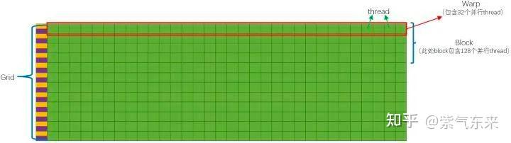

1. CPU 中包含了多级高速的缓存结构。 这样提升了指令访问存储的速度。
2. CPU 中包含了很多控制单元。 具体有2种，一个是分支预测机制，另一个是流水线前传机制。
3. CPU 的运算单元 (Core) 强大，整型浮点型复杂运算速度快。

4. CUDA 内存模型的最基本的单位就是 SP (线程处理器)
5. 多个线程处理器 (SP) 和一块共享内存所构成的就是 SM (多核处理器) (
6. 每个多核处理器 (SM) 内都有自己的 shared memory (共享内存)，shared memory 可以被线程块内所有线程访问。

7. 由这个 SM (多核处理器) 和一块全局内存，就构成了 GPU
8. 一个 GPU 的所有 SM 共有一块 global memory (全局内存)

每个 thread 都有自己的一份 register 和 local memory 的空间。同一个 block 中的每个 thread 则有共享的一份 share memory。此外，所有的 thread (包括不同 block 的 thread) 都共享一份 global memory。不同的 grid 则有各自的 global memory。

* A100
1. 108 个SM
2. 64 个 CUDA 核心
3. 256 KB 的寄存器/SM
4. 192 KB L1/SMEM
5. L2 Cache 40MB
6. 1024 个线程 / block

* 总结
线程处理器 (SP) 对应线程 (thread)。
多核处理器 (SM) 对应线程块 (thread block)。
设备端 (device) 对应线程块组合体 (grid)。

线程块内存模型在软件侧的一个最基本的执行单位

## CUDA 编程的要素

CUDA C++ 定义的基本函数执行单元被称为 kernel ，kernel 在调用时由 N 个不同的 CUDA 线程并行执行 N 次

1. 对于一维块，它们是相同的
2. 对于大小为（Dx，Dy）的二维块，索引为（x,y）的线程的线程ID为(x + y * Dx)
3. 对于大小为（Dx，Dy，Dz）的三维块，索引为（x，y，z）的线程的线程ID为(x + y * Dx + z * Dx * Dy)

* warp (线程束)
单指令多数据流机制是说：执行的指令是一条，只不过不同的计算单元使用的数据是不一样的。而上面这一行，我们就称之为一个线程束 (warp)
warp (线程束) 是最基本的执行单元
由于warp的大小为32，所以block所含的thread的大小一般要设置为32的倍数。

当一个 kernel 被执行时，grid 中的线程块被分配到 SM (多核处理器) 上，一个线程块的 thread 只能在一个SM 上调度，SM 一般可以调度多个线程块，大量的 thread 可能被分到不同的 SM 上。每个 thread 拥有它自己的程序计数器和状态寄存器，并且用该线程自己的数据执行指令，这就是所谓的 Single Instruction Multiple Thread (SIMT)，如下图所示。

## 实践：PyTorch自定义CUDA算子

* CMAKE 编译调用

