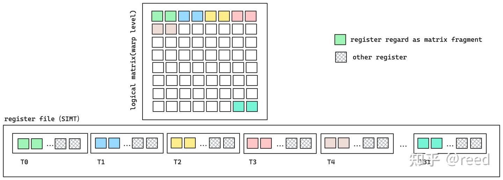
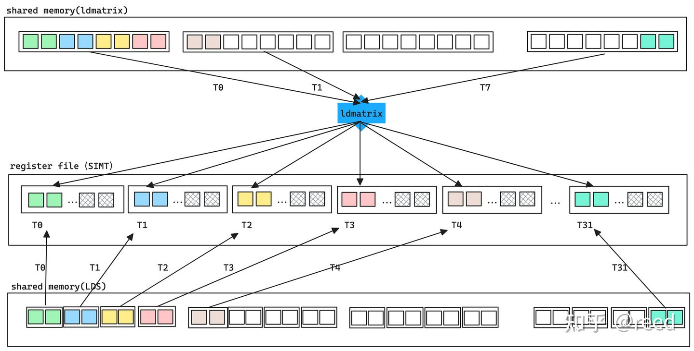
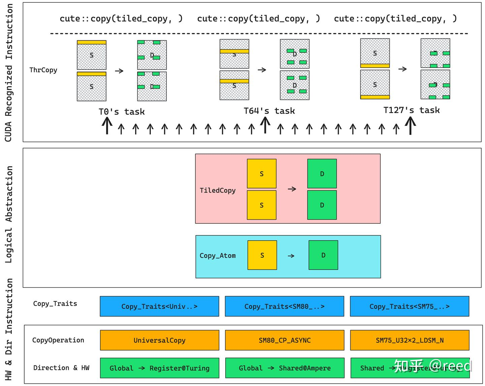

# Copy

* GPU的存储层次和数据搬运路径

1. 片外存储结构-全局内存（global memory）
2. 片上SM（stream multi-processor）内的shared memory 和 L1 data cache，以及寄存器堆（register file）
3. 以及在全局内存和SM之间的L2 Cache


1. 全局内存（图中标记为绿色global memory）容量最大，在数据中心级A100显卡中存储空间可以达到80GB，采用HBM2e技术实现，最高带宽可达2TB/s
2. 再往内层为L2 Cache，在A100-80GB上为80MB，带宽可达20TB/s
3. 再向内层为片上(on-chip)存储shared memory 和L1 data cache，shared memory 和 L1 data cache 共享192KB的空间，可以配置shared memory 和L1的大小，最大可将shared memory配置为164KB
4. Tensor Core、CUDA Core、Register File（一个线程最多使用255个32bit的寄存器）

## 高效的ldmatrix指令

如果我们认真研究Tensor Core的汇编指令我们不难发现，参与计算warp内的线程只持有矩阵的部分数据，这些数据保存在线程的私有寄存器中（SIMT架构中，可以认为寄存器为线程所私有），warp内的所有线程的寄存器共同组成完整的矩阵计算数据。


就数据从共享内存到寄存器的加载方面而言，可以通过SIMT意义下的LDS（load shared）来完成，为了更极致的性能NVidia从Turing架构开始提供了专门针对这种场景的加载指令ldmatrix

*  SIMT形式加载矩阵数据和ldmatrix协作式加载矩阵的对比
ldmatrix协作式加载可以通过线程提供共享内存的地址（提供16Byte数据）完成数据的加载然后将数据分配到warp中各个线程的寄存器中，实现了跨越SIMT寄存器边界的写出。由于是单线程提供16Byte的数据地址，warp内所有线程可以提供16Byte x 32 = 512Byte的数据到寄存器的加载，单指令实现16x16 float16矩阵的加载，减少指令数提高调度效率，同时其可以在写出时合并矩阵转置能力

而如果是SIMT形式的加载，则只能使用更窄的数据位宽，这也就需要更多的指令完成等量数据的读写


## cute Copy抽象及其相互关系

CopyOperation、Copy_Traits、Copy_Atom、TiledCopy、ThrCopy和拷贝函数cute::copy

* CopyOperation提供了指令级的数据搬运的封装，NVidia在不同的硬件架构、不同的存储层次之间数据搬运提供了不同的指令，如前文提到的ldmatrix和LDS等，还有针对Ampere架构的cp.async等，我们在使用时只需要根据我们的硬件支持的指令情况和需要搬运的内存层次来选择已经提供的Operation即可;

* Copy_Traits和MMA_Traits类似，提供了CopyOperation类型没有提供，但是其使用者Copy_Atom却需要的起到桥梁作用的信息；

* Copy_Atom提供了指令级别不可分割的数据搬运的拷贝能力；
* TiledCopy是对Copy_Atom的能力的封装通过重复拷贝执行单元的个数（增加执行线程）或者做多次的拷贝实现对原子能力的重复；
* TildCopy提供的是逻辑上的拷贝的概念，在具体的kernel执行之时，为了复合CUDA的编程范式，需要写成线程级别的指令，ThrCopy可以实现将大块的数据根据TiledCopy所描述的划分规则，通过提供当前线程的线程号threadIdx.x对大块的Tensor进行划分，得到当前线程为了完成D = S 拷贝所需要该线程做的任务；
* cute::copy在ThrCopy提供了当前线程的任务之后，便可以通过copy函数触发具体的数据搬运指令。



## CopyOperation

一般通过PTX汇编指令（或CUDA实现）来完成，实现指令集的拷贝能力抽象，其定义了源数据类型和目标数据类型以及个数，同时提供copy函数供框架层调用

## Copy_Traits
```
struct Copy_Traits<SM75_U32x1_LDSM_N> {
  // Logical thread id to thread idx (warp)
  using ThrID = Layout<_32>;

  // Map from (src-thr,src-val) to bit
  using SrcLayout = Layout<Shape <Shape <  _8,_4>,_128>,
                           Stride<Stride<_128,_0>,  _1>>;
  // Map from (dst-thr,dst-val) to bit
  using DstLayout = Layout<Shape <_32,_32>,
                           Stride<_32, _1>>;

  // Reference map from (thr,val) to bit
  using RefLayout = DstLayout;
};
```
traits补充了CopyOperation的信息，如其提供了执行operation所需要的线程数，源数据和目标数据的Layout排布情况，其描述了线程和数据的存放关系，即通过线程号和寄存器号可以得到数据的逻辑位置，同时提供RefLayout供线程级的数据拆分时实现retile能力


## Copy_Atom

Atom将Operation和Traits进行封装和抽象，定义了内部数据类型，供形成TiledCopy和后续的ThrCopy分解任务时提取信息，如其继承来自Traits的线程情况和数据Layout情况，提供call方法实现对底层指令的调用入口，
```
struct Copy_Atom<Copy_Traits<Args...>, T>
  : Copy_Traits<Args...>
{
  using Traits = Copy_Traits<Args...>;

  // Bit and Thr layouts from the Copy_Traits
  using ThrID        = typename Traits::ThrID;
  using BitLayoutSrc = typename Traits::SrcLayout;
  using BitLayoutDst = typename Traits::DstLayout;
  using BitLayoutRef = typename Traits::RefLayout;

  using ValType = T;

  void call(Tensor<TS,SLayout> const& src, Tensor<TD,DLayout>& dst);
};
```

## TiledCopy

tiled抽象通过对Atom能力进行重复得到更大的块的拷贝能力，对Atom的重复可以通过提供线程-存储的Layout来提供，也可以直接通过提供Atom能力和MMA中的tiled_mma实现，如make_tiled_copy_A/B/C，因为MMA已经提供了计算D = AxB + C时所需要的数据划分能力，当然这些函数时针对寄存器表达能力的，具体的模版参数和形参如下。除了描述对Atom的重复方式外，TiledCopy提供的核心函数时get_slice和get_thread_slice,其可以实现将逻辑Tensor的拷贝能力根据线程的id得到每一个线程的Layout描述的拷贝任务，所以以上两个函数的返回对象为ThrCopy
```
template <class Copy_Atom,
          class LayoutCopy_TV,  // (tid,vid) -> coord   [Need not be 2D...]
          class ShapeTile_MN>   // coord space
struct TiledCopy : Copy_Atom {
  ThrCopy get_slice(ThrIdx const& thr_idx)；
  ThrCopy get_thread_slice(ThrIdx const& thr_idx));
};

CUTE_HOST_DEVICE
auto make_tiled_copy_A(Copy_Atom<Args...> const& copy_atom,
                  TiledMMA           const& tiled_mma)
```

## ThrCopy
thread copy是线程级别的拷贝的抽象，其通过TiledCopy调用get_slice方法而得到，其核心函数为partition_S/D和retile_S/D,其中S和D分别表示source和destination，partition表示对一个大的逻辑Tensor进行划分得到当前线程的拷贝所需要的源Tensor和目标Tensor， 而retile系列的函数表示其输入的数据已经是当前的线程的私有的数据了，但是其可能不满足拷贝所要求的形状，需要将其变换到拷贝所支持的形状，形式如下代码：

```
template <class TiledCopy, class ThrIdx>
struct ThrCopy {
 auto partition_S(Tensor&& stensor);
 auto partition_D(Tensor&& dtensor);
 auto retile_S(Tensor&& stensor);
 auto retile_D(Tensor&& stensor);
};
```

## cute::copy

copy函数是拷贝的实际执行函数，调用该函数会触发线程级别的拷贝的发生，完成线程指令的执行，实现src到dst到数据拷贝指令，实现逻辑上的D = S。我们用块状逻辑对数据进行拷贝的时候可能遇到边界处理的情况，这时可以通过copy_if实现对某些数据拷贝的mask，从额避免非法的数据访问，其函数原型如下，


