# Swizzle

cute通过提供swizzle抽象简化了逻辑空间和多bank存储空间的映射的复杂度。

## 局部性原理和Shared Memory
* 空间局部性和时间局部性
* Shared Memory
为了保障Shared Memory存储结构在多线程并发读写下的效率（更低的Latency和更高的Throughput），其硬件被实现为多bank的模式，每个bank都是可以独立寻址的存储空间，bank之间可以并行的读写数据，相互之间不会影响

在NVidia的架构中，shared memory包含32个bank，bank中可寻址的基本单元为4byte

* 每个bank为黑框所包含的单元，用户看到的地址空间为箭头所示的方向，即相邻的4byte占用不同的bank
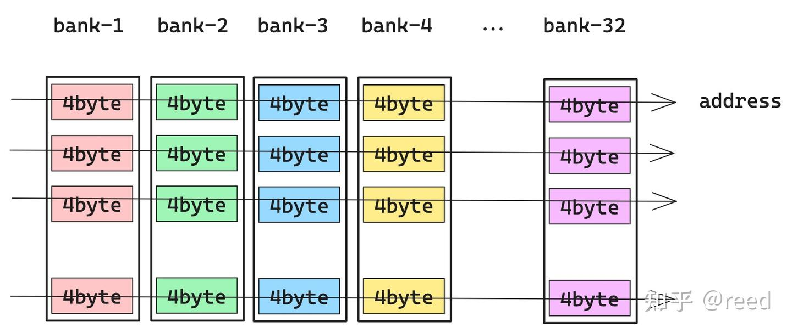

* 当32个线程同时访问32个不同的bank时，各个bank是并行执行的，其效率是最高的，即32个线程并发的访问32个bank中不同颜色的单元，是可以并行的，值得注意的是其中的线程编号（如图2中的T0所示）和bank中的行位置并没有连续性要求

* 如果某两个线程T0、T2要同时访问相同bank-2的不同地址，则这两次访问会被排队执行，即先访问该bank的一个地址，然后再访问第二个地址，这样两次访问在发射任务维度上（产生访问请求指令）时间维度上是并行的，但是在真正bank读写数据在时间维度上是串行的。这就是所谓的bank conflict。由于一个bank上有两次冲突，这种情况称为二路冲突（two-way conflict）。

为了减少指令数，我们在进行kernel优化时会采用向量化的读写指令（也叫大字长读写），如以128bit的形式读写共享内存，此时线程需要访问的单位数据量为16byte，32个线程需要访问的数据量为16byte x 32 = 512byte。完整的512byte需要4个phase才能完成访问，第一phase，T0-T7无bank conflict的访问所有bank，第二phase，T8-T15无bank conflict的访问所有bank，第三phase，T16-T23无bank conflict的访问所有bank，第四phase，T24-T31无bank conflict的访问所有的bank。这种情况也可以看作是：shared memory基本单元为16byte，总bank数为8，冲突与否的分析不在是32线程，而变成4个phase中的不同线程。如果采用64bit的访问形式，则相应的基本单元可以看作是8byte，总bank数目为16，冲突与否的条件变成两个phase内的线程是否冲突。整体上shared memory空间可以看作二维存储空间，其中列方向表示bank情况，行方向表示自由定义的大小。

## 共享内存读取（ldmatrix指令）

## Shared Memory写入

## Swizzle抽象

描述逻辑空间我们可以使用Layout（本质是函数），而为了避免bank 冲突，cute中定义了swizzle抽象，swizzle的本质也是函数，swizzle作用在layout上，即函数作用在函数上，复合函数复合的定义

Layout的作用是给定坐标返回offset，而swizzle的作用则是给定offset返回bank conflict free的offset

Swizzle定义了三个参数: B、M、S。它们共同表达描述一维坐标向二维空间映射的三个层次。其中一维坐标中连续的2^M个元素构成二维空间中最基本的元素，2^S表示新的二维空间中有多少列，2^B表示新的二维空间中有多少行。

## Thread Block Swizzle

cute（cutlass）中还有另一种swizzle，为thread block swizzle。在以C为中心的任务划分模式中，如果没有Thread Block Swizzle，则任务块会按照线性的行优先或者列优先的顺序分配给所有的执行单元（如图9中SM0-3，假设硬件只有4个SM），进行Thread Block Swizzle后，可以形成如图9右侧所示的任务划分关系，在某些场景下，其可以提升L2 Cache的命中率，数学上表现为在相同的元素能覆盖更大的面积，同时这部分面积(A、B)能够很好的被L2缓存住，具体的可以参考cutlass中的thread block swizzle实现

---

## 

一个warp(32个线程)的访存尽量要避免访问同一个bank中的数据，否则就要串行分多次来进行访问
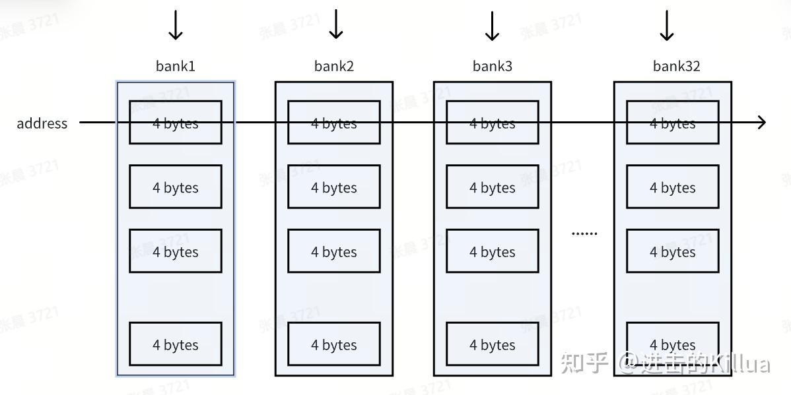
经常使用的GEMM操作在逻辑上是通过二维矩阵表示的
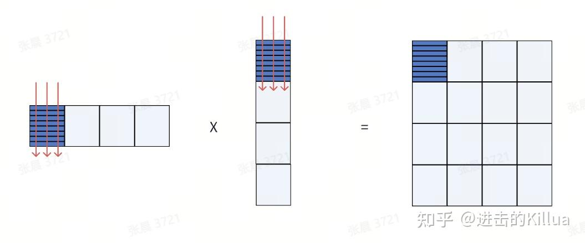

如果逻辑layout直接存储映射到物理结构上，访问一个子矩阵就会出现大量的bank conflict，导致性能急剧下降。比如图中矩阵，warp内所有线程对红线上元素的访问都会产生bank conflict。

cute Swizzle登场了，它就是为了解决逻辑结构上的需要和物理存储结构设计不一致的问题，有了它就不需要去关心物理结构设计了，只需要关注在逻辑上的矩阵layout，Swizzle会帮你去尽量解决底层bank conflict的问题。

## cute Swizzle本质
cute Swizzle本质就是一种映射，将二维逻辑结构映射到二维物理结构上，屏蔽掉底层结构的物理特性。

## cute Swizzle抽象
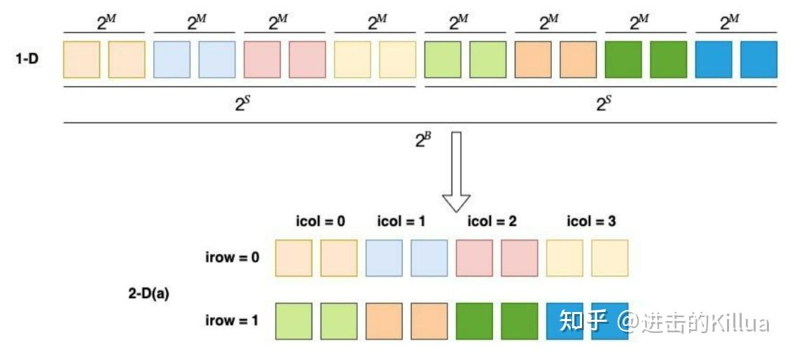
得到上图结果后还需要对每个单元进行异或重排操作，目的是为了把数据打散到不同bank中
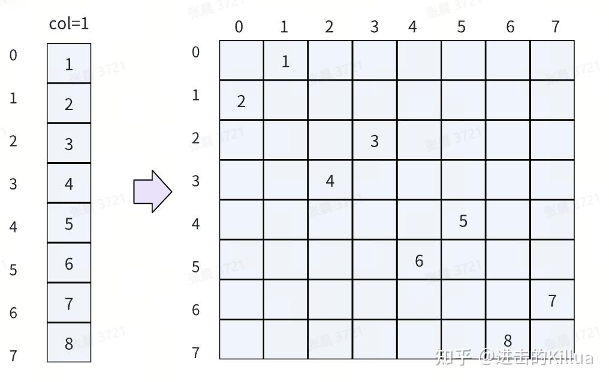

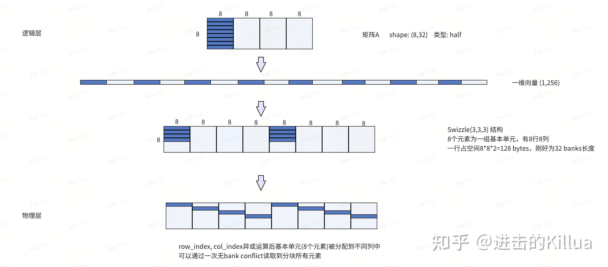

图中演示了矩阵A的第一个分块子矩阵(深色部分)逐步映射到共享内存的流程。
1. 首先将矩阵A进行一维向量化，就是拍平，得到每个元素对应的线性offset，其实就是cute layout的作用。
2. 定义Swizzle为Swizzle<3, 3, 3>作用到该线性空间上，即把这个向量按顺序依次平铺到Swizzle空间上。Swizzle<3, 3, 3>其实是一个8x8x8的表示（8个元素为一组基本单位，有8行8列）。
3. 进行行号和列号的异或运算得到新的列号再移动过去，得到最终的物理层表示。

---
# cutlass swizzle机制解析（一）

* swizzle机制主要起到两种作用：
  * Thread Block Swizzle：利用局部性原理，重映射block id改变其发射顺序，提高L2 cache命中率；
  * 保证GEMM pipeline在进行warp tile计算的时候，读写共享内存是无bank冲突的。这也是本文要讨论的主题。

shared memory是可编程的L1 memory，为了读写效率被组织成32路bank，每路（4字节，32bit），当一个warp中的不同线程访问同一个bank时，该访问过程将会被串行化，这将极大影响效率（有一种例外情况——广播）

swizzle机制主要通过物理layout到逻辑layout的重映射。

为了用一个warp完成这个过程，这里需要分成4个phase，其中T0-7为phase 0、T8-15为phase 1、T16-23为phase 2、T24-31为phase 4，每个phase读取一个8x8xfp16矩阵，每个phase（8个线程）中的每个线程负责读取一行的8xfp16=16bytes=128bit（vector）=4bank数据。注意，这一行的4bank数据必须连续，每个线程之间的4bank数据则不要求连续，满足对齐要求即可。因此，这里对bank冲突的讨论将从一个warp变成一个phase（8个线程），只需要保证这8个线程读取的时候不会发生bank冲突即可。
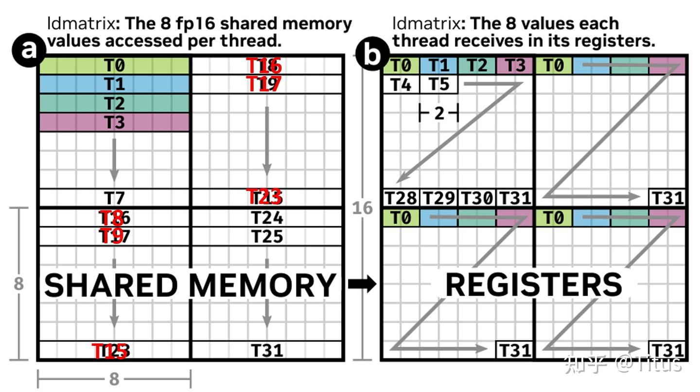

* 对于矩阵A，ISA中每个线程实际寄存器得到的数据如图所示：

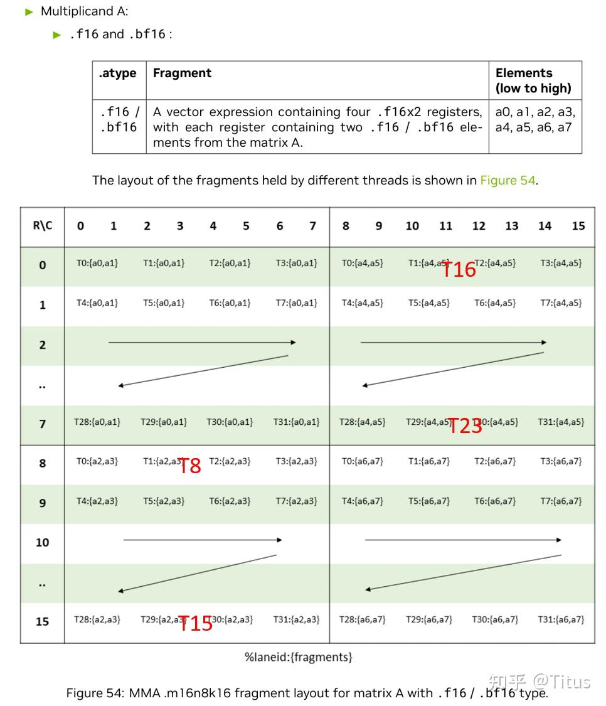

同样对于矩阵B，ldmatrix负责读取2个8x8xfp16矩阵，注意B为col-major，这里只需要2个phase完成这一过程，即T0-7为phase 0、T8-15为phase 1，同样，每个phase中的每个线程负责读取列长度为1vec=8xfp16=32bytes=4bank的数据，这4bank数据必须连续，线程间的load地址满足对齐要求，不要求连续

* 只要传给ldmatrix每个线程的地址不合理，就有可能发生bank冲突

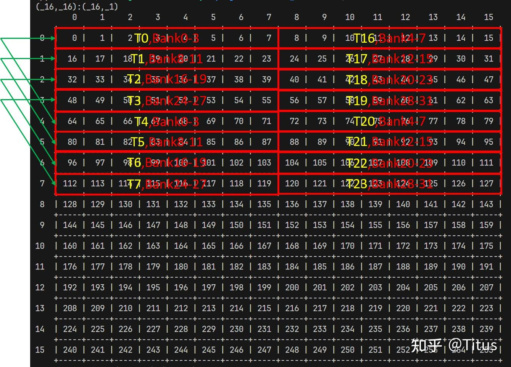

* 这时候需要引入Swizzle机制了。假设Swizzle<3,3,3>对上述16x16xfp16layout进行重排
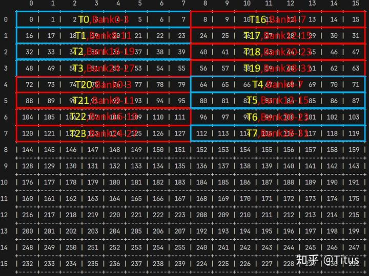

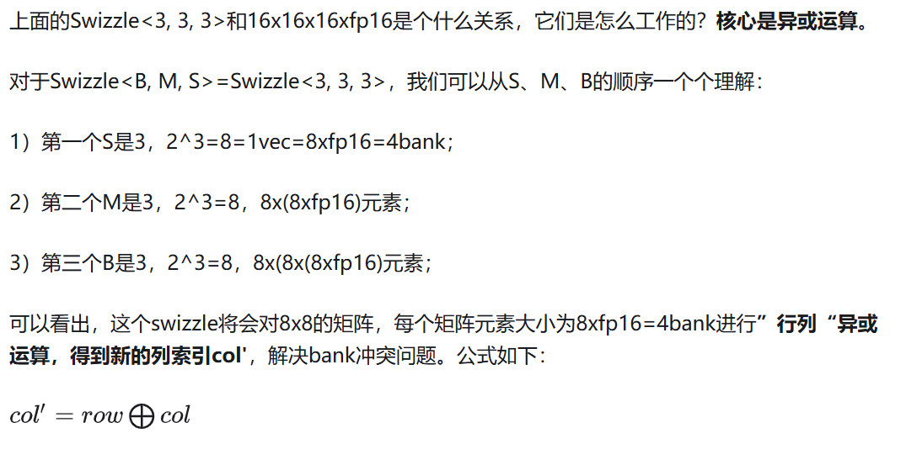

# cutlass swizzle机制解析（二）
cutlass将GEMM进行了三级tile——thread block tile、warp tile和thread tile（CUDA core/TensorCore），背后的核心思想之一就是数据复用，提高访存效率，解决访存瓶颈。

在GEMM pipeline中，数据搬运流程为：Global memory -> (L2) -> L1/shared memory ->register files -> shared memory -> (L2) -> Global memory，我们往往忽略了一个比较重要的优化点——L2 cache

问题：这个固然有GPU硬件限制（不可编程），另一方面，在PTX/SASS层面进行访存指令调优，使用更宽指令收益显然比调节cache policy/hint等指令缓存行为更有性价比以及可操作性。

* Thread block swizzle机制就是一个从这个层面出发，具体操作是：将CTA索引（blockIdx）与 block tiles进行逻辑重映射，以提高L2 cache命中率，改善局部性。

GPU以一个wave（最大并行运行的CTAs）执行这些blocks的过程中，尽可能提升这些blocks的数据复用，进而一定程度上减少访存开销。
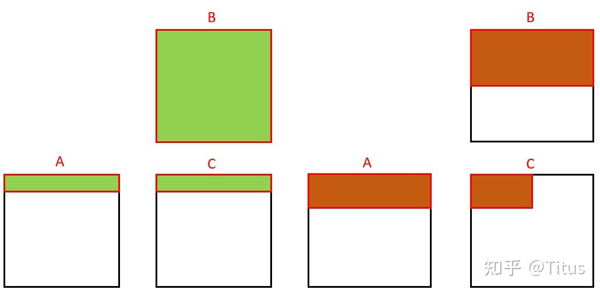

显然，都会认为右边方案更优一些，左边的方案需要访问完整的B，当B非常大时，B更难被L2 cache住，而右边仅需要部分的B，更容易被L2 cache住，而且更符合访存局部性一些。

## 引入swizzle

cutlass在GEMM kernel层面是怎么将各个tile与CTA进行映射的？假设将GEMM将C分成8x8的tile网格（grid），则初始阶段各个tile与CTA之间的索引映射关系如下表所示：
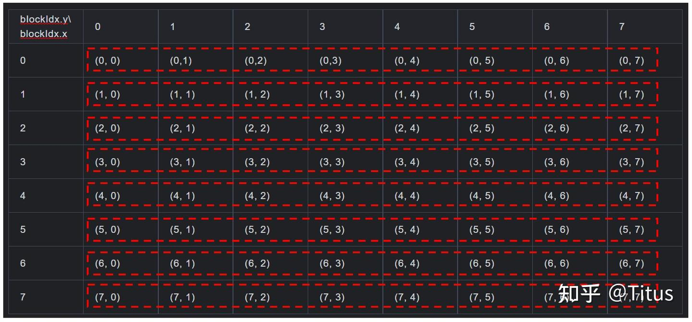

