# cute 之 简单GEMM实现

列优先称为Normal（简写为N），行优先则称为Transpose（简写为T）

BLAS规定了不同的简写，如单精度浮点为s（缩写自single precision）, 双精度浮点为d （缩写自double precision），单精度复数为c （缩写自complex），双精度浮点复数记为z。
所以在附加上数据类型（如单精度浮点）之后函数名字就由gemm变为了sgemm（single precision general matrix multiplation）
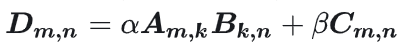

## NVidia cuBLAS类库
* NVidia提供的BLAS类的库对比
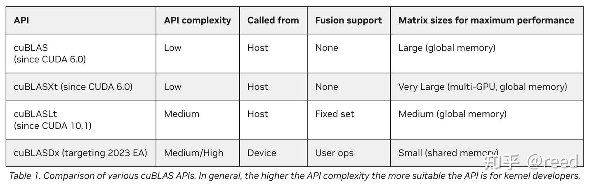

## Tensor表示
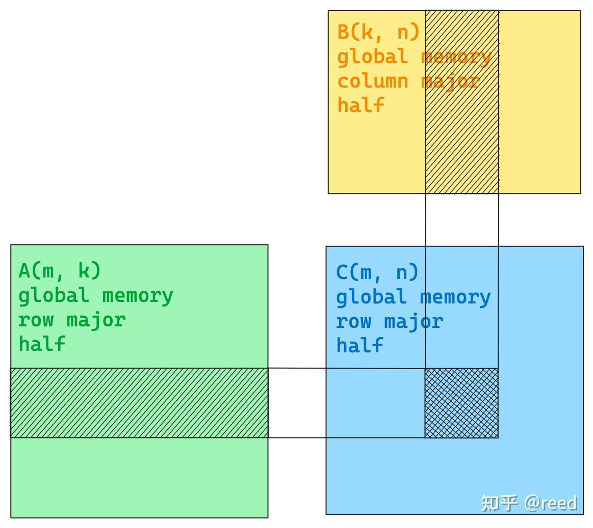
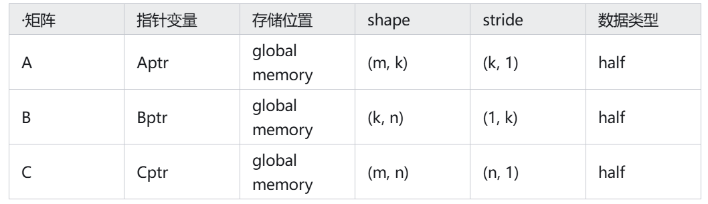
```
template <typename T>
__global__ void gemm_simple(T *Cptr, const T *Aptr, const T *Bptr, int m, int n, int k) {
  Tensor A = make_tensor(make_gmem_ptr(Aptr), make_shape(m, k), make_stride(k, Int<1>{}));
  Tensor B = make_tensor(make_gmem_ptr(Bptr), make_shape(n, k), make_stride(k, Int<1>{}));
  Tensor C = make_tensor(make_gmem_ptr(Cptr), make_shape(m, n), make_stride(n, Int<1>{})); 
}
```

## 以C矩阵为中心的任务划分策略
### sliced-k

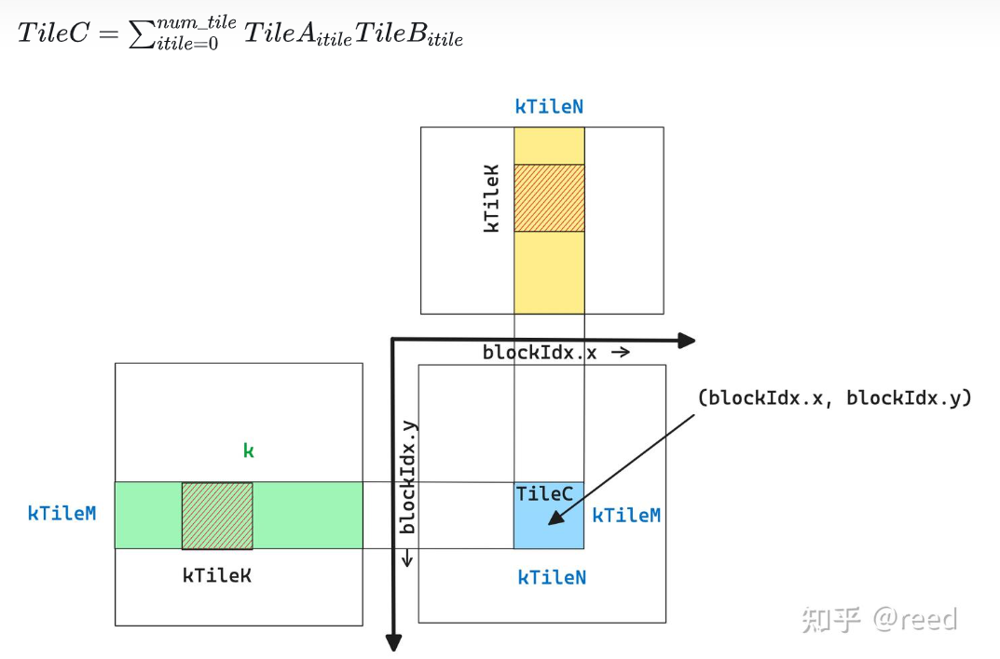
这种沿着k轴移动的策略称sliced-k方法。
这样我们使用一个block（坐标如图blockIdx.x, blockIdx.y）便可以完成C矩阵中一个小块的完整的计算
由此我们可以计算出完成整个C矩阵所需要的gird维度：grid.x = N / kTileN, grid.y = M / kTileM 
```
template <typename T, int kTileM, int kTileN, int kTileK>
__global__ void gemm_simple(T *Cptr, const T *Aptr, const T *Bptr, int m, int n, int k) {
  Tensor A = make_tensor(make_gmem_ptr(Aptr), make_shape(m, k), make_stride(k, Int<1>{}));
  Tensor B = make_tensor(make_gmem_ptr(Bptr), make_shape(n, k), make_stride(k, Int<1>{}));
  Tensor C = make_tensor(make_gmem_ptr(Cptr), make_shape(m, n), make_stride(n, Int<1>{}));

  int ix = blockIdx.x;
  int iy = blockIdx.y;

  Tensor gA = local_tile(A, make_tile(Int<kTileM>{}, Int<kTileK>{}), make_coord(iy, _));
  Tensor gB = local_tile(B, make_tile(Int<kTileN>{}, Int<kTileK>{}), make_coord(ix, _));
  Tensor gC = local_tile(C, make_tile(Int<kTileM>{}, Int<kTileN>{}), make_coord(iy, ix));
}

int main() {
  ...
  dim3 grid(n / kTileN, m / kTileM);
  ...
}
```
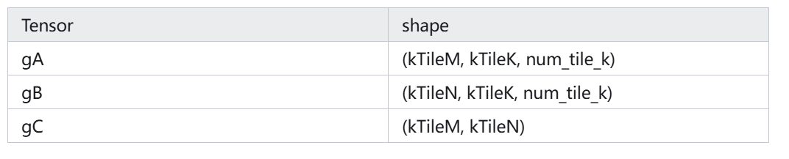

* 问题
先选定TileC，然后沿着k轴移动小块进行累加求和的策略为sliced-k，它对于m、n维度较大的场景（m n分块所需要的block数目足以填充所有的SM）比较有效。

对于k比较大，而m、n比较小的场景，由于m、n较小而我们根据C来划分thread block，这时需要的thread block数目比较小，当这个数目无法填充所有的SM时，则存在很多SM无任务，而有任务的SM需却又需要循环多次的问题

这时候可以考虑将k轴拆分成多段，每一段都计算一个TileC结果，最后再通过额外的累加过程将多段的结果进行求和，这种模式的任务划分方法成为split-k方法

## split-k
把k拆分成两段，由不同的计算单元来完成不同段段段计算，如此则得到多份C，最后将多个C进行累加求和得到最终结果
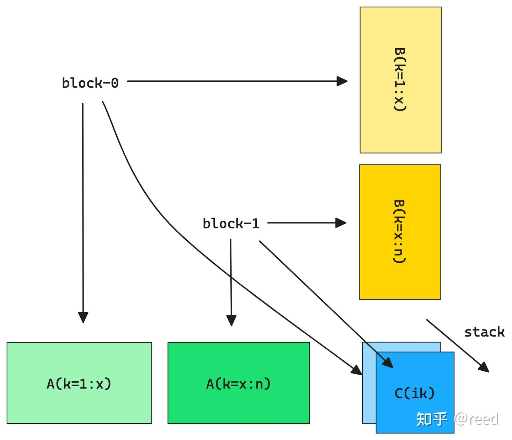


## stream-k
stream-k方法作者们指出sliced-k或者split-k方法都是静态的划分任务，在划分的任务数目和SM执行单元不能整除的时候，总会在存在某轮（wave）计算中存在SM空闲的问题。

stream-k则是抛弃以任务为中心的划分逻辑，而是变成了以计算资源为核心的分配任务方式，使得SM的任务量基本相当

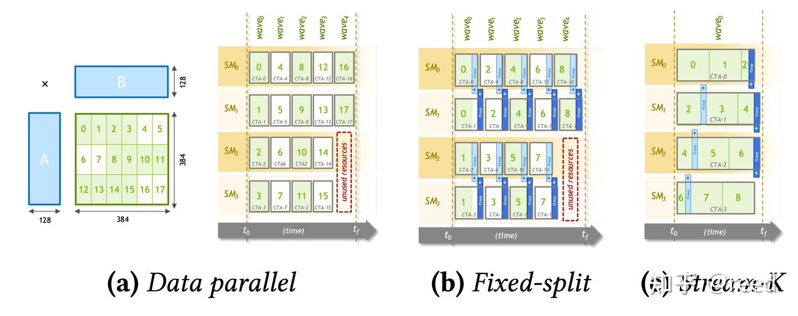

其展示了假设只有4个SM的情况下，不同任务划分逻辑的差异，其中stream-k对计算资源的利用效果最好，具体可以参考发表在PPoPP‘23上的poster。

现阶段cuBLAS中的kernel依然多为sliced-k和split-k实现。


## TiledMMA：主机端选择指令，设备端将分块划分到线程
通过ThrMMA的partition_A/B/C方法实现对TileA、TileB、TileC、的划分，通过partition_fragment_A/B/C便可以构造矩阵乘所需要的寄存器表示
```
template <typename T, int kTileM, int kTileN, int kTileK, typename TiledMMA>
__global__ void gemm_simple(T *Cptr, const T *Aptr, const T *Bptr, int m, int n, int k) {
  Tensor A = make_tensor(make_gmem_ptr(Aptr), make_shape(m, k), make_stride(k, Int<1>{}));
  Tensor B = make_tensor(make_gmem_ptr(Bptr), make_shape(n, k), make_stride(k, Int<1>{}));
  Tensor C = make_tensor(make_gmem_ptr(Cptr), make_shape(m, n), make_stride(n, Int<1>{}));

  int ix = blockIdx.x;
  int iy = blockIdx.y;

  Tensor gA = local_tile(A, make_tile(Int<kTileM>{}, Int<kTileK>{}), make_coord(iy, _));
  Tensor gB = local_tile(B, make_tile(Int<kTileN>{}, Int<kTileK>{}), make_coord(ix, _));
  Tensor gC = local_tile(C, make_tile(Int<kTileM>{}, Int<kTileN>{}), make_coord(iy, ix));
  //  gA(kTileM, kTileK, num_tile_k)
  //  gB(kTileN, kTileK, num_tile_k)
  //  gC(kTileM, kTileN) 

  TiledMMA tiled_mma;
  auto thr_mma = tiled_mma.get_slice(threadIdx.x);
  auto tAgA = thr_mma.partition_A(gA);  // (MMA, MMA_M, MMA_K, num_tile_k)
  auto tBgB = thr_mma.partition_B(gB);  // (MMA, MMA_N, MMA_K, num_tile_k)
  auto tCgC = thr_mma.partition_C(gC);  // (MMA, MMA_M, MMA_N)

  auto tArA = thr_mma.partition_fragment_A(gA(_, _, 0));  // (MMA, MMA_M, MMA_K)
  auto tBrB = thr_mma.partition_fragment_B(gB(_, _, 0));  // (MMA, MMA_N, MMA_K)
  auto tCrC = thr_mma.partition_fragment_C(gC(_, _));     // (MMA, MMA_M, MMA_N)
 
  clear(tCrC); 
}

int main() {
  ...
  using mma_op = SM80_16x8x16_F16F16F16F16_TN;
  using mma_traits = MMA_Traits<mma_op>;
  using mma_atom = MMA_Atom<mma_traits>;

  auto MMA = decltype(make_tiled_mma(mma_atom{}, 
                      make_layout(Shape<_2, _2, _1>{}), 
                      make_layout(Shape<_1, _2, _1>{})));
  dim3 block(size(MMA{}));
  dim3 grid(n / kTileN, m / kTileM);
  ...
}
```
## Loop Over K
调用cute::gemm即可以完成 C[kTileM, kTileN] =A[kTileM, kTilleK] B[kTileN, kTileK]利用Tensor Core进行矩阵乘的能力

```
template <typename T, int kTileM, int kTileN, int kTileK, typename TiledMMA>
__global__ void gemm_simple(T *Cptr, const T *Aptr, const T *Bptr, int m, int n, int k) {
  Tensor A = make_tensor(make_gmem_ptr(Aptr), make_shape(m, k), make_stride(k, Int<1>{}));
  Tensor B = make_tensor(make_gmem_ptr(Bptr), make_shape(n, k), make_stride(k, Int<1>{}));
  Tensor C = make_tensor(make_gmem_ptr(Cptr), make_shape(m, n), make_stride(n, Int<1>{}));

  int ix = blockIdx.x;
  int iy = blockIdx.y;

  Tensor gA = local_tile(A, make_tile(Int<kTileM>{}, Int<kTileK>{}), make_coord(iy, _));
  Tensor gB = local_tile(B, make_tile(Int<kTileN>{}, Int<kTileK>{}), make_coord(ix, _));
  Tensor gC = local_tile(C, make_tile(Int<kTileM>{}, Int<kTileN>{}), make_coord(iy, ix));
  //  gA(kTileM, kTileK, num_tile_k)
  //  gB(kTileN, kTileK, num_tile_k)
  //  gC(kTileM, kTileN) 

  TiledMMA tiled_mma;
  auto thr_mma = tiled_mma.get_slice(threadIdx.x);
  auto tAgA = thr_mma.partition_A(gA);  // (MMA, MMA_M, MMA_K, num_tile_k)
  auto tBgB = thr_mma.partition_B(gB);  // (MMA, MMA_N, MMA_K, num_tile_k)
  auto tCgC = thr_mma.partition_C(gC);  // (MMA, MMA_M, MMA_N)

  auto tArA = thr_mma.partition_fragment_A(gA(_, _, 0));  // (MMA, MMA_M, MMA_K)
  auto tBrB = thr_mma.partition_fragment_B(gB(_, _, 0));  // (MMA, MMA_N, MMA_K)
  auto tCrC = thr_mma.partition_fragment_C(gC(_, _));     // (MMA, MMA_M, MMA_N)
 
  clear(tCrC);
  
  int num_tile_k = size<2>(gA);
#pragma unroll 1
  for(int itile = 0; itile < num_tile_k; ++itle) {
    cute::copy(tAgA(_, _, _, itile), tArA);
    cute::copy(tBgB(_, _, _, itile), tBrB);

    cute::gemm(tiled_mma, tCrC, tArA, tBrB, tCrC);
  }

  cute::copy(tCrC, tCgC); 
}

int main() {
  ...
  using mma_op = SM80_16x8x16_F16F16F16F16_TN;
  using mma_traits = MMA_Traits<mma_op>;
  using mma_atom = MMA_Atom<mma_traits>;

  auto MMA = decltype(make_tiled_mma(mma_atom{}, 
                      make_layout(Shape<_2, _2, _1>{}), 
                      make_layout(Shape<_1, _2, _1>{})));
  dim3 block(size(MMA{}));
  dim3 grid(n / kTileN, m / kTileM);
  gemm_simple<T, kTileM, kTileN, kTileK, MMA>(Cptr, Aptr, Bptr, m, n, k);
  ...
}
```
https://github.com/reed-lau/cute-gemm

# cute 之 高效GEMM实现

## 计算高效
针对输入为半精度类型（half precision），Accumulator为半精度类型的计算任务，Ampere架构提供了Tensor Core上的如下计算指令
```
mma.sync.aligned.m16n8k8.row.col.f16.f16.f16.f16
mma.sync.aligned.m16n8k16.row.col.f16.f16.f16.f16
```
cute将这两条指令抽象为MMA_Operation
```
SM80_16x8x8_F16F16F16F16_TN
SM80_16x8x16_F16F16F16F16_TN
```

可以通过MMA_Traits，如图1，在MMA_Operation的基础上补充上后续计算所需要的其它信息，如矩阵计算的形状、该指令所需要的协作线程（此处为32线程）、A、B矩阵的寄存器Layout分布情况。

有了MMA_Traits之后，我们便可以将其进一步封装为MMA_Atom，其利用Traits提供的信息，提供数据划分所需要的信息和Operation的执行功能。
MMA_Atom描述了矩阵计算的原子能力（单条指令的计算能力，最小能力），我们通过增加更多的线程、每个线程做多次任务则可以将计算的规格增大，如此则有了TiledMMA，TiledMMA针对每一个线程则被分裂为ThrMMA，TiledMMA和ThrMMA利用MMA_Atom提供的信息，能够实现对矩阵块的划分。

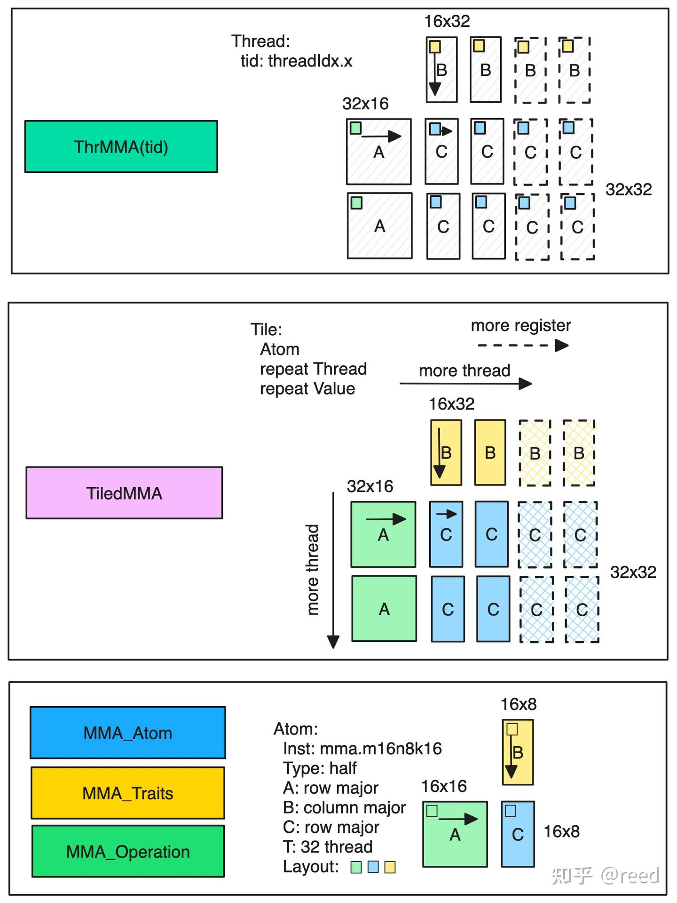

```
  using mma_op = SM80_16x8x16_F16F16F16F16_TN;
  using mma_traits = MMA_Traits<mma_op>;
  using mma_atom = MMA_Atom<mma_traits>;

  static constexpr int kMmaEURepeatM = 2;
  static constexpr int kMmaEURepeatN = 2;
  static constexpr int kMmaEURepeatK = 1;

  static constexpr int kMmaVRepeatM = 1;
  static constexpr int kMmaVRepeatN = 2;
  static constexpr int kMmaVRepeatK = 1;

  using MMA_EU_RepeatT = decltype(make_layout(make_shape(
      Int<kMmaEURepeatM>{}, Int<kMmaEURepeatN>{}, Int<kMmaEURepeatK>{})));
  using MMA_V_RepeatT = decltype(make_layout(make_shape(
      Int<kMmaVRepeatM>{}, Int<kMmaVRepeatN>{}, Int<kMmaVRepeatK>{})));

  using MMA =
      decltype(make_tiled_mma(mma_atom{}, MMA_EU_RepeatT{}, MMA_V_RepeatT{}));
```

其中前三行选择了MMA指令形成了Atom能力，然后定义了对该Atom能力的重复方法（包括线程重复和寄存器重复），它们分别形成各自重复的Layout，然后利用make_tile_mma接口形成更大块的矩阵乘法描述。设备端的代码如下：


```
  TiledMMA tiled_mma;
  auto thr_mma = tiled_mma.get_slice(idx);
  auto tCrA = thr_mma.partition_fragment_A(gA(_, _, 0));  // (MMA, MMA_M, MMA_K)
  auto tCrB = thr_mma.partition_fragment_B(gB(_, _, 0));  // (MMA, MMA_N, MMA_K)
  auto tCrD = thr_mma.partition_fragment_C(gD);           // (MMA, MMA_M, MMA_N)
```
将TileMMA提供线程号，则获得具体线程的数据划分能力，对给定的数据块进行划分，得到线程级的数据描述。

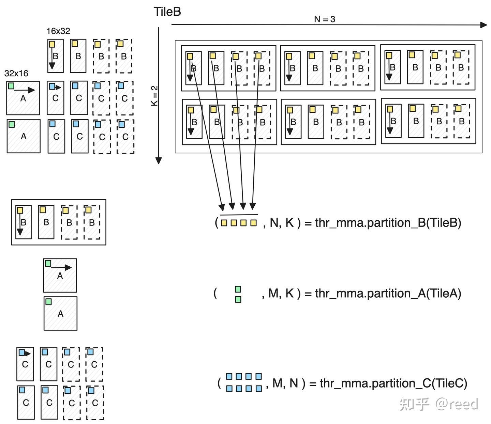

其展示了ThrMMA提供的partition_A/B/C和partition_fragment_A/B/C函数的计算逻辑，给定一个静态大小的Tensor TileB（被划分维度为Int<>编译时常量），则thr_mma可以对其进行划分，其中划分的逻辑为：以TileMMA中描述的矩阵大小对目标Tensor进行周期性平铺，对高亮的部分进行选取形成新的矩阵，其中第一个维度为TiledMMA中单个线程的数据描述，第二个维度和第三个维度为行方向和列方向需要重复的次数。如果TileB的维度比两维高，则高出的部分继承到N,K维度之后。类似地，A/C的划分采用同样的逻辑。

## 访存高效

整个GEMM计算体系中数据的在到达Tensor Core进行计算之前需要包含：全局内存到共享内存，共享内存到寄存器

在流水线章节我们介绍过全局内存到共享内存的异步拷贝方法，和共享内存到寄存器的ldmatrix指令。

在cute中，针对全局内存到共享内存，我们和选择MMA能力类似，选择cute已经定义好的抽象能力即可，此处我们选择SM80_CP_ASYNC_CACHEGLOBALCopy_Operation，该指令可以实现全局内存到共享内存到异步拷贝，同时CACHEGLOBAL指示了数据只在L2做Cache，对L1则做bypass。
```
  using g2s_copy_op = SM80_CP_ASYNC_CACHEGLOBAL<cute::uint128_t>;
  using g2s_copy_traits = Copy_Traits<g2s_copy_op>;
  using g2s_copy_atom = Copy_Atom<g2s_copy_traits, T>;

  using G2SCopyA =
      decltype(make_tiled_copy(g2s_copy_atom{},
                               make_layout(make_shape(Int<32>{}, Int<4>{}),
                                           make_stride(Int<4>{}, Int<1>{})),
                               make_layout(make_shape(Int<1>{}, Int<8>{}))));
  using G2SCopyB = G2SCopyA;
```
和MMA时的make_tiled_mma类似，Copy抽象提供了make_tile_copy能力，其通过制定线程和数据的重复方法将Atom能力扩展到块状能力。数据拷贝时可以区分AB矩阵的不同拷贝方法，我们此处选用同样的Copy能力。设备端代码如下

```
  G2SCopyA g2s_tiled_copy_a;
  auto g2s_thr_copy_a = g2s_tiled_copy_a.get_slice(idx);
  auto tAgA_copy = g2s_thr_copy_a.partition_S(gA);  // (CPY, CPY_M, CPY_K, k)
  auto tAsA_copy =
      g2s_thr_copy_a.partition_D(sA);  // (CPY, CPY_M, CPY_K, kStage)
```
和图1中的MMA层级类似，Copy时先将TileCopy通过指定线程号得到线程级的Copy能力抽象ThrCopy。也和图2中的MMA划分类似，ThrCopy抽象提供了partiton_S/D函数，其实现将大块的矩阵划分到线程维度上。经过partition_S/D划分的数据维度为(E, M, K)，E表示该线程要做的数据大小（包含分布），M、K表示由于给定的被划分的块需要在纵轴和横轴上需要重复的次数。如果被划分的Tile的维度大于2，则多出的维度附加到（，M，K）维度之后。

对于共享内存到寄存器的拷贝，cute提供了对ldmatrix指令的封装，主机端代码和设备端代码分别如下：
```
  // shared memory to register copy
  using s2r_copy_op = SM75_U32x4_LDSM_N;
  using s2r_copy_traits = Copy_Traits<s2r_copy_op>;
  using s2r_copy_atom = Copy_Atom<s2r_copy_traits, T>;

  using S2RCopyAtomA = s2r_copy_atom;
  using S2RCopyAtomB = s2r_copy_atom;
```
设备端代码：
```
  auto s2r_tiled_copy_a = make_tiled_copy_A(S2RCopyAtomA{}, tiled_mma);
  auto s2r_thr_copy_a = s2r_tiled_copy_a.get_slice(idx);
  auto tAsA = s2r_thr_copy_a.partition_S(sA);  // (CPY, CPY_M, CPY_K, kStage)
  auto tCrA_view = s2r_thr_copy_a.retile_D(tCrA);  // (CPY, CPY_M, CPY_K)
```

其中主机端选择ldmatrix指令的x4模式，形成Atom抽象，设备端通过make_tiled_copy_A函数借助tiled_mma抽象出共享内存到寄存的TileCopy

前面的全局内存到共享内存TileCopy不同的是，这里直接利用tiled_mma的信息形成块状拷贝，原因是TiledMMA包含了计算所需要的数据描述，所以对于以它作为目标的Copy而言，tiled_mma自然也是精准描述这部分数据的，所以就不需要用户额外制定Copy_Atom到TileCopy的信息，而是之间从MMA能力中获得，其一定程度上可以避免了独立设置的不一致性问题。


## 算法高效

其主要包含两个部分：1. 分块；2. 流水线。

我们主机端和设备端的代码如下：
```
  static constexpr int kTileM = kTileM_;
  static constexpr int kTileN = kTileN_;
  static constexpr int kTileK = kTileK_;
  static constexpr int kStage = kStage_;
```
设备端：
```
  // slice the tensor to small one which is used for current thread block.
  Tensor gA = local_tile(A, make_tile(Int<kTileM>{}, Int<kTileK>{}),
                         make_coord(iy, _));  // (kTileM, kTileK, k)
  Tensor gB = local_tile(B, make_tile(Int<kTileN>{}, Int<kTileK>{}),
                         make_coord(ix, _));  // (kTileN, kTileK, k)
  Tensor gD = local_tile(D, make_tile(Int<kTileM>{}, Int<kTileN>{}),
                         make_coord(iy, ix));  // (kTileM, kTileN)

  // shared memory
  auto sA = make_tensor(make_smem_ptr(Ashm),
                        SmemLayoutA{});  // (kTileM, kTileK, kStage)
  auto sB = make_tensor(make_smem_ptr(Bshm),
                        SmemLayoutB{});  // (kTileN, kTileK, kStage)
```
分别定义了分块的大小和设备端如何通过Tensor抽象和local_tile将矩阵进行分块。

流水线方面，为了做multi stage流水线，需要在共享内存分配时指定流水线级数，同时设备端需要做必要的数据加载和计算重叠方案。主机端代码如下
```
  static constexpr int kShmLoadSwizzleM = 3;
  static constexpr int kShmLoadSwizzleS = 3;
  static constexpr int kShmLoadSwizzleB = 3;

  using SmemLayoutAtom = decltype(composition(
      Swizzle<kShmLoadSwizzleB, kShmLoadSwizzleM, kShmLoadSwizzleS>{},
      make_layout(make_shape(Int<8>{}, Int<kTileK>{}),
                  make_stride(Int<kTileK>{}, Int<1>{}))));
  using SmemLayoutA = decltype(
      tile_to_shape(SmemLayoutAtom{},
                    make_shape(Int<kTileM>{}, Int<kTileK>{}, Int<kStage>{})));
  using SmemLayoutB = decltype(
      tile_to_shape(SmemLayoutAtom{},
                    make_shape(Int<kTileN>{}, Int<kTileK>{}, Int<kStage>{})));
```
其定义了共享内存的Layout，其中Swizzle用来避免bank conflict，其详细介绍可以参考前序文章cute之Siwzzle抽象，其中kStage表示流水线的级数。
核心设备端代码由两个for循环组成
```
  // loop over k: i. load tile, ii. mma
  int ntile = k / kTileK;
#pragma unroll 1
  for (int itile = 0; itile < ntile; ++itile) {
    int nk = size<2>(tCrA);

#pragma unroll
    for (int ik = 0; ik < nk; ++ik) {
      int ik_next = (ik + 1) % nk;

      if (ik == nk - 1) {
        cp_async_wait<kStage - 2>();
        __syncthreads();

        ismem_read = (ismem_read + 1) % kStage;
      }

      // shm -> reg s[itile][ik + 1] -> r[ik + 1]
      cute::copy(s2r_tiled_copy_a, tAsA(_, _, ik_next, ismem_read),
                 tCrA_view(_, _, ik_next));
      cute::copy(s2r_tiled_copy_b, tBsB(_, _, ik_next, ismem_read),
                 tCrB_view(_, _, ik_next));

      if (ik == 0) {
        if (itile_to_read < ntile) {
          cute::copy(g2s_tiled_copy_a, tAgA_copy(_, _, _, itile_to_read), tAsA_copy(_, _, _, ismem_write));
          cute::copy(g2s_tiled_copy_b, tBgB_copy(_, _, _, itile_to_read), tBsB_copy(_, _, _, ismem_write));

          ++itile_to_read;
          ismem_write = (ismem_write + 1) % kStage;
        }

        cp_async_fence();
      }

      cute::gemm(tiled_mma, tCrD, tCrA(_, _, ik), tCrB(_, _, ik), tCrD);
    }  // for ik
  }    // itile
```

外层循环对Tile做循环，内层循环对Tile内做k循环，同时在ik == 0 和 ik == nk -1的时候发射了后kStage-1的Tile的全局内层到共享内存的数据加载和针对即将读取的共享内存的数据同步。

## 尾阶段高效（Epilogue）

如果将寄存器数据直接写出，则在全局地址空间中会产生内存地址的不连续，这将导致存储时需要更多的内存事务，并且不能使用向量化存储指令（STG.128）。
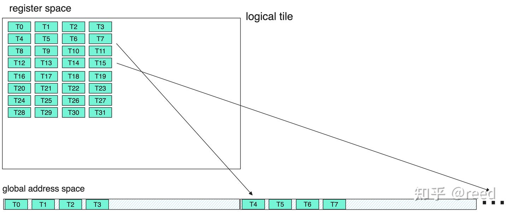
针对这个问题，cute中（实质为cutlass中），专门提供了Epilogue来通过共享内存作为中间媒介。先将寄存器数据存储到共享内存，然后再从共享内存中以更连续、更高位宽的形式存储到全局内存中去。PACT'20 Fireiron文章有对该问题的详细探讨，可以参考之。

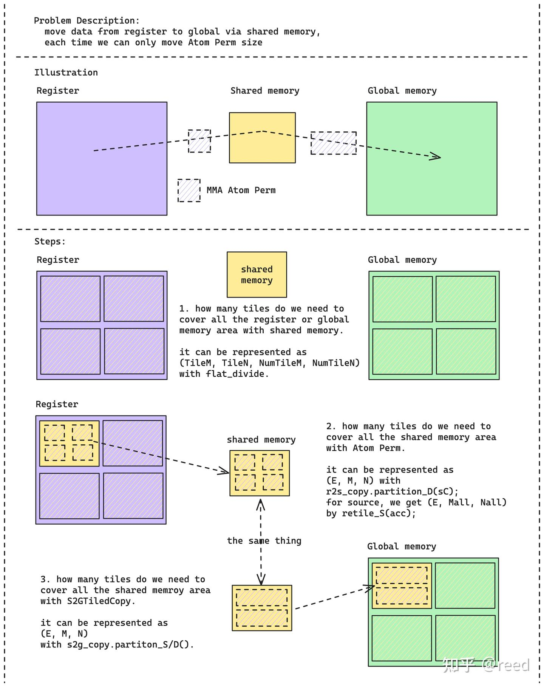

https://github.com/reed-lau/cute-gemm

