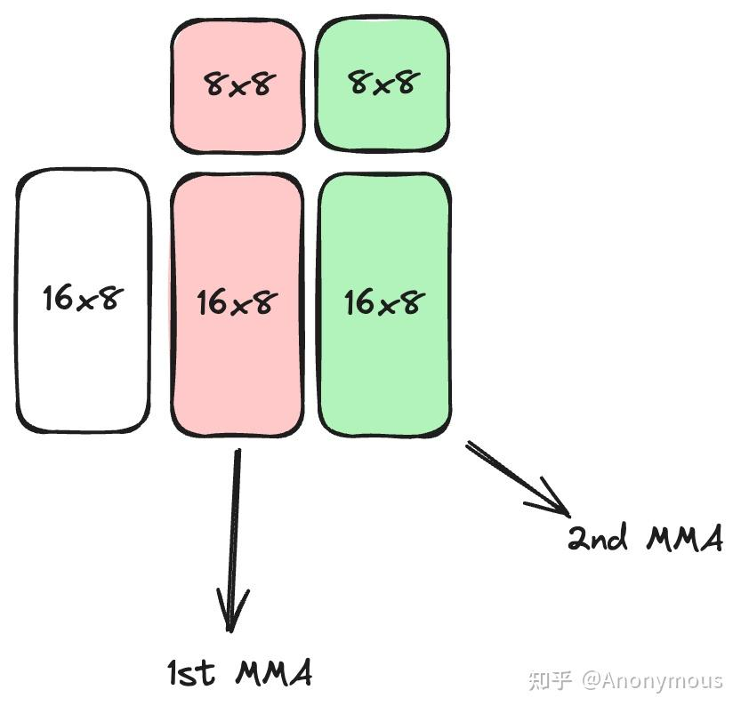

# ldmatrix的选择
如何选择合适ldmatrix指令进行Shared Memory到Registers的Copy
CUTLASS 3.5版本，GPU是Compute Capability 8.0的A100 GPU

## 基本原理

1. 在TiledMMA中，MMA_Atom的MNK大小和PermutationMNK中包含的ValLayoutMNK信息用于确定ldmatrix指令中的x1，x2，x4。
2. Shared Memory中的输入矩阵A/B的Layout决定是否transpose。

### TiledMMA

构造TiledMMA时，其实是通过两种方式对MMA_Atom进行扩展，一种是执行单元的扩展，另一种是通过重复计算的方式进行扩展。
早期的CUTLASS版本中，TiledMMA类模板的模板参数ValLayoutMNK表示通过重复计算的方式进行扩展
虽然CUTLASS 3.5已经取消了ValLayoutMNK模板参数，但实际上，是将ValLayoutMNK融合在PermutationMNK中，这并不影响我们对于原理的分析

假设我们选定SM80_16x8x8_F16F16F16F16_TN作为MMA_Operation，并且通过重复计算的方式在MNK的N维度上扩展至原来的2倍，即ValLayoutMNK为(1, 2, 1)，也就是说，此时每一个warp内部会完成MNK为16x16x8的矩阵计算。

在一个warp内部，完成16x16x8的矩阵计算需要两步：
1. 通过ldmatrix指令将输入矩阵A/B加载至warp内Thread的寄存器中。(第一步与ldmatrix有关)
2. 通过两次MMA_Atom操作完成16x16x8的矩阵计算，每次MMA_Atom计算16x8x8的矩阵。

ldmatrix指令能够一次性加载一个或多个8x8的子矩阵到寄存器中，加载的8x8子矩阵的个数由x1，x2，x4标识，分别代表加载1，2，4个8x8子矩阵。ldmatrix指令非常灵活，加载每一个8x8子矩阵时，仅需提供8个地址，ldmatrix指令认为，这8个地址代表了8x8子矩阵中8个行的起始地址，因此，ldmatrix并不要求这8个行在Shared Memory上连续存储，但每个行内部必须是连续存储的。

由于ldmatrix在加载地址上的灵活性，我们可以利用ldmatrix加载任意的由一个或多个8x8子矩阵构成的更大规模的矩阵分块。对于上面的例子，输入矩阵A和B的Shape分别为16x8和8x16，它们都包含两个8x8子矩阵，因此，对于A和B，我们都可以用一个x2的ldmatrix一次性将这个矩阵加载到寄存器中。make_tiled_copy_A/B函数会帮助我们根据TiledMMA输入矩阵的Layout信息和Copy_Atom自动计算各个8x8子矩阵对应的行地址。我们也可以用x1的ldmatrix分两次加载A或B，但注意，我们不能使用x4的ldmatrix指令，因为输入矩阵中8x8子矩阵的个数小于4个，如果我们尝试使用x4的ldmatrix指令，在编译期间就会报错：TiledCopy uses too few vals for selected CopyAtom.

### A/B Layout

ldmatrix指令认为，这8个地址代表了8x8子矩阵中8个行的起始地址，因此，ldmatrix并不要求这8个行在Shared Memory上连续存储，但每个行内部必须是连续存储的。

输入矩阵A/B在Shared Memory中可能会以Row-Major的形式存储，此时这个条件成立，但也有可能是以Column-Major的形式存储，此时这个条件就不再成立了

ldmatrix 指令提供了 trans 限定符，用于处理加载8x8子矩阵时的转置操作。具体来说，ldmatrix 指令在加载时会将提供的8个列的起始地址当作行地址进行加载。如果没有 trans 限定符，加载后的子矩阵在寄存器中的分布将是目标分布的转置形式。通过使用 trans 限定符，ldmatrix 指令会对加载的子矩阵进行转置操作，从而得到正确的子矩阵形式。

在CuTe中，make_tiled_copy_A/B函数会自动帮助我们计算列起始地址等信息，我们需要做仅仅是选择合适Copy_Operation，选择Copy_Operation时，需要遵循以下原则：如果输入矩阵在Shared Memory中是Row-Major的，则选择不带trans的ldmatrix指令（Copy_Operation名称的后缀为N），如果输入矩阵在Shared Memory中是Column-Major的，则选择带trans的ldmatrix指令（Copy_Operation名称的后缀为T）。

### Where is swizzle？
A/B矩阵在Shared Memory中的真实分布是在Row/Column-Major的基础上进一步进行swizzle得到的，但CuTe的Swizzle抽象可以很好的屏蔽这一层复杂的映射关系，让我们在处理Shared Memory to Registers Copy时只需关注A/B矩阵的逻辑空间排布（即Row/Column-Major）而不需要关注底层的物理排布，在reed大佬介绍Swizzle的文章中有很好解释，我也会在后续的文章中详细的介绍Swizzle抽象的相关理解。

### 举几个例子
选SM80_16x8x16_F16F16F16F16_TN，ValLayoutMNK为(1, 2, 1)，那么一个warp内处理的A/B矩阵均为16x16，16x16包含4个8x8子矩阵，因此选择x4的ldmatrix（x2和x1的ldmatrix也可以用，但指令的效率比较低，明明可以一条指令就完成的工作，我们不建议用多条指令完成，因为这样会对硬件资源造成浪费，对性能也会有影响）。如果A/B是Row-Major，则选SM75_U32x4_LDSM_N，若为Colum-Major，则选SM75_U16x8_LDSM_T。

选SM80_16x8x8_F16F16F16F16_TN，ValLayoutMNK为(1, 1, 1)，则B矩阵为8x8，此时，对于B矩阵，我们只能选择x1的ldmatrix。根据B的Layout，如果是Row-Major，则选SM75_U32x1_LDSM_N，如果是Column-Major，则选SM75_U16x2_LDSM_T。

https://github.com/HydraQYH/cutlass_cute_experiments/blob/master/s2r_copy.cu