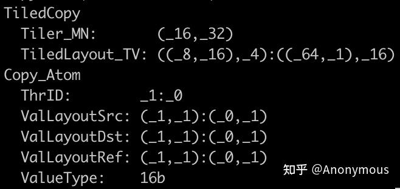
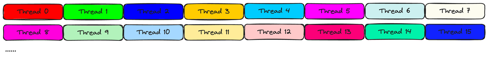

# TiledCopy与cp.async

基于CuTe的GEMM将SM80的cp.async指令进行封装并扩展成TiledCopy，实现了Global Memory到Shared Memory的异步拷贝，在执行异步拷贝的同时，利用TensorCore完成MMA计算，最终实现了数据加载->计算的流水线

存合并——深入理解TiledCopy

## TiledCopy参数的理解

```
    using g2r_copy_op = UniversalCopy<T>;
    using g2r_copy_traits = Copy_Traits<g2r_copy_op>;
    using g2r_copy_atom = Copy_Atom<g2r_copy_traits, T>;

    using G2RCopy = decltype(make_tiled_copy(g2r_copy_atom{},
                        Layout<Shape<_16, _8>, Stride<_8, _1>>{},
                        Layout<Shape<_1, _4>>{}));
    print(G2RCopy{})
```


### Tiler_MN

Tiler_MN代表TiledCopy执行一次copy时，操作的Src/Dst Tensor的Shape，也就是说，Src/Dst Tensor的Shape是Tiler_MN即可，TiledCopy并不会对Stride做强制的要求。
例如，对于一个4096 x 4096的矩阵，以Row-Major存储时，位于其中间的一个(16, 64)的分块的步长是(4096, 1)，而不是(64, 1)，如果是以Column-Major存储，则这个分块的步长是(1, 4096)，而不是(1, 16)。

仅需分块的Shape与其Tiler_MN一致即可。

Tiled_MN的构造依赖于make_tiled_copy函数中ThrLayout参数和ValLayout参数。ThrLayout表示我们如何从执行单元的层面对Copy_Atom进行扩展，而ValLayout则表示每个执行单元所拷贝的Tensor分块的Shape。

Copy_Atom所表达的“原子能力”为：一个执行单元（CUDA Thread）能够完成一个1个元素的拷贝。首先，我们定义执行单元所拷贝的Tensor分块为(1, 4)，即ValLayout。接下来，我们将执行单元扩展为16x8个（ThrLayout的Shape），即(1x16, 4x8)-->(16, 32)，最终得到TiledCopy一次拷贝能够操作的Shape。

### TiledLayout_TV

Layout<Shape<_16, _8>, Stride<_8, _1>>代表16x8个执行单元是以行主序的形式排布的，也就是说，Thread ID在行方向上连续递增，在列方向上以8为步长递增，如图所示


展示了前16个Thread负责的数据分块，其中，每一个线程负责拷贝Tiler_MN一行上连续的4个元素（由(1, 4)简化而来）。

* TiledLayout_TV所表达的含义是什么？
TiledLayout_TV是一个复合的Layout，Layout本质上是一个映射，它能够将一个由整数构成的坐标转换为一个标量offset。

TiledLayout_TV所表达的含义为：给定一个Thread的ID，以及这个Thread所负责的Tensor分块中某个元素的坐标，返回这个元素在Tiled_MN中的坐标。（坐标可转成offset）

我们结合一个具体的例子来说明TiledLayout_TV的作用。假设，TiledLayout_TV为上文中的((8, 16), 4):((64, 1), 16)，我们想知道ID为9的Thread，它拷贝的Tensor分块中，坐标为(0, 2)的元素，对应Tiler_MN中的坐标是多少？

1. 首先，将Thread ID 9转换为Shape(8, 16)的坐标：(1, 1)，坐标(0, 2)是Shape(1, 4)的坐标，这个Shape可以简化为(4,)，因此坐标也可以简化为(2,)。因此，输入的坐标为((1, 1), 2)。
2. 计算offset = 1 x 64 + 1 x 1 + 2 x 16 = 97（坐标乘以步长，然后求和）
3. 将97转换为Shape(16, 32)的坐标，(16, 32)即Tiler_MN，结果为：(1, 6)

因此，对于Thread 9这个线程来说，它拷贝的Tensor分块中坐标为(0, 2)的元素位于Tiler_MN的(1, 6)位置处。事实上，Thread 9负责Tiler_MN上(1, 4:8)这个分块。


* 访存的连续性


## 如何基于cp.async构造TiledCopy
```
    using g2s_copy_op = SM80_CP_ASYNC_CACHEGLOBAL<cute::uint128_t>;
    using g2s_copy_traits = Copy_Traits<g2s_copy_op>;
    using g2s_copy_atom = Copy_Atom<g2s_copy_traits, half_t>;

    using G2SCopyA = decltype(make_tiled_copy(g2s_copy_atom{},
                        make_layout(make_shape(Int<16>{}, Int<8>{}),
                                    make_stride(Int<8>{}, Int<1>{})),
                        make_layout(make_shape(Int<1>{}, Int<8>{}))));  // Copy Tile: (16, 64)
```

# 引用
catalog.ngc.nvidia.com/orgs/nvidia/containers/pytorch