# TensorRT-LLM 中 Hopper Mixed GEMM 的 CUTLASS 3.x 实现
https://zhuanlan.zhihu.com/p/714378343

使用CUTLASS 3.x风格的代码在Hopper架构上实现输入为FPA+INTB混合精度矩阵乘法
1. 使用CuTe进行数据传输
2. FPA+INTB矩阵乘法案例讲解

## 介绍cute

Layout和Tensor

Layout是由Shape和Stride这两个概念组成的，可以把它理解为一个函数，作用就是把一个N维的逻辑坐标映射到真实的一维的连续的索引上去
再把一个真正的内存的指针传给Tensor的模板参数，这就构成了一个真正的Tensor

* API
get、rank、depth、shape、stride和size等

* 相关概念
Composition（组合）、Complement（补集）、Inverse（逆）、Product（乘积）和Divide（除法）

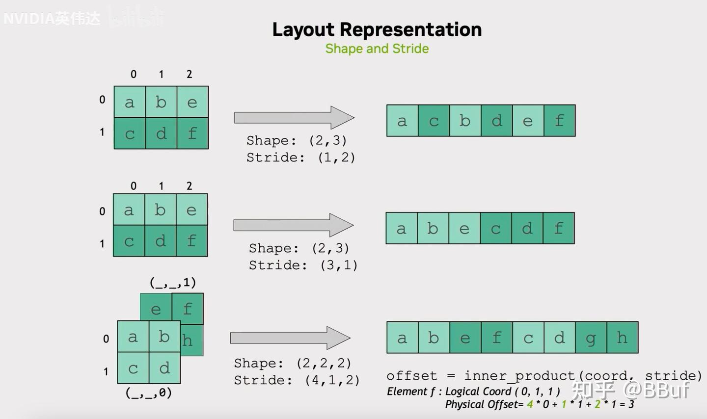

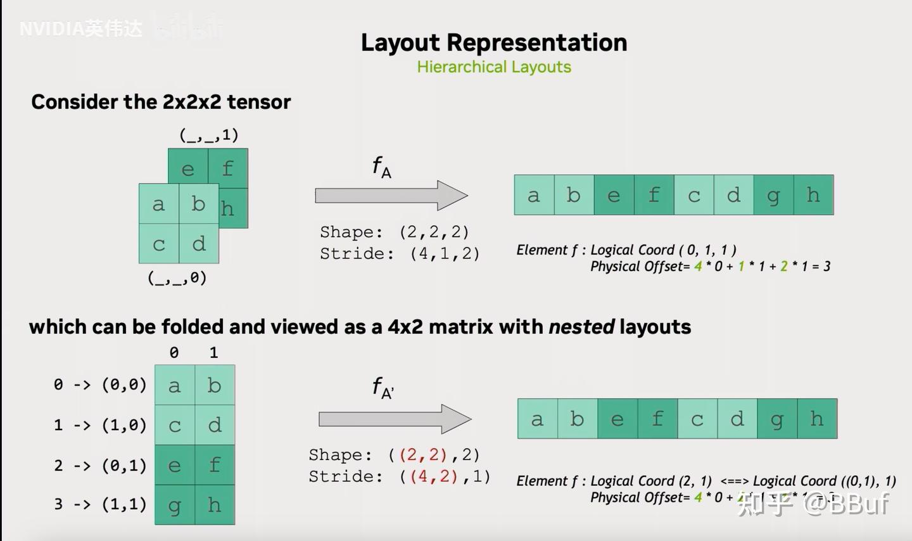
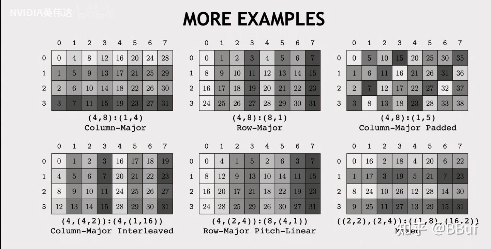

* CuTe的使用示例

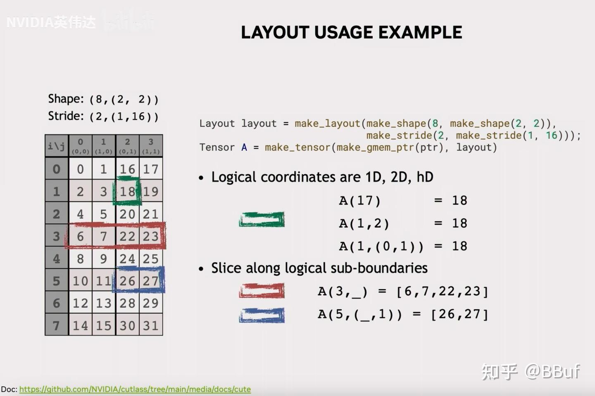

* Why cute?

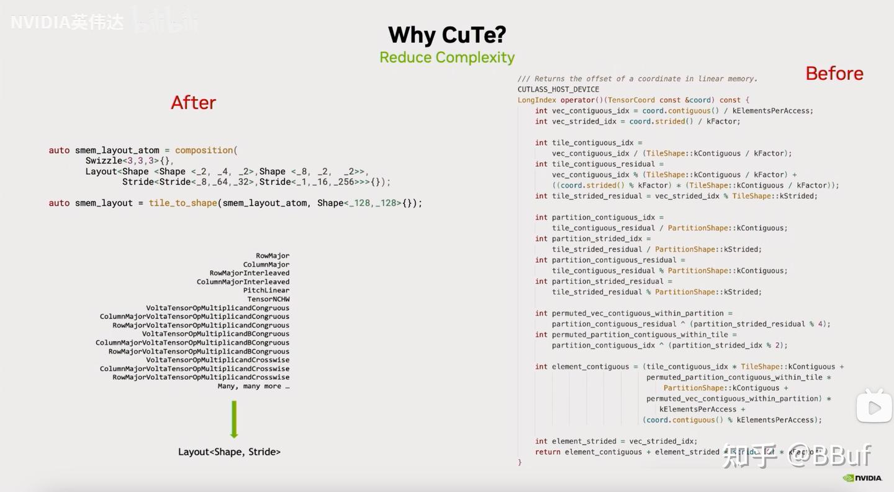

## Cute 的 GEMM 数据流

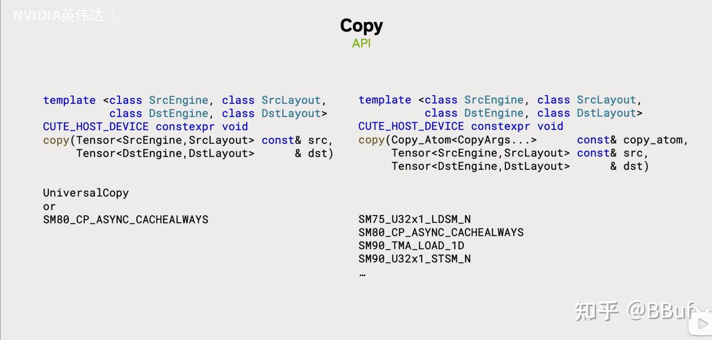

左边的API比较简单，把src Tensor和dst Tensor传禁区就可以完成数据拷贝，会自动根据GPU的架构，数据的存储位置去自动选择用UniversalCopy或者SM80_CP_ASYNC_CACHEALWAYS，但是只会在这两个里面选择

如果我们想要得到更好的性能，建议使用右边的API，右边的copy API我们需要在第一个参数中显示指定一个copy_atom，它就是CuTe会为各种不同架构中的数据传输指令做一个封装

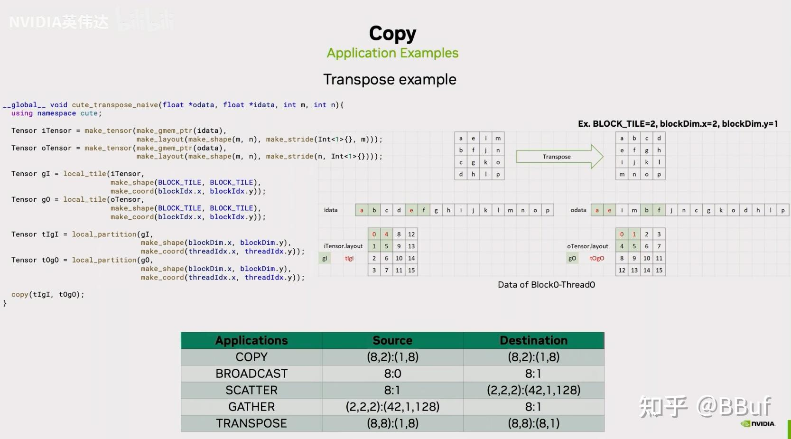

只不过在读进iTensor的时候让它以一个Column Major的方式读进来，所以我们构造Stride的时候传入(1, m)，右边的图里把iTensor.layout也画出来了，我们再以Row Major的方式写出去就达到了一个转置的效果，因此oTensor的stride就是(n, 1)

### TiledCopy
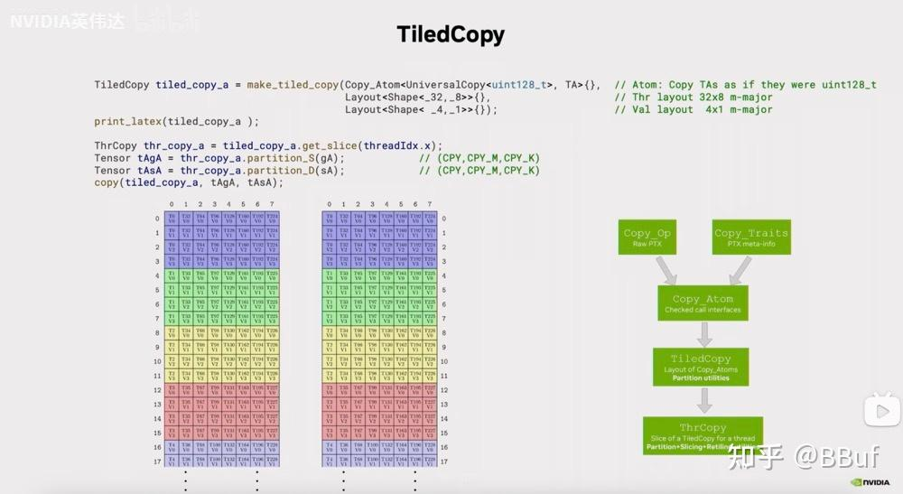

以Tile为单位的Copy时去构造source/dest tensor需要用到的东西
包括MMA的话，也是不同的MMA实现需要不同的Tile的形式，也需要TiledCopy去做。
想构造一个Tiled Copy需要用到make_tiled_copy这个API。第一个参数传的还是Copy_Atom，第二个参数就是Dest Tensor的Stride的Layout，第三个参数是Dest Tensor的Value Layout。
（Value Layout不好理解，可以用print_latex把你构造好的一个Tiled Copy打印出来）
(32x4, 8x1)=(128, 8)

拿到Tiled Copy之后首先需要get_slice把当前的线程号传进去，这样会得到一个Thread Copy表示当前线程需要Copy的Tile，然后用它去做partition_S并且把Source Tensor传进去

它的Shape就是CPY_M和CPY_K，然后CPY就是我们刚才说的128x8的这个Tile大小，然后CPY_M和CPY_K分别表示它需要在M方向以及K方向做这么多次Copy，才能把gA这个Tensor完整的拷贝过去。

同理对于Dest Tensor来说，我们需要调用一个partition_D同样可以得到（CPY, CPY_M, CPY_N）这个shape的Tensor，然后再调用copy这个API就可以了。

* 构造一个Tiled Copy应该怎么设置Thread Layout和Value Layout呢？

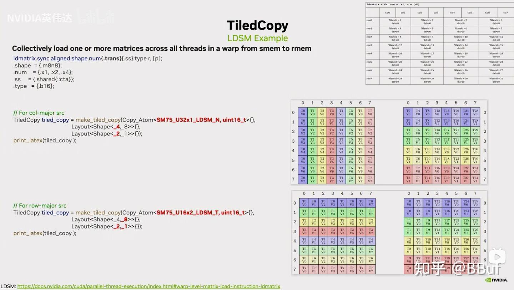

以一个warp为单位去load 1个/2个/4个 8x8矩阵的指令
这个指令有2种形式，一种是Trans的，一种是非Trans的。

## GEMM Data Flow
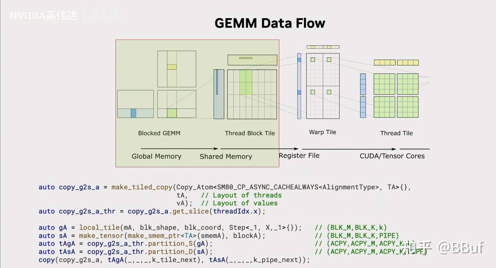
G -> S
1. 构造Tiled Copy
使用make_tiled_copy来构造一个Tiled Copy对象, 然后，通过get_slice获取对应的Thread Copy

2. 构造Source Tensor
Source Tensor来自Global Memory，我们需要以Block的形式将其拷贝到Shared Memory。这里使用local_tile指令

* mA：Global Memory中的Tensor。
* BlockShape：Block的形状，通常是三维的（M, N, K）。
* Thread：线程布局。
* Step：步长，通常设置为<_1, X, _1>{}，其中X表示N维度不参与计算。

gA表示当前Block需要负责的Source Tensor的表示。它的Shape为（BLK_M, BLK_K, k）
* BLK_M 和 BLK_K 是Tile的形状
* k 表示一共有k个这个形状的Tile需要拷贝

3. 构造Dest Tensor
Dest Tensor在Shared Memory上，我们直接使用make_tensor来构造

4. 获取当前线程负责的区域
使用partition_S和partition_D分别获取当前线程负责的Source和Dest区域

thread_source_region 的Shape为 (ACPY, ACPY_M, ACPY_K, k)
* ACPY 是拷贝的单位
* ACPY_M 和 ACPY_K 是在M和K方向上的拷贝次数
* k 表示一共有k个Tile

thread_dest_region 的Shape为 (ACPY, ACPY_M, ACPY_K, PIPE)
* PIPE 表示一共有多少个Stage

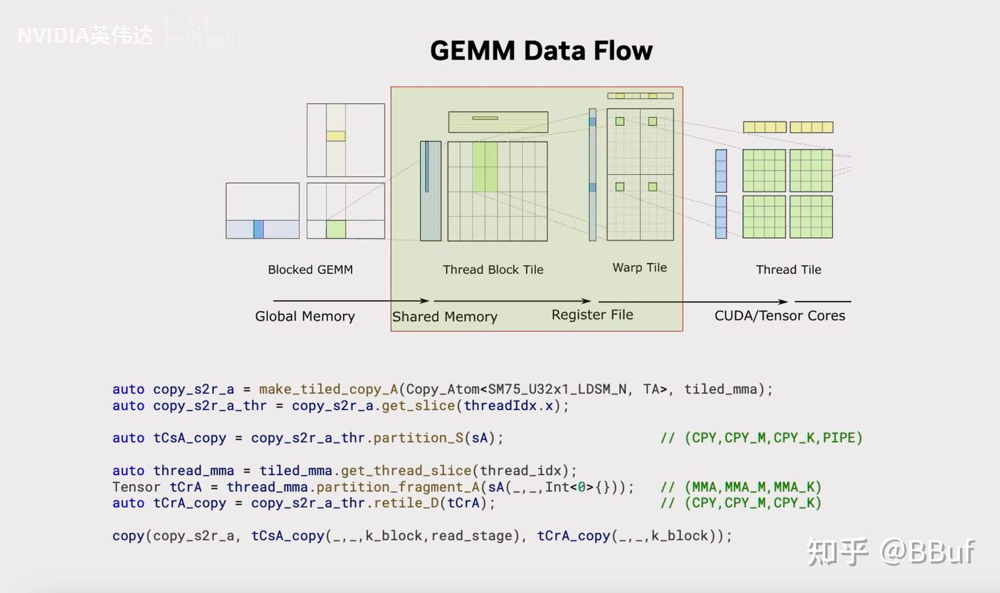
Shared Memory到Register File
1. 构造Tiled Copy
因为Register File是直接要用来做MMA的，所以数据的排布是不能随便设置的
使用make_tiled_copy_A API来构造Tiled Copy，然后，通过get_slice获取对应的Thread Copy

2. 获取Source Tensor的线程负责区域
Source Tensor不涉及Register File，因此可以直接使用partition_S来获取当前线程负责的区域

3. 获取Dest Tensor的线程负责区域
Dest Tensor涉及MMA操作，因此需要使用MMA的get_thread_slice来获取当前线程负责的区域
* thread_mma：MMA的线程切片。
* mma_fragment_A：MMA视角下当前线程需要负责的Tensor

4. 转换为Copy视角下的Tensor
由于MMA视角和Copy视角的Tensor布局可能不同，我们需要使用retile_D来转换为Copy视角下的Tensor
* copy_fragment_A：Copy视角下当前线程需要负责的Tensor

5. 完成数据拷贝
使用copy指令完成数据从Shared Memory到Register File的拷贝

## 混合 GEMM 演练
### 如何实现 Mixed 数据类型的通用矩阵乘加（GEMM）操作，特别是在使用Hopper架构下的异步Warp Group矩阵乘加累积（MMA）操作时
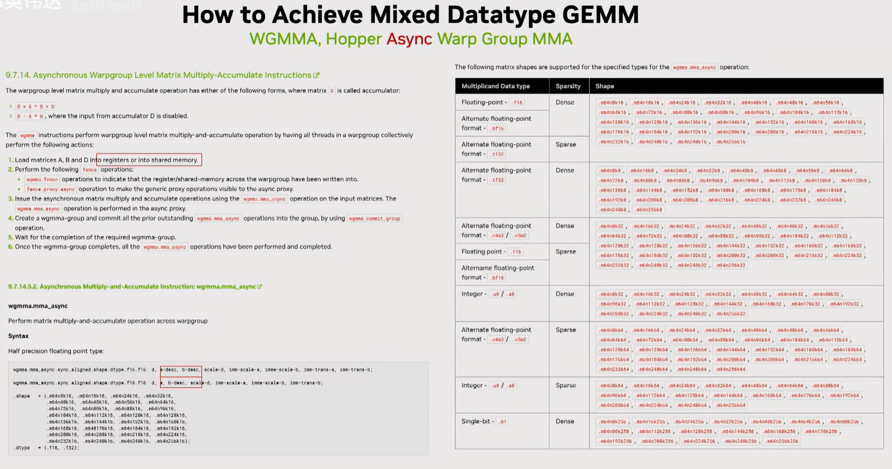
CUTLASS 2.x的Ampere的这些Tensor Core是同步的，意味着输入输出A，B，C都是在寄存器层面发射一条同步指令
Hopper上这个指令变成异步之后它可以接收来自Shared Memory的矩阵A，B

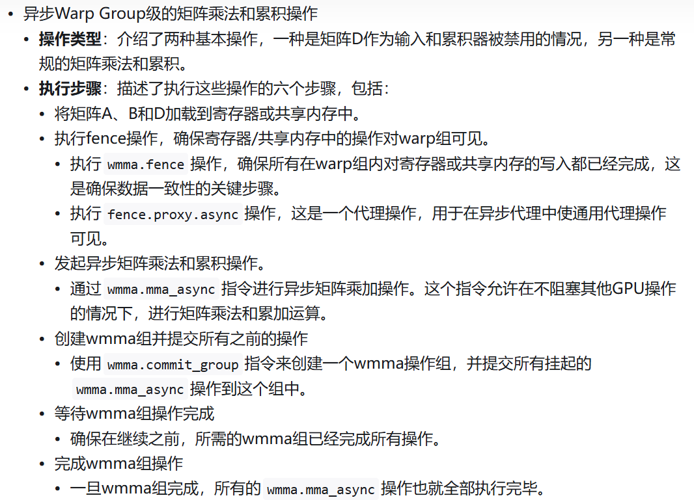

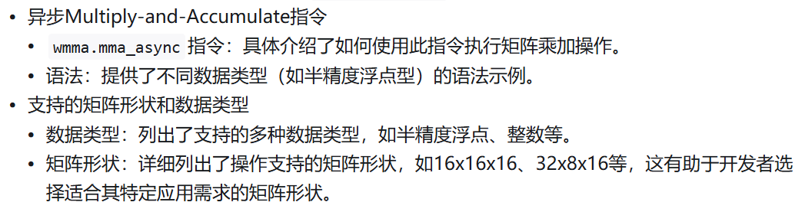

### 如何实现混合数据类型的GEMM(通用矩阵乘法)
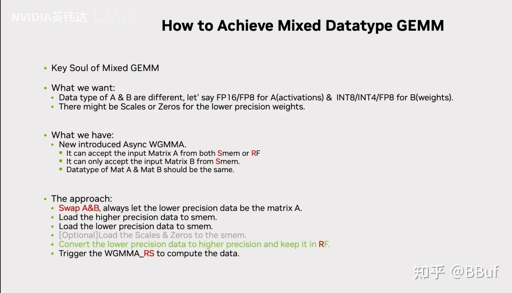

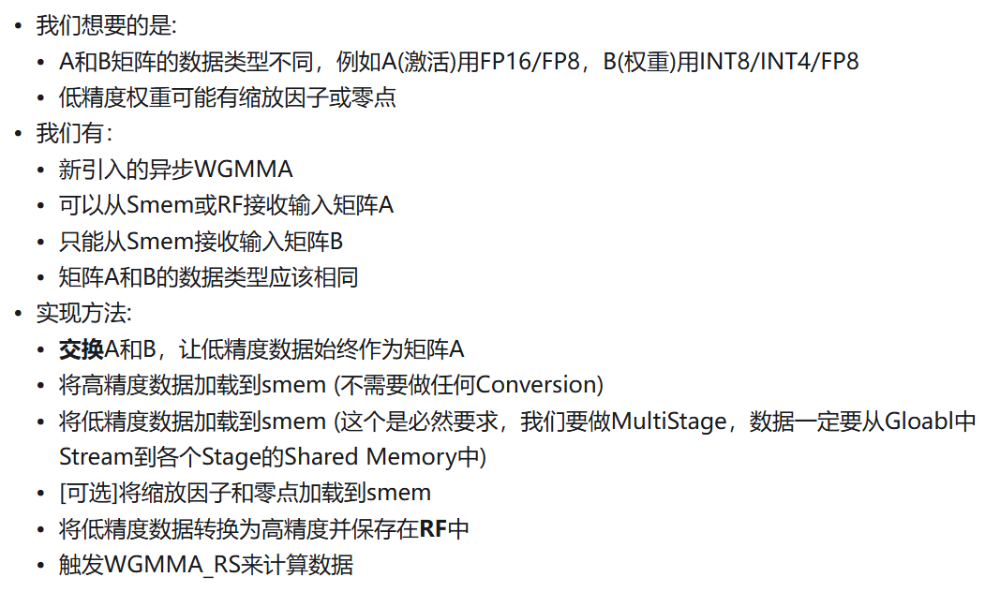

### Hopper架构上的Warp Specialized GEMM实现，采用了生产者-消费者模型
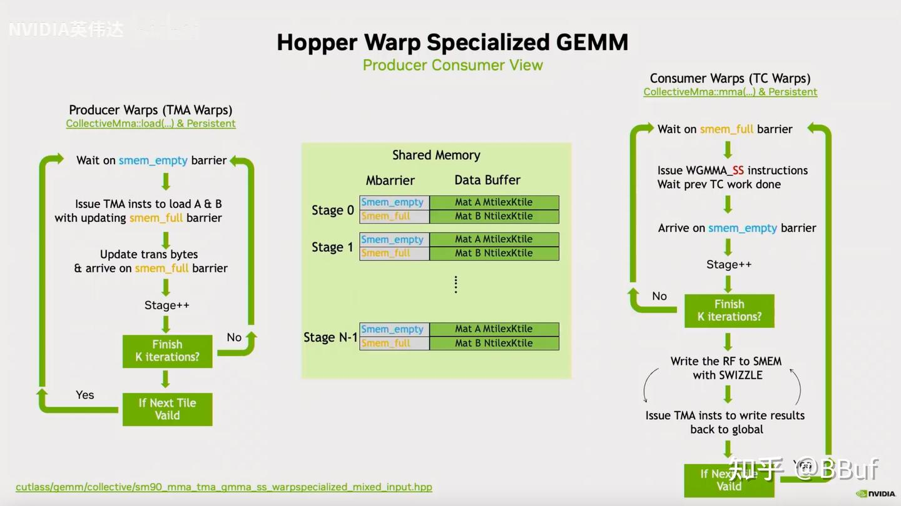

cutlass/gemm/collective/sm90_mma_tma_gmma_ss_warpspecialized_mixed_input.hpp
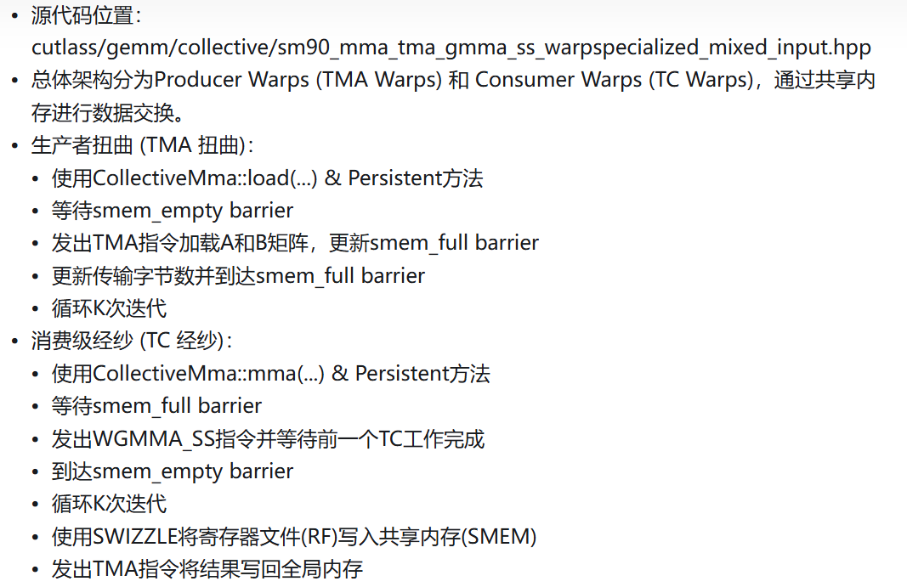

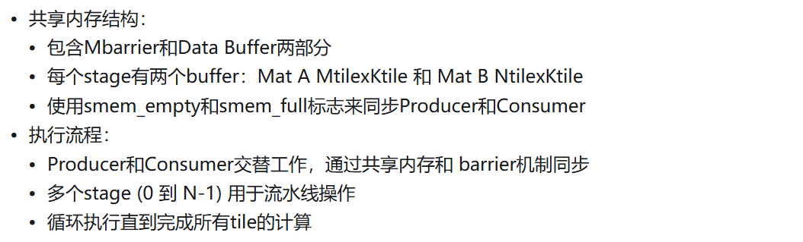

### Hopper架构上的Warp Specialized GEMM实现

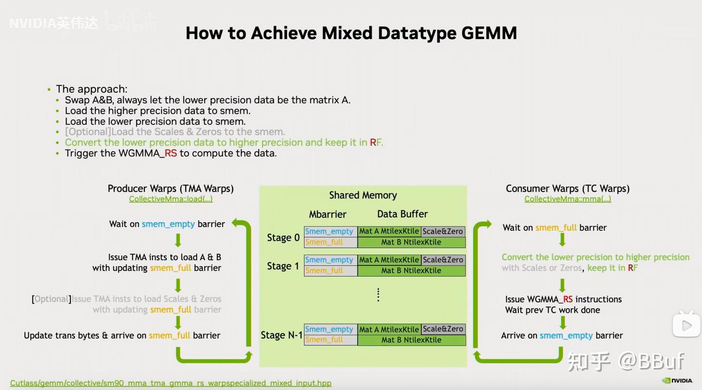

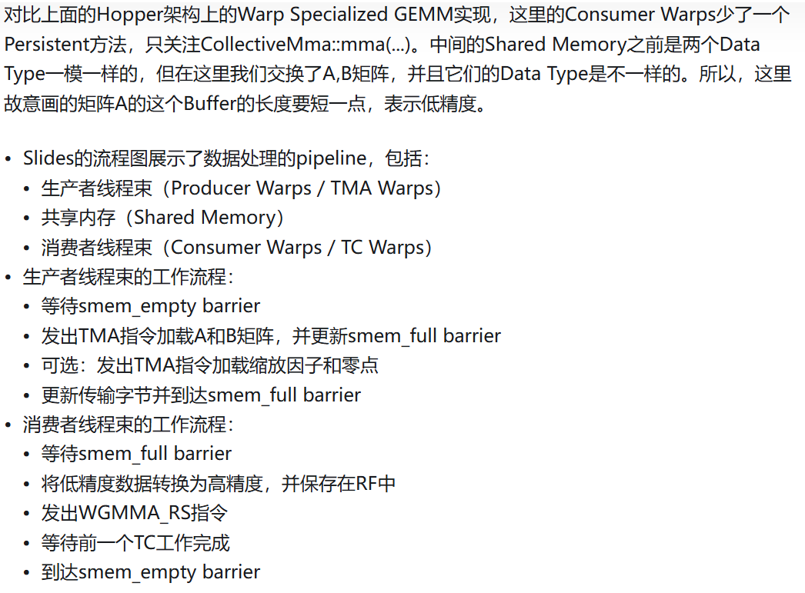

### 分别对生产者线程束 (Producer Warps) 和消费者线程束（TC Warps）对应流程的一部分底层代码进行了解释

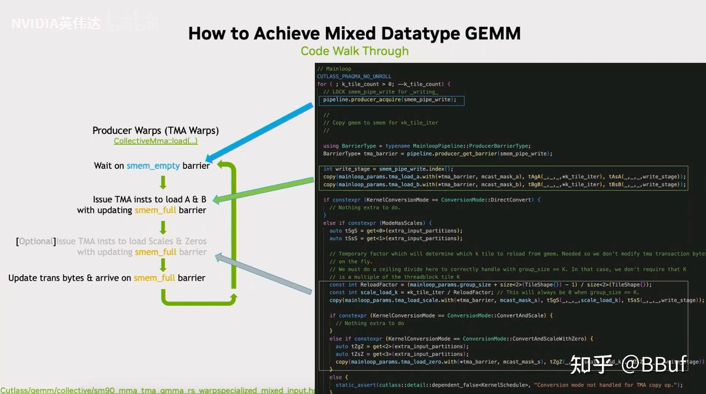

### 消费者线程束（TC Warps）中将低精度数据转换为高精度并保存在寄存器文件（RF）中的实现细节，以及具体是怎么做的Copy的细节
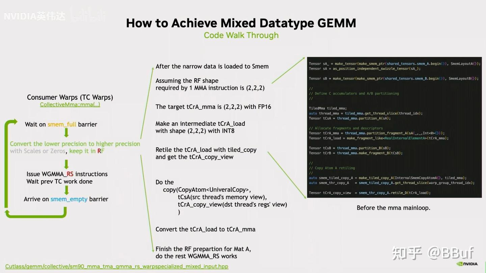

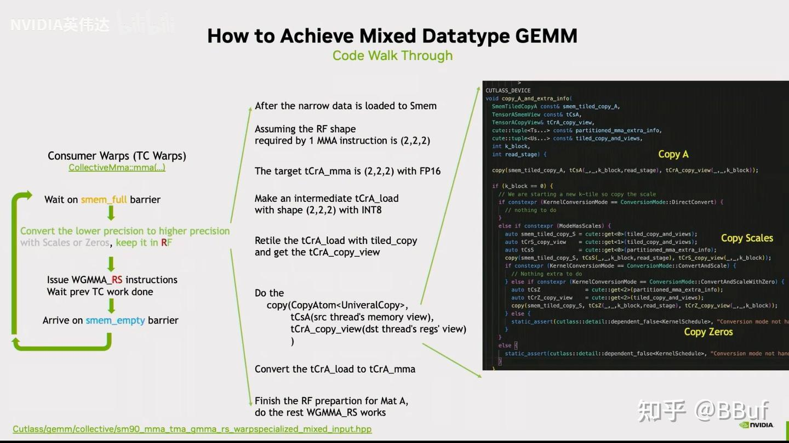
