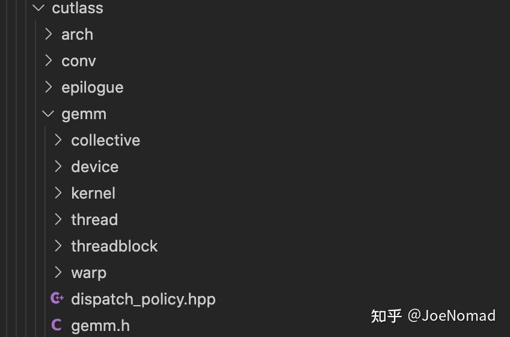

# 逻辑划分

1. MMA: 矩阵乘法的乘累加部分，覆盖范围是load(global)->store(shared)->mma(矩阵乘法的结果存在寄存器里)
2. Epilogue: 将矩阵乘法的结果拿到，并进行后续的计算(cast, fusion kernel如bias,relu等)&&搬出, 覆盖的范围是 (store(shared),如果重排的话) -> Epilogue compute -> store(global)

device(主要是host侧调用的代码) -> kernel(针对不同的workload, dispatch需要用到的mma和epilogue && 定义kernel的mma计算逻辑以及调用epilogue) -> threadblock(定义一个block内mma的计算) -> warp-> thread

# 引用
https://zhuanlan.zhihu.com/p/678915618
