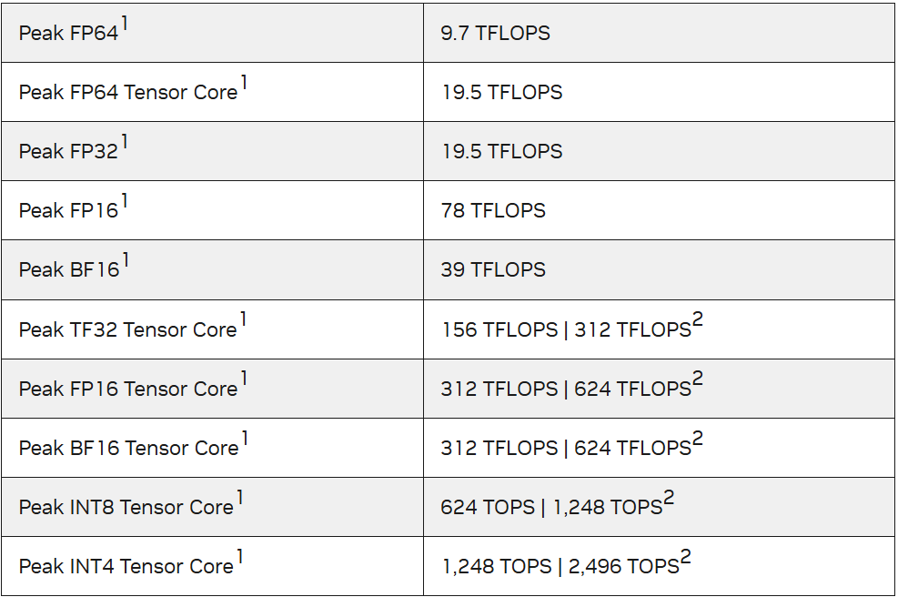
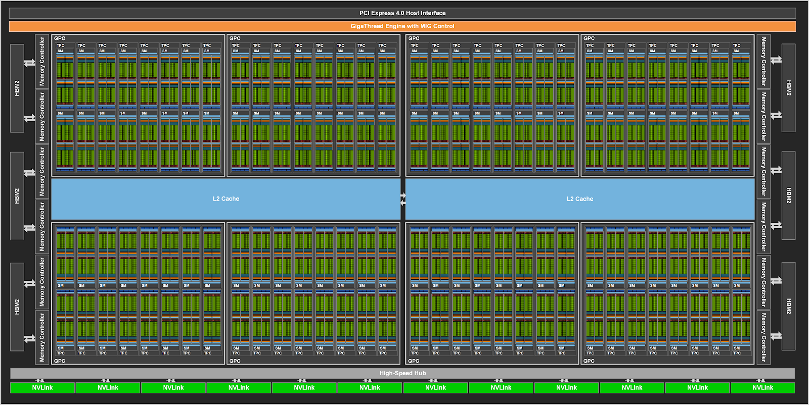

# Ampere

NVIDIA A100 张量核心 GPU 基于新的 NVIDIA 安培 GPU 架构

多实例 （ MIG ）虚拟化：A100 允许 CSP 提高其 GPU 服务器的利用率，在不增加额外成本的情况下，可提供最多 7 倍的 GPU 实例
GPU 分区功能

第三代张量核心
TensorFloat-32 （ TF32 ） Tensor 核心操作为在 DL 框架和 HPC 中加速 FP32 输入/输出数据提供了一条简单的途径，比 V100 FP32 FMA 操作快 10 倍，在稀疏的情况下运行速度快 20 倍
对于 FP16 / FP32 混合精度 DL ， A100 张量核心提供了 V100 的 2.5 倍性能，随着稀疏性增加到 5 倍。

Bfloat16 （ BF16 ）/ FP32 混合精度张量核心操作以与 FP16 / FP32 混合精度相同的速率运行
 INT8 、 INT4 的张量核心加速和二进制舍入支持 DL 推断， A100 稀疏 INT8 运行速度比 V100 INT8 快 20 倍。对于 HPC ， A100 张量核心包括新的符合 IEEE 标准的 FP64 处理，其 FP64 性能是 V100 的 2 . 5 倍。

* 40 GB HBM2 和 40 MB 二级缓存
NVIDIA A100 GPU 拥有 40GB 的高速 HBM2 内存，内存带宽为 1555GB / s ，与 Tesla V100 相比增加了 73% 。此外， A100 GPU 拥有更多的片上内存，包括 40 MB 的二级缓存（ L2 ），比 V100 大近 7 倍，以最大限度地提高计算性能。 A100 二级缓存采用新的分区交叉结构，提供了 V100 2 . 3 倍的二级缓存读取带宽。

* A100 GPU 硬件架构
NVIDIA GA100 GPU 由多个 GPU 处理簇（ GPC ）、纹理处理簇（ TPC ）、流式多处理器（ SMs ）和 HBM2 内存控制器组成。
8 个 GPC ， 8 个 TPC / GPC ， 2 个 SMs / TPC ， 16 个 SMs / GPC ，每满 128 个 SMsGPU
64 个 FP32 CUDA 核/ SM ，每满 GPU 个 8192 个 FP32 CUDA 个核
4 个第三代张量核心/ SM ，每满 512 个第三代张量核心 GPU
6 个 HBM2 堆栈， 12 个 512 位内存控制器

