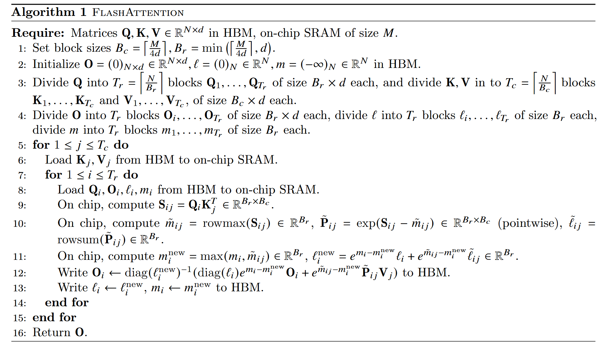

# Flash Attention

https://github.com/HazyResearch/flash-attention

降低模型的FLOPS（Floating Point Operations Per Second）
降低存储访问开销（Memory Access Cost，MAC）

## 背景

Transformers：自注意力的时间和内存复杂度是序列长度的二次方，所以在长序列上slow、内存饥饿

1. Q\K\V由原始输入经线性变换得到;
2. S 在一些论文中被称为Attention Scores；
3. P 是对P进行逐行softmax得到的结果;
4. O 是最终的输出；
5. N 是序列长度；
6. d 是维度。

公式一，需要N^2次点乘，每次点乘需要d次乘法和d-1次加法，总复杂度O( dN\^2 )
公式三，中的矩阵乘法复杂度也是O( dN\^2 )
当N > d时， self-attention的复杂度为O( N\^2 )

Approximate attention：权衡模型质量减少复杂度，但无法实现wall-clock speedup

IOaware：GPU读写

Flash Attention

1.  tiling 减少HBM和SRAM的读写
2.  block-sparse attention

## 之前方法

*   稀疏近似（sparse-approximation）

Reformer: The efficient transformer.  (ICML)

Efficient content-based sparse attention with routing transformers.

*   低秩近似（low-rank approximation）

Rethinking attention with performers.

Transformers are RNNs: Fast autoregressive transformers with linear attention.

Linformer: Self-attention with linear complexity.

*   稀疏近似+低秩近似

Longformer: The long-document transformer.

Scatterbrain: Unifying sparse and low-rank attention.

Big bird: Transformers for longer sequences.

上述倾向减少时间，忽略IO

## Softmax的动态更新

### 常规Softmax

### Stable softmax

* EXP求和项

### softmax 分块

* x = [x1, x2]

* 处理完x(1)保存
m_max = m(x^(x1))
l_all = l(x^(x1))

* 用和x(1)相同的方法处理x(2)

* 开始合并x(1) 和 x(2)

* 解析

* 基于上述步骤，直接推导 softmax，更新全局
更新分子

根据上述公式，带入公式16

更新分母

合并分子和分母

* 我们在更新x(2)的softmax值时，额外保存的几个量

## 方法

*   问题

1.  减少softmax的计算量
2.  不存储大量的中间注意力矩阵

*   解决方法

1.  tiling：切割输入矩阵
2.  存储前向传播时softmax归一化因子

### 减少HBM的访问量

Q\K\V 分块，从HBM加载到SRAM，计算这些块的注意力输出

将每个块的输出相加之前按正确的归一化因子缩放

*   Tiling

*   Recomputation

不存储O(N^2)的中间变量给反向传播，反向传播需要S、P去计算Q、K、V

存储 output O 和 softmax 标准化统计量（m, l）来计算

*   Implementation details: Kernel fusion

### block-sparse FlashAttention

> 64k

## 补充知识

*   GPU Memory Hierarchy

A100 GPU 具有 40-80GB 的高带宽内存 (HBM)，带宽为 1.5-2.0TB/s，每个 108 个流式多处理器都有 192KB 片上 SRAM，带宽估计约为 19TB/s

*   Execution Model
*   计算和内存的瓶颈

Roofline: an insightful visual performance model for multicore architectures.

*   Kernel fusion

### Standard Attention
 

# 参考
https://zhuanlan.zhihu.com/p/642962397
