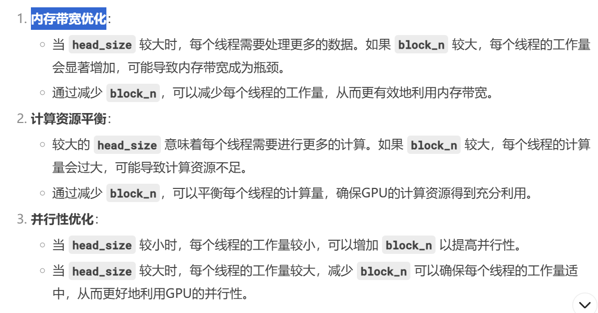

# Flash Attention源码解读（V2）
## 项目结构
* /training/run.py
 启动代码
通过hydra.main获取config信息
/training/configs/experiment/owt
base.yaml -> gpt2s-flash.yaml -> gpt2m-flash.yaml -> gpt2l-flash.yaml -> gpt2xl-flash.yaml
/training/configs/model
gpt2.yaml 定义了执行文件 target_: flash_attn.models.gpt.GPTLMHeadModel
* /training/src/train.py
checkpoint加载点、deepspeed、ddp
实际开始训练代码
trainer.fit(model=model, datamodule=datamodule, **ckpt_cfg)

* /flash_attn/models/gpt.py
 create_block() -> GPTModel -> GPTLMHeadModel 

* /flash_attn/modules/block.py
Block() ->create_block()
* /flash_attn/modules/mha.py
/flash_attn/__init__.py - > flash_attn_varlen_qkvpacked_func -> FlashSelfAttention -> MHA -> Block()
/flash_attn/__init__.py - > flash_attn_qkvpacked_func            -> FlashSelfAttention -> MHA -> Block()
* /flash_attn/flash_attn_interface.py
    flash_attn_func
    flash_attn_kvpacked_func
    flash_attn_qkvpacked_func
    flash_attn_varlen_func
    flash_attn_varlen_kvpacked_func
    flash_attn_varlen_qkvpacked_func
    flash_attn_with_kvcache

*  用flash_attn_qkvpacked_func函数举例
FlashAttnKVPackedFunc -> flash_attn_qkvpacked_func

* FlashAttnQKVPackedFunc
flash_attn_cuda.fwd -> _flash_attn_forward -> forward._wrapped_flash_attn_forward -> FlashAttnQKVPackedFunc
```
if torch.__version__ >= "2.4.0":
    _wrapped_flash_attn_forward = torch.ops.flash_attn._flash_attn_forward
else:
    _wrapped_flash_attn_forward = _flash_attn_forward

```

flash_attn_cuda.bwd -> _flash_attn_backward -> backward
._wrapped_flash_attn_backward -> FlashAttnQKVPackedFunc
```
if torch.__version__ >= "2.4.0":
    _wrapped_flash_attn_backward = torch.ops.flash_attn._flash_attn_backward
else:
    _wrapped_flash_attn_backward = _flash_attn_backward
```

import flash_attn_2_cuda as flash_attn_cuda

到此python层面结束
* /setup.py
创建 flash_attn_2_cuda

* /csrc/flash_atten/flash_api.py
run_mha_fwd_ 					-> run_mha_fwd -> mha_fwd  -> fwd 
run_mha_fwd_splitkv_dispatch		-> run_mha_fwd -> mha_fwd  -> fwd
其他：
mha_varlen_fwd   -> varlen_fwd   
mha_bwd -> bwd 
mha_varlen_bwd   -> varlen_bwd
mha_fwd_kvcache -> fwd_kvcache

* 用run_mha_fwd_splitkv_dispatch 举例 csrc\flash_attn\src\flash_fwd_launch_template.h
flash::compute_attn_splitkv -> flash_fwd_splitkv_kernel -> run_flash_splitkv_fwd -> run_mha_fwd_splitkv_dispatch
```
DEFINE_FLASH_FORWARD_KERNEL(flash_fwd_splitkv_kernel, bool Is_causal, bool Is_local, bool Has_alibi, bool Is_even_MN, bool Is_even_K, bool Is_softcap, bool Split, bool Append_KV) {
    #if defined(ARCH_SUPPORTS_FLASH)
        flash::compute_attn_splitkv<Kernel_traits, Is_causal, Is_local, Has_alibi, Is_even_MN, Is_even_K, Is_softcap, Split, Append_KV>(params);
    #else
        FLASH_UNSUPPORTED_ARCH
    #endif
}
```

* csrc\flash_attn\src\flash_fwd_kernel.h
compute_attn_1rowblock_splitkv -> compute_attn_splitkv


## 代码逻辑
### forward
#### mha_fwd
* 参数
at::Tensor &q：查询张量，形状为 batch_size x seqlen_q x num_heads x round_multiple(head_size, 8)
const at::Tensor &k：键张量，形状为 batch_size x seqlen_k x num_heads_k x round_multiple(head_size, 8)。
const at::Tensor &v：值张量，形状为 batch_size x seqlen_k x num_heads_k x round_multiple(head_size, 8)。
c10::optional<at::Tensor> &out_：输出张量（可选），形状为 batch_size x seqlen_q x num_heads x round_multiple(head_size, 8)。
c10::optional<at::Tensor> &alibi_slopes_：ALiBi斜率张量（可选），形状为 num_heads 或 batch_size x num_heads。
const float p_dropout：dropout概率。
const float softmax_scale：softmax缩放因子。
bool is_causal：是否使用因果掩码。
int window_size_left：左侧窗口大小
int window_size_right：右侧窗口大小
const float softcap：softmax值的上限
const bool return_softmax：是否返回softmax值
c10::optional<at::Generator> gen_：随机数生成器（可选）

* 基本要求
1. FlashAttention仅支持 Ampere GPUs or newer
2. q\k\v 仅支持 fp16、bf16
3. 基本参数
batch_size = q.sizes()[0];
seqlen_q = q.size()[1];
num_heads = q.size()[2];
head_size = q.size()[3];                    head_size < 256 && head_size & 8 == 0;
seqlen_k = k.size()[1]; 
num_heads_k = k.size()[2];		num_heads % num_heads_k == 0 	(q的头数必须被k/v的头数整除)
window_size_left/right >= seqlen_k		window_size_left/right = -1;
is_causal							window_size_right = 0;
4. 对q进行重塑和转置操作
5. 数据格式优化
如果 head_size 小于或等于 192，则将其向上取整到最接近的 32 的倍数。
如果 head_size 大于 192，则将其设置为 256。
seqlen_q/k 被向上取整到最接近的 128 的倍数。

6. softmax 参数
7. Flash_fwd_params 配置上述参数
8. set_params_splitkv 定义cuda参数（block大小和grid大小

```
const int block_n = head_size <= 64 ? 256 : (head_size <= 128 ? 128 : 64);
```
为什么 head_size 越大，block_n 越小？


```
const int num_n_blocks = (max_seqlen_k + block_n - 1) / block_n;
```
其中 max_seqlen_k == seqlen_k

```
// Technically kBlockM = 64 only for the splitKV kernels, not the standard kernel.
// In any case we don't expect seqlen_q to be larger than 64 for inference.
const int num_m_blocks = (max_seqlen_q + 64 - 1) / 64;
```
标准内核通常不会固定块大小为64，而是会根据具体的计算任务和硬件特性动态调整块大小。标准内核的设计目标是通用性，能够处理各种不同的计算任务，因此不会像 splitKV 内核那样专门优化某个特定的块大小。

SpiltKV 执行不能设置dropout（即dropout = 0.0f）
```
// We multiply number of SMs by 2 to hard-code the fact that we're using 128 threads per block.
params.num_splits = num_splits_heuristic(batch_size * num_heads * num_m_blocks, dprops->multiProcessorCount * 2, num_n_blocks, 128);
```
num_splits_heuristic 来计算 num_splits
num_splits 表示将计算任务分成多少个部分（splits）。
dprops->multiProcessorCount * 2 表示 GPU 的多处理器数量乘以 2，假设每个块使用 128 个线程。


```
softmax_lse_accum = torch::empty({params.num_splits, batch_size, num_heads, max_seqlen_q}, opts.dtype(at::kFloat));
out_accum = torch::empty({params.num_splits, batch_size, num_heads, max_seqlen_q, head_size_rounded}, opts.dtype(at::kFloat));
params.softmax_lseaccum_ptr = softmax_lse_accum.data_ptr();
params.oaccum_ptr = out_accum.data_ptr();
```
初始化了两个张量 softmax_lse_accum 和 out_accum，分别用于存储 softmax 的对数和（log-sum-exp）和输出累加结果。
(1) softmax_lse_accum {params.num_splits, batch_size, num_heads, max_seqlen_q} 指定张量的形状
params.num_splits：表示将计算任务分成多少个部分（splits）。
batch_size：表示批量大小。
num_heads：表示多头注意力机制中的头数。
max_seqlen_q：表示查询序列的最大长度。
\\
{2, 4, 8, 64}
表示有 2 个 splits，每个 split 有 4 个批次，每个批次有 8 个头，每个头有 64 个查询序列长度。
\\
(2) out_accum = {params.num_splits, batch_size, num_heads, max_seqlen_q, head_size_rounded}
params.num_splits：表示将计算任务分成多少个部分（splits）。
batch_size：表示批量大小。
num_heads：表示多头注意力机制中的头数。
max_seqlen_q：表示查询序列的最大长度。
head_size_rounded：表示每个头的尺寸（可能进行了对齐处理）。
\\
{2, 4, 8, 64, 64}
表示有 2 个 splits，每个 split 有 4 个批次，每个批次有 8 个头，每个头有 64 个查询序列长度，每个头的尺寸为 64。
\\

9. num_splits_heuristic
通过启发式方法找到最佳的 num_splits，以最大化 GPU 的占用率（occupancy），同时避免过多的 HBM（High Bandwidth Memory）读写操作。

int batch_nheads_mblocks: batch_size * num_heads * num_m_blocks
int num_SMs: dprops->multiProcessorCount * 2
int num_n_blocks: num_n_blocks
int max_splits: 128

(1) 如果 batch_nheads_mblocks（即 batch_size * num_heads * num_m_blocks）足够大，接近填充所有多处理器（SMs）的 80%，则直接返回 1，表示不需要进一步分割。
(2) 限制 max_splits 的最大值为 max_splits、num_SMs 和 num_n_blocks 中的最小值。
(3)
```
float max_efficiency = 0.f;
std::vector<float> efficiency;
efficiency.reserve(max_splits);
```
max_efficiency：用于存储最大效率。
efficiency：用于存储每个 num_splits 的效率。

(4) 计算每个 num_splits 的效率
(5) 选择最佳的 num_splits, 返回这个 num_splits

10. 在CUDA线程中使用自定义的随机数生成器（RNG），并通过增加偏移量来调整philox计数器的状态

11. set_params_alibi 设置ALiBi（Attention with Linear Biases）的参数
params 是参数结构体，包含ALiBi的参数，RNG。
alibi_slopes_ 是ALiBi的斜率（slopes），用于计算位置偏置。
batch_size 是批次大小。
num_heads 是多头注意力机制中的头数。

12. run_mha_fwd 开始执行前向传播
```
if (seqlen_k > 0) {
    auto stream = at::cuda::getCurrentCUDAStream().stream();
    run_mha_fwd(params, stream);
} else {
    // If seqlen_k == 0, then we have an empty tensor. We need to set the output to 0.
    out.zero_();
    softmax_lse.fill_(std::numeric_limits<float>::infinity());
}
```

#### run_mha_fwd(run_mha_fwd_)
在CUDA中根据不同的硬件特性和参数选择合适的内核来运行Flash Attention前向传播
csrc\flash_attn\src\flash_fwd_hdim128_bf16_causal_sm80.cu 举例
run_mha_fwd_hdim128

csrc\flash_attn\src\flash_fwd_launch_template.h
void run_mha_fwd_hdim128(Flash_fwd_params &params, cudaStream_t stream) 

1.  Headdim = 128
2.  根据 Is_causal 选择不同的内核


template<typename Kernel_traits, bool Is_dropout, bool Is_causal>
void run_flash_fwd(Flash_fwd_params &params, cudaStream_t stream) 

```
constexpr size_t smem_size = Kernel_traits::kSmemSize;
```
smem_size 是内核所需的共享内存大小。

```
const int num_m_block = (params.seqlen_q + Kernel_traits::kBlockM - 1) / Kernel_traits::kBlockM;
dim3 grid(num_m_block, params.b, params.h);
```
num_m_block 是M维度的块数。
grid 是CUDA内核的网格大小，包含M、批次大小和头数。

```
const bool is_even_MN = params.cu_seqlens_q == nullptr && params.cu_seqlens_k == nullptr && params.seqlen_k % Kernel_traits::kBlockN == 0 && params.seqlen_q % Kernel_traits::kBlockM == 0;
```
is_even_MN 是一个布尔值，表示M和N维度是否均匀。

```
const bool is_even_K = params.d == Kernel_traits::kHeadDim;
```
is_even_K 是一个布尔值，表示K维度是否均匀。

```
const bool return_softmax = params.p_ptr != nullptr;
```
return_softmax 是一个布尔值，表示是否返回softmax。

```
auto kernel = &flash_fwd_kernel<Kernel_traits, Is_dropout && !Is_softcap, Is_causal, Is_local && !Is_causal, Has_alibi, IsEvenMNConst && IsEvenKConst && !Is_local && !ReturnSoftmaxConst && Kernel_traits::kHeadDim <= 128, IsEvenKConst, Is_softcap, ReturnSoftmaxConst && Is_dropout && !Is_softcap>;
```
根据不同的模板参数选择合适的内核。

```
if (smem_size >= 48 * 1024) {
    C10_CUDA_CHECK(cudaFuncSetAttribute(
        kernel, cudaFuncAttributeMaxDynamicSharedMemorySize, smem_size));
}
```
如果共享内存大小超过48KB，设置动态共享内存大小

```
kernel<<<grid, block, smem_size, stream>>>(params);
```
cudaLaunchKernel 用于启动CUDA内核。
smem_size 是动态共享内存的大小。


> 跳转到flash_fwd_kernel.h


#### run_mha_fwd(run_mha_fwd_splitkv_dispatch)


#### flash_fwd_kernel.h
csrc\flash_attn\src\flash_fwd_kernel.h


template<typename Kernel_traits, bool Is_dropout, bool Is_causal, bool Is_local, bool Has_alibi, bool Is_even_MN, bool Is_even_K, bool Is_softcap, bool Return_softmax, typename Params>
inline __device__ void compute_attn(const Params &params)

\\

template<typename Kernel_traits, bool Is_dropout, bool Is_causal, bool Is_local, bool Has_alibi, bool Is_even_MN, bool Is_even_K, bool Is_softcap, bool Return_softmax, typename Params>
inline __device__ void compute_attn(const Params &params)

\\

template<typename Kernel_traits, int kBlockM, int Log_max_splits, bool Is_even_K, typename Params>
inline __device__ void combine_attn_seqk_parallel(const Params &params)


