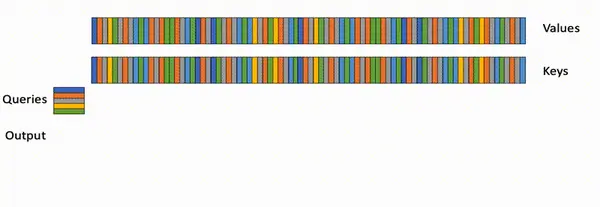
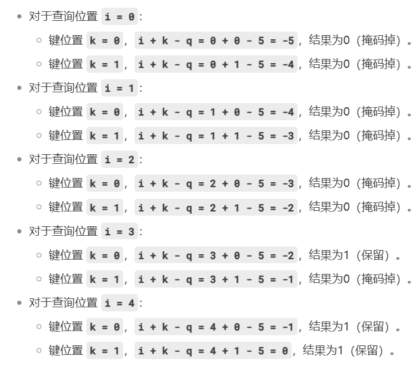
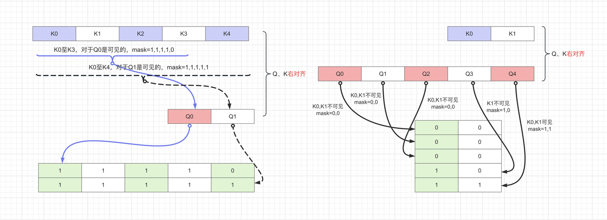
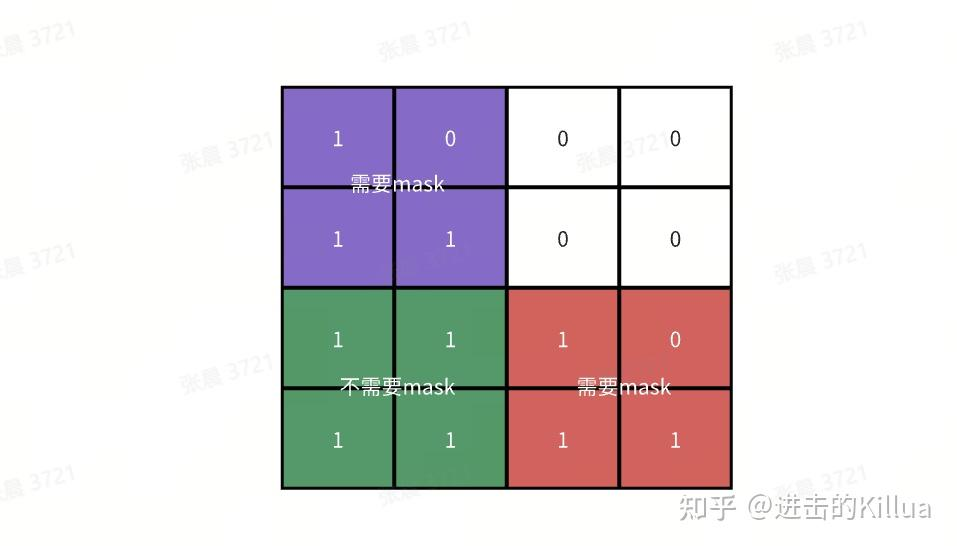
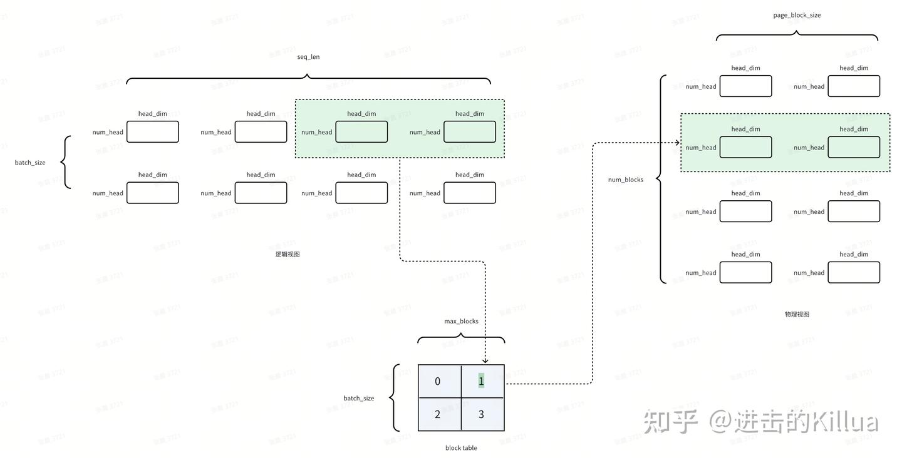
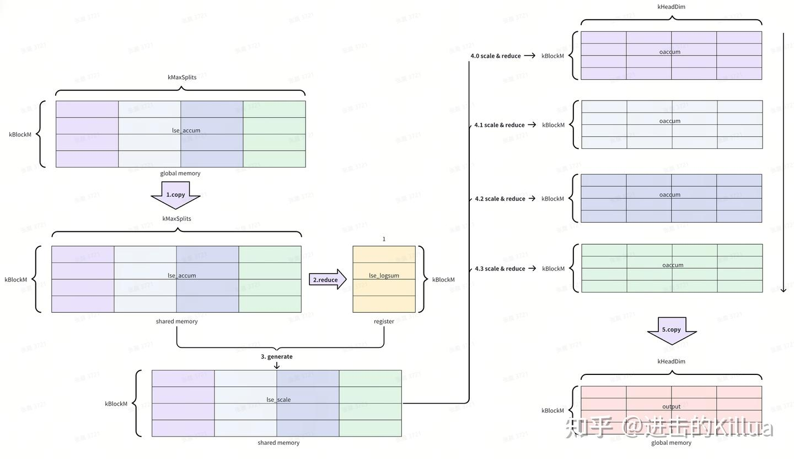

# Flash Attention源码解读（V2）
## 项目结构
* /training/run.py
 启动代码
通过hydra.main获取config信息
/training/configs/experiment/owt
base.yaml -> gpt2s-flash.yaml -> gpt2m-flash.yaml -> gpt2l-flash.yaml -> gpt2xl-flash.yaml
/training/configs/model
gpt2.yaml 定义了执行文件 target_: flash_attn.models.gpt.GPTLMHeadModel
* /training/src/train.py
checkpoint加载点、deepspeed、ddp
实际开始训练代码
trainer.fit(model=model, datamodule=datamodule, **ckpt_cfg)

* /flash_attn/models/gpt.py
 create_block() -> GPTModel -> GPTLMHeadModel 

* /flash_attn/modules/block.py
Block() ->create_block()
* /flash_attn/modules/mha.py
/flash_attn/__init__.py - > flash_attn_varlen_qkvpacked_func -> FlashSelfAttention -> MHA -> Block()
/flash_attn/__init__.py - > flash_attn_qkvpacked_func            -> FlashSelfAttention -> MHA -> Block()
* /flash_attn/flash_attn_interface.py
    flash_attn_func
    flash_attn_kvpacked_func
    flash_attn_qkvpacked_func
    flash_attn_varlen_func
    flash_attn_varlen_kvpacked_func
    flash_attn_varlen_qkvpacked_func
    flash_attn_with_kvcache

*  用flash_attn_qkvpacked_func函数举例
FlashAttnKVPackedFunc -> flash_attn_qkvpacked_func

* FlashAttnQKVPackedFunc - forward
flash_attn_cuda.fwd -> _flash_attn_forward -> forward._wrapped_flash_attn_forward -> FlashAttnQKVPackedFunc
```
if torch.__version__ >= "2.4.0":
    _wrapped_flash_attn_forward = torch.ops.flash_attn._flash_attn_forward
else:
    _wrapped_flash_attn_forward = _flash_attn_forward

```

flash_attn_cuda.bwd -> _flash_attn_backward -> backward
._wrapped_flash_attn_backward -> FlashAttnQKVPackedFunc
```
if torch.__version__ >= "2.4.0":
    _wrapped_flash_attn_backward = torch.ops.flash_attn._flash_attn_backward
else:
    _wrapped_flash_attn_backward = _flash_attn_backward
```

import flash_attn_2_cuda as flash_attn_cuda

到此python层面结束
* /setup.py
创建 flash_attn_2_cuda

* /csrc/flash_atten/flash_api.py
run_mha_fwd_ 					-> run_mha_fwd -> mha_fwd  -> fwd 
run_mha_fwd_splitkv_dispatch		-> run_mha_fwd -> mha_fwd  -> fwd
其他：
mha_varlen_fwd   -> varlen_fwd   
mha_bwd -> bwd 
mha_varlen_bwd   -> varlen_bwd
mha_fwd_kvcache -> fwd_kvcache

* 用run_mha_fwd_splitkv_dispatch 举例 csrc\flash_attn\src\flash_fwd_launch_template.h
flash::compute_attn_splitkv -> flash_fwd_splitkv_kernel -> run_flash_splitkv_fwd -> run_mha_fwd_splitkv_dispatch
```
DEFINE_FLASH_FORWARD_KERNEL(flash_fwd_splitkv_kernel, bool Is_causal, bool Is_local, bool Has_alibi, bool Is_even_MN, bool Is_even_K, bool Is_softcap, bool Split, bool Append_KV) {
    #if defined(ARCH_SUPPORTS_FLASH)
        flash::compute_attn_splitkv<Kernel_traits, Is_causal, Is_local, Has_alibi, Is_even_MN, Is_even_K, Is_softcap, Split, Append_KV>(params);
    #else
        FLASH_UNSUPPORTED_ARCH
    #endif
}
```

* csrc\flash_attn\src\flash_fwd_kernel.h
compute_attn_1rowblock_splitkv -> compute_attn_splitkv


## 代码逻辑
### forward
#### mha_fwd
* 参数
at::Tensor &q：查询张量，形状为 batch_size x seqlen_q x num_heads x round_multiple(head_size, 8)
const at::Tensor &k：键张量，形状为 batch_size x seqlen_k x num_heads_k x round_multiple(head_size, 8)。
const at::Tensor &v：值张量，形状为 batch_size x seqlen_k x num_heads_k x round_multiple(head_size, 8)。
c10::optional<at::Tensor> &out_：输出张量（可选），形状为 batch_size x seqlen_q x num_heads x round_multiple(head_size, 8)。
c10::optional<at::Tensor> &alibi_slopes_：ALiBi斜率张量（可选），形状为 num_heads 或 batch_size x num_heads。
const float p_dropout：dropout概率。
const float softmax_scale：softmax缩放因子。
bool is_causal：是否使用因果掩码。
int window_size_left：左侧窗口大小
int window_size_right：右侧窗口大小
const float softcap：softmax值的上限
const bool return_softmax：是否返回softmax值
c10::optional<at::Generator> gen_：随机数生成器（可选）

* 基本要求
1. FlashAttention仅支持 Ampere GPUs or newer
2. q\k\v 仅支持 fp16、bf16
3. 基本参数
batch_size = q.sizes()[0];
seqlen_q = q.size()[1];
num_heads = q.size()[2];
head_size = q.size()[3];                    head_size < 256 && head_size & 8 == 0;
seqlen_k = k.size()[1]; 
num_heads_k = k.size()[2];		num_heads % num_heads_k == 0 	(q的头数必须被k/v的头数整除)
window_size_left/right >= seqlen_k		window_size_left/right = -1;
is_causal							window_size_right = 0;
4. 对q进行重塑和转置操作
5. 数据格式优化
如果 head_size 小于或等于 192，则将其向上取整到最接近的 32 的倍数。
如果 head_size 大于 192，则将其设置为 256。
seqlen_q/k 被向上取整到最接近的 128 的倍数。

6. softmax 参数
7. Flash_fwd_params 配置上述参数
8. set_params_splitkv 定义cuda参数（block大小和grid大小

```
const int block_n = head_size <= 64 ? 256 : (head_size <= 128 ? 128 : 64);
```
为什么 head_size 越大，block_n 越小？


```
const int num_n_blocks = (max_seqlen_k + block_n - 1) / block_n;
```
其中 max_seqlen_k == seqlen_k

```
// Technically kBlockM = 64 only for the splitKV kernels, not the standard kernel.
// In any case we don't expect seqlen_q to be larger than 64 for inference.
const int num_m_blocks = (max_seqlen_q + 64 - 1) / 64;
```
标准内核通常不会固定块大小为64，而是会根据具体的计算任务和硬件特性动态调整块大小。标准内核的设计目标是通用性，能够处理各种不同的计算任务，因此不会像 splitKV 内核那样专门优化某个特定的块大小。

SpiltKV 执行不能设置dropout（即dropout = 0.0f）
```
// We multiply number of SMs by 2 to hard-code the fact that we're using 128 threads per block.
params.num_splits = num_splits_heuristic(batch_size * num_heads * num_m_blocks, dprops->multiProcessorCount * 2, num_n_blocks, 128);
```
num_splits_heuristic 来计算 num_splits
num_splits 表示将计算任务分成多少个部分（splits）。
dprops->multiProcessorCount * 2 表示 GPU 的多处理器数量乘以 2，假设每个块使用 128 个线程。


```
softmax_lse_accum = torch::empty({params.num_splits, batch_size, num_heads, max_seqlen_q}, opts.dtype(at::kFloat));
out_accum = torch::empty({params.num_splits, batch_size, num_heads, max_seqlen_q, head_size_rounded}, opts.dtype(at::kFloat));
params.softmax_lseaccum_ptr = softmax_lse_accum.data_ptr();
params.oaccum_ptr = out_accum.data_ptr();
```
初始化了两个张量 softmax_lse_accum 和 out_accum，分别用于存储 softmax 的对数和（log-sum-exp）和输出累加结果。
(1) softmax_lse_accum {params.num_splits, batch_size, num_heads, max_seqlen_q} 指定张量的形状
params.num_splits：表示将计算任务分成多少个部分（splits）。
batch_size：表示批量大小。
num_heads：表示多头注意力机制中的头数。
max_seqlen_q：表示查询序列的最大长度。

{2, 4, 8, 64}
表示有 2 个 splits，每个 split 有 4 个批次，每个批次有 8 个头，每个头有 64 个查询序列长度。

(2) out_accum = {params.num_splits, batch_size, num_heads, max_seqlen_q, head_size_rounded}
params.num_splits：表示将计算任务分成多少个部分（splits）。
batch_size：表示批量大小。
num_heads：表示多头注意力机制中的头数。
max_seqlen_q：表示查询序列的最大长度。
head_size_rounded：表示每个头的尺寸（可能进行了对齐处理）。

{2, 4, 8, 64, 64}
表示有 2 个 splits，每个 split 有 4 个批次，每个批次有 8 个头，每个头有 64 个查询序列长度，每个头的尺寸为 64。


9. num_splits_heuristic
通过启发式方法找到最佳的 num_splits，以最大化 GPU 的占用率（occupancy），同时避免过多的 HBM（High Bandwidth Memory）读写操作。

int batch_nheads_mblocks: batch_size * num_heads * num_m_blocks
int num_SMs: dprops->multiProcessorCount * 2
int num_n_blocks: num_n_blocks
int max_splits: 128

(1) 如果 batch_nheads_mblocks（即 batch_size * num_heads * num_m_blocks）足够大，接近填充所有多处理器（SMs）的 80%，则直接返回 1，表示不需要进一步分割。
(2) 限制 max_splits 的最大值为 max_splits、num_SMs 和 num_n_blocks 中的最小值。
(3)
```
float max_efficiency = 0.f;
std::vector<float> efficiency;
efficiency.reserve(max_splits);
```
max_efficiency：用于存储最大效率。
efficiency：用于存储每个 num_splits 的效率。

(4) 计算每个 num_splits 的效率
(5) 选择最佳的 num_splits, 返回这个 num_splits

10. 在CUDA线程中使用自定义的随机数生成器（RNG），并通过增加偏移量来调整philox计数器的状态

11. set_params_alibi 设置ALiBi（Attention with Linear Biases）的参数
params 是参数结构体，包含ALiBi的参数，RNG。
alibi_slopes_ 是ALiBi的斜率（slopes），用于计算位置偏置。
batch_size 是批次大小。
num_heads 是多头注意力机制中的头数。

12. run_mha_fwd 开始执行前向传播
```
if (seqlen_k > 0) {
    auto stream = at::cuda::getCurrentCUDAStream().stream();
    run_mha_fwd(params, stream);
} else {
    // If seqlen_k == 0, then we have an empty tensor. We need to set the output to 0.
    out.zero_();
    softmax_lse.fill_(std::numeric_limits<float>::infinity());
}
```

#### run_mha_fwd(run_mha_fwd_)
在CUDA中根据不同的硬件特性和参数选择合适的内核来运行Flash Attention前向传播
csrc\flash_attn\src\flash_fwd_hdim128_bf16_causal_sm80.cu 举例
run_mha_fwd_hdim128

csrc\flash_attn\src\flash_fwd_launch_template.h
void run_mha_fwd_hdim128(Flash_fwd_params &params, cudaStream_t stream) 

1.  Headdim = 128
2.  根据 Is_causal 选择不同的内核


template<typename Kernel_traits, bool Is_dropout, bool Is_causal>
void run_flash_fwd(Flash_fwd_params &params, cudaStream_t stream) 

```
constexpr size_t smem_size = Kernel_traits::kSmemSize;
```
smem_size 是内核所需的共享内存大小。

```
const int num_m_block = (params.seqlen_q + Kernel_traits::kBlockM - 1) / Kernel_traits::kBlockM;
dim3 grid(num_m_block, params.b, params.h);
```
num_m_block 是M维度的块数。
grid 是CUDA内核的网格大小，包含M、批次大小和头数。

```
const bool is_even_MN = params.cu_seqlens_q == nullptr && params.cu_seqlens_k == nullptr && params.seqlen_k % Kernel_traits::kBlockN == 0 && params.seqlen_q % Kernel_traits::kBlockM == 0;
```
is_even_MN 是一个布尔值，表示M和N维度是否均匀。

```
const bool is_even_K = params.d == Kernel_traits::kHeadDim;
```
is_even_K 是一个布尔值，表示K维度是否均匀。

```
const bool return_softmax = params.p_ptr != nullptr;
```
return_softmax 是一个布尔值，表示是否返回softmax。

```
auto kernel = &flash_fwd_kernel<Kernel_traits, Is_dropout && !Is_softcap, Is_causal, Is_local && !Is_causal, Has_alibi, IsEvenMNConst && IsEvenKConst && !Is_local && !ReturnSoftmaxConst && Kernel_traits::kHeadDim <= 128, IsEvenKConst, Is_softcap, ReturnSoftmaxConst && Is_dropout && !Is_softcap>;
```
根据不同的模板参数选择合适的内核。

```
if (smem_size >= 48 * 1024) {
    C10_CUDA_CHECK(cudaFuncSetAttribute(
        kernel, cudaFuncAttributeMaxDynamicSharedMemorySize, smem_size));
}
```
如果共享内存大小超过48KB，设置动态共享内存大小

```
kernel<<<grid, block, smem_size, stream>>>(params);
```
cudaLaunchKernel 用于启动CUDA内核。
smem_size 是动态共享内存的大小。


> 跳转到flash_fwd_kernel.h


#### run_mha_fwd(run_mha_fwd_splitkv_dispatch)

在之前的基础上对kv维度进行了进一步的拆分，分配到不同thread block中并行运行，然后再合并中间结果生成最终结果，适用于batch_size x seq_len x head_size 不够大等场景，以进一步增大并行度提高GPU利用率。

*  Prologue
旋转嵌入的内存块复制操作


#### flash_fwd_kernel.h
csrc\flash_attn\src\flash_fwd_kernel.h


template<typename Kernel_traits, bool Is_dropout, bool Is_causal, bool Is_local, bool Has_alibi, bool Is_even_MN, bool Is_even_K, bool Is_softcap, bool Return_softmax, typename Params>
inline __device__ void compute_attn(const Params &params)


template<typename Kernel_traits, bool Is_dropout, bool Is_causal, bool Is_local, bool Has_alibi, bool Is_even_MN, bool Is_even_K, bool Is_softcap, bool Return_softmax, typename Params>
inline __device__ void compute_attn(const Params &params)


template<typename Kernel_traits, int kBlockM, int Log_max_splits, bool Is_even_K, typename Params>
inline __device__ void combine_attn_seqk_parallel(const Params &params)


#### compute_attn - compute_attn_1rowblock


* 输入参数
1. Is_causal: 是否需要应用causal_mask, 与Is_local互斥，计算公式 i+k-q > 0 则为 1（掩码掉设置为0） 或者 保留
其中 i 为 当前查询q的位置， k 为 查询 k 的位置
if seqlen_q = 2 and seqlen_k = 5, the causal mask (1 = keep, 0 = masked out) is:
        1 1 1 1 0
        1 1 1 1 1
If seqlen_q = 5 and seqlen_k = 2, the causal mask is:
        0 0
        0 0
        0 0
        1 0
        1 1


2. Is_local
是否应用sliding_window_local_attention, =(params.window_size_left >= 0 || params.window_size_left >= 0) && !Is_causal

query位置i对应的key计算范围 [i + seqlen_k - seqlen_q - window_size[0], i + seqlen_k - seqlen_q + window_size[1]]
(window_size_left,window_size_left) 到本函数有四种取值：
(-1, -1)：表示不应用滑动窗口局部注意力。
(seq_len_k, >=0)：表示左侧窗口大小为键序列的长度，右侧窗口大小为非负数。
(>=0, seq_len_k)：表示左侧窗口大小为非负数，右侧窗口大小为键序列的长度。
(>=0, >=0)：表示左侧和右侧窗口大小均为非负数。

3. Has_alibi
是否加上alibi斜率偏置，=params.alibi_slopes_ptr != nullptr
(-alibi_slope * |i + seqlen_k - seqlen_q - j|) is added to the attention score of query i and key j.
4. Is_even_MN
用kBlockM和kBlockN对seqlen_q和seqlen_k进行分块后是否能被整除，params.seqlen_k % Kernel_traits::kBlockN == 0 && params.seqlen_q % Kernel_traits::kBlockM == 0
5. Is_even_K
headDim是否是32的倍数，模板对headDim进行了32,64,96,128,160,192,224,256的向上取整，=params.d == Kernel_traits::kHeadDim

* 基本参数
S=QK, P=softmax(S), O=PV
1. shared memory
2. tid, kBlockM, kBlockN, kHeadDim,KNWarps
 // eg. Flash_fwd_kernel_traits<Headdim, 128, 32, 4, false, false, T>
seqlen_q 维度按kBlockM进行划分，每个threadblock处理kBlockM大小的q，eg. 128
seqlen_k 维度按kBlockN进行划分，每个threadblock处理完整的seqlen_k，按kBlockN大小切分后迭代计算，eg.32
每个head处理的维度，eg. 32,64,96,128,160,192,224,256
一个threadblock中的设置的warps数量，eg.4

1. seed, offset, dropout
2. 0块线程，保存 RNG 状态（seed，offset），用于反向传播
3. m_block * kBlockM >= binfo.actual_seqlen_q ，满足条件提前退出当前线程块的执行（确定m block 执行的范围）
4. 确定n block执行的范围
5. 在键序列长度为零或处理范围无效时，以避免访问越界元素
提前退出并写入零到全局内存中的输出（gO）和局部缩放指数（gLSE）
(Is_causal || Is_local || !Is_even_MN) && n_block_max <= n_block_min
1. 反向迭代块（提前知道最后一个块需要掩码处理，从而在读取全局内存时直接应用掩码，并且可能减少寄存器的使用。）【重点】
为了在从全局内存读取K和V时，最后一个块需要进行掩码处理。此外，反向迭代可能节省一个寄存器（只需要n_block而不是n_block和n_block_max）

row_offset_p，mQ，gQ，mK，gK，mV，gV，gP
sQ, sK, SV, sVt, sVtNoSwizzle
gP 是一个张量，用于存储注意力分数矩阵（Attention Scores Matrix）。在自注意力机制中，注意力分数矩阵是通过查询（Q）和键（K）的点积计算得到的。gP 的作用是将这些注意力分数矩阵分块加载到共享内存中，以便在GPU上进行高效的计算

9. 创建张量，将全局内存中的查询（Q）、键（K）和值（V）张量分块加载到共享内存中
10. 创建张量，将共享内存中的查询（Q）、键（K）和值（V）张量重新分块（retiling）
11. 设置谓词
12. 实际将（QK）数据从全局内存（gmem）拷贝到共享内存（smem），并在必要时进行同步操作
flash::copy
13. 将两种不同的迭代分开处理：

(1) 需要对S进行掩码处理的迭代部分，（带mask的主体计算）
(a) 当K和V的长度不是kBlockN的整数倍时，最后一个块需要进行掩码处理。
(b) 如果S是因果的（causal），则对于最后ceil_div(kBlockM, kBlockN)个块，也需要进行掩码处理。
如果even_N为假（即不是kBlockN的整数倍），那么seqlen_k可能会在一个块的中间结束。在这种情况下，我们需要对两个块进行掩码处理（例如，当kBlockM == kBlockN时），而不仅仅是一个块。


计算出在不同情况下需要进行的掩码步骤的数量。关键在于是否是因果关系、是否是局部关系、以及块的大小关系（kBlockM 和 kBlockN）。
(a) tiled_mma 分区为一个形状为 (MMA=4, MMA_M, MMA_N) 的张量 acc_s
(b) 根据 masking_step 的值来处理 gV 的复制操作
masking_step == 0, 清理最后一块block中共享存储的数据(/*Clear_OOB_MN=*/true)
masking_step > 0, 进行数据的复制操作
(c) 进行矩阵乘法(QK)操作，将结果存储在 acc_s 中
```
flash::gemm</*A_in_regs=*/Kernel_traits::Is_Q_in_regs>(
    acc_s, tSrQ, tSrK, tSsQ, tSsK, tiled_mma, smem_tiled_copy_Q, smem_tiled_copy_K,
    smem_thr_copy_Q, smem_thr_copy_K
);
```
softcap 限制矩阵乘法结果的最大值，防止数值溢出或不稳定。

(d) 应用掩码到矩阵乘法的结果 acc_s 上
(e) 对不完整的块，能够正确地进行数据复制和同步，避免数据竞争和计算错误
(f) acc_s从fp32转成fp16/bf16 存为 rp, 判断是否使用dropout
(g) 根据硬件重塑rp
在代码中，rP 的原始形状为 (MMA=4, MMA_M, MMA_N)。根据使用的矩阵乘法内核（如 m16n8k16 或 m16n8k8），rP 的形状可能会被重塑为 ((4, 2), MMA_M, MMA_N / 2) 或保持为 (4, MMA_M, MMA_N)。
(h) rp (S) 和 V相乘


(2) 不需要对S进行掩码处理的迭代部分

类似（1）

1.  后处理（epilogue）
计算对数似然估计（LSE）softmax 
将 lse 张量中的值写入到 gLSE 张量中
最终将处理后的输出数据存储到全局内存中。
寄存器->共享内存 -> 寄存器 -> 全局内存，这样做的目的是对数据重新排列后最大化寄存器输出到全局内存的写入带宽


#### compute_attn - compute_attn_1rowblock_splitkv


首先介绍下拆分成多少个split的代码逻辑，主要目标是最大化SM利用率，根据batch x num_heads x q_len乘积结果、当前GPU的硬件特性(SM个数)和拆分前kv组数来计算最终拆分的组数，尽量让SM利用率保持在85%以上，代码如下所示。
1. 计算得到kv上的切分数，从而最大化SM利用率
2. batch_nheads_mblocks是batch, heads, q_len维度上的分组数，作为最终block数的一项乘法因子
3. num_n_blocks是拆分前kv组数
4. 计算拆分后的平均efficiency
5. 选择满足85%利用率最小的拆分

* 对block table类型的kvcache使用
首先介绍block table类型的kvcache的使用，kvcache就不多介绍已经成为事实标准了，这里的block table主要是引用了pagedAttention的分页思想，优化 kvcache 内存管理，增大吞吐量。

kvcahce的shape不再按照逻辑上的(batch_size_cache, seqlen_cache, nheads_k, headdim)进行存储，而是变成(num_blocks, page_block_size, nheads_k, headdim)，即按page_block_size进行了划分




由于page_block_size足够大且是256倍数，所以一次(kBlockM,kHeadDim)x(kHeadDim,kBlockN)的运算读取的内容发生在单块内，不存在跨block的可能性

kvcache的组织shape是(num_blocks, page_block_size, nheads_k, headdim)，而运算是(kBlockM,headdim)，如何跨越nheads维度进行计算呢？代码里使用到了cute::Tensor定义中的stride进行跨nhead抽取，从而方便进行head并行运算。
```
Tensor gK = make_tensor(make_gmem_ptr(reinterpret_cast<Element *>(params.k_ptr) + row_offset_k),
                        Shape<Int<kBlockN>, Int<kHeadDim>>{},
                        make_stride(params.k_row_stride, _1{})); // 使用k_row_stride进行tensor组织
Tensor gV = make_tensor(make_gmem_ptr(reinterpret_cast<Element *>(params.v_ptr) + row_offset_v),
                        Shape<Int<kBlockN>, Int<kHeadDim>>{},
                        make_stride(params.v_row_stride, _1{})); // 使用v_row_stride进行tensor组织
```


#### flash_fwd_splitkv_combine_kernel

调用链：flash_fwd_splitkv_combine_kernel -> combine_attn_seqk_parallel

每个split block在完成attention计算后都生成了(kBlckM, kHeadDim)的中间结果，combine_attn_seqk_parallel 这个函数的作用就是将split_num个(kBlckM, kHeadDim)中间结果校正归约成最终正确的结果，整体流程如下图所示，总共有5个小步骤。

1. 将lse_accum从全局内存拷贝到共享内存。
2. 对lse_accum进行归约，求得最终真实的lse_logsum。
3. 利用lse_logsum和lse_accum生成校正的lse_scale。
4. 利用lse_scale对每个(kBlckM, kHeadDim)中间结果进行校准后归约求和。
5. 将结果写回全局内存中。




## bwd

* flash_api - bwd - mha_bwd
dout: 输出梯度，形状为 batch_size x seqlen_q x num_heads x multiple_of(head_size_og, 8)。
q: 查询张量，形状为 batch_size x seqlen_q x num_heads x head_size。
k: 键张量，形状为 batch_size x seqlen_k x num_heads_k x head_size。
v: 值张量，形状为 batch_size x seqlen_k x num_heads_k x head_size。
out: 输出张量，形状为 batch_size x seqlen_q x num_heads x head_size。
softmax_lse: softmax的对数和，形状为 batch_size x num_heads x seqlen_q。
dq_: 查询梯度的可选张量，形状为 batch_size x seqlen_q x num_heads x head_size。
dk_: 键梯度的可选张量，形状为 batch_size x seqlen_k x num_heads_k x head_size。
dv_: 值梯度的可选张量，形状为 batch_size x seqlen_k x num_heads_k x head_size。
alibi_slopes_: ALiBi斜率的可选张量，形状为 num_heads 或 batch_size x num_heads。
p_dropout: 丢弃概率。
softmax_scale: softmax的缩放因子。
is_causal: 是否为因果关系。
window_size_left: 左窗口大小。
window_size_right: 右窗口大小。
softcap: 软上限值。
deterministic: 是否确定性。
gen_: 随机数生成器的可选对象。
rng_state: 随机数状态的可选张量。


* dq_、dk_、dv_在反向传播中的作用
计算输出梯度：从最终输出开始，计算输出梯度 dout。
计算值的梯度：使用 dout 计算值 V 的梯度 dv_。
计算键的梯度：使用 dout 和 dv_ 计算键 K 的梯度 dk_。
计算查询的梯度：使用 dout 和 dk_ 计算查询 Q 的梯度 dq_。

* loop、dq_accum
loop 变量用于控制是否在计算梯度时使用循环。具体来说，它决定了是否需要将计算任务分成多个小块（blocks）来处理。
长序列：当序列长度（seqlen_k）大于某个阈值（blocksize_c）时，使用循环可以更高效地处理长序列。

dq: 分块计算：在循环模式下，计算任务会被分成多个小块（blocks），每个小块处理一部分序列。每个小块的梯度会被累积到 dq_accum 中。
汇总梯度：在所有小块处理完毕后，dq_accum 中累积的梯度会被汇总，得到最终的查询梯度 dq。

* set_params_dgrad
params: 参数结构体，用于存储所有配置参数。
batch_size: 批量大小。
seqlen_q: 查询序列的长度。
seqlen_k: 键序列的长度。
seqlen_q_rounded: 查询序列长度四舍五入后的值。
seqlen_k_rounded: 键序列长度四舍五入后的值。
num_heads: 注意力头的数量。
num_heads_k: 键的注意力头数量。
head_size: 每个注意力头的维度大小。
head_size_rounded: 每个注意力头维度大小四舍五入后的值。
q: 查询张量。
k: 键张量。
v: 值张量。
out: 输出张量。
dout: 输出梯度张量。
dq: 查询梯度张量。
dk_expanded: 键梯度扩展张量。
dv_expanded: 值梯度扩展张量。
nullptr: 空指针，表示某些参数不需要传递。
loop ? dq_accum.data_ptr() : nullptr: 如果 loop 为真，传递 dq_accum 的数据指针，否则传递空指针。
softmax_lse.data_ptr(): softmax 对数求和项的数据指针。
softmax_d.data_ptr(): softmax 梯度的数据指针。
p_dropout: dropout 概率。
softmax_scale: softmax 缩放因子。
window_size_left: 左窗口大小。
window_size_right: 右窗口大小。
softcap: 软上限值。
deterministic: 是否确定性模式。
unpadded_lse: 是否使用未填充的对数求和项（此处为 false）。

* launch 发布任务  -> run_mha_bwd -> run_mha_bwd_ 
run_mha_bwd_ -> 例如：csrc\flash_attn\src\flash_bwd_hdim32_bf16_causal_sm80.cu
flash_bwd_hdim32_bf16_causal_sm80.cu -> 
csrc\flash_attn\src\flash_bwd_launch_template.h -> run_flash_bwd
run_flash_bwd -> run_flash_bwd_seqk_parallel 

1. 计算M和N方向的块数
2. 调用 flash_bwd_dot_do_o_kernel - compute_dot_do_o 内核函数
用于计算 dot(do, o) 并将结果（softmax_d）写入全局内存。这个函数主要用于在反向传播过程中并行化处理 seqlen_k 的情况。
3. flash_bwd_dq_dk_dv_loop_seqk_parallel_kernel - compute_dq_dk_dv_seqk_parallel - compute_dq_dk_dv_1colblock

4. flash_bwd_convert_dq_kernel - convert_dQ<<<>>>
用于将 dQaccum（以浮点数形式存储）转换为 fp16 或 bf16 格式。这个函数主要用于在反向传播过程中并行化处理 seqlen_k 的情况


### compute_dq_dk_dv_1colblock
csrc\flash_attn\src\flash_bwd_kernel.h - compute_dq_dk_dv_1colblock

* 模板函数
Kernel_traits: 包含内核特性的类型，如元素类型、累加器类型、索引类型等。
Is_dropout: 是否启用dropout。
Is_causal: 是否启用因果掩码（causal masking）。
Is_local: 是否启用局部注意力（local attention）。
Has_alibi: 是否启用ALiBi（Attention with Linear Biases）。
Is_even_MN: 是否M和N是偶数。
Is_even_K: 是否K是偶数。
Is_softcap: 是否启用softcap。
Is_first: 是否是第一个块。
Is_last: 是否是最后一个块。
Seq_parallel: 是否启用序列并行。
Params: 包含参数的类型。

* 入参
params: 包含所有参数的对象。
bidb: 块的批处理索引。
bidh: 块的注意力头索引。
n_block: 块的数量。


* 其他参数
MMA_N_SdP ：用于计算矩阵乘法累加（MMA）操作中的N维度大小。通过将块的N维度大小除以MMA操作的平铺大小
AtomLayoutMS ：
Double_buffer ：


* 全局内存张量/共享内存的创建
* 全局内存平铺复制对象
* 全局内存/共享内存中的输出梯度矩阵进行分区
全局内存/共享内存中的键矩阵进行分区
对共享内存/全局内存中的查询梯度矩阵进行分区

* 使用平铺矩阵乘法累加对象对张量进行分区，确保在CUDA内核中能够高效地进行矩阵乘法操作
* PREDICATES，根据Is_even_K设置谓词张量
* 数据复制和同步
* 根据不同的条件对 scores 张量进行掩码操作，以避免在后续计算中出现数值溢出或不正确的结果
1. 如果既不是因果关系也不是局部关系，则应用非因果和非局部掩码。
2. 如果是因果关系，则应用因果掩码。
3. 如果是局部关系，则应用局部掩码。
* 计算 scores 张量的指数值，并在必要时应用Dropout操作
* 将 scores 从 fp32 转换为 fp16/bf16

* 计算注意力分数的梯度， dQK。将矩阵乘法的结果重塑为与 scores 相同的布局，并进行逐点操作
```
flash::gemm</*A_in_regs=*/false, /*B_in_regs=*/Kernel_traits::Is_V_in_regs>(
    acc_dp, tdPrdO, tdPrV, tdPsdO, tdPsV, tiled_mma_sdp,
    smem_tiled_copy_QdO, smem_tiled_copy_KV, smem_thr_copy_QdO, smem_thr_copy_KV
);
```
* 主要功能是实现Q双缓冲机制，并在必要时更新数据指针和执行数据复制操作
* 计算 dV 的梯度。具体来说，它执行的是 P 的转置和 dO 的转置的矩阵乘法，结果存储在 acc_dv 中
```
flash::gemm(acc_dv, tdVrPt, tdVrdO, tdVsPt, tdVsdOt, tiled_mma_dkv,
                    smem_tiled_copy_PdSt, smem_tiled_copy_QdOt, smem_thr_copy_PdSt, smem_thr_copy_QdOt);
```
* 计算 dQ 的梯度。具体来说，它执行的是 dS 和 K 的转置的矩阵乘法，结果存储在 acc_dq 中。
```
flash::gemm(acc_dq, tdQrdS, tdQrKt, tdQsdS, tdQsKt, tiled_mma_dq,
            smem_tiled_copy_dS, smem_tiled_copy_Kt, smem_thr_copy_dS, smem_thr_copy_Kt);
```
* 计算 dK 的梯度。具体来说，它执行的是 dS 的转置和 Q 的转置的矩阵乘法，结果存储在 acc_dk 中
```
flash::gemm(acc_dk, tdKrdSt, tdKrQt, tdKsdSt, tdKsQt, tiled_mma_dkv,
                    smem_tiled_copy_PdSt, smem_tiled_copy_QdOt, smem_thr_copy_PdSt, smem_thr_copy_QdOt);
```

