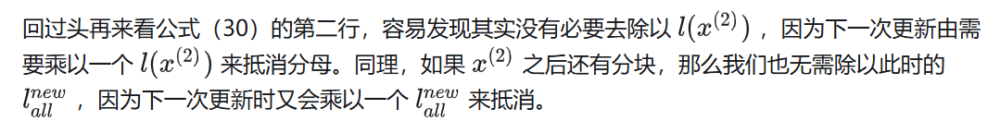
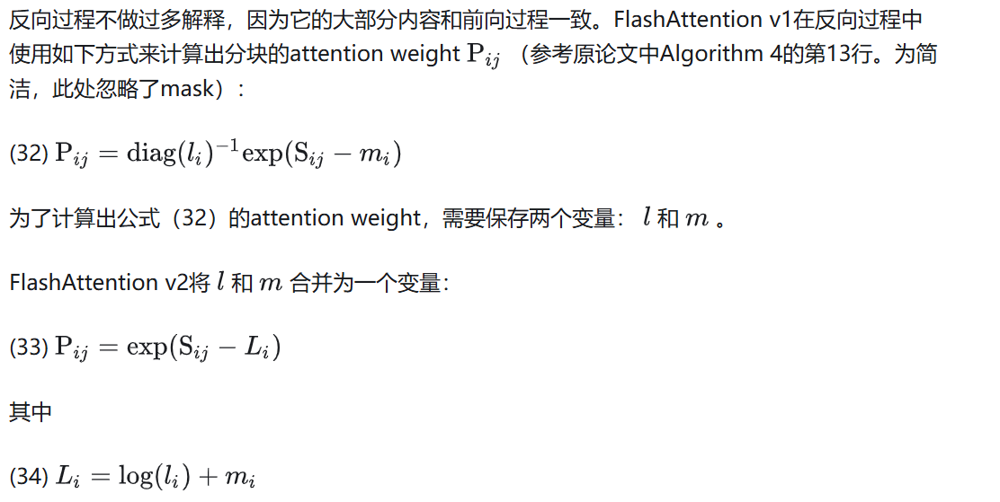

# flash attention v2

https://github.com/Dao-AILab/flash-attention

flash attention v1计算速度提升2至4倍，但是它的整体吞吐量仍然较低
在A100上，FlashAttention v1的forward吞吐量只有GPU极限的30%至50%；而backward甚至只有25%至35%。

## 优化

### 算法（Algorithm）
FlashAttention v2在纯算法层面对前向过程和反向过程都做了细微的改进。我们先来看前向过程。

* 前向过程

分析

结论

直到处理完最后一个分块后，直接用此时的全局EXP求和项来做分母即可。

例子

* Causal Masking的简单优化

* 反向过程

### 并行（Parallelism）

#### FlashAttention v1的并行策略

#### FlashAttention v2的并行策略

### 计算分片（Work Partitioning）

#### FlashAttention v1

#### FlashAttention v2

# 引用
https://arxiv.org/pdf/2307.08691
https://zhuanlan.zhihu.com/p/642962397

 