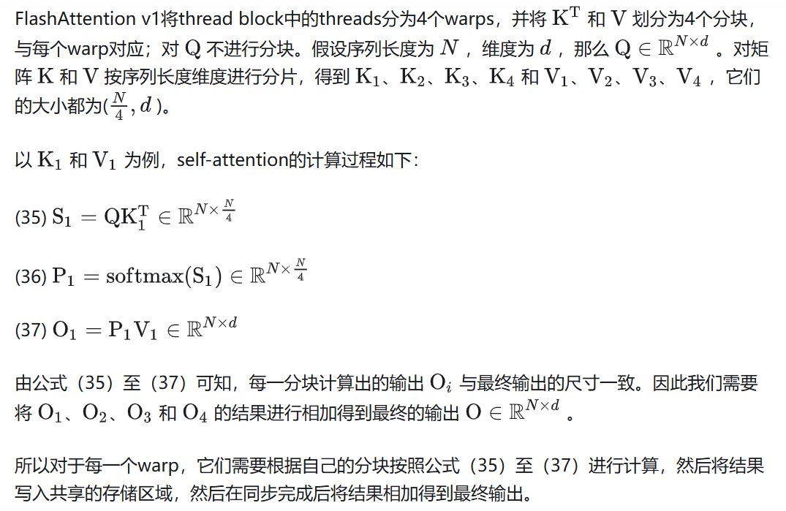

# flash attention v2

https://github.com/Dao-AILab/flash-attention

flash attention v1计算速度提升2至4倍，但是它的整体吞吐量仍然较低
在A100上，FlashAttention v1的forward吞吐量只有GPU极限的30%至50%；而backward甚至只有25%至35%。

## 优化

### 算法（Algorithm）
FlashAttention v2在纯算法层面对前向过程和反向过程都做了细微的改进。我们先来看前向过程。

* 前向过程

分析

结论

直到处理完最后一个分块后，直接用此时的全局EXP求和项来做分母即可。

例子

* Causal Masking的简单优化

* 反向过程

### 并行（Parallelism）

#### FlashAttention v1的并行策略

#### FlashAttention v2的并行策略

对于Work Partitioning Between Warps这一部分，我有不同的理解。论文作者并没有写错，是shared memory。

v1中，o需要不断的从hbm读写，但是，v2中，kv也要反复从hbm里面读到sram在这一点上，算打个平手。

v2 Work Partitioning Between Warps这一部分主要的改进是，warp之间的通信，同步大大减少，导致性能提高

### 计算分片（Work Partitioning）

#### FlashAttention v1

#### FlashAttention v2

# 引用
https://arxiv.org/pdf/2307.08691
https://zhuanlan.zhihu.com/p/642962397

 

# 其他

*  1

对于Work Partitioning Between Warps这一部分，我有不同的理解。论文作者并没有写错，是shared memory。

v1中，o需要不断的从hbm读写，但是，v2中，kv也要反复从hbm里面读到sram在这一点上，算打个平手。

v2 Work Partitioning Between Warps这一部分主要的改进是，warp之间的通信，同步大大减少，导致性能提高

* 2

同意。因为v1计算该块的Oi时，每个warp算出了矩阵乘的部分结果(Oi)，需要先写入共享内存。然后再同步，并重新读取，reduce成一个。会有额外的共享内存读写开销，和不同warp同步的开销。

v2对Qi分块，每个warp能得到矩阵乘的部分完整结果。可以直接写到共享内存中该结果的对应部分，不需要warp之间同步了。也不需要再像v1一样把部分和从共享内存读出来，写到最终结果

其实block内部对Qi分块，有点类似于外部循环中，不同block对Q分块：

不同block中，计算不同的Qi,得到完整的Oi,不同block之间不需要交互，直接得到完整O的一部分(即完整Oi)；（v1外循环KV的话，每个block得到的局部O,大小同最终O,需要同步才能得到最终结果）

这里不同warp,计算Qi的不同部分，得到完整Oi的一部分，不同warp之间也不需要交互。

思想是一样的，都是让最终结果是完整结果的一部分，省去不同块之间交互的开销。

* 3
说一下我的理解（初学者，轻喷）
1. v1到v2的循环变量交换，主要是出于效率考虑(gpu利用率，主要瓶颈)
- 原先按(batch_size,head)的方式 拆不出太多block，无法把gpu算力打满(SM可能比block还多)，所以加了一维seq_len来拆
- 不同q的计算是独立的，没有额外的同步成本，可以尽量把算力打满

- 如果按k来拆，因为softmax需要归一化，还需要同步，reduce
- causal mask下不同q的kv长度不同，计算量会不平衡，并行度需要进一步提高
2. 访存量（load QKVO from HBM）
- v1: (k, v) * #col + (q, o) * #col * #row = sizeof(K, V) + sizeof(Q, O) * #col
- v2: q * #row + (k, v) * #col * #row = sizeof(Q) + sizeof(K, V) * #row
- 这里的#col和#row跟block_size有关，按paper中的说法，是比较接近的，所以可以认为差不多
- QKV的size也是一样的；如果是multi query attention的话，理论上还可以进一步优化，减少kv的访存量
- 综上，v1比v2主要是多了load O的成本，v2是直接在shared mem上初始化的

