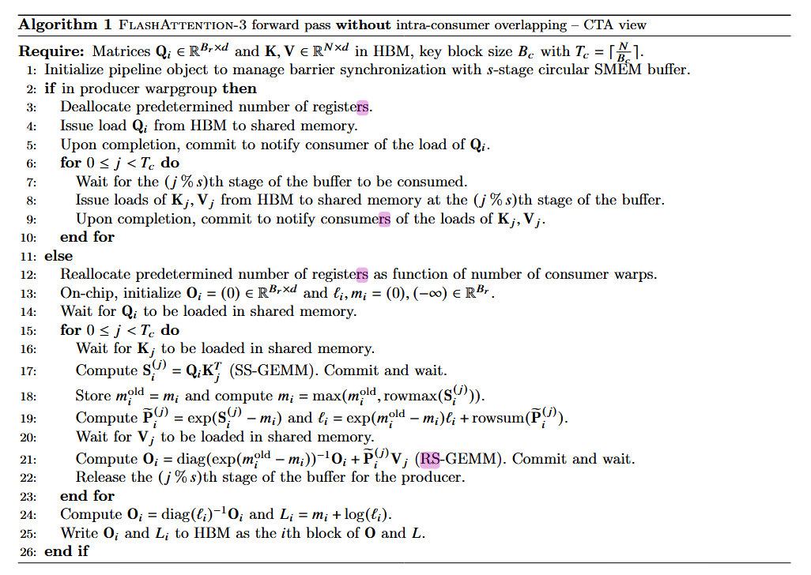
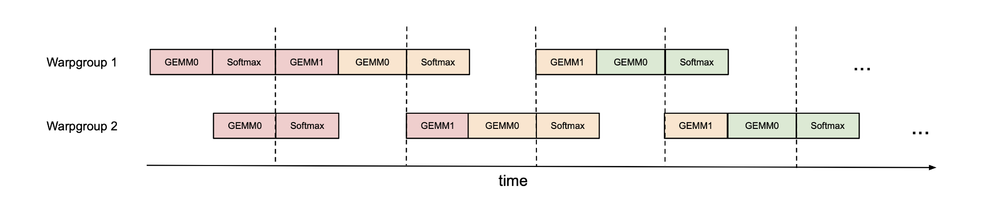
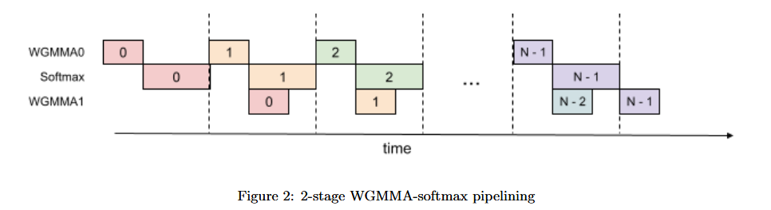
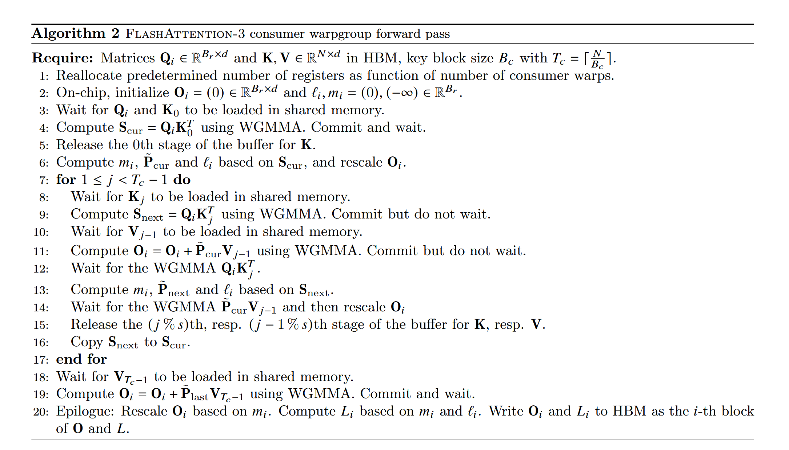
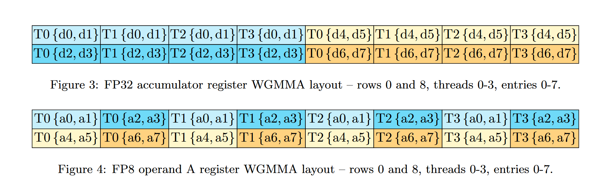
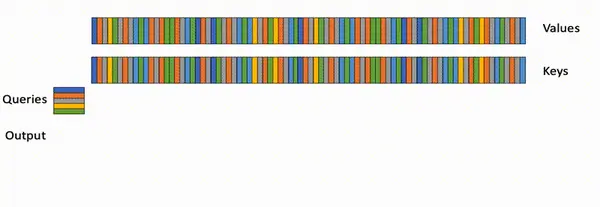
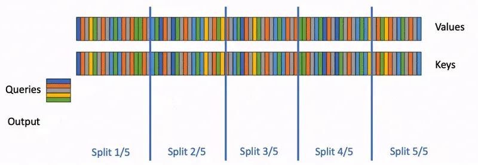

# flash attention v3

https://tridao.me/publications/flash3/flash3.pdf
https://tridao.me/blog/2024/flash3/

FlashAttention-2 在H100上利用率不高 35%

（利用 Tensor Core 和 TMA 的异步性）加速Hopper架构GPU attention：
1. 通过warp覆盖计算和数据移动
2. 交错分块 matmul 和 softmax 运算
3. 块量化和FP8精度

ThunkerKitten [https://github.com/ HazyResearch/ThunderKittens] 和 cuDNN 9 [https://developer.nvidia. com/blog/accelerating-transformers-with-nvidia-cudnn-9/] 等多项工作表明，利用 Hopper 特定的指令和基于图块的抽象，可以加速注意力计算并简化实现。

执行矩阵乘法（张量核心）或内存加载（张量内存加速器 - TMA）

贡献：
1. 生产者-消费者异步：定义了一种 warp 专用软件流水线方案，通过将数据的生产者和消费者拆分为单独的 warp 来利用数据移动和 Tensor Core 的异步执行，从而扩展算法隐藏内存和指令发出延迟的能力。
2. 在异步分块 GEMM 下隐藏 softmax：WGMMA
3. 硬件加速的低精度 GEMM：FP8

## 背景
Hopper 的 Tensor Core 通过 warpgroup 范围的 WGMMA 指令 ，可以直接从共享内存获取输入

threadblocks（CTA） 的 warp 被分为生产者或消费者角色，它们只发出数据移动或计算。一般来说，这提高了编译器生成最佳指令调度的能力
Hopper 支持通过 setmaxnreg  在 warpgroup 之间动态重新分配寄存器，因此那些执行 MMA 的 warp 可以获得比那些只发布 TMA 的 warp 更大的 RMEM 份额（只需要一个线程） 。

WGMMA 指令可以针对 Hopper 上的 FP8 张量核心，与 FP16 或 BF16 相比，为每个 SM 提供 2 倍的吞吐量。

## 工作

### 算法

#### Warp-specialization

* 使用 setmaxnreg 进行（取消）分配
* 使用 TMA 加载 Qi 、K、V
* 使用 WGMMA 在消费者主循环中执行 GEMM
* 使用 SS 或 RS 前缀指示第一个操作数是否来自共享内存或寄存器文件
  

#### Pingpong scheduling

WGMMA and TMA 专门为warp提供异步性，提供了将一个 warpgroup 的 softmax 计算与另一 warpgroup 的 GEMM 重叠的机会。

* Pingpong scheduling
指数（e^x操作）是由单独的硬件单元（多功能单元）执行的，因此理想情况下，我们希望在 Tensor Core 执行 matmul 时安排指数计算。
1. 同步屏障（bar.sync 指令）强制将 warpgroup 1 的 GEMM 安排在 warpgroup 2 的 GEMM 之前
因此，当 warpgroup 2 执行其 GEMM 时，将调度 warpgroup 1 的 softmax
然后角色交换，warpgroup 2 执行 softmax，而 warpgroup 1 执行 GEMM（因此，“乒乓”调度）

#### 组内Warp 重叠 GEMM 和 softmax

* 两阶段 GEMM-softmax pipelining algorithm
在注意力算法中，内循环（主循环）内的操作具有顺序依赖性，这会阻碍单次迭代内的并行化。

例如：（局部）softmax （第 18 至 19 行）依赖于第一个 GEMM 的输出，而第二个 GEMM 将其结果作为操作数
事实上，算法 1 第 17 行和第 21 行中的等待语句串行化了 softmax 和 GEMM 的执行。

1. 通过寄存器中的附加缓冲区在迭代之间进行管道化来打破这些依赖性。

使用 WGMMA 作为异步 GEMM 的转喻。
在主循环（第 8 行到第 16 行）内，迭代 j 的第二个 WGMMA 操作（第 11 行）与迭代 j ̧ 1（第 13 行）的 softmax 操作重叠

在主循环（第 8 行到第 16 行）内，迭代 j 的第二个 WGMMA 操作（第 11 行）与迭代 j ̧ 1（第 13 行）的 softmax 操作重叠

仍然要考虑：
1. Compiler reordering：伪代码表示理想化的执行顺序，但编译器 (NVCC) 经常重新排列指令以进行优化。这可能会破坏精心设计的 WGMMA 和非 WGMMA 操作流水线序列，可能导致意外行为或性能增益降低。对 SASS 代码的分析表明编译器按预期生成了重叠代码
2. Register pressure：为了保持最佳性能，应尽量减少寄存器溢出。然而，2 级流水线需要额外的寄存器来存储中间结果并维护阶段之间的上下文。具体来说，额外的 Snext 必须保留在寄存器中，导致每个线程块额外使用大小 Br Bc sizeof1floato 的寄存器。这种增加的寄存器需求可能与使用更大的块大小（另一种常见的优化）相冲突，这也需要寄存器。在实践中，应根据分析结果进行权衡。
3. 3-stage pipelining：扩展上述 2 阶段算法，我们提出了一个 3 阶段变体，该变体将进一步将第二个 WGMMA 与 softmax 重叠。虽然这种方法提供了更高 Tensor Core 利用率的潜力，但由于管道中的额外阶段，它需要更多的寄存器，使得切片大小和管道深度之间的权衡更加难以平衡。

#### Low-precision with FP8

输入张量 Q、K 和 V 通常在头维度中给出为连续的，而为了满足第二个 GEMM 的 FP8 WGMMA 的 k 主约束，我们需要 V，或者更确切地说加载 V 的图块进入 SMEM，在序列长度维度上是连续的。
由于 TMA 加载本身无法更改连续维度,我们需要
 (1) 在 GMEM 中转置 V 作为预处理步骤
 (2) 在将 V 的图块加载到 SMEM 后对其进行内核内转置。

为了实现 (1) 我们可以（1a）将转置融合到前一步骤的尾声，例如旋转嵌入，或者（1b）调用独立的预处理转置内核7来交换序列长度和步长头部尺寸。然而，(1a)很难集成到标准库中，而(1b)在推理等内存受限的情况下太浪费了 

1. 对于 FP8 FlashAttention-3，我们选择选项 (2)：对于内核转置，我们利用 LDSM (ldmatrix) 和 STSM (stmatrix) 指令，这些指令涉及线程扭曲，以 128 字节的粒度集体将 SMEM 加载到 RMEM 并将 RMEM 存储到 SMEM。此外，在第一次迭代之后，我们可以安排下一个 V 瓦片的转置在涉及前一个 V 瓦片和当前 K 瓦片的两个 WGMMA 的阴影中执行。

2. 与 FP16 不同，FP8 WGMMA 的 FP32 累加器的内存布局与其操作数 A 保存在寄存器中时假定的内存布局不同。我们在图 3 和图 4 中描述了这两种布局的片段，其中条目按列出的顺序保存在每个线程的寄存器中。通过使用字节置换指令，我们可以将第一个 WGMMA 的累加器转换为适合第二个 WGMMA 的格式，并与内核转置生成的 V 瓦片的布局兼容。然后每 8 个字节复制一次该寄存器排列。就 P 图块的逻辑形状而言，此操作对其列进行了排列（例如，列 0189 现在成为前四列）。为了让 WGMMA 计算正确的输出图块，我们可以相应地安排内核转置以写出 V 图块的匹配行排列

---

> 预测的tokens是逐个生成的。如果生成的句子有N个单词，那么模型需要进行N次forward。一个常用的优化技巧是KV Cache，该方法缓存了之前forward的一些中间结果，节约了大部分运算（如MatMul），但是attention操作是个例外。随着输出tokens长度增加，attention操作的复杂度也极具上升。

> 本文提出了Flash-Decoding，可以推理过程中显著加速attention操作（例如长序列生成速度提高8倍）。其主要思想是最大化并行加载keys和values的效率，通过重新缩放组合得到正确结果。

FlashAttention和FlashAttention2
上述优化不适合直接应用于推理过程。因为在训练过程中，FlashAttention对batch size和query length进行了并行化加速。
而在推理过程中，query length通常为1，这意味着如果batch size小于GPU上的SM数量（例如A100上有108个SMs），那么整个计算过程只使用了GPU的一小部分！特别是当上下文较长时，通常会减小batch size来适应GPU内存。例如batch size = 1时，FlashAttention对GPU利用率小于1%！

* flashattention计算过程

* Flash-Decoding

