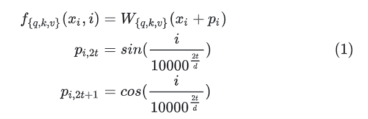

# LLama-2

## 流程
* Tokenization (分词)

* Embedding 
> 生成toekn序列

* 位置编码

* Transformer
* Autoregressive 
> 自回归生成

* 输出处理

* kv cache


> 使用的是Transformer Decoder， 与Encoder相比多了一个Mask  
> 32个 Transformer Block 组成，不同之处主要包括以下几点：
1. 前置的RMSNorm层
2. Q在与K相乘之前，先使用RoPE进行位置编码
3. K V Cache，并采用Group Query Attention
4. FeedForward层

## 算子

### RMSNorm
> β和γ为可学习参数


```
# RMSNorm
class RMSNorm(torch.nn.Module):
    def __init__(self, dim: int, eps: float = 1e-6):
        super().__init__()
        self.eps = eps # ε
        self.weight = nn.Parameter(torch.ones(dim)) #可学习参数γ
​
    def _norm(self, x):
        # RMSNorm
        return x * torch.rsqrt(x.pow(2).mean(-1, keepdim=True) + self.eps)
​
    def forward(self, x):
        output = self._norm(x.float()).type_as(x)
        return output * self.weight
```

### RoPE
> Llama 2的位置编码在每个Attention层中分别对Q K 进行RoPE位置编码，而不是在> Transformer Block之前进行一次位置编码，也就是说每次计算Attention时都分别要对Q K做位置编码

* 绝对位置编码
> 在标准的Transformer中通常是在整个网络进入Transformer Block之前做一个位置编码



* 旋转位置编码
> 出发点就是“通过绝对位置编码的方式实现相对位置编码”


### KV Cache
* 自回归

```
In  [1]: {prompt:"将进酒："}
Out [1]: 将进酒：人
​
In  [2]: 将进酒：人
Out [2]: 将进酒：人生
​
In  [3]: 将进酒：人生
Out [3]: 将进酒：人生得
​
In  [4]: 将进酒：人生得
Out [4]: 将进酒：人生得意
​
In  [5]: 将进酒：人生得意
Out [5]: 将进酒：人生得意需
​
​
In  [6]: 将进酒：人生得意需
Out [6]: 将进酒：人生得意需尽
​
In  [7]: 将进酒：人生得意需尽
Out [7]: 将进酒：人生得意需尽欢

```


```
def mha(x, c_attn, c_proj, n_head, kvcache=None):  # [n_seq, n_embd] -> [n_seq, n_embd]
    # qkv projection
    # when we pass kvcache, n_seq = 1. so we will compute new_q, new_k and new_v
    x = linear(x, **c_attn)  # [n_seq, n_embd] -> [n_seq, 3*n_embd]
    # split into qkv
    qkv = np.split(x, 3, axis=-1)  # [n_seq, 3*n_embd] -> [3, n_seq, n_embd]
    if kvcache:
        # qkv
        new_q, new_k, new_v = qkv  # new_q, new_k, new_v = [1, n_embd]
        old_k, old_v = kvcache
        k = np.vstack([old_k, new_k]) # k = [n_seq, n_embd], where n_seq = prev_n_seq + 1
        v = np.vstack([old_v, new_v]) # v = [n_seq, n_embd], where n_seq = prev_n_seq + 1
        qkv = [new_q, k, v]
```

* MQA & GQA
> K,V 真的能缓存的了吗？  
> 以Llama 7B模型为例，hidden_size为4096，也就说每个K,V有4096 个数据，假设是半精度浮点数据float16，一个Transformer Block中就有 4096* 2 *2 = 16KB的单序列 K,V缓存空间，而Llama 2一共32个Transformer Block，所以单序列整个模型需要16 * 32 = 512KB的缓存空间，那多序列呢？如果此时句子长度为1024 ，那是不是就得512MB 的缓存空间了。而现在英伟达最好的卡 H100 的 SRAM 缓存大概是 50MB，而 A100 则是 40MB. 而 7B 模型都这样，175B 模型就更不用说了

> 既然SRAM 放不下，我们放到DRAM(GPU显存)行不行呢？答案是可以，但要牺牲性能。
Memory Wall（内存墙）  
> 从硬件层面，可以使用HBM(高速带宽内存)提高读取速度，或者抛弃冯诺依曼架构，改变计算单元从内存读数据的方式，不再以计算单元为中心，而以存储为中心，做成计算和存储一体的“存内计算”，比如"忆阻器"。而从软件层面就是优化算法，由此便引入Llama 2所使用的GQA (Group Query Attention)


> 多头注意力机制(MHA)就是多个头各自拥有自己的Q,K,V来算各自的Self-Attention，而MQA(Multi Query Attention)就是Q依然保持多头，但是K,V只有一个，所有多头的Q共享一个K,V ,这样做虽然能最大程度减少KV Cache所需的缓存空间，但是可想而知参数的减少意味着精度的下降，所以为了在精度和计算之间做一个trade-off，GQA (Group Query Attention)孕育而生，即Q依然是多头，但是分组共享K,V,即减少了K,V缓存所需的缓存空间，也暴露了大部分参数不至于精度损失严重


### FeedForward

* SiLU激活函数

```
class FeedForward(nn.Module):
    def __init__(
        self,
        dim: int,
        hidden_dim: int,
        multiple_of: int,
        ffn_dim_multiplier: Optional[float],
    ):
        super().__init__()
        hidden_dim = int(2 * hidden_dim / 3)
        # custom dim factor multiplier
        if ffn_dim_multiplier is not None:
            hidden_dim = int(ffn_dim_multiplier * hidden_dim)
        hidden_dim = multiple_of * ((hidden_dim + multiple_of - 1) // multiple_of)
        # Linear 1
        self.w1 = ColumnParallelLinear(...)
        # Linear 2
        self.w2 = RowParallelLinear(...)
        # Linear 3
        self.w3 = ColumnParallelLinear(...)
    def forward(self, x):
        return self.w2(F.silu(self.w1(x)) * self.w3(x))
```


