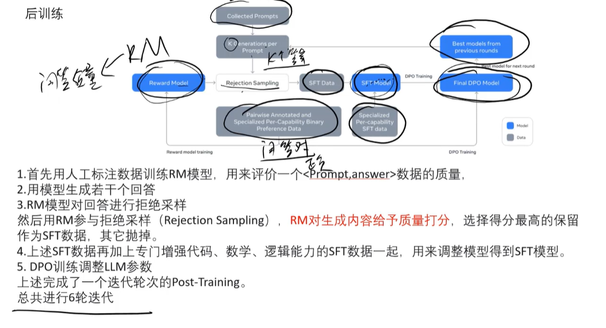

# LLama-3

## 基础
1. 基于Transformer的解码器
2. 参数量：8B和70B
3. 上下文长度：8192/128K（LLama-3.1）
4. 注意力机制：分组查询注意力（GQA）

## 结构

* 分层堆叠
1. 嵌入层
2. 自注意力层
3. 前馈网络（FFN）
4. 位置编码

* 与Transformer不同之处
1. 引入了分组查询注意力（GQA）
2. 使用SwiGLU激活函数
3. RoPE位置编码
4. 上下文长度8192

## LLama-3.1
[https://ai.meta.com/blog/meta-llama-3-1/](https://ai.meta.com/blog/meta-llama-3-1/)

### 计算量
> B: batchsize, 
> s：序列长度，
> v：词表长度
> h：特征维度

* 前向传播
1. q/k/v: 6Bsh^2
2. attention：2Bs^2h
3. 对value的attention计算：2Bs^2h
4. attention后的linear层：2Bsh^2
5. 对于h->4h->h的FeedForward层：16Bsh^2
6. lm_head层（将特征为h的特征转换为词汇维度v）：2Bshv

>上述总共 24Bsh^2 + 4Bs^2h + 2Bshv

* 反向传播
> 两倍FLOPs

* 总的计算量

### 两阶段训练

#### pre-training 海量数据

* 数据处理

* 模型训练
> 16，000个H100 80G Nvlink

* 并行策略
1. 张量并行TP
2. 流水线并行PP
3. 数据并行DP
4. 上下文并行CP： 输入上下文分割成段（128k）

* 训练参数
1. 线性预热8,000步， 余弦学习率
2. batchsize，经过6步，最终达到128k的上下文
   1. step1: 4M 4096
   2. step2: 8M 8192
   3. step3: 16M 8192
3. 数据退火

#### post-training 少量数据

