# Megatron-LM
https://github.com/NVIDIA/Megatron-LM
PTD 并行

## DP
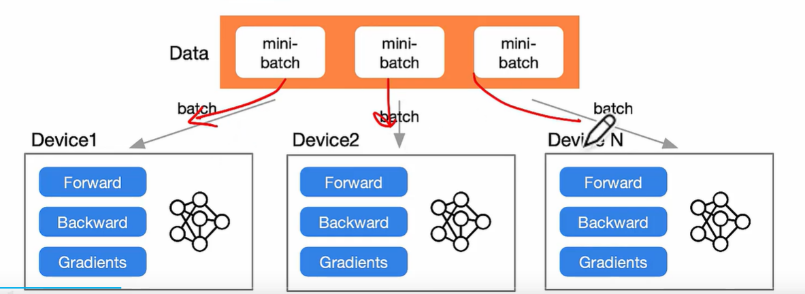

## TP
> TP张量并行被用于 intra-code transformer层
> 消耗大量带宽，使用nvlink
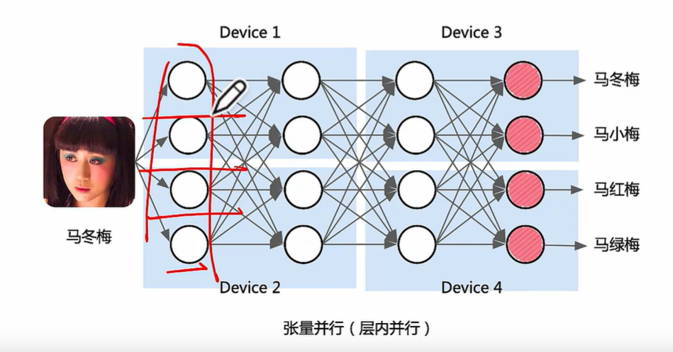

* 并行原理
> Matmul 与 transformer 应用 

Matual
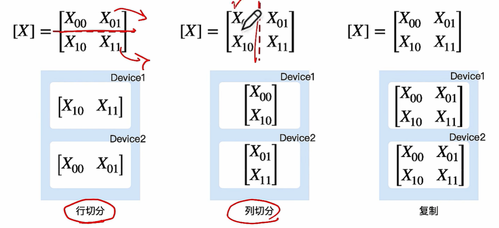
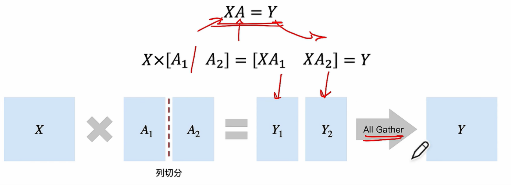
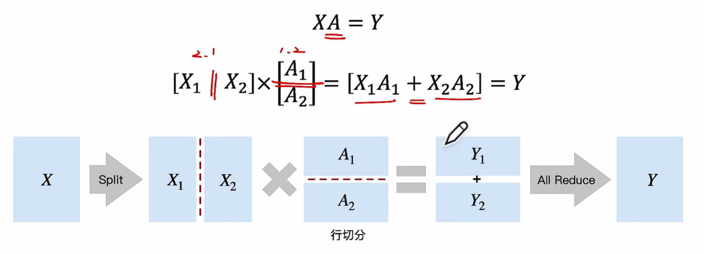
多次连续矩阵乘
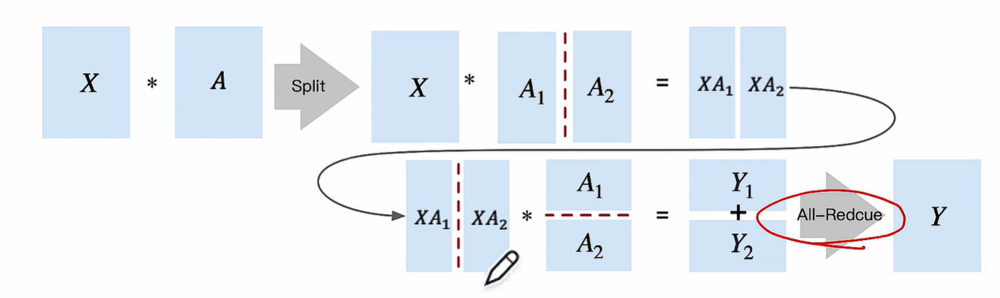

transformer : MLP
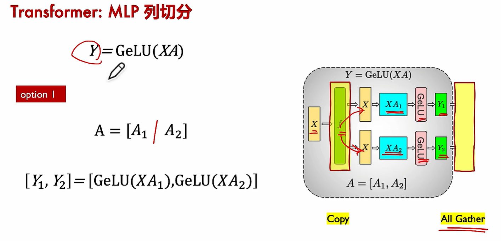
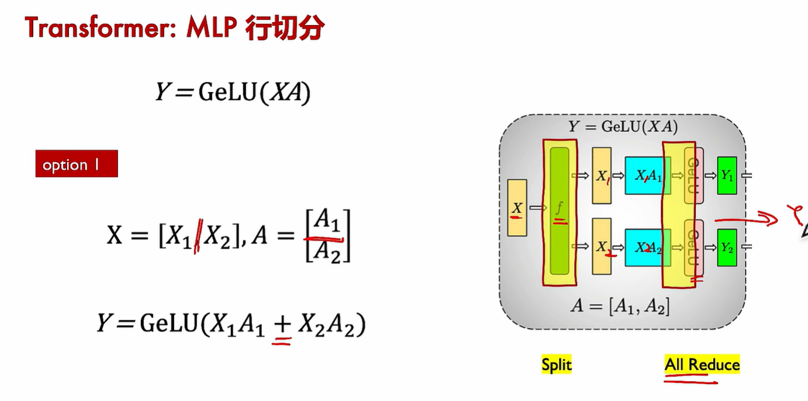
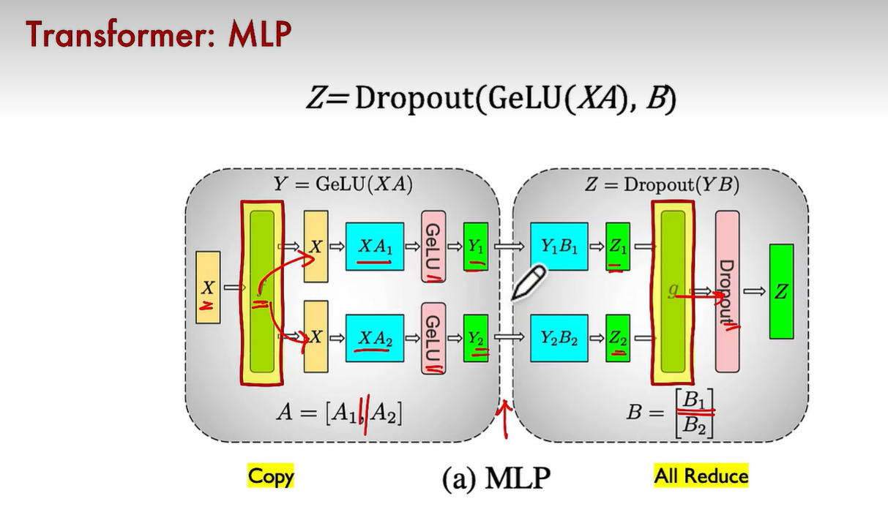
* TP具体实现
1. ColumnParallelLinear
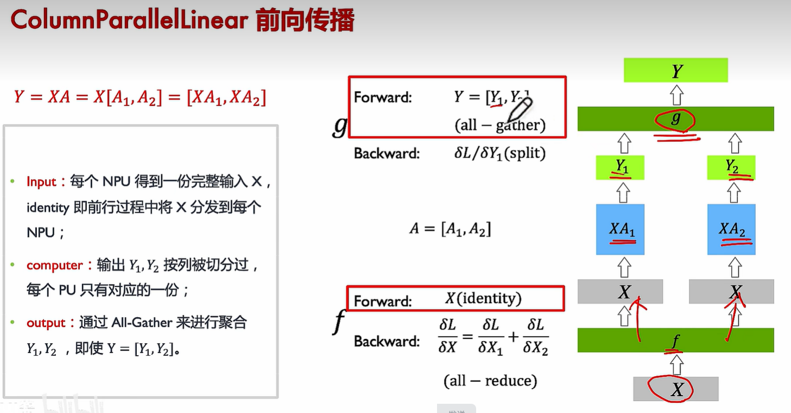
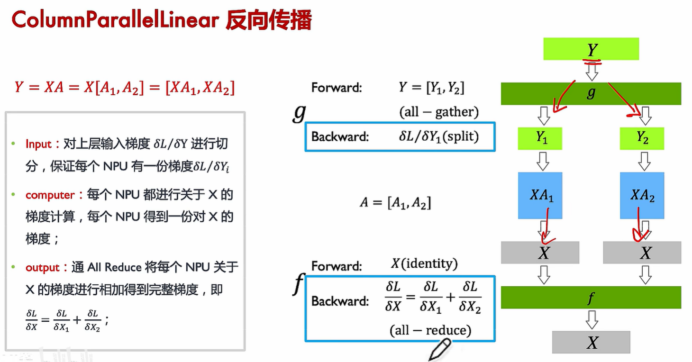
2. RowParallelLinear
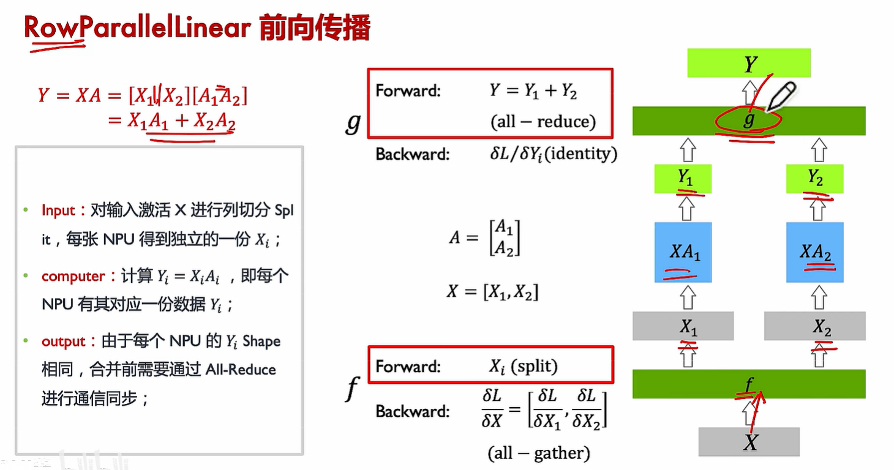
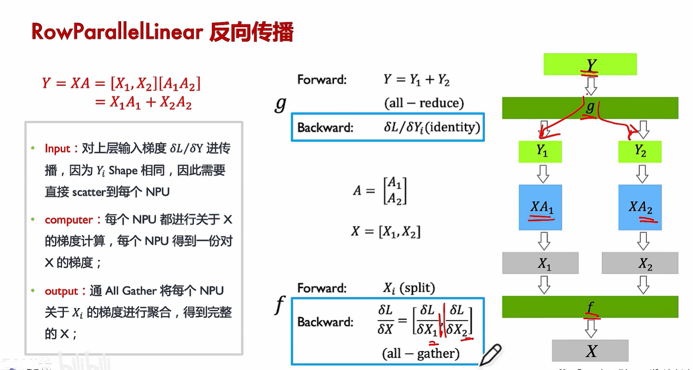
* Transformer
1. Embedding 并行
2. layerNorm 并行
3. Attention 并行
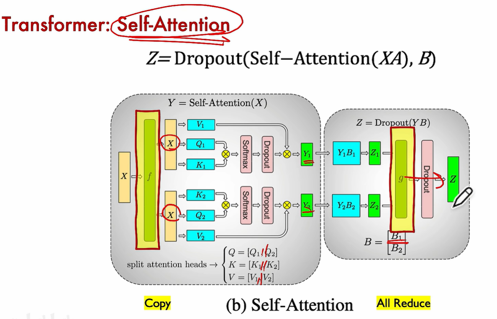
4. Add & Norm结构
5. mlp并行

## PP
> PP张量并行被用于 intra-code transformer层
> 带宽占用少，集群多级多卡

* 基本原理
1. BUbble 空泡率影响性能
2. PP 切分到不同卡

* Gpipe
* PipeDream 1F1B
* Interleavel 1F1B

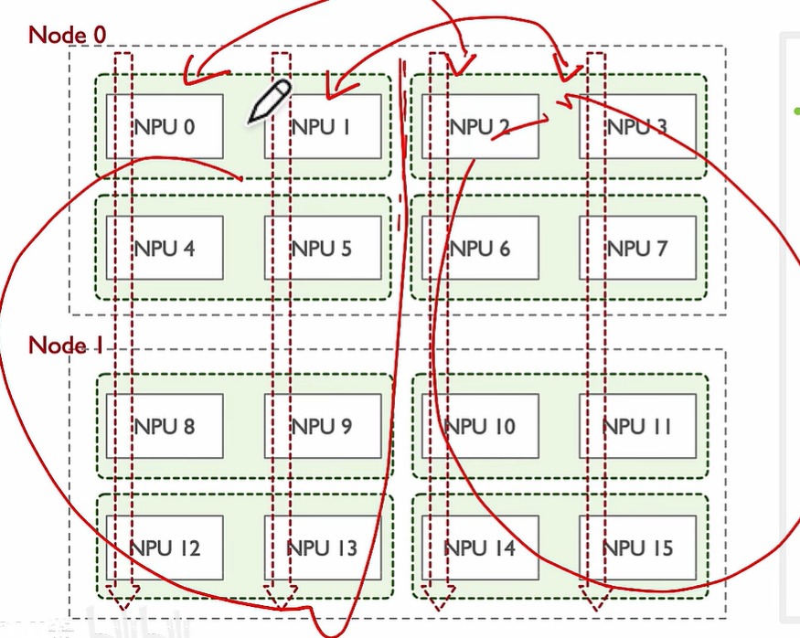

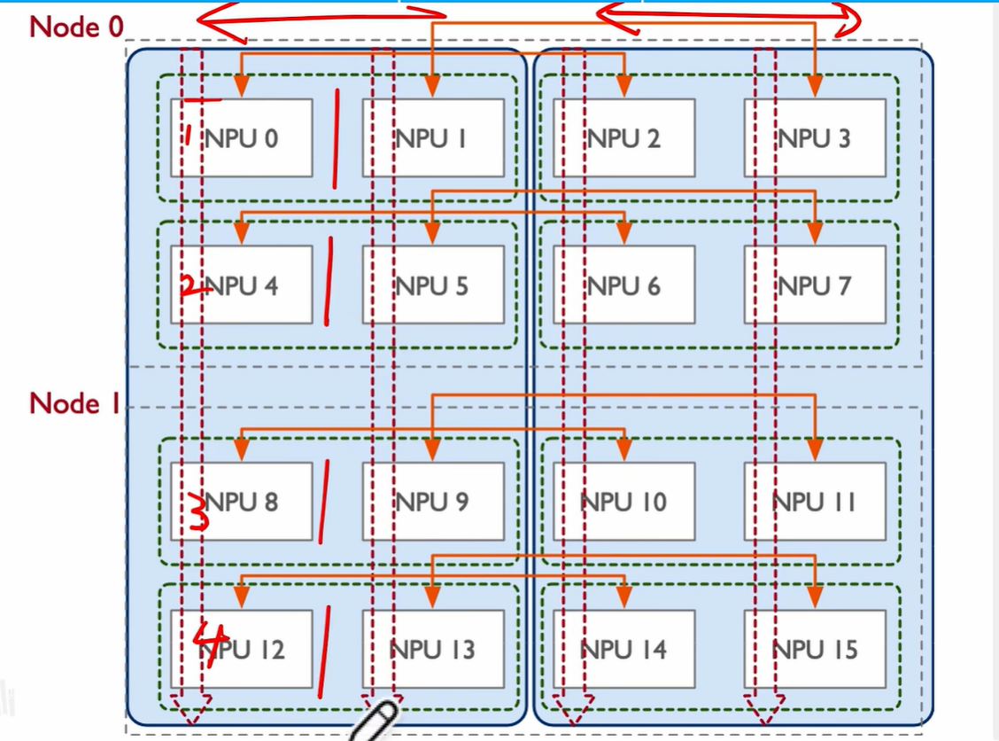

