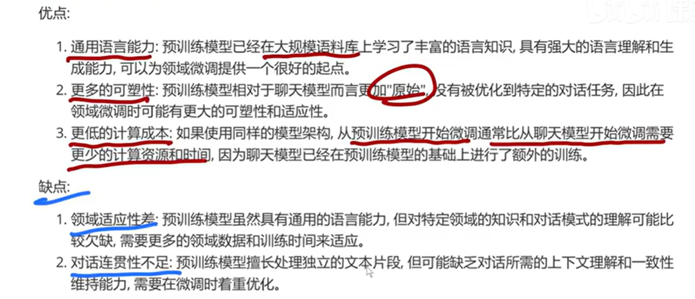
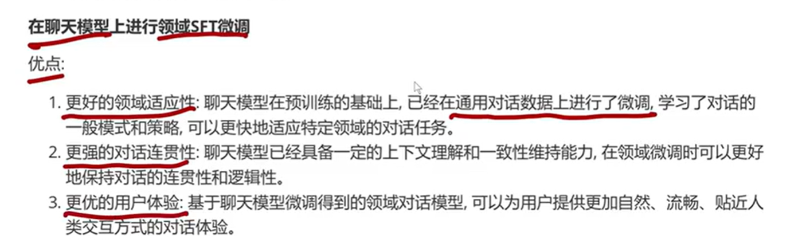
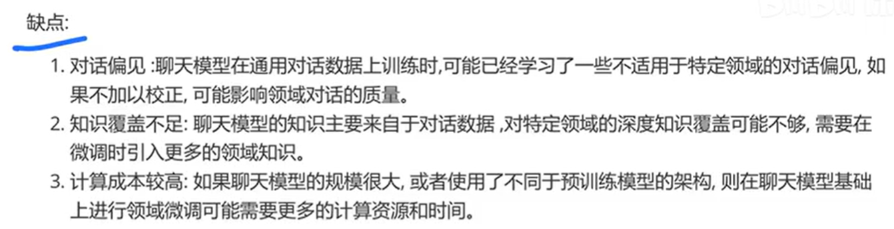
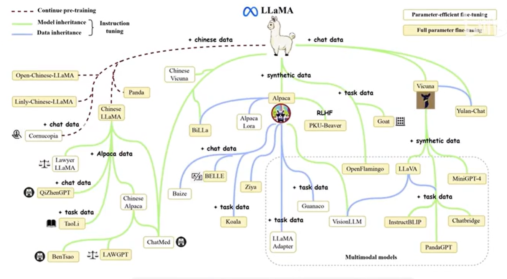
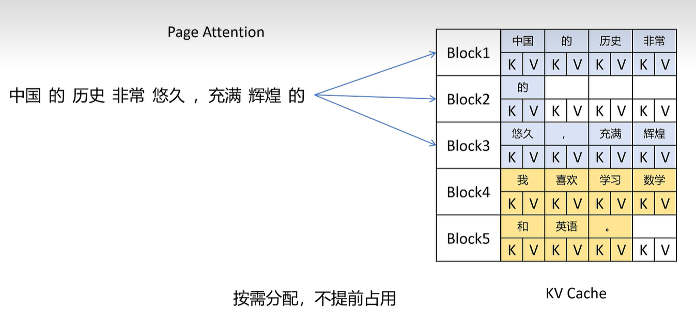
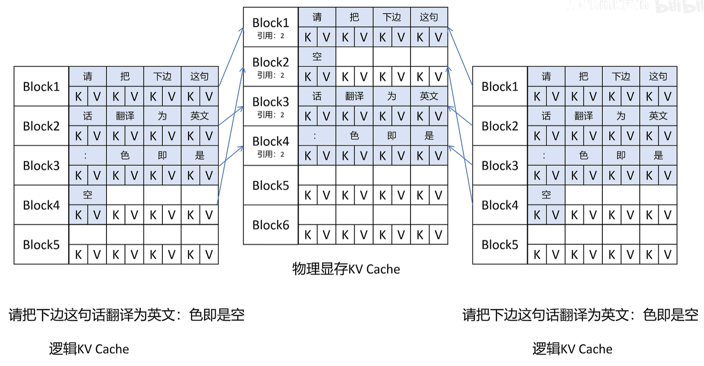
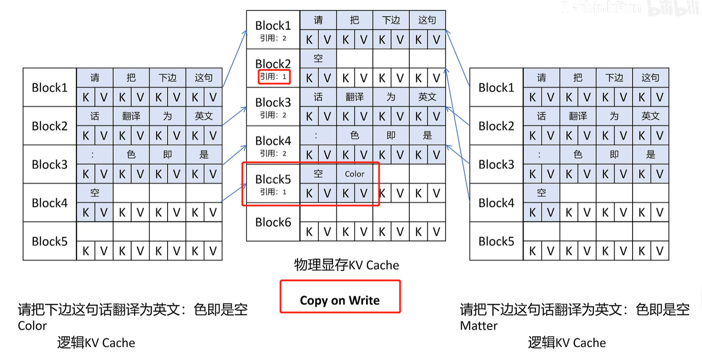
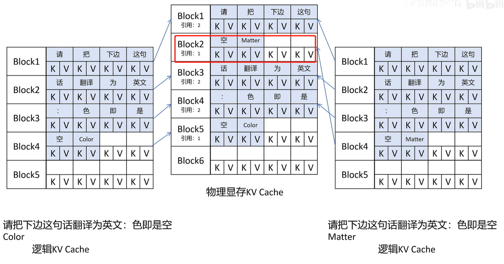

# llm

## LLM开发流程

### 4阶段划分
* 预训练

* 有监督微调(SFT Model)
> 用标注好的数据集


* 奖励模型 (RM Model)
> 评价不同输出质量的模型

* 强化学习(RLHF)
> 利用RM模型来评估SFT模型的输出，从而调整SFT模型的参数

### 3阶段划分

* 预训练
* 微调
* 对齐
> 奖励模型 + 强化学习

### 2阶段划分

* 预训练
* 对齐阶段：SFT + RLHF


## 微调

### 特定领域微调
* 领域数据准备
* 微调样本构建
* 微调策略设计
* 模型微调训练
* 微调模型评估
* 模型部署应用

### 基座模型

### 对话模型




## LLaMA
> AIpaca、Vicuna、LLaVa


## vllm
### paged attention

> 原因：不清楚最后句子长度，原本直接分配2024浪费空间。减少llm中间产生的连续结果的浪费


* 分块存储 kv Block
> 利用率从20%-40%提升到96%



* KV Block共享：大模型同一个Prompt，生成多个Output

生成第一个 Color，引用为2，执行copy on write

第二个序列生成Matter，引用为1，则直接加入



> vllm - cuda

## tiktoken 离线

  * 有网环境运行
```

```
用everything 软件查找： data-gym-cache

* 复制目录下所有文件，到离线环境的某个目录（/home/xxx/datasets）

* 离线环境
```
tiktoken_cache_dir = "/home/xxx/datasets"
os.environ["TIKTOKEN_CACHE_DIR"] = tiktoken_cache_dir
```


