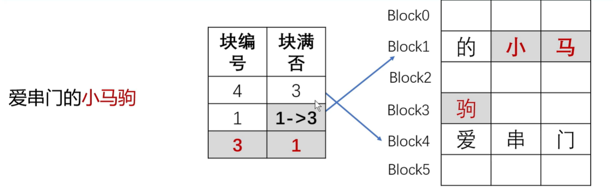

## llm

## vllm
### paged attention

> 原因：不清楚最后句子长度，原本直接分配2024浪费空间。减少llm中间产生的连续结果的浪费
> 

* 分块存储



## tiktoken 离线

  * 有网环境运行
```

```
用everything 软件查找： data-gym-cache

* 复制目录下所有文件，到离线环境的某个目录（/home/xxx/datasets）

* 离线环境
```
tiktoken_cache_dir = "/home/xxx/datasets"
os.environ["TIKTOKEN_CACHE_DIR"] = tiktoken_cache_dir
```


