# nsight

## nsight systems

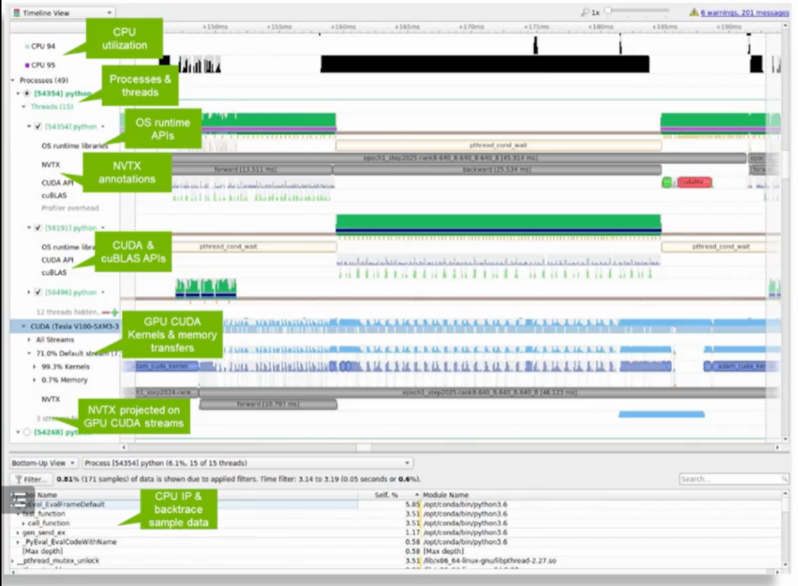

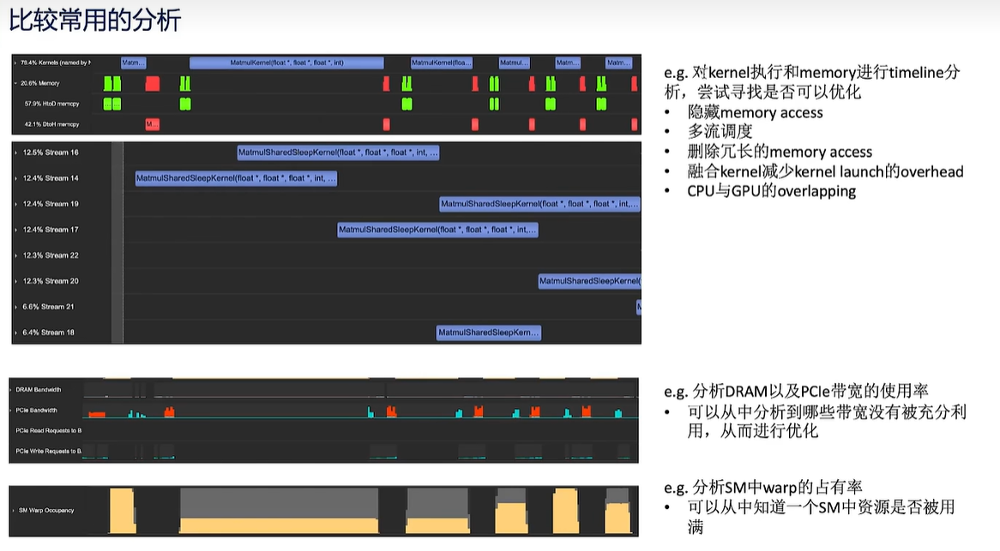

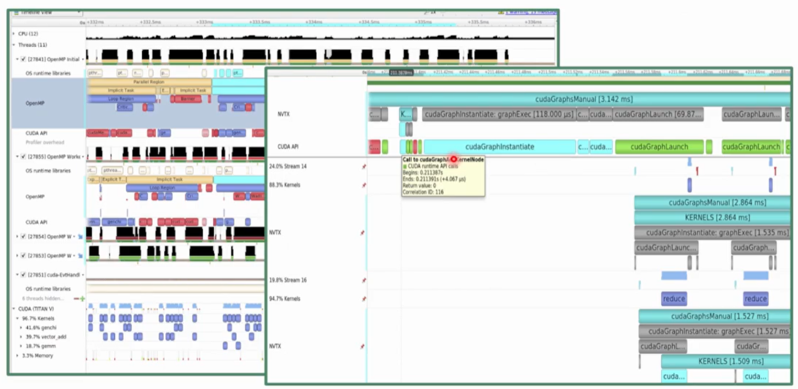

### NVTX
* python
import nvtx
* c++
#include "nvToolsExt.h"
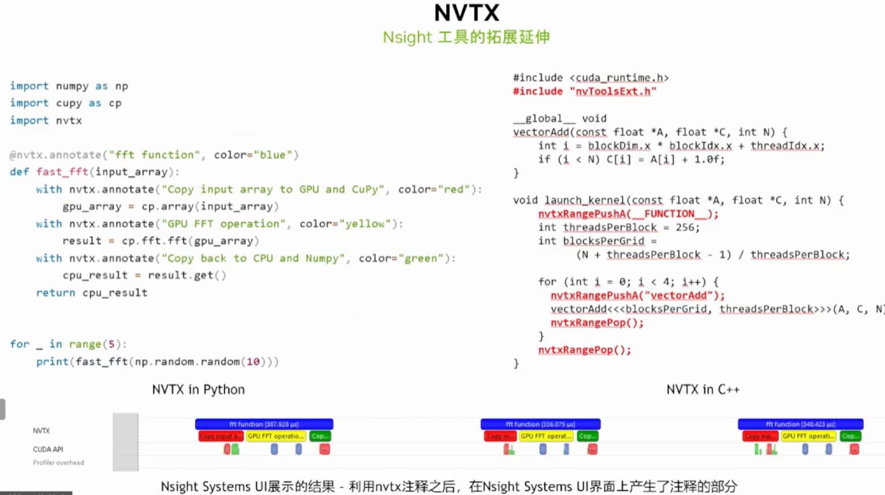

### Nsight Systems CLI

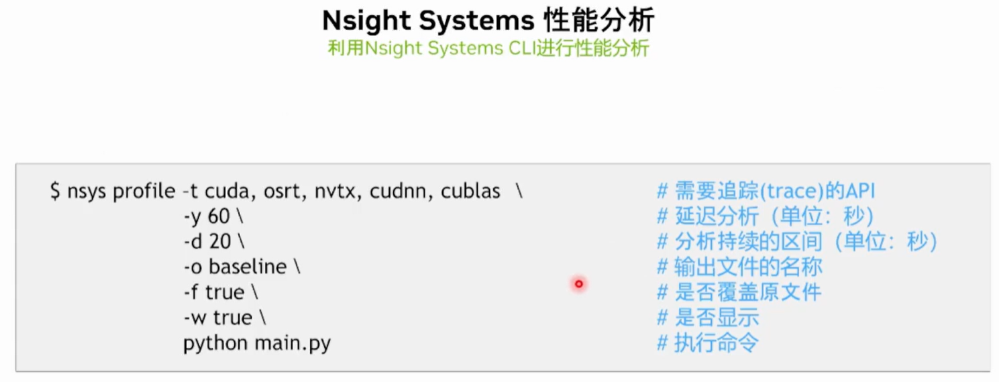

## Nsight Compute

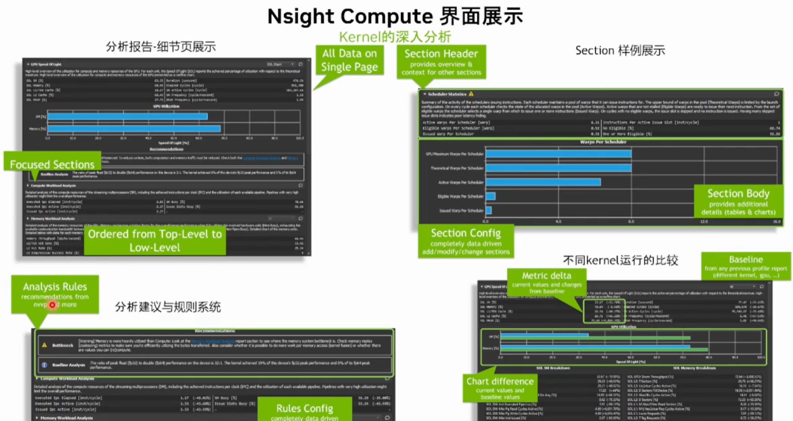

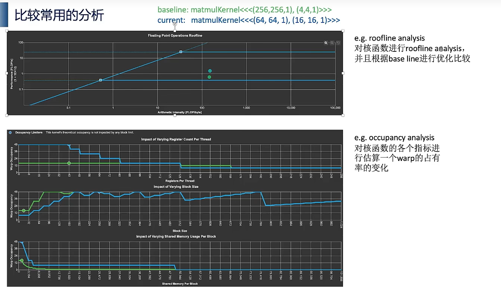

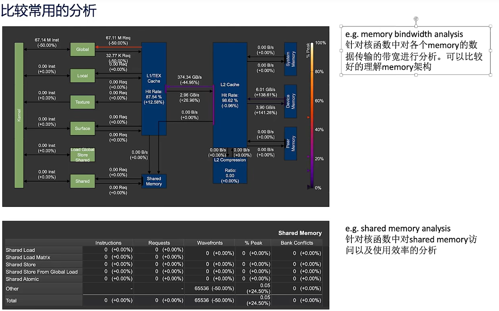

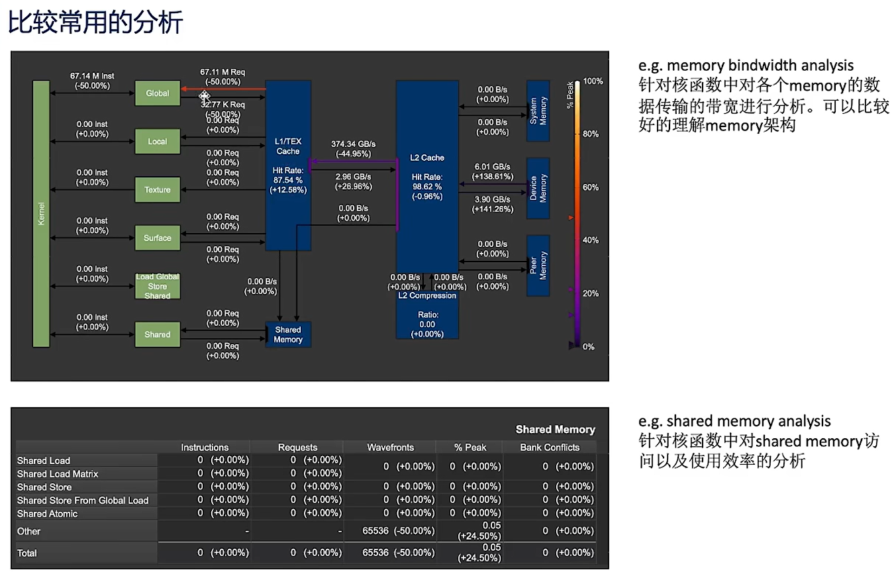

## 实战 - systems

### 案例一
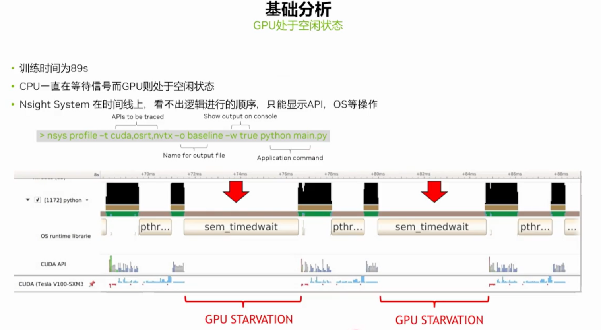

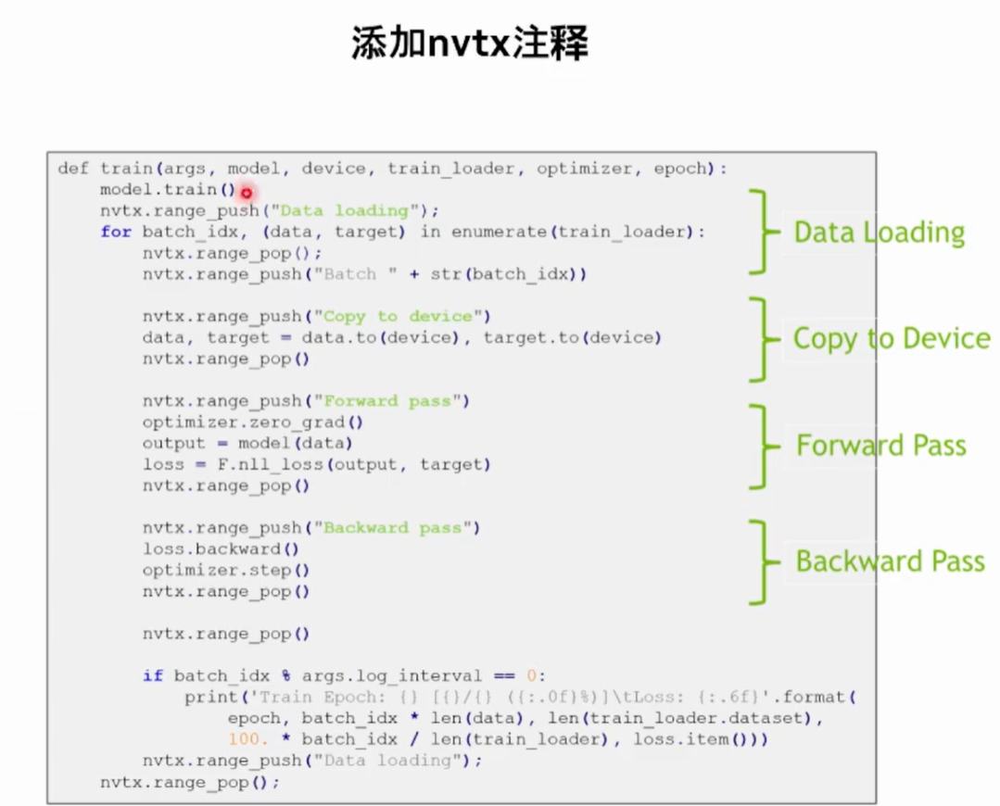

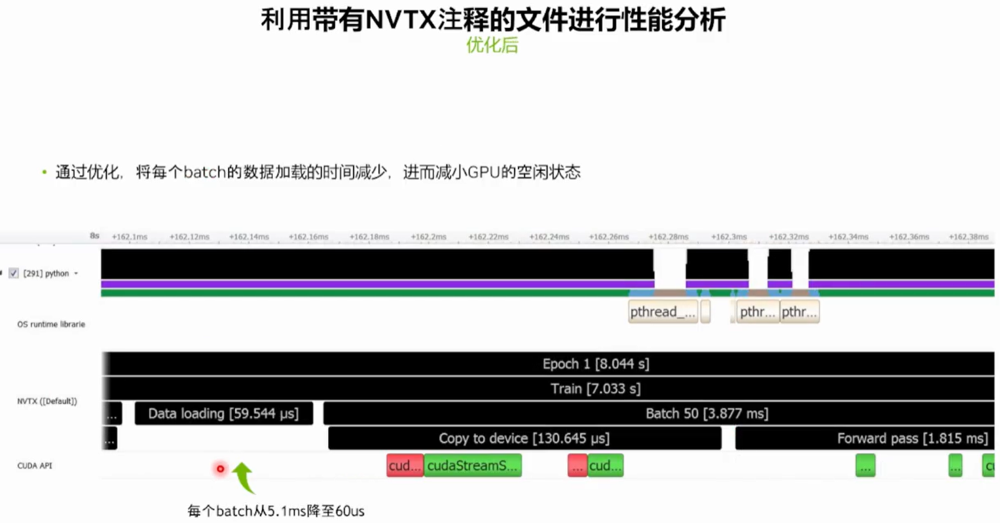

### 案例二 混合精度

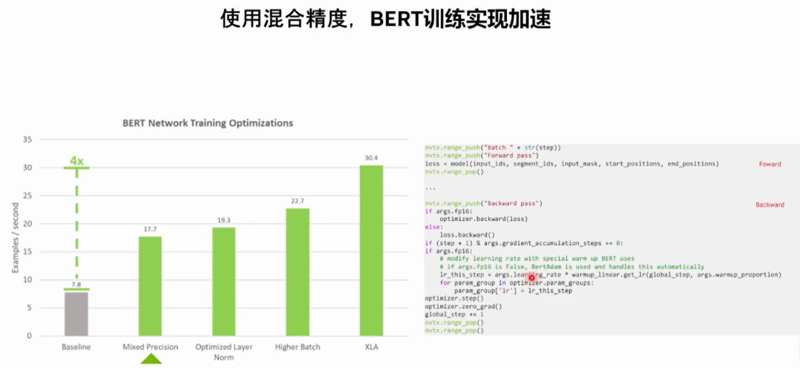

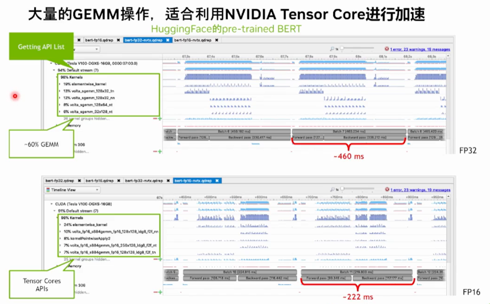

### 案例三 矩阵转置

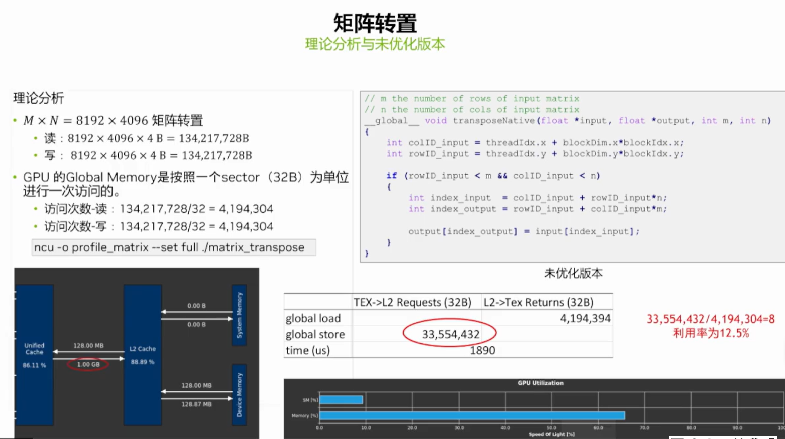

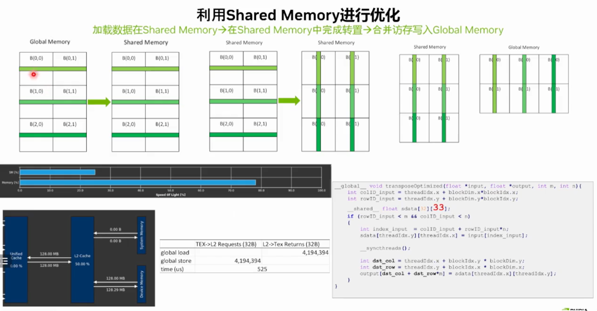

 
# 引用

https://www.bilibili.com/video/BV1UP411s7nE/?spm_id_from=333.337.search-card.all.click&vd_source=d1b32ea2fd93ddb53c8d4206b2d66548
