## 静态 Token 稀疏化

### Dense Attention

### Window Attention

### Sliding Window Attention with recomputation

### StreamingLLM

---
## 动态 Token 稀疏化

### H2O

### Quest

---
##  Prefix Caching 

### Radix Attention

### Cascade Inference

---
## KV Cache

### Layers

#### KV Cache

#### LayerSkip

#### YOCO

### HeadDim & NumHeads & HiddenSize

#### MHA、MQA、GQA 和 MLA

* MHA
多头注意力
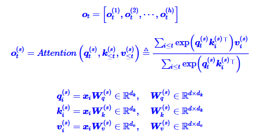
常见的设置是dk=dv=d/h，对于LLAMA2-7b有d=4096,h=32,dk=dv=128，LLAMA2-70b则是d=8192,h=64,dk=dv=128

* MQA
MQA的思路很简单，直接让所有Attention Head共享同一个K、V，用公式来说，就是取消MHA所有的k,v的上标
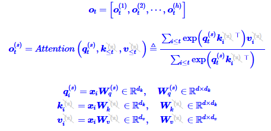

使用MQA的模型包括PaLM、StarCoder、Gemini等
MQA由于共享了K、V，将会导致Attention的参数量减少了将近一半，而为了模型总参数量的不变，通常会相应地增大FFN/GLU的规模，这也能弥补一部分效果损失。

* GQA
GQA的思想也很朴素，它就是将所有Head分为g个组（g可以整除h），每组共享同一对K、V
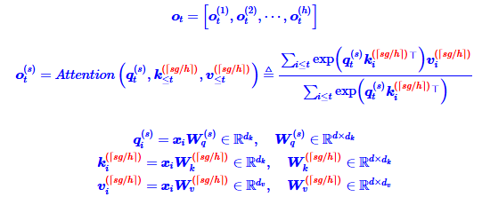
GQA最知名的使用者，大概是Meta开源的LLAMA2-70B，以及LLAMA3全系列，此外使用GQA的模型还有TigerBot、DeepSeek-V1、StarCoder2、Yi、ChatGLM2、ChatGLM
ChatGLM虽然在它的介绍中说自己是MQA，但实际是g=2的GQA
llama2/3-70B中，GQA的g=8

* MLA 
DeepSeek-V2的技术报告里是从低秩投影的角度引入MLA
要说低秩投影的话，事实上只要我们将GQA的所有K、V叠在一起，就会发现GQA也相当于在做低秩投影
MLA的本质改进不是低秩投影，而是低秩投影之后的工作。

1. MLA的第一个想法是将这些简单的线性变换换成一般的线性变换
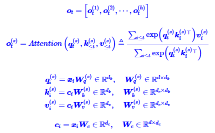
首先，在训练阶段还是照常进行，此时优化空间不大；然后，在推理阶段，我们利用：
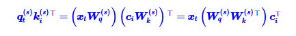
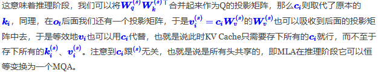
2. RoPE（旋转位置编码）
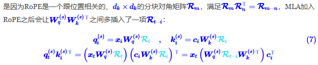
最简单的方式是放弃RoPE，换用其他基于Attention Bias的位置编码，如ALIBI，但DeepSeek的实验显示它明显不如RoPE
笔者也提议过换Sandwich，它不像ALIBI单调衰减到负无穷，估计效果会好些，但感觉是治标不治本
最后发布的MLA，采取了一种混合的方法——每个Attention Head的Q、K新增dr个维度用来添加RoPE，其中K新增的维度每个Head共享：
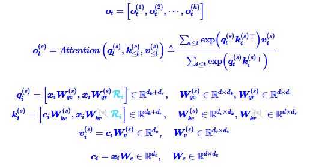
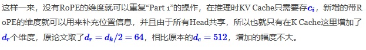
3. 
MLA的最终版本，还将Q的输入也改为了低秩投影形式，这与减少KV Cache无关，主要是为了减少训练期间参数量和相应的梯度
训练期间：
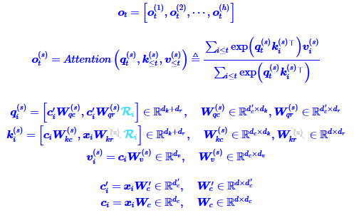
推理阶段的MLA则改为:
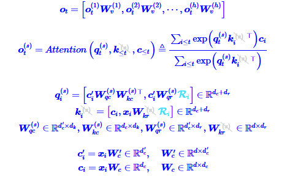

### DataType

#### KIVI

#### Per-Group

---
## Flash Attention

## Chunk Prefills

## Page Attention
https://arxiv.org/abs/2309.06180
https://github.com/vllm-project/vllm
* 问题
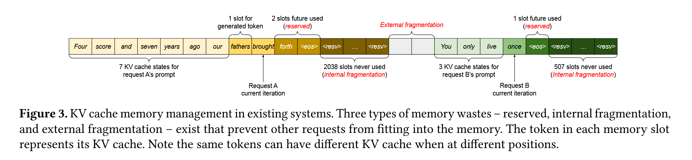

* 架构
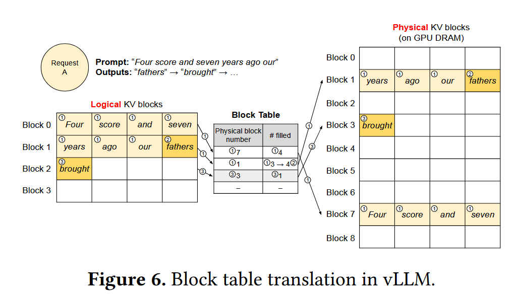

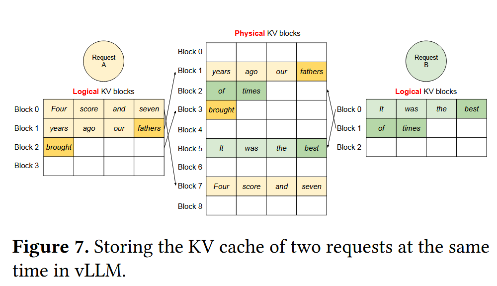

* Feature
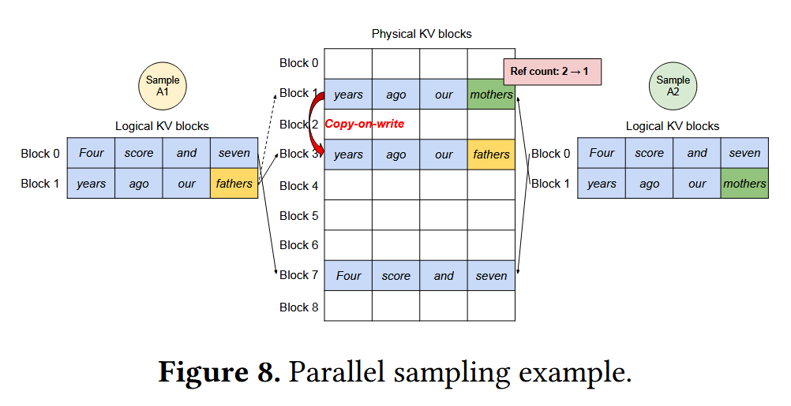

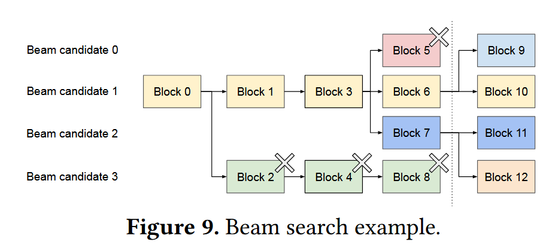

## faster-transformer

* v1

https://github.com/NVIDIA/FasterTransformer

* v2

https://github.com/NVIDIA/FasterTransformer/tree/v2.0/

https://zhuanlan.zhihu.com/p/650462095

## TurboTransformers

https://github.com/Tencent/TurboTransformers

